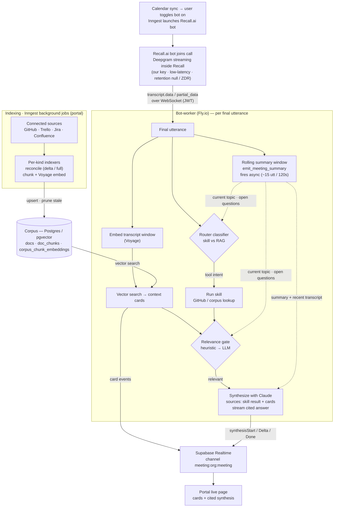

# Risezome

A cloud meeting-context copilot. A Recall.ai bot joins your meeting, listens to the transcript in real time, retrieves relevant context from your connected sources (GitHub, Trello, Jira, Confluence), and surfaces synthesized, cited answers on a live page while the conversation is still happening.

> Status: active development. The product is cloud-hosted; the original desktop daemon (`apps/daemon`) and the standalone HUD app (`apps/hud-next`) are legacy from an earlier local-capture era and are not part of the shipping product — see [AGENTS.md](AGENTS.md).

## Architecture at a glance

Three runtime tiers, plus Supabase as the shared data plane:

- **Portal** (`apps/portal`, Next.js App Router on Vercel) — the web app. Handles auth, org/workspace management, OAuth connectors, the marketing page, the upcoming/live/review meeting pages, and the Sources page. Hosts the Inngest endpoint.
- **Bot-worker** (`apps/bot-worker`, Fastify on Fly.io) — a long-lived WebSocket service the Recall.ai bot connects back to. On every utterance it embeds a transcript window, retrieves from the corpus, optionally routes the query to a skill, synthesizes an answer with Claude, and broadcasts events to the live page.
- **Background jobs** (Inngest functions in `apps/portal/src/inngest`) — schedule and launch Recall bots, index connected sources into the corpus, and sync Google Calendar.
- **Supabase** — Postgres (with `pgvector` for the corpus), Auth, Row-Level Security, and Realtime (the channel the bot-worker broadcasts on and the live page subscribes to).

### Flow at a glance

Indexing runs in the background and fills the corpus; the live meeting path reads that same corpus on every utterance. The rolling summary window (dotted arrows) feeds the router, the relevance gate, and the synthesizer with meeting context.



### Meeting flow

1. The portal syncs Google Calendar; a user toggles the bot on for a meeting.
2. An Inngest function launches a **Recall.ai** bot just before start and records a `meetings` row.
3. The bot joins the call and streams transcripts to the **bot-worker** over a JWT-authenticated WebSocket. Transcription is done by **Deepgram streaming configured inside Recall** (our Deepgram key, low-latency mode) — Recall runs with `retention: null` so it never stores transcripts or recordings (ZDR posture).
4. Each final utterance is embedded via **Voyage**, matched against the **pgvector** corpus, optionally answered by a **skill** (GitHub/corpus lookups via a router classifier), gated for relevance, and **synthesized** by **Claude** with inline citations. A rolling **summary window** gives the router, relevance gate, and synthesizer ongoing meeting context.
5. Cards and synthesis stream to the portal **live page** over Supabase Realtime; everything persists for post-meeting review.

### Corpus & connectors

Source connectors are indexed by per-kind Inngest functions into a shared corpus (`docs` / `doc_chunks` / `corpus_chunk_embeddings`), chunked by `@risezome/engine/chunker` and embedded with Voyage:

- **GitHub** — repo files + issues/PRs (GitHub App, per-org installation)
- **Trello** — boards, lists, cards (org-level token)
- **Jira** & **Confluence** — issues+comments and pages+body (one Atlassian OAuth 2.0 3LO connection, two source kinds)

### Packages

- `@risezome/engine` — shared core: chunker, embeddings, synthesizer, relevance + router classifiers, skill contract/registry, rolling summarizer.
- `@risezome/hud-ui` — React components for the live HUD (cards, synthesis card, citations), used by the portal.
- `@risezome/shared-types` — cross-package types.

## Development

Requirements: Node ≥ 22, pnpm ≥ 9.

```bash
pnpm install
pnpm typecheck
pnpm lint
pnpm test
```

Each app carries its own `.env.example` and per-app README with setup specifics:

- [`apps/portal/README.md`](apps/portal/README.md) — Supabase, Google OAuth, GitHub App, Inngest, Voyage, the connectors.
- [`apps/bot-worker/README.md`](apps/bot-worker/README.md) — Recall.ai, Fly.io deploy, local tunnel.

To stand up the three local dev processes (portal, Inngest CLI, bot-worker) after a fresh shell, see [`docs/runbooks/local-dev-processes.md`](docs/runbooks/local-dev-processes.md).

## Documentation

- [AGENTS.md](AGENTS.md) — conventions and guardrails for agents and humans.
- [`docs/runbooks/`](docs/runbooks/) — operational runbooks (e.g. the bot-worker tunnel).
- [`docs/plans/archive/`](docs/plans/archive/) and [`docs/brainstorms/archive/`](docs/brainstorms/archive/) — historical implementation plans and product framing for shipped/superseded work.
