# Retrieval, Synthesis & Gating Pipeline

Last updated: 2026-06-02

This is the **canonical, current-state** description of how Risezome turns
connected sources into grounded, cited answers during a live meeting. It owns
the end-to-end pipeline: index time (sources → embeddings) and query time
(utterance → ranked sources → gated, verified synthesis).

The point-in-time plan docs (`docs/plans/2026-06-01-002-feat-corpus-retrieval-claude-augmented-rag-plan.md`,
`docs/plans/2026-06-02-001-feat-self-healing-skills-plan.md`) remain as the
design/spec record. **When they disagree with this doc, this doc wins** — it
describes what is in the code.

File references use `path:line`. They are accurate as of the date above; treat
them as a starting point, not a contract.

---

## 0. The shape at a glance

```mermaid
flowchart TD
  subgraph IDX["INDEX TIME (apps/portal Inngest → packages/engine)"]
    FETCH["Fetch source set"] --> RECON["Reconcile vs corpus<br/>(content_hash: skip unchanged)"]
    RECON --> CHUNK["Chunk (code 120 / text 80 lines, 20 overlap)"]
    CHUNK --> CTX["Contextualize each chunk<br/>(Haiku: ~60-tok situating context)"]
    CTX --> SUM["Summarize doc<br/>(Haiku: one is_summary chunk)"]
    SUM --> EMB["Embed (Voyage: text→voyage-3-large, code→voyage-code-3)"]
    EMB --> UPS["Upsert docs · doc_chunks · corpus_chunk_embeddings<br/>(content_hash stamped LAST)"]
  end

  subgraph QRY["QUERY TIME (apps/bot-worker/src/retrieval.ts)"]
    UTT["Finalized utterance"] --> CAD["Cadence gate<br/>(threshold + 10s cooldown)"]
    CAD --> WIN["Build 8-utterance window query"]
    WIN --> ROUTE["Router classify (parallel)<br/>tool-shaped? → skill vs RAG"]
    WIN --> QEMB["Embed query (text domain)"]
    QEMB --> HYB["Hybrid search<br/>vector + FTS → RRF (k=60) + distance floor"]
    HYB --> RR["Rerank (Voyage rerank-2.5)*"]
    RR --> CRAG["CRAG on-miss expansion*<br/>(only if 0 hits + scattered query)"]
    CRAG --> PD["Parent-doc expansion*<br/>(child → parent context)"]
    ROUTE --> SKILL["Skill run + self-heal"]
    SKILL --> SAFE["Safety-net: keep-repaired / drop-unresolved"]
    PD --> MERGE["Merge: [tool] + [cards]"]
    SAFE --> MERGE
    MERGE --> RELV["Relevance gate<br/>(filler skip / LLM skip ≥0.7)"]
    RELV --> SYN["Synthesize (Claude, buffered)"]
    SYN --> VERIFY["Verify citations + grounded-or-nothing"]
    VERIFY --> BROAD["Broadcast start→delta→done"]
  end

  IDX -.writes corpus.-> QRY

  %% * = feature-flagged (see §6)
```

`*` = feature-flagged stage (§6). Everything else is always on.

---

## 1. Index time — building the corpus

Orchestrated by Inngest functions in `apps/portal/src/inngest/` (one per
connector: `index-repo.ts` for GitHub files, `runConnectorIndex` in
`lib/connector-index.ts` for Trello / Jira / Confluence / GitHub-issues). The
heavy lifting is pure, network-injected code in `packages/engine/src/`
(`chunker`, `contextualize`, `summarize-doc`, `embed`).

Stages, in order:

1. **Fetch + reconcile (change detection).** Each indexer fetches its complete
   entity/file set, then `reconcile()` (`apps/portal/src/inngest/lib/corpus-reconcile.ts:88-167`)
   diffs the desired set against the corpus **before any paid work**. Per doc:
   absent → `new`; `content_hash` differs → `changed`; equal → `unchanged`
   (skipped). This is the dominant cost-saver — full-fetch connectors used to
   re-embed everything every run. Reconcile is type-scoped so a GitHub *file*
   reindex never prunes the *issues* corpus sharing a `source_id`. **Prune**
   (delete removed docs) happens only in `full` mode on a verified-complete
   fetch, never on a truncated/errored fetch.

2. **Chunk** (`packages/engine/src/chunker/file-chunker.ts:105-140`).
   `chunkFile(path, content)` classifies by extension into `code` / `text` /
   skip, then line-chunks with overlap: **code = 120 lines/chunk, text = 80
   lines/chunk, 20-line overlap**. Binary/`.lock` extensions are blocklisted;
   files >512 KB or empty are skipped. The chunk's `domain` (`text`|`code`)
   travels with it because it routes the embedding model. Connectors don't use
   `chunkFile`; they assemble chunk text from entity fields (e.g. a Trello
   card's name + description + comments) and assign the domain themselves.

3. **Contextualize each chunk** ("Contextual Retrieval",
   `packages/engine/src/contextualize/`). For every chunk,
   `makeAnthropicContextualizer` calls **claude-haiku-4-5** with the **full
   source document in an ephemeral `cache_control` block** plus the chunk, and
   asks for a ≤60-token sentence that situates the chunk in the document
   ("what part/section/file, what it is about"). The cached document block lets
   all chunks of one doc reuse it at the prompt-cache discount, so docs are
   processed back-to-back. The generated context is **prepended to the chunk
   body before embedding** (`contextualizedText(context, body)` →
   `"${context}\n\n${body}"`), and is also stored in `doc_chunks.context` so the
   lexical index covers it too (see step 6). Failure-tolerant: an empty/failed
   context yields `''` and the chunk is still indexed body-only.

4. **Summarize the document** (`packages/engine/src/summarize-doc/`). One Haiku
   call per doc (same cached full-doc block, composes with step 3) produces a
   compact, fact-dense 2–4 sentence summary naming the searchable specifics
   (identifiers, names, versions, decisions, status). It's stored as a
   **distinguished chunk on the same doc** with `is_summary = true` — embedded
   and lexically searchable like any chunk, so a high-level question ("what AI
   models do we use") can hit one consolidating chunk instead of having to
   assemble scattered ones. Critically, the summary is **excluded from
   `content_hash`** (which hashes bodies only) so LLM drift in the summary
   never destabilizes change detection.

5. **Embed** (`packages/engine/src/embed/voyage.ts`). Voyage, 1024-dim:
   **text domain → `voyage-3-large`, code domain → `voyage-code-3`**. The embed
   input is the *contextualized* text (context + body); the summary chunk is
   embedded as text domain. One Voyage request per doc (body chunks + summary
   together), LRU-cached, with rate-limit retry/backoff honoring `Retry-After`.
   Note: queries are embedded through the *same* text-domain path at query time
   (§2.3), so code chunks are somewhat under-recalled by prose queries — a known
   cross-space limitation, not a bug.

6. **Upsert** in a crash-safe order (`corpus-reconcile.ts:245-303`,
   `index-repo.ts:370-431`): clear old chunks if changed → upsert `docs` with
   `content_hash = NULL` → upsert `doc_chunks` → upsert
   `corpus_chunk_embeddings` → **stamp `content_hash` LAST**. A crash before the
   last step leaves `hash = null`, which reconcile treats as `changed` and
   rebuilds — it can never be falsely "unchanged".

**Batching / concurrency:** GitHub indexes 8 files per Inngest step (kept under
~30s); connectors use prepare-batch 8 / embed-batch 5. Per-doc enrichment runs
at concurrency 5 (`RISEZOME_INDEX_DOC_CONCURRENCY`). Inngest caps one run per
source and two per org.

**Corpus schema** (`supabase/migrations/`):

| Table | Key columns (retrieval-relevant) |
|---|---|
| `docs` | `id` (canonical source id), `org_id`, `source`, `type`, `title`, `url`, `provenance`, `content_hash` |
| `doc_chunks` | `chunk_id`, `doc_id` (FK, cascade), `domain` (`text`\|`code`), **`text`** (verbatim body — display + citation), **`context`** (contextual prefix), `position`, **`is_summary`**, generated **`text_fts = to_tsvector('english', context \|\| ' ' \|\| text)`** (GIN) |
| `corpus_chunk_embeddings` | `chunk_id` (FK, cascade), `org_id`, **`embedding vector(1024)`** (HNSW `vector_cosine_ops`) |

Contextual Retrieval and per-doc summaries are **gated on `ANTHROPIC_API_KEY`**:
absent → body-only chunks, no summary. They are enabled in deployments where the
key is set (i.e. ours).

---

## 2. Query time — utterance to ranked sources

All query-time orchestration lives in `apps/bot-worker/src/retrieval.ts`, which
calls `corpus-search.ts` and the engine packages. Everything here happens
*before* synthesis.

### 2.1 Cadence gate (do we run at all?)

Per finalized utterance (`retrieval.ts:161-179`):
- **Utterance threshold** — `UTTERANCE_THRESHOLD = 1` (effectively every utterance).
- **Cooldown** — skip if `< COOLDOWN_MS = 10_000` (10s) since the last retrieval.
- The query is the joined text of the rolling window of the last
  **`WINDOW_UTTERANCES = 8`** finals. An empty window skips (`empty_query`).

### 2.2 Router classification (parallel, skill track)

In parallel with retrieval, if a classifier + non-empty skill registry exist and
the **latest** utterance is `isToolShaped` (cheap regex,
`packages/engine/src/router/heuristic.ts`), the router classifier fires
(`retrieval.ts:191-230`). It is **claude-haiku-4-5** using `tool_use` purely as
**structured output** (`tool_choice: auto`, it does not execute the tool); the
result is `{intent:'rag'}` or `{intent:'tool', skillName, args}`. Hard timeout
3s. See §3 for what happens with the result.

### 2.3 Embed the query

`embedder.embed({ items: [{ text, domain: 'text' }] })` → `voyage-3-large`,
1024-dim (`retrieval.ts:249-264`). Optionally (env `RISEZOME_KEY_TERMS_BOOST`,
default off) the rolling-summary `key_terms` are appended to the *embedding*
text only — never to the lexical query or the synthesis prompt.

### 2.4 Hybrid search (vector + lexical + RRF)

`hybridSearch` (`apps/bot-worker/src/corpus-search.ts:128-192`) runs two
Supabase RPCs in parallel, each returning `DEFAULT_CANDIDATE_LIMIT = 20`
candidates:
- **`search_corpus_vector`** — pgvector cosine distance (`<=>`) over
  `corpus_chunk_embeddings`, HNSW index, ascending distance.
- **`search_corpus_fts`** — Postgres FTS `ts_rank(text_fts, websearch_to_tsquery(...))`
  over the `context || text` generated column (so BM25 is contextual too).

Fusion is **Reciprocal Rank Fusion** (`fuseRrf`, `corpus-search.ts:67-102`):
each leg contributes `1/(k + rank)` with `DEFAULT_RRF_K = 60`, summed, no per-leg
weighting (RRF needs no score normalization). A **relevance floor** then drops
weak-tail noise: a chunk passes only if it matched FTS, or it's a vector hit
with `distance ≤ DEFAULT_VECTOR_DISTANCE_FLOOR = 0.45`
(`RISEZOME_VECTOR_DISTANCE_FLOOR`). Degrades gracefully: a vector-RPC error → `[]`
(treated as a miss); an FTS error → vector-only.

Note: **`is_summary` chunks are not specially routed** — they compete in the same
candidate pool as body chunks. (The migration comment about a "routing manifest
selecting is_summary chunks" describes U7, which was **not built** — see §7.)

### 2.5 Rerank (Voyage rerank-2.5) — flagged

When `RISEZOME_RERANK_ENABLED` + `VOYAGE_API_KEY` are set
(`apps/bot-worker/src/reranker.ts`), RRF fuses to a larger pool of
`RERANK_POOL = 25` instead of the final K, then the verbatim chunk texts are sent
to **Voyage `rerank-2.5`** with a steering instruction ("prefer documentation,
plans, application source; deprioritize tests/fixtures/snapshots"). The reranked
order is truncated to **`TOP_K = 3`**. The reranker only reorders + truncates —
no score threshold; on any error the RRF order is kept.

### 2.6 CRAG expansion (on miss **or** low confidence) — flagged

Fires when `RISEZOME_CRAG_ENABLED` + `ANTHROPIC_API_KEY` are set, the query is
worth expanding (`shouldExpandOnMiss`, `packages/engine/src/query-route/`: skip
queries `<3` words; fire when "scattered" — thematic/aggregate words like
`all|every|across|list|overview|summary|architecture|...` or `≥8` words — or
`≥5` words), **and** the first pass either:
- **missed** (zero hits), or
- came back **low-confidence** — no returned hit is lexically grounded
  (FTS-matched) or a close vector match (`isLowConfidenceHits`, strong-distance
  `RISEZOME_CRAG_STRONG_DISTANCE = 0.30`). This is the U10 close-out: escalating
  weak retrievals — not just empty ones — is the real value of adaptive routing,
  so a scattered query that pulled one mediocre vector-only chunk still gets the
  richer path.

Claude (Haiku) returns 6–12 candidate terms, the novel ones are appended to the
query, and a single re-embed + `hybridSearch` retry runs (bounded to one retry).
**Adopt rule:** on a true miss, any expanded hits are taken; on a low-confidence
first pass the expansion is adopted only if it comes back confident — a grounded
(if mediocre) result is never traded for a weaker one. A miss after expansion
still ends as `no_hits` (no synthesis).

### 2.7 Enrich + parent-doc expansion — (expansion flagged)

Surviving hit `chunk_id`s are enriched with chunk + doc metadata. Then, if
`RISEZOME_PARENT_DOC_ENABLED` (`apps/bot-worker/src/parent-doc.ts`):
- **Dedupe by doc** — collapse multiple hits of one document to its best-ranked
  occurrence (one card per document).
- **Expand to parent** — fetch the doc's body chunks and build the parent
  context: the whole doc if it fits under `RISEZOME_PARENT_DOC_CAP_CHARS = 6000`,
  else a window of the matched child ± `RISEZOME_PARENT_DOC_WINDOW = 1`
  neighbours.

This produces the two-field `SynthesisSource` (`packages/engine/src/synthesize/contract.ts:3-30`):
**`text`** = the expanded parent context (what the model composes from, and what
citation quotes verify against); **`focus`** = the tight matched child chunk
(what the model judges topical relevance from). `focus` is always a substring of
`text`. With expansion off, `text === focus === chunk.text`.

The output of query time is an ordered `SynthesisSource[]` (RAG cards), handed to
the merge + synthesis stages.

---

## 3. Skills, self-healing & the router safety-net

This is the structured-answer path (counts/lists from GitHub & Trello) and the
gating that keeps a mis-heard argument from producing a confidently-wrong number.

1. **Skill selection** (`retrieval.ts:486-597`). On a router `intent:'tool'`
   result, `skillRegistry.lookup(skillName)` resolves the handler
   (`packages/engine/src/skills/registry.ts`). Unknown skill → logged
   `unknown-skill`, no throw, falls back to RAG-only. The handler runs with
   `{db, orgId, signal}`; args were shaped by Anthropic against the skill's
   `inputSchema`. Live GitHub skills register only when GitHub App creds exist;
   live Trello only when `TRELLO_API_KEY` is set (`apps/bot-worker/src/skills/index.ts`).

2. **Self-healing** (`apps/bot-worker/src/skills/github/self-heal.ts`,
   `trello/filter.ts`). When a skill receives a risky free-text arg (a GitHub
   label/author, a Trello board/list/label/member), it validates that value
   against its **live domain**, neutralizes bogus values, and re-runs:
   - GitHub labels are validated as the **union of every connected repo's real
     labels**, and only when that domain fetch is **complete** (a truncated label
     set must not drop a possibly-real label). A transient validation-fetch
     failure returns `unresolved` rather than answering on an unverified domain;
     genuine auth/rate-limit errors propagate as real failures.
   - Trello validates the **board before collecting** (a bogus board would empty
     the universe and make everything look bogus), then validates
     list/label/member against names on the already-collected cards (zero extra
     calls), using substring semantics that mirror the filter's own matching.
   - **Status decision (the structural guard):** if neutralizing leaves **no
     scope** (the bogus value was the only filter, so the re-run is unscoped) →
     `unresolved`; if a real scope survives → `repaired`. The result carries
     `SkillResult.recovery = { status, neutralized, note }`
     (`packages/engine/src/skills/contract.ts:55-62`).

3. **Format as a source.** `formatAsSource` (`contract.ts:219-249`) leads the
   body with `Note: <sanitizeNote(note)>` and sets **`suspect: true`** whenever
   `recovery` is present. `sanitizeNote` (`contract.ts:75-83`) is a
   prompt-injection defense: the note embeds a value mis-extracted from speech,
   so it strips control chars/newlines (no forged `STATUS:` line or
   self-verifying citation), normalizes em/en dashes, and caps at 200 chars.

4. **Safety-net gating** (`apps/bot-worker/src/retrieval-safety-net.ts`).
   `decideToolSource(skillResult)` is the exact keep/drop rule:
   - `unresolved` → **drop** the tool source (fall back to RAG-only).
   - `repaired` → **keep, flagged suspect**.
   - no recovery → keep (clean common path).

   `mergeToolSource(toolSource, ragSources)` prepends a kept tool source at index
   0 (cited `[1]`); RAG cards follow (`[2..N]`). A dropped/absent tool source
   leaves RAG-only.

5. **Flash-fix invariant.** The keep/drop decision is made (`retrieval.ts:545`)
   **before** `runSynthesisAndBroadcast` and therefore before any
   `synthesisStart` is emitted — so a result that would be dropped never produces
   a premature "thinking…" flash on the live page.

---

## 4. Synthesis & grounding gating

`apps/bot-worker/src/retrieval.ts` (`runSynthesisAndBroadcast`) wraps the engine
synthesizer (`packages/engine/src/synthesize/`).

### 4.1 Pre-synthesis relevance gate

Synthesis fires only when a synthesizer exists **and** (`synthesisSources.length > 0`
OR a tool source survived) — so a structured question whose retrieval found
nothing can still be framed from the tool result. Then
(`retrieval.ts:610-677`):
1. **Heuristic** `classifyRelevanceHeuristic(utterance)` →
   `clearly_filler` (skip, zero cost) / `clearly_substantive` (always
   synthesize) / `ambiguous`.
2. Only `ambiguous` + a configured relevance classifier fires the LLM. It skips
   synthesis only on `decision === 'skip'` with
   `confidence ≥ RELEVANCE_SKIP_THRESHOLD = 0.7`. 3s timeout, **fails open**
   (any error → synthesize).

### 4.2 Prompt construction

`packages/engine/src/synthesize/prompt.ts`. A **cached** system prefix
(`cache_control: ephemeral`) holds `SYSTEM_INSTRUCTIONS` + 9 few-shot examples,
deliberately oversized to clear Haiku's minimum cacheable prefix. Few-shots use a
fictional "Marina" product so the model has nothing real to leak when retrieval
is weak. Each source renders as `[rank] title` + body; **suspect sources get a
`[UNCERTAIN: read the Note before stating its numbers]` header flag**;
parent-doc sources split into a "Matched excerpt (judge relevance from THIS)"
block (`focus`) and a "Surrounding context" block (`text`). The user message
frames the current utterance plus a `recentContext` window (rolling-summary prose
+ recent finals) so the model can resolve fragments and pronouns.

**Behavior rules** (guardrails, `prompt.ts:80-112`): grounding is absolute; use
only the numbered sources, no prior knowledge; cite every factual statement with
a verbatim `[N:"quote"]` (copy-exact-or-go-bare); 1–3 sentences, lead with the
answer; never prompt the user; prefer specific identifiers over pronouns;
preserve load-bearing technical detail; no em/en dashes (rule 11); and **rule 12:
never state a flagged-uncertain/repaired result as a plain fact** — surface the
caveat first ("there is no 'case' label, so across all open issues there are
47 [1]"). Rule 12 is the honesty rule that prevents the "47 open *case* issues"
failure.

### 4.3 Streaming is buffered (the no-flash reveal)

Production **buffers every text delta and broadcasts nothing mid-flight**
(`retrieval.ts:851-888`). All decisions (refusal, grounding) are made on `done`.
Only a grounded answer is revealed, in one shot and in order:
`synthesisStart` → a single full `synthesisDelta` (the whole body) →
`synthesisDone`. So a body that would be retracted never flashes on the page.

### 4.4 Refusal & grounded-or-nothing

The model's first line is a status protocol: `STATUS: answer` or
`STATUS: no_relevant_context`. A refusal **retracts** the row and broadcasts
`synthesisRetracted` (the live page shows nothing, not the refusal text). The bar
to refuse is deliberately high ("when in doubt, answer").

**Citation verification** (`prompt.ts:646-713`) is the hard grounding guarantee.
Inline `[N]` / `[N:"quote"]` are parsed; out-of-range ranks are dropped. Each
quote is checked (whitespace/case-normalized, plus a looser
punctuation-insensitive pass) against the cited source's `text`+`focus` **and
any retrieved sibling chunk of the same `docId`** (a verbatim quote in a sibling
chunk of the same document is still grounded). A non-verbatim quote with a
≥20-char common substring is **downgraded** (kept, quote stripped); anything less
is **dropped** as fabrication. After verification, **if zero citations survive
the answer is retracted** (`status:'retracted'`, reason `ungrounded`): no
surviving citation ⇒ nothing renders.

---

## 5. The full gate / threshold reference

Every decision point that filters, drops, or bounds, in execution order:

| # | Gate / threshold | Value | Where |
|---|---|---|---|
| 1 | Utterance threshold | 1 | `retrieval.ts:62` |
| 2 | Retrieval cooldown | 10,000 ms | `retrieval.ts:63` |
| 3 | Query window | last 8 finals | `retrieval.ts:65` |
| 4 | Router eligibility | classifier + registry>0 + `isToolShaped` | `retrieval.ts:191-195` |
| 5 | Router / relevance LLM timeout | 3,000 ms | `retrieval.ts:751` |
| 6 | Per-leg candidate fetch | 20 | `corpus-search.ts:22` |
| 7 | RRF k | 60 | `corpus-search.ts:23` |
| 8 | Vector distance floor | 0.45 (`RISEZOME_VECTOR_DISTANCE_FLOOR`) | `corpus-search.ts:27` |
| 9 | Rerank pool | 25 | `corpus-search.ts:120` |
| 10 | Final source count (TOP_K) | 3 | `retrieval.ts:64` |
| 11 | CRAG trigger | (0 hits **or** low-confidence) **and** `shouldExpandOnMiss` | `retrieval.ts:283-289` |
| 11b | CRAG strong-distance (low-confidence cutoff) | 0.30 (`RISEZOME_CRAG_STRONG_DISTANCE`) | `corpus-search.ts` (`isLowConfidenceHits`) |
| 12 | CRAG routing gate | `<3` words skip; scattered or `≥5` fire | `query-route.ts:32-36` |
| 13 | `no_hits` RAG skip | hits == 0 | `retrieval.ts:313-315` |
| 14 | Parent-doc cap / window | 6000 chars / ±1 | `parent-doc.ts:12-13` |
| 15 | GitHub label domain bound | 100/page × 5 pages | `github/self-heal.ts:24-25` |
| 16 | Skill recovery status | unscoped → `unresolved`, else `repaired` | `search_count.ts:146-149`, `trello/filter.ts:222-238` |
| 17 | `sanitizeNote` cap | 200 chars | `skills/contract.ts:74` |
| 18 | Safety-net keep/drop | drop `unresolved`, keep `repaired` (suspect) | `retrieval-safety-net.ts:31-36` |
| 19 | Synthesis-eligibility | RAG sources OR tool source | `retrieval.ts:610` |
| 20 | Relevance heuristic | filler skip / substantive (len ≥80) / ambiguous | `relevance/heuristic.ts:59,77-98` |
| 21 | Relevance LLM skip | `skip` with confidence ≥ 0.7 | `retrieval.ts:750` |
| 22 | Citation rank bounds | drop ranks outside 1..N | `prompt.ts:459` |
| 23 | Citation verify | verbatim keep / paraphrase (≥20 chars) downgrade / else drop | `prompt.ts:646-693` |
| 24 | Grounded-or-nothing | 0 surviving citations → retract | `retrieval.ts:971-997` |

---

## 6. Feature flags

| Flag | Default (code) | Effect when on |
|---|---|---|
| `ANTHROPIC_API_KEY` (presence) | — | Enables index-time **contextualization** + **per-doc summaries**; required for router/relevance/CRAG classifiers + synthesis |
| `RISEZOME_RERANK_ENABLED` | off | Voyage **rerank-2.5** after RRF (pool 25 → top 3) |
| `RISEZOME_PARENT_DOC_ENABLED` | off | **Parent-document** dedupe + expansion (child → parent context) |
| `RISEZOME_PARENT_DOC_CAP_CHARS` | 6000 | Parent-context size cap |
| `RISEZOME_PARENT_DOC_WINDOW` | 1 | Neighbour radius when the whole doc doesn't fit |
| `RISEZOME_CRAG_ENABLED` | off | **CRAG** query expansion on miss or low confidence (Claude term expansion + one retry) |
| `RISEZOME_CRAG_STRONG_DISTANCE` | 0.30 | Vector distance under which a hit counts "strong"; if no hit is strong (and none FTS-matched) the result set is low-confidence and eligible for CRAG escalation |
| `RISEZOME_VECTOR_DISTANCE_FLOOR` | 0.45 | Vector-only relevance floor in RRF |
| `RISEZOME_KEY_TERMS_BOOST` | off | Append rolling-summary `key_terms` to the **embedding** query only |
| `RISEZOME_INDEX_DOC_CONCURRENCY` | 5 | Per-doc enrichment concurrency at index time |

The three pipeline stages (`RERANK`, `PARENT_DOC`, `CRAG`) default off **in
code** but are enabled in this deployment via the bot-worker `.env`. Treat the
env as the source of truth for what's live.

---

## 7. Not yet shipped / partial (don't be misled)

- **U7 — routing manifest / source pre-routing: deliberately deferred (2026-06-02).**
  There is no pre-route step that prunes the candidate set to a source subset,
  and nothing specially selects `is_summary` chunks. The comment in
  `20260604010000_summary_chunks.sql` ("the routing manifest (U7) selects
  is_summary chunks") and the plan's HTD diagram describe an intended design that
  was never wired; summary chunks participate in ordinary hybrid retrieval.
  Deferred because it's a scale optimization (cross-source noise isn't a measured
  problem at current corpus size), its failure mode is the worst kind for this
  product (a wrong prune silently drops the source that had the answer), and the
  rerank steering instruction is a cheaper precision lever for the same goal.
  Revisit when source/corpus count grows or eval shows cross-source noise.
- **U10 — adaptive routing: closed (right-sized).** Rather than the planned
  eager up-front `{single-shot | expansion | parent-doc}` path classifier, the
  shipped design is **lazy escalation**: run the cheap path, and escalate to CRAG
  expansion only when the first pass misses **or** comes back low-confidence
  (`isLowConfidenceHits`, §2.6). Rerank + parent-doc are cheap enough to stay
  always-on, so a per-query path classifier wasn't warranted. The eager
  classifier was deliberately not built.
- **U11 — LazyGraphRAG: deferred** (see
  `docs/plans/2026-06-01-003-spike-lazygraphrag-decision.md`). Default expectation
  is "skip".

---

## 8. Where to look in code

| Concern | Entry point |
|---|---|
| Query-time orchestration (the whole tick) | `apps/bot-worker/src/retrieval.ts` |
| Hybrid search + RRF + rerank | `apps/bot-worker/src/corpus-search.ts` |
| Reranker client/flag | `apps/bot-worker/src/reranker.ts`, `packages/engine/src/embed/voyage-rerank.ts` |
| Parent-doc expansion | `apps/bot-worker/src/parent-doc.ts`, `packages/engine/src/parent-doc/` |
| CRAG expansion + routing | `packages/engine/src/query-expand/`, `query-route/` |
| Skills + self-heal + safety-net | `apps/bot-worker/src/skills/`, `retrieval-safety-net.ts`, `packages/engine/src/skills/` |
| Synthesis prompt + citation verify | `packages/engine/src/synthesize/prompt.ts`, `anthropic.ts` |
| Index-time enrich | `packages/engine/src/{contextualize,summarize-doc}/`, `apps/portal/src/inngest/lib/connector-index.ts` |
| Corpus schema | `supabase/migrations/20260601000000_corpus_pgvector.sql`, `20260604000000_contextual_chunks.sql`, `20260604010000_summary_chunks.sql` |
