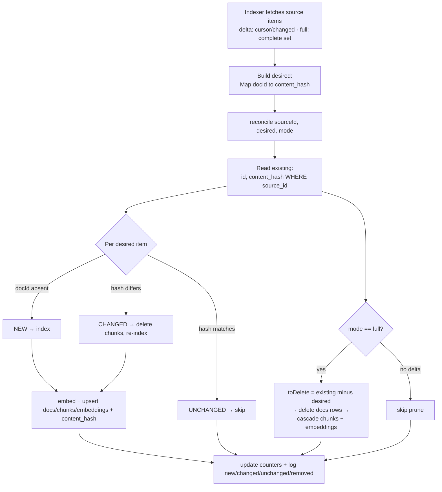

# Corpus Reconciliation Across All Source Indexers

## Summary

Every corpus indexer (GitHub files, GitHub issues/PRs, Trello, Jira,
Confluence) currently **upserts only** — it adds and overwrites docs but
never removes stale content, and most re-embed every item on every run.
This plan makes (re)indexing reconcile the corpus to exactly match the
source via one shared helper: **unchanged items are skipped (no
re-embed), changed items are re-embedded with their old chunks cleared,
and removed items are deleted** (FK cascade then cleans their chunks +
embeddings).

Two reconcile modes, surfaced as explicit UI actions:
- **Delta** — index new + changed, skip unchanged, do **not** prune
  removals. Cheap routine refresh. (Webhook + install also use delta /
  full respectively.)
- **Full** — fetch the complete current set and reconcile fully,
  including deleting items no longer in the source. The "make the corpus
  exactly match the source" action.

---

## Problem Frame

The corpus is three tables with a delete-cascade chain:
`docs` → `doc_chunks` (FK `on delete cascade`) → `corpus_chunk_embeddings`
(FK `on delete cascade`). Deleting a `docs` row therefore cleans its
chunks and embeddings automatically — reconciliation reduces to "delete
the right `docs` rows + re-embed the changed ones."

Today, none of the five indexers do this. Current behavior per source:

| Source | Fetch shape | docId scheme | `updated_at` stored | Skips unchanged? | Detects removals? |
|--------|-------------|--------------|---------------------|------------------|-------------------|
| GitHub files (`index-repo`) | full git tree | content-addressed `github:owner/repo:<path>@<blobSHA>` | index-time | no — re-embeds all | no |
| GitHub issues/PRs (`index-github-issues`) | incremental (`since` cursor) | entity `gh:owner/repo#issue:N` | source-time | yes (cursor limits fetch) | no |
| Trello (`index-trello`) | full | entity `trelloCardDocId(board, card)` | index-time | no — re-embeds all | no |
| Jira (`index-jira`) | full | entity `jiraIssueDocId(cloud, key)` | index-time | no — re-embeds all | no |
| Confluence (`index-confluence`) | full | entity `confluencePageDocId(cloud, page)` | index-time | no — re-embeds all | no |

Consequences:
1. **Stale accumulation.** A renamed/changed file produces a new
   content-addressed docId and orphans the old one forever. A deleted
   file/issue/card/page stays in the corpus indefinitely — surfacing in
   retrieval and skills as content that no longer exists.
2. **Wasted embedding cost.** Four of five sources re-embed every item
   every run. The three connectors store `updated_at = now()` (index
   time), so there's no fingerprint to tell changed from unchanged.
3. **No user control** over cheap-refresh vs authoritative-reconcile.

This was surfaced by a real incident: a stuck reindex left the corpus
out of sync, and there was no mechanism to prune what the source no
longer has.

---

## Requirements Trace

- **R1.** Unchanged items are not re-embedded on reindex (skip via
  content fingerprint).
- **R2.** Changed items are re-embedded, and their prior chunks +
  embeddings are cleared first (no orphaned/duplicate chunks when an
  item shrinks).
- **R3.** Removed items (deleted files, issues/PRs, Trello cards, Jira
  issues, Confluence pages) are deleted from the corpus, including their
  chunks + embeddings.
- **R4.** A single reconciliation contract/helper enforces R1–R3
  consistently across all five indexers — no per-connector divergence in
  the reconcile logic.
- **R5.** Two reindex modes exist and are user-selectable from the
  Sources UI: **delta** (R1 + R2, no prune) and **full** (R1 + R2 + R3).
- **R6.** Source status/progress counters remain meaningful when items
  are skipped (the progress bar still completes; logs distinguish
  new / changed / unchanged / removed).
- **R7.** Webhook-driven incremental updates use delta (cannot see
  removals); first-time index (GitHub `install`, connector `connect`)
  uses full.
- **R8.** Reconcile is scoped to the **doc subset the calling indexer
  owns**, not `source_id` alone. The GitHub file indexer and issue
  indexer share one `source_id`; reconcile must partition by
  `(source_id, type-set)` so a file reindex never deletes issue docs and
  vice versa.
- **R9.** Full-mode prune runs **only when the fetch that built the
  desired set is provably complete.** A truncated tree, a partial
  paginated fetch, or any swallowed per-item fetch/embed failure
  disables pruning for that run (delete nothing rather than delete
  live docs misread as "removed"). An empty desired set while existing
  docs remain never prunes-to-zero without an explicit confirmed-empty
  signal.

---

## Scope Boundaries

- **Writers only.** Only the portal Inngest indexers write the corpus.
  The bot-worker reads it (retrieval + corpus skills) and is unchanged by
  this plan.
- **No retrieval/skill changes.** Reconciliation changes what's in the
  corpus, not how it's queried.
- **No re-keying of GitHub file docIds.** Content-addressed file docIds
  stay as-is — the shared reconcile handles content-addressed and
  entity-keyed schemes uniformly (see Key Technical Decisions). This
  avoids a forced one-time re-embed of all files.
- **GitHub App branch handling** (deleted default branch) is already
  fixed separately (`index-repo` re-resolves the live default branch +
  the `onFailure` → `errored` safety net). Not re-addressed here.

### Deferred to Follow-Up Work

- **Backfill hashes without re-embed.** On the first reconcile after this
  ships, entity-keyed sources (issues/Trello/Jira/Confluence) have
  `content_hash = null` for existing docs, so the first run treats them
  as changed and re-embeds once to populate hashes. An optimization that
  computes the hash from already-stored `doc_chunks.text` to backfill
  without re-embedding is possible but deferred — the one-time cost is
  acceptable pre-launch and steady-state skips unchanged thereafter.
- **Scheduled full-reconcile cron.** Periodic automatic full reconcile
  (vs user-triggered) is out of scope; delta on cron + user-triggered
  full covers the need for now.

---

## Context & Research

### Relevant Code and Patterns

- `supabase/migrations/20260601000000_corpus_pgvector.sql` — defines
  `docs` / `doc_chunks` / `corpus_chunk_embeddings`. Verified FK chain:
  `doc_chunks.doc_id → docs(id) on delete cascade`,
  `corpus_chunk_embeddings.chunk_id → doc_chunks(chunk_id) on delete
  cascade`. Deleting a `docs` row cascades to both.
- `apps/portal/src/inngest/functions/index-repo.ts` — full-tree fetch;
  `indexBatch` builds `docId = github:owner/repo:<path>@<sha>`, upserts
  `docs` + `doc_chunks` + `corpus_chunk_embeddings`. load-source resets
  counters (`indexed_files=0, total_files=null, chunk_count=0`).
- `apps/portal/src/inngest/functions/index-github-issues.ts` —
  incremental (`since = max(docs.updated_at where type in
  ('issue','pull-request'))`); entity docId; stores source `updated_at`.
- `apps/portal/src/inngest/functions/index-trello.ts`,
  `index-jira.ts`, `index-confluence.ts` — full fetch each run;
  entity docIds via per-connector `*DocId` helpers; chunkId
  `${docId}::${i}`; store `updated_at = new Date()` (index time).
- `apps/portal/src/inngest/client.ts` — `SourceIndexRequestedEvent`
  (`data: { orgId, sourceId, reason: 'install'|'reindex'|'webhook' }`).
  All file/issue indexers trigger on `risezome/source.index-requested`.
- `apps/portal/app/(authed)/sources/reindex-action.ts` — server action
  that sets `status='pending'` and sends the index event.
- `apps/portal/app/(authed)/sources/_source-actions.tsx` — the per-source
  actions menu (Reindex item, disabled when `busy`).
- `apps/portal/app/(authed)/sources/page.tsx` — `busy = status ===
  'indexing'`; status pills.

### Institutional Learnings

- Pre-launch: DB migrations and breaking changes are acceptable
  (apply with `supabase db push`).
- The `kind` discriminator + Trello/Atlassian source columns already
  exist on `sources` (recent migrations applied to remote).

### External References

External research skipped — this is internal corpus/indexer architecture
with clear, consistent local patterns across the five indexers. No
external option set or unsettled dependency is involved.

---

## Key Technical Decisions

- **One `content_hash` column on `docs`, one shared reconcile helper.**
  Add nullable `content_hash text`. Every indexer computes a per-item
  fingerprint and the shared helper diffs desired-vs-existing by
  `(docId, content_hash)`. This is the uniformity the requirement asks
  for: a single reconcile path, not five.

- **Reconcile is scoped by `(source_id, type-set)`, never `source_id`
  alone (R8) — load-bearing for correctness.** The GitHub repo indexer
  (`type='file'`) and the issue indexer (`type IN ('issue',
  'pull-request')`) write to the **same `sources` row** and both fire on
  `risezome/source.index-requested`. Existing proof: `index-github-issues`
  reads its cursor with `.eq('source_id', sourceId).in('type',
  ['issue','pull-request'])` precisely because file docs share the
  source_id. So `reconcile(db, sourceId, ownedTypes, desired, mode)`
  reads existing and computes `toDelete` filtered to `type = ANY
  (ownedTypes)`. `index-repo` owns `['file']`; `index-github-issues`
  owns `['issue','pull-request']`. Connectors (Trello/Jira/Confluence)
  are each their own `sources` row of a distinct `kind` on distinct
  events, so they're not cross-contaminated — but they still pass their
  own type-set for defense-in-depth. **Without this scope, a full repo
  reindex deletes the entire issues corpus (and vice versa).**

- **Full-mode prune runs only on a provably complete fetch (R9).** The
  existing indexers swallow per-item fetch/embed failures with `continue`
  and accept git-tree truncation (`truncated` is read but ignored). An
  incomplete-but-non-throwing desired set fed into `toDelete = existing −
  desired` would delete live docs as phantom "removals." Prune is gated
  on a `fetchComplete` signal the indexer passes to reconcile:
  - `index-repo`: `fetchComplete = !tree.truncated && noPerFileFailures`.
    In full mode, a per-file fetch/embed failure flips `fetchComplete`
    false (or, simpler, throws so Inngest retries) rather than silently
    dropping the file from desired.
  - paginated sources (issues full fetch): `fetchComplete` false if any
    page errored.
  - Hard floor: never prune when `desired.size === 0 && existing.size >
    0` unless the fetch explicitly confirms the source is empty.
  When `fetchComplete` is false, reconcile indexes new/changed but skips
  the prune entirely (degrades to delta-safety for that run).

- **The reconcile helper handles content-addressed AND entity-keyed
  docId schemes with the same logic — no re-keying.** The diff rule:
  for each desired `{docId, hash}`: docId absent from existing → **new**;
  docId present but hash differs → **changed**; docId present and hash
  matches → **unchanged (skip)**. `toDelete` = existing docIds absent
  from the desired set.
  - GitHub files (content-addressed `path@sha`): a changed file is a new
    docId → falls into **new**; the old docId → **toDelete**. The
    "same docId, different hash" branch never fires. `content_hash` is
    set to the blob SHA (redundant but harmless, keeps the row uniform).
  - Entity-keyed sources (issues/Trello/Jira/Confluence): stable docId; a
    changed item is the same docId with a different hash → **changed**
    (chunks cleared, re-embedded).
  This lets one helper serve both without changing file docIds or forcing
  a re-embed of the existing 264 file docs.

- **Content fingerprint = SHA-256 of the joined chunk-input text** for
  entity-keyed sources (precise: re-embeds only when the embedded content
  actually changes, not on incidental activity like a label change). For
  GitHub files, the git blob SHA is already an exact content hash — use
  it directly.

- **Two modes on the event, surfaced as two UI actions.** Add
  `mode: 'delta' | 'full'` to `SourceIndexRequestedEvent`. The helper's
  prune step (delete `toDelete`) runs only in **full** mode. New/changed
  indexing + skip-unchanged run in both modes.
  - **Delta**: index new + changed, skip unchanged, **no prune**. For
    incremental sources (issues) delta also keeps using the `since`
    cursor to limit the fetch. Cheap.
  - **Full**: fetch the complete current set, reconcile, **prune
    removals**. For incremental sources (issues), full **ignores the
    cursor** and fetches all so removals are visible.
  - Routing: install → full; webhook → delta; manual reindex → user picks
    "Reindex (delta)" or "Reindex (full)" from the dropdown.

- **FK cascade does chunk/embedding cleanup, and changed-item re-embed is
  failure-safe (R2).** Reconcile only deletes `docs` rows (batched
  `.in('id', ids)`); chunks + embeddings cascade. For **changed** entity
  items, chunks are cleared before re-insert (`delete from doc_chunks
  where doc_id = X`) so a shrunk item doesn't leave trailing-position
  orphans. (Files don't need this — a changed file is a brand-new docId.)
  But clear-then-embed is a window: if the embed throws *after* the clear,
  the doc is left chunkless **and** its `content_hash` would mark it
  "unchanged" on the next run — a permanent invisible hole. Two rules
  close it: (1) **write `content_hash` only after the doc's chunks +
  embeddings are committed** — a failed re-embed leaves the old hash (or
  null), so the retry re-classifies it as changed; (2) for **changed**
  items, an embed failure **throws** (lets Inngest retry the step) rather
  than the existing `continue`-swallow, since a swallowed failure after a
  destructive clear must not pass silently.

- **Counter détente preserved — the issue indexer does not write the
  shared counters.** Inngest concurrency keys are per-function, so
  `index-repo`'s `{key: sourceId, limit: 1}` does **not** serialize it
  against `index-github-issues` (a different function id). Today the
  issue indexer deliberately writes no `sources` status/counters to avoid
  stomping. This plan keeps that: only `index-repo` owns
  `sources.status` + `indexed_files`/`total_files`/`chunk_count` for the
  GitHub kind; the issue indexer's progress is **structured logs only**
  (`{ new, changed, unchanged, removed }`). Connectors each own their own
  `sources` row, so they update their own counters freely. For
  `index-repo`, `total_files` = desired-file-set size; `indexed_files`
  increments per processed file (skipped + new + changed) so the bar
  completes.

- **Two modes carried on every index event (R5, R7), default delta.**
  Add `mode: 'delta' | 'full'` to the GitHub `SourceIndexRequestedEvent`
  **and** the connector events (`trello/jira/confluence.index-requested`).
  Routing: GitHub `install` / connector `connect` → full; webhook →
  delta; manual reindex → user's menu choice. The `mode ?? 'delta'`
  default is centralized in the shared reconcile entrypoint so no indexer
  can forget it — worst case is "doesn't prune," never "wrongly deletes."

---

## Open Questions

### Resolved During Planning

- **Fingerprint strategy** → `content_hash` column, unified helper
  (chosen over per-source heuristics).
- **Issue removal detection** → explicit delta/full modes surfaced in the
  UI dropdown (chosen over a separate periodic reconcile job).
- **Re-key file docIds?** → No; the helper handles content-addressed +
  entity-keyed uniformly.

### Deferred to Implementation

- Exact migration timestamp — must be greater than the latest applied
  migration (`20260603100000`); pick the next monotonic value at
  implementation time.
- Whether the reconcile helper batches deletes in chunks of N (e.g. 100)
  to stay under PostgREST URL limits on large `.in()` lists — decide
  against the observed corpus sizes during implementation.
- Trello "delta" semantics: Trello has no cheap incremental API today
  (full board fetch each run), so Trello delta = full fetch + skip
  unchanged + no prune. Confirm against the Trello client at impl time.

---

## High-Level Technical Design

> Reconcile flow shared by every indexer. The indexer supplies the
> desired set (per its own fetch + docId + hash); the helper owns the
> diff, the prune, and the changed-chunk cleanup.



The diff rule (the heart of R1–R3), as directional pseudo-code — not
implementation spec:

```
reconcile(sourceId, ownedTypes, desired: Map<docId,{hash}>, mode, fetchComplete):
  // SCOPED to the indexer's own doc types — never source_id alone (R8)
  existing = select id, content_hash from docs
             where source_id = sourceId AND type = ANY(ownedTypes)
  toIndex = []
  for [docId, {hash}] in desired:
    if docId not in existing:            toIndex.push({docId, kind:'new'})
    elif existing[docId].hash !== hash:  toIndex.push({docId, kind:'changed'})
    else:                                /* unchanged → skip */
  toDelete = [id for id in existing if id not in desired]
  // PRUNE only on a complete fetch, and never prune-to-zero blindly (R9)
  prune = mode == 'full' and fetchComplete
          and not (desired.size == 0 and existing.size > 0 and not confirmedEmpty)
  if prune and toDelete:                 deleteDocs(batched(toDelete))  // cascade
  return { toIndex, removed: prune ? toDelete.length : 0, unchanged, pruned: prune }
// caller per toIndex item:
//   if 'changed': clearDocChunks(docId)   // delete-cascade old chunks+embeddings
//   embed + upsert docs/chunks/embeddings; write content_hash ONLY after commit;
//   on embed failure for a 'changed' item → throw (don't continue) so retry fires
```

---

## Implementation Units

### U1. Migration: add `content_hash` to `docs`

**Goal:** Add a nullable `content_hash text` column to `docs` so every
indexer can store a per-item content fingerprint the reconcile helper
compares against.

**Requirements:** R1, R4.

**Dependencies:** None.

**Files:**
- Create: `supabase/migrations/<next-timestamp>_docs_content_hash.sql`

**Approach:**
- `alter table public.docs add column content_hash text;` (nullable —
  existing rows backfill on next reindex).
- No index needed (reconcile reads `content_hash` only for rows already
  filtered by `source_id`, which is indexed).
- Timestamp must exceed `20260603100000`.

**Patterns to follow:**
- Existing additive migrations under `supabase/migrations/` (e.g. the
  `generalize_sources_and_trello` column adds).

**Test scenarios:**
- Test expectation: none — pure additive schema migration. Verified by
  `supabase db push` succeeding and a follow-up `select content_hash from
  docs limit 1` returning the column (null).

**Verification:**
- `supabase db push` applies cleanly; `content_hash` present and nullable;
  existing rows unaffected.

---

### U2. Shared corpus-reconcile helper

**Goal:** A single helper that, given a `sourceId`, the **owned doc-type
set**, a desired `Map<docId, { hash, ... }>`, a `mode`, and a
`fetchComplete` flag, computes new/changed/unchanged and (in full mode,
on a complete fetch) deletes removed docs; plus a `clearDocChunks` helper
for the changed-item re-index. This is the one place R1–R3, R8, R9 live.

**Requirements:** R1, R2, R3, R4, R8, R9.

**Dependencies:** U1.

**Files:**
- Create: `apps/portal/src/inngest/lib/corpus-reconcile.ts`
- Create: `apps/portal/test/inngest/corpus-reconcile.test.ts`

**Approach:**
- `reconcile(db, { sourceId, ownedTypes, desired, mode, fetchComplete })`:
  - Read existing `{ id, content_hash }` for `source_id = sourceId AND
    type = ANY(ownedTypes)` (R8 — never source_id alone; paginate past
    the PostgREST row cap so a large source's existing set is complete).
  - Partition desired into `new` / `changed` / `unchanged` by the diff
    rule (docId presence, then hash compare).
  - `toDelete = existing ids ∉ desired`. Prune (delete in batches via
    `.in('id', batch)`, cascade handles chunks + embeddings) **only when**
    `mode === 'full' && fetchComplete` **and not** a blind prune-to-zero
    (`desired.size === 0 && existing.size > 0` aborts the prune unless a
    `confirmedEmpty` signal is set) — R9.
  - Default `mode ?? 'delta'` here so callers can't forget it.
  - Return `{ toIndex: [{docId, kind}], counts: { new, changed,
    unchanged, removed }, pruned: boolean }`.
- `clearDocChunks(db, docId)`: `delete from doc_chunks where doc_id =
  docId` (cascade clears embeddings) — callers invoke this for `changed`
  items before re-inserting chunks. **Callers must write `content_hash`
  only after chunks+embeddings commit, and throw on embed failure for a
  changed item** (R2 atomicity — the helper documents this contract;
  enforcement lives in the indexer callers, U4/U5/U6).
- Pure data-shaping + Supabase calls; no connector-specific logic.

**Execution note:** test-first — the diff rule + the type-scope + the
prune gate are the correctness core; write those tests before the impl.

**Patterns to follow:**
- Supabase service-role query patterns in the existing indexers
  (`createServiceRoleClient().from('docs')...`).
- Mock-Supabase test shape in
  `apps/bot-worker/test/skills/github/_mock-db.ts` (chainable builder stub).

**Test scenarios:**
- Happy path (full, complete): existing {a:h1, b:h2, c:h3}; desired
  {a:h1, b:h2x, d:h4} → new=[d], changed=[b], unchanged=[a], delete=[c].
- Delta mode: same inputs → new=[d], changed=[b], unchanged=[a], **no
  delete call**, removed=0, pruned=false.
- **Type-scope (R8 — the load-bearing test): existing has file docs AND
  issue docs under the same source_id; reconcile with ownedTypes=['file']
  and a desired set of only files → the existing read is filtered to
  type='file' and NO issue doc appears in toDelete.** Symmetric test for
  ownedTypes=['issue','pull-request'] not deleting file docs.
- **Prune gate (R9): full mode with `fetchComplete=false` → indexes
  new/changed but deletes nothing (pruned=false).**
- **Prune-to-zero guard: full mode, complete, desired.size=0,
  existing.size>0, confirmedEmpty=false → no delete; with
  confirmedEmpty=true → deletes all.**
- Content-addressed file shape: existing {p@sha1}; desired {p@sha2},
  full+complete → new=[p@sha2], delete=[p@sha1]; changed-branch never
  fires for files.
- Null existing hash: existing {a:null}; desired {a:h1} → changed
  (re-index once to populate hash).
- Large delete set → batched into multiple `.in()` calls (assert batch
  boundary).
- `clearDocChunks` issues a delete scoped to the docId.
- Error path: a delete batch returns an error → throws (Inngest retries),
  no silent stale rows.

**Verification:**
- `pnpm --filter @risezome/portal test` covers the partition + type-scope
  + prune-gate + batching logic without a live DB.

---

### U3. Reindex modes: event contract + Sources UI

**Goal:** Add `mode: 'delta' | 'full'` to the index event, expose two
reindex actions ("Reindex (delta)" / "Reindex (full)") in the Sources
per-source menu, and wire install→full / webhook→delta.

**Requirements:** R5, R7.

**Dependencies:** None (can land before or after U2; indexers in U4–U6
consume the mode).

**Files:**
- Modify: `apps/portal/src/inngest/client.ts` (add `mode` to
  `SourceIndexRequestedEvent.data`)
- Modify: `apps/portal/app/(authed)/sources/reindex-action.ts` (accept +
  forward `mode`)
- Modify: `apps/portal/app/(authed)/sources/_source-actions.tsx` (two
  menu items)
- Modify: callers that emit the event — install callback / webhook
  handler (`apps/portal/app/api/github/...`) and any connector connect
  actions — to pass `mode` (`install` → `full`, `webhook` → `delta`).
- Modify (test): `apps/portal/test/...` reindex-action test if present;
  otherwise add a focused test for the action emitting the right mode.

**Approach:**
- `mode` is required on the event going forward; map existing `reason`
  values: `install → full`, `webhook → delta`, `reindex → mode from the
  user's menu choice`.
- The two menu items call `reindexSourceAction(formData)` with a
  `mode` field. Keep the `busy` disable (status `indexing`/`pending`)
  on both.
- Copy/labels: "Reindex (delta)" with a hint like "new & changed only",
  "Reindex (full)" with "also removes deleted items".

**Patterns to follow:**
- Existing `SourceIndexRequestedEvent` shape + `inngest.send` in
  `reindex-action.ts`.
- The existing single Reindex menu item in `_source-actions.tsx`.

**Test scenarios:**
- `reindexSourceAction` with `mode=full` emits an event with
  `data.mode === 'full'` and sets status `pending`.
- `reindexSourceAction` with `mode=delta` emits `data.mode === 'delta'`.
- Missing/invalid `mode` → defaults to `delta` (safe: never prunes
  unexpectedly).
- Membership check still enforced (org scoping) before emit.
- UI: both menu items render and are disabled when status is
  `indexing`/`pending` (component-level test or manual).

**Verification:**
- Both actions appear in the menu; clicking each emits the corresponding
  mode (observed in Inngest dev dashboard); install/webhook paths pass
  the right mode.

---

### U4. `index-repo` (GitHub files): reconcile + skip-unchanged + prune

**Goal:** Make the file indexer skip unchanged files (don't re-embed),
prune deleted files in full mode, and store `content_hash`. Files keep
content-addressed docIds; the shared helper handles them.

**Requirements:** R1, R2, R3, R6, R8, R9.

**Dependencies:** U1, U2, U3.

**Files:**
- Modify: `apps/portal/src/inngest/functions/index-repo.ts`
- Modify/Create: `apps/portal/test/inngest/index-repo.test.ts` (if no
  test harness exists, add focused coverage for the desired-set build +
  reconcile wiring)

**Approach:**
- After building `targets` (filtered tree blobs), build desired =
  `Map(docId → { hash: blobSha, entry })` where docId stays
  `github:owner/repo:<path>@<sha>` and `content_hash = sha`.
- Call `reconcile` with **`ownedTypes: ['file']`** (R8 — so it never
  touches issue/PR docs under the same source_id) and a **`fetchComplete`
  flag** = `!tree.truncated && noPerFileFailures` (R9). In full mode,
  treat a per-file content-fetch/embed failure as either a hard error
  (throw → Inngest retries) or a `fetchComplete=false` signal — do **not**
  silently `continue` and then prune, or live files get deleted as
  phantom removals.
- Only embed `toIndex` (new + changed) — unchanged files skipped (R1).
  For files `changed` won't occur (content-addressed), but document +
  test the invariant rather than leaving it implicit (F7): assert/branch
  that the file path produces only new/removed, and cover the changed
  branch so a future docId-scheme change can't silently break it.
- Prune runs only via the helper's gated path (full + complete).
- Set `content_hash = sha` on the `docs.upsert`, written after chunks +
  embeddings commit.
- Counters: `total_files = desired.size`; increment `indexed_files`
  across processed items (skipped + embedded) so the bar completes; log
  `{ new, changed, unchanged, removed }`. (`index-repo` remains the sole
  writer of the shared `sources` counters — see counter-détente KTD.)

**Patterns to follow:**
- Existing `indexBatch` upsert flow; the new branch changes which files
  get embedded + adds `content_hash`, the type-scoped reconcile, and the
  fetch-completeness gate.

**Test scenarios:**
- Unchanged repo (same tree) reindex → 0 files embedded, unchanged =
  total, removed = 0.
- One file changed → new docId embedded; full prunes the old docId;
  delta leaves it.
- One file deleted → full deletes its doc; delta leaves it.
- New file added → embedded in both modes.
- **Type-scope (R8): a source_id that also holds issue docs → a full file
  reindex deletes zero issue docs.**
- **Truncated tree (R9): `tree.truncated === true` in full mode → prune
  skipped (no deletions), new/changed still indexed.**
- **Per-file fetch failure in full mode → either throws or disables prune
  for the run (no phantom deletion).**
- `content_hash` written = blob sha; counters reach `indexed_files ==
  total_files`.

**Verification:**
- Reindex (delta) of an unchanged repo embeds nothing; Reindex (full)
  after deleting a file removes that file's doc + chunks AND leaves all
  issue docs intact; corpus file-doc `count` matches the current tree.

---

### U5. `index-github-issues`: reconcile + change-aware chunks + full/delta fetch

**Goal:** Clear-and-reinsert chunks for changed issues, detect+delete
removed issues in full mode (full fetch ignores the cursor), keep delta
incremental, and store `content_hash`.

**Requirements:** R1, R2, R3, R6, R7, R8, R9.

**Dependencies:** U1, U2, U3.

**Files:**
- Modify: `apps/portal/src/inngest/functions/index-github-issues.ts`
- Modify: `apps/portal/test/lib/github/...` or add
  `apps/portal/test/inngest/index-github-issues.test.ts`

**Approach:**
- `content_hash = sha256(joined chunk-input text)` for each issue.
- Reconcile with **`ownedTypes: ['issue','pull-request']`** (R8 — so it
  never touches `type='file'` docs sharing the source_id; this mirrors
  the existing `.in('type', […])` cursor filter that already proves the
  shared source_id).
- **Delta**: keep the `since = max(updated_at)` cursor (fetch only
  changed/new). Reconcile against existing → changed issues get
  `clearDocChunks` then re-embed; unchanged (hash match) skip. **No
  prune** (`fetchComplete=false` for delta — the cursor can't see the
  full set, so removals are invisible by construction).
- **Full**: fetch all issues (ignore cursor), paginate to completion,
  `fetchComplete = no page errored`. Reconcile + prune removed issue docs
  (R3, R9-gated).
- **Atomicity (R2):** write `content_hash` only after the issue's chunks
  + embeddings commit; on embed failure for a changed issue, throw
  (Inngest retries) rather than `continue` — never leave a cleared issue
  chunkless-and-marked-unchanged.
- **Counters:** issue indexer writes **no** shared `sources` counters
  (counter-détente KTD) — progress is structured logs only.

**Patterns to follow:**
- Existing incremental fetch loop + `chunkIssue` in
  `apps/portal/src/lib/github/chunk-issues.ts`; existing type-scoped
  cursor read.

**Test scenarios:**
- Changed issue whose body shrank (fewer chunks) → old chunks cleared,
  new chunks only (no trailing orphans). Covers R2.
- Unchanged issue (same content_hash) → skipped, not re-embedded.
- **Type-scope (R8): full issue reindex under a source_id that also holds
  file docs deletes zero file docs; counts computed over issue/PR docs
  only.**
- Full mode with an issue removed upstream → its doc deleted; delta →
  retained (no prune).
- Full ignores the cursor (fetches all); delta uses it.
- **Embed failure mid-change (R2 atomicity): clearDocChunks ran, embed
  throws → step throws (no chunkless doc with stale hash); retry
  re-embeds.**
- `content_hash` stable when content identical even if GitHub
  `updated_at` changed (e.g. a label edit) → no re-embed.

**Verification:**
- Editing an issue body then Reindex (delta) re-embeds just that issue
  with the correct chunk count; deleting an issue then Reindex (full)
  removes it AND leaves all file docs intact.

---

### U6. Connector indexers (Trello, Jira, Confluence): reconcile + skip-unchanged + prune

**Goal:** Bring the three full-fetch connectors onto the shared reconcile:
skip unchanged (they currently re-embed everything), prune removed items
in full mode, store `content_hash`. Mechanically identical change across
the three.

**Requirements:** R1, R2, R3, R4, R6, R7, R9.

**Dependencies:** U1, U2, U3.

**Files:**
- Modify: `apps/portal/src/inngest/functions/index-trello.ts`
- Modify: `apps/portal/src/inngest/functions/index-jira.ts`
- Modify: `apps/portal/src/inngest/functions/index-confluence.ts`
- Modify: `apps/portal/src/inngest/client.ts` (add `mode` to the three
  connector `*.index-requested` event interfaces — covered jointly with
  U3, listed here since this unit consumes it)
- Modify: connector connect/reindex emitters to pass `mode` (`connect` →
  full, `reindex` → user choice, `webhook` → delta).
- Create: `apps/portal/test/inngest/index-connectors-reconcile.test.ts`
  (one suite exercising the shared wiring against a representative
  connector; the three share the pattern)

**Approach:**
- Each indexer fetches its full set (unchanged — Trello/Jira/Confluence
  have no cheap incremental API today, so delta = full fetch + skip
  unchanged + no prune; full = + prune). Build desired =
  `Map(entityDocId → { hash: sha256(chunk text), item })`.
- Reconcile with each connector's **own type-set** (defense-in-depth —
  each connector is its own `sources` row of a distinct `kind`, but pass
  the type anyway), and `fetchComplete` = full page set retrieved
  without error (R9 — a partial board/project/space fetch must not
  prune).
- Embed only new + changed (R1 skip-unchanged: the big win — these
  currently re-embed everything). `changed` items get `clearDocChunks`
  before re-insert, with the same atomicity rule as U5 (write
  `content_hash` post-commit; throw on changed-item embed failure).
- Full prunes removed cards/issues/pages (R3, R9-gated); delta does not.
- Stop storing `updated_at = new Date()` as the change signal — the
  `content_hash` is the fingerprint now. (Keep `updated_at` as the
  source's modified time where available, for display/ordering.)
- Each connector owns its own `sources` row → updates its own counters
  freely (no shared-counter détente concern; that's GitHub-only).
- **Mode (R7):** connector `connect` → full, `reindex` → user's menu
  choice, `webhook` (if/when added) → delta; `mode ?? 'delta'` default
  centralized in the reconcile entrypoint.

**Patterns to follow:**
- The shared helper wiring established in U2/U4/U5 so all five indexers
  read the same.
- Existing per-connector `*DocId` + chunk builders (unchanged).

**Test scenarios:**
- Trello: unchanged board reindex → nothing embedded; one card edited →
  only that card re-embedded with chunks cleared; one card removed →
  full prunes it, delta keeps it.
- Jira: same three behaviors at the issue level.
- Confluence: same three behaviors at the page level.
- `content_hash` written for each; identical content across runs → skip.
- Full mode with the whole board/project/space emptied → all docs pruned
  (confirmedEmpty path); a **partial/errored** fetch in full mode → no
  prune (R9).
- Changed-item embed failure → throws, no chunkless doc (R2 atomicity).
- Connector event carries `mode`; missing → delta default.

**Verification:**
- Re-running a connector index with no source changes embeds nothing
  (observed: zero embedding calls); Reindex (full) after removing a
  card/issue/page deletes it from the corpus.

---

## System-Wide Impact

- **Interaction graph:** GitHub file + issue indexers both fire on
  `risezome/source.index-requested` and **share one `source_id`** — the
  reason reconcile must be type-scoped (R8). Connectors fire on their own
  `trello/jira/confluence.index-requested` events and each owns a distinct
  `sources` row of its `kind`, so they don't cross-contaminate. Adding
  `mode` touches every emitter (GitHub install callback, webhook handler,
  reindex action; connector connect/reindex actions). U3 + U6 enumerate
  them; a missed emitter defaults to `delta` (safe — never prunes).
- **Error propagation:** Reconcile deletes must surface errors (throw →
  Inngest retry) rather than silently leaving stale rows. Changed-item
  embed failures also throw (not `continue`) so a cleared doc is never
  left chunkless. The existing `onFailure → errored` net (index-repo)
  means a failed reconcile re-enables reindex.
- **State lifecycle:** Deletes rely on the FK cascade
  (docs→chunks→embeddings). If a future migration ever drops a cascade,
  reconciliation leaks — the U2 tests assert delete-by-doc is the only
  cleanup path, and this invariant is called out here.
- **Read-side safety:** The bot-worker reads the corpus concurrently.
  Deleting stale docs mid-meeting is safe (retrieval just won't return
  them); no locking needed. A card already surfaced in a live meeting is
  a snapshot and unaffected.
- **Counter ownership:** For the GitHub kind, `index-repo` is the **sole**
  writer of the shared `sources` counters (Inngest concurrency keys don't
  serialize across function ids, so the issue indexer staying out of the
  counters avoids last-writer-wins stomping). Connectors each own their
  own row and write freely. The Sources UI progress reaches 100% when
  unchanged items are counted as covered.
- **Unchanged invariants:** docId schemes, chunk-id schemes, the embed
  pipeline, and retrieval are unchanged. Only "which items get embedded"
  and "stale items get deleted" change.

---

## Risks & Dependencies

| Risk | Mitigation |
|------|------------|
| **Cross-delete: a full GitHub file reindex deletes the issue corpus (and vice versa) — they share a `source_id`.** Highest-severity data-loss path. | Reconcile is type-scoped (R8): `index-repo` owns `['file']`, `index-github-issues` owns `['issue','pull-request']`. The load-bearing U2 + U4 + U5 tests assert no cross-type deletion. |
| **Partial/truncated/empty fetch in full mode prunes live docs as phantom removals.** Swallowed `continue` errors + accepted tree truncation feed an incomplete desired set. | Full-mode prune gated on a `fetchComplete` signal (R9): truncated tree / any per-item fetch failure / paginated page error disables prune; never prune-to-zero without `confirmedEmpty`. Tested in U2/U4/U6. |
| **Clear-then-embed leaves a chunkless doc with a stale hash → marked unchanged forever (invisible hole).** | Write `content_hash` only after chunks+embeddings commit; changed-item embed failure throws (not `continue`) so the retry re-embeds (R2 atomicity). Tested in U5/U6. |
| Counter stomping between the two concurrent GitHub indexers (per-function concurrency keys don't serialize across function ids) | Détente preserved: only `index-repo` writes the shared `sources` counters for the GitHub kind; the issue indexer logs progress instead. |
| Delta mode leaves stale prior-SHA **file** docs live (content-addressed: an edited file's old doc isn't pruned until a full run) — more staleness than removals-only | Documented in mode copy + ops notes: recommend a periodic Reindex (full) for repos; delta is the cheap refresh, full is authoritative. |
| First reconcile re-embeds all entity-keyed items once (null `content_hash`) | One-time, bounded cost; steady-state skips unchanged. Optional chunk-text backfill deferred. Communicate via logs. |
| A delete-batch error leaves the corpus partially reconciled | Helper throws on delete error → Inngest retries the step; `onFailure` flips source to `errored` (recoverable). Deletes are idempotent. |
| Large `.in('id', […])` delete lists exceed PostgREST URL limits | Batch deletes (chunk size decided in U2); covered by a batching test. |
| `content_hash` over-/under-detects change | For files, blob sha is exact. For entity sources, sha256 of the *embedded* chunk text is exact for retrieval purposes — incidental metadata changes that don't alter chunk text correctly skip. |
| A new emitter of the index event forgets `mode` | Defaulting to `delta` means the worst case is "doesn't prune," never "wrongly deletes." |
| Trello/Jira/Confluence full fetch is expensive every run | Unchanged today; skip-unchanged via hash removes the *embedding* cost (the expensive part). Incremental *fetch* for these connectors is separate future work. |

---

## Documentation / Operational Notes

- After shipping, the Sources page shows two reindex actions; a brief note
  in the connector docs / `docs/runbooks/` explaining delta vs full is
  worth adding — including the guidance that **delta is the cheap routine
  refresh and full is the authoritative reconcile that prunes
  removals** (and, for GitHub files, clears the stale prior-SHA
  duplicates that delta leaves behind). Recommend a periodic full reindex
  per source.
- A `docs/solutions/` entry capturing the shared-reconcile pattern (diff
  by docId+hash, cascade-delete cleanup, delta/full modes) is reusable for
  any future connector.

---

## Sources & References

- `supabase/migrations/20260601000000_corpus_pgvector.sql` (corpus schema
  + FK cascade chain — verified).
- `apps/portal/src/inngest/functions/{index-repo,index-github-issues,index-trello,index-jira,index-confluence}.ts`
- `apps/portal/src/inngest/client.ts` (`SourceIndexRequestedEvent`).
- `apps/portal/app/(authed)/sources/{reindex-action.ts,_source-actions.tsx,page.tsx}`
- Prior related work: `docs/plans/2026-05-31-003-feat-skill-routing-bot-worker-plan.md`
  (U5 introduced `index-github-issues`).
