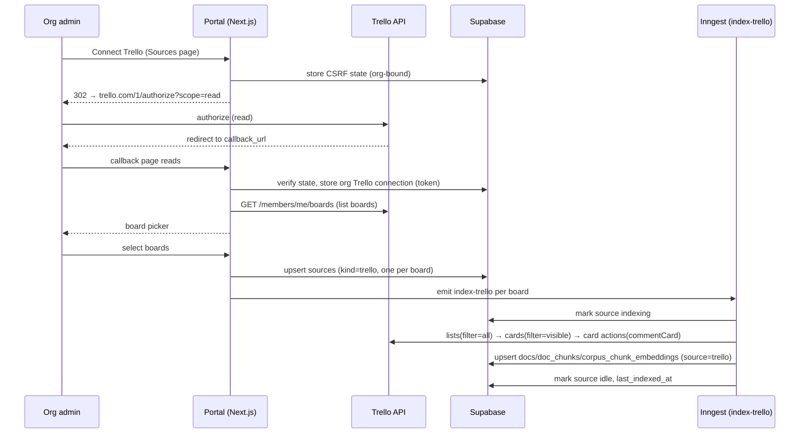
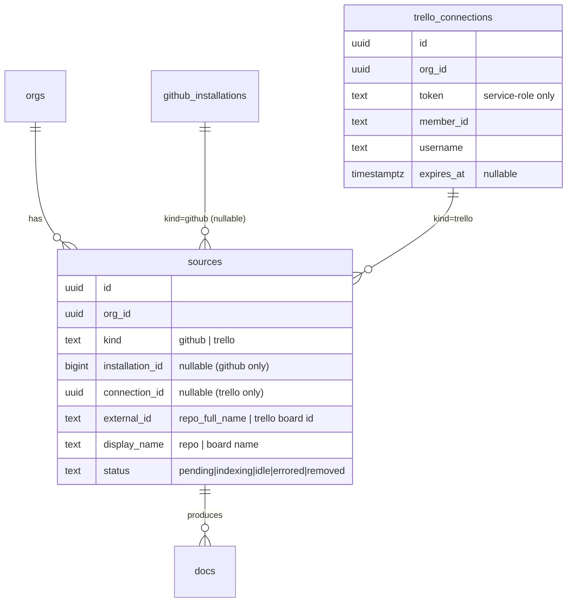

# feat: Trello source connector (+ general connector foundation)

## Summary

Make the `sources` model connector-agnostic and add **Trello** as the first
non-GitHub source. Today every source row requires a GitHub App installation
(`public.sources.installation_id NOT NULL → github_installations`); we generalize
that in place with a `kind` discriminator and a nullable GitHub FK, then build the
Trello path end to end: an org-level Trello connect flow, a board picker on the
Sources page, a Trello indexer that pulls each selected board's cards + comments
into the existing corpus, and surfacing those as cited `source: trello` cards in
meetings — reusing the same retrieval path GitHub already uses.

This is a Deep plan: it touches a data migration, a third-party OAuth-style auth
flow with token storage, a new background indexer, and UI. It does **not** touch
the GitHub indexing path beyond the shared schema change.

---

## Problem Frame

Risezome grounds live meetings in connected sources, but **only GitHub is wired
up** — Jira and Slack are "Coming soon" stubs on the Sources page with no
ingestion, and the `sources` table is GitHub-coupled. The corpus layer
underneath (`docs`, `doc_chunks`, `corpus_chunk_embeddings`, the chunker, the
Voyage embedder) is already source-agnostic and `docs` even carries a `source`
discriminator column. The missing piece is a general way to **register and index
a non-GitHub source**. Trello is the first such source and forces that
generality into existence; the next connectors (Jira, Slack) get much cheaper.

See origin: `docs/brainstorms/2026-05-31-trello-source-connector-requirements.md`.

---

## Requirements Traceability

- **R1** — A source representable without a GitHub install → U1
- **R2** — Source carries a `kind`/type + per-type identity → U1
- **R5** — One org-level Trello connection (per-user token, org-scoped) → U2
- **R6** — Board selection (mirrors install + repo-select) → U4
- **R3** — Index card name + description + comments + metadata → U3, U5
- **R4** — Flows through the existing corpus pipeline → U5
- **R7** — Archived/closed cards + archived lists skipped; no checklists → U3, U5
- **R8** — Freshness = on connect + manual re-index; webhooks deferred → U5, U4
- **R9** — Surfaces as `source: trello`, citable → U6
- **R10** — Surfaced card shows name, board · list, link → U6
- **R11** — Trello sources in the Sources list with status + re-index → U4

Success criteria (origin): an org connects Trello, picks boards, sees them reach
indexed state with no GitHub install in the path; a Trello-answerable question
surfaces that card in-meeting linking back to Trello; the *next* connector reuses
U1's foundation without touching the source model again; archived/personal
content is not indexed.

---

## Key Technical Decisions

### KTD1. Generalize `sources` in place (discriminator + nullable GitHub FK)

Add `sources.kind text not null default 'github'` and make `installation_id`
nullable. GitHub rows keep `kind='github'` + their installation; Trello rows use
`kind='trello'` + a new connection reference + board identity, with
`installation_id NULL`. One Sources list, one corpus path, one status machine
serve all connectors. Rationale: a parallel Trello-sources table would fork the
Sources UI, the `docs.source_id` FK, and the indexing dispatch for no benefit;
the table is already org-scoped and has a generic status lifecycle.
Source of truth for the current shape: `supabase/migrations/...sources_and_indexer...`.

### KTD2. Reuse the source counter + status columns as generic "items"

`indexed_files` / `total_files` / `chunk_count` become generic item counters
(cards for Trello, files for GitHub); the UI labels them per `kind`. No new
Trello-specific status table. Keeps the existing `pending → indexing → idle |
errored | removed` lifecycle and the `sources` row as the single unit of
indexing work.

### KTD3. Org-level Trello connection via the `/1/authorize` read-token flow

Trello has **no org/app install** — auth is a per-user token. We connect **one
org-level Trello account**: redirect to
`https://trello.com/1/authorize?scope=read&expiration=never&response_type=token&callback_method=fragment&key=…&callback_url=…`,
and store the resulting token as the org's Trello connection. Reuse the existing
CSRF-state pattern (`pending_installations`-style) to bind the flow to the
initiating org. Because Trello returns the token in a **URL fragment** (not
server-readable), the callback is a small client page that reads
`window.location.hash` and POSTs the token + state to a server endpoint to
persist it. Token stored in a service-role-only table (like GitHub installs).

**Forward-looking:** Trello's OAuth 2.0 migration (RFC-89) will add token expiry;
store the token with a nullable `expires_at` and treat the connection as
refreshable so the eventual migration is a contained change. (Research: no
deprecation date; ≥6 months' notice promised.)

### KTD4. Dedicated Trello indexer Inngest function (mirrors `index-repo`)

A new `index-trello` Inngest function mirrors `index-repo.ts`'s shape (load
source → mark indexing → fetch → chunk → embed → upsert docs/chunks/embeddings →
status idle), dispatched by a Trello-specific event. Per-board source = one
indexing unit, same concurrency caps. Rationale: the *fetch* stage differs
entirely (Trello REST vs git tree); forcing one generic indexer would be a
conditional mess. The shared corpus-write half is small enough to duplicate or
extract as a tiny helper.

### KTD5. One doc per Trello card; text = name + description + comments

Each indexed card becomes one `docs` row (`source='trello'`, `type='card'`,
`title=card name`, `url=card shortUrl`, `provenance='trusted'`), and its chunk
text concatenates name + description + the comment thread. Comments are part of
the card's text (not separate docs) so retrieval returns the card as the citable
unit. Domain is always `text` (Voyage `voyage-3-large`), never `code`.

### KTD6. Archived exclusion is explicit, not filter-trusted

Trello's `filter=open`/`visible` does **not** exclude cards on archived lists
(documented API gotcha). The indexer fetches lists with `filter=all`, builds the
set of archived list IDs, and excludes cards whose `idList` is archived — one
extra request per board. Closed cards (`closed=true`) are also skipped. Use the
immutable card `id` (not `idShort`, which regenerates on board move) as the
stable doc key.

### KTD7. Surfacing reuses the existing retrieval → card path

`docs.source='trello'` / `type='card'` flow through the same retrieval that
already turns matched chunks into in-meeting cards; the `trello` source-chip
color already exists in the palette. U6 verifies the card builder carries
`source`/`type`/`title`/`url` for Trello and maps `type='card'` to a sensible
glyph/label, rather than building a new surfacing path.

---

## High-Level Technical Design

### Connect + index flow

### Generalized source model (ERD delta)

Exact column names/shape are directional — final schema is the implementer's call
within KTD1/KTD2.

---

## Implementation Units

### U1. Generalize the `sources` model for non-GitHub connectors

**Goal:** `sources` can represent a Trello board with no GitHub installation; a
`kind` discriminator and Trello connection storage exist.

**Requirements:** R1, R2

**Dependencies:** none

**Files:**
- `supabase/migrations/<new>_generalize_sources_and_trello.sql` (add
  `sources.kind` default `'github'`, make `installation_id` nullable, add
  generic identity columns per KTD1, add `trello_connections` table with
  service-role-only RLS; backfill existing rows to `kind='github'`)
- `supabase/seed.sql` (only if it references source shape)
- Any shared types for a source row (`packages/shared-types` or portal `_lib`)

**Approach:** Per KTD1/KTD2. Keep the existing status lifecycle and counters
(reused as generic items). `trello_connections` mirrors `github_installations`'s
org-binding + service-role-only access (no member RLS on the token). Add a
`check` so `kind='github'` rows have an `installation_id` and `kind='trello'`
rows have a `connection_id` (enforce the per-kind identity at the DB).

**Patterns to follow:** `github_installations` + `pending_installations` RLS and
service-role-only conventions; the `set_updated_at` trigger; existing `sources`
status enum.

**Test scenarios:**
- Migration applies cleanly and existing GitHub source rows read back with
  `kind='github'` and their `installation_id` intact.
- Inserting a `kind='trello'` source with `installation_id NULL` and a
  `connection_id` succeeds; a `kind='github'` row with NULL installation is
  rejected by the check.
- RLS: an org member can read their org's `sources` regardless of kind;
  `trello_connections` is not readable by `authenticated` (service-role only).
- `docs.source_id` FK still resolves for both kinds.

**Verification:** `supabase db` migration runs; a Trello board row can be created
and linked to a `trello_connections` row; GitHub indexing is unaffected.

---

### U2. Trello connect + token capture (org-level read token)

**Goal:** An org admin can authorize Trello (read scope) and the org's token is
stored securely, with the URL-fragment capture handled.

**Requirements:** R5

**Dependencies:** U1

**Files:**
- `apps/portal/app/(authed)/sources/trello/connect/route.ts` (mint CSRF state,
  302 to `trello.com/1/authorize`)
- `apps/portal/app/(authed)/sources/trello/callback/page.tsx` (client page that
  reads `window.location.hash`, POSTs token + state)
- `apps/portal/app/api/trello/connect/route.ts` (server: verify state, fetch
  `/members/me` to capture member_id/username, store `trello_connections`)
- `apps/portal/app/_lib/trello.ts` (auth URL builder + token/identity helpers)
- `apps/portal/test/trello/connect.test.ts`

**Approach:** Per KTD3. Reuse the `pending_installations` CSRF pattern (org-bound,
15-min, single-use) — either the existing table generalized or a Trello-specific
analog. The callback is a minimal client page because Trello returns the token in
the fragment; it POSTs `{token, state}` to the API route, which validates state,
calls `GET /members/me?key&token` to confirm the token + record identity, and
upserts the org's `trello_connections` row. Handle a Trello `401` (revoked/invalid
token) by surfacing a re-connect prompt and not persisting.

**Patterns to follow:** `apps/portal/app/(authed)/sources/install/route.ts`
(state mint + redirect), `apps/portal/app/api/github/install-callback`
(state verify + bind to org), service-role client usage.

**Test scenarios:**
- Connect route mints a single-use state row bound to the authed org and
  redirects to a `trello.com/1/authorize` URL carrying `scope=read`,
  `expiration=never`, and the callback URL.
- API callback with a valid state + token verifies the token via `/members/me`,
  stores the connection, and clears the state row.
- Replay: a reused or expired state is rejected; no connection is written.
- Error path: a `401` from `/members/me` (revoked/invalid token) returns a
  re-connect error and writes nothing.
- A second connect for the same org updates (not duplicates) the connection.

**Verification:** Completing the flow in a browser results in a stored
`trello_connections` row and the Sources page showing Trello as connected.

---

### U3. Trello read client (boards, lists, cards, comments)

**Goal:** A typed, server-side Trello read client that lists boards, lists, and a
board's non-archived cards with descriptions and comments — with pagination,
rate-limit backoff, and 401 handling.

**Requirements:** R3, R6, R7

**Dependencies:** U1

**Files:**
- `apps/portal/app/_lib/trello.ts` (extend U2's lib) **or**
  `packages/engine/src/connectors/trello/*` if the client should live with the
  engine (implementer's call; keep it where the indexer can import it)
- `apps/portal/test/trello/client.test.ts`

**Approach:** Per KTD6. Endpoints (research-grounded): `GET /members/me/boards`
(`filter=open`, fields incl. `idOrganization`, `dateLastActivity`); per board
`GET /boards/{id}/lists?filter=all` (to find archived list IDs); `GET
/boards/{id}/cards?filter=visible&fields=…&limit=1000` then **exclude cards whose
`idList` is archived**; per card `GET /cards/{id}/actions?filter=commentCard&limit=1000`
with `before` cursor pagination. Use immutable card `id` (not `idShort`).
Implement cursor pagination (max 1000, iterate on last `id`), exponential backoff
on `429` honoring the `x-rate-limit-*` headers, and stay under ~100 req/10s per
token. Surface a typed `TrelloAuthError` on `401`.

**Patterns to follow:** `@risezome/engine` embed client's rate-limit error class
(`EmbeddingRateLimitError`) as a model for typed retryable errors; existing
`requireEnv` usage for the API key.

**Test scenarios:**
- Lists a token's boards and maps fields (id, name, url, org id, last activity).
- Card fetch excludes cards on archived lists: given lists where one is
  `closed=true`, cards on that list are dropped even though `filter=visible`
  returned them.
- Closed cards (`closed=true`) are skipped.
- Pagination: a board returning the per-call max triggers a follow-up request
  using the last `id` as `before`; results concatenate without duplicates.
- Comment fetch returns comment text + author + date for a card; a card with no
  comments yields an empty list.
- `429` triggers backoff and retry (mock clock); `401` raises `TrelloAuthError`
  without retry.
- `idShort` is never used as a key; the immutable `id` is.

**Verification:** Against a real (or recorded) Trello board, the client returns
the expected non-archived cards with descriptions and comments.

---

### U4. Sources page: connect Trello + board picker + status list

**Goal:** Replace the Trello "Coming soon" stub with a working connect → pick
boards → see indexing status flow, consistent with the GitHub repo list.

**Requirements:** R6, R8, R11

**Dependencies:** U2, U3, U5

**Files:**
- `apps/portal/app/(authed)/sources/page.tsx` (render Trello connection + boards
  alongside GitHub repos; per-kind labels for the item counter)
- `apps/portal/app/(authed)/sources/_trello-board-picker.tsx` (select boards to
  index)
- `apps/portal/app/(authed)/sources/trello-select-action.ts` (server action:
  upsert `sources` rows for chosen boards, emit index events)
- `apps/portal/app/(authed)/sources/reindex-action.ts` (extend to dispatch the
  Trello event for `kind='trello'` sources)
- `apps/portal/test/sources/trello-select.test.ts`

**Approach:** When a Trello connection exists, fetch the account's boards (U3) and
show a picker; selecting boards upserts one `kind='trello'` source per board and
emits `index-trello` events. Reuse the existing source-row status UI
(pending/indexing/idle/errored + re-index) — only the item-count label differs
("cards" vs "files"). Re-index reuses the existing affordance, dispatching by
`source.kind`.

**Patterns to follow:** the GitHub repo list + `ConnectorCard`,
`SourceActions`/`reindex-action.ts`, and `_auto-refresh.tsx` on
`apps/portal/app/(authed)/sources/page.tsx`.

**Test scenarios:**
- With a Trello connection, the page lists the account's boards and the Trello
  connector shows "Connected" (not "Coming soon").
- Selecting two boards creates two `kind='trello'` source rows and emits two
  index events.
- Re-index on a Trello source dispatches the Trello index event (not the GitHub
  one).
- Selecting an already-indexed board does not duplicate its source row.
- A Trello source row shows status + item count with the "cards" label.

**Verification:** Connecting + picking boards lands source rows that progress
pending → indexing → idle on the page.

---

### U5. Trello indexer (Inngest `index-trello`)

**Goal:** Index a selected board's cards + comments into the corpus end to end,
with the same status/counter lifecycle as the GitHub indexer.

**Requirements:** R3, R4, R7, R8

**Dependencies:** U1, U3

**Files:**
- `apps/portal/src/inngest/functions/index-trello.ts`
- `apps/portal/src/inngest/index.ts` (register the function + event)
- `apps/portal/src/inngest/client.ts` (event type, if typed centrally)
- `apps/portal/test/inngest/index-trello.test.ts`

**Approach:** Per KTD4/KTD5. Triggered by `risezome/trello.index-requested`
`{ orgId, sourceId }`. Steps mirror `index-repo.ts`: load source + its
`trello_connections` token, mark `indexing`; fetch the board's non-archived cards
(U3); for each card build text = name + description + comments, chunk via the
text chunker, embed via Voyage, and upsert `docs` (`source='trello'`,
`type='card'`, `title=name`, `url=shortUrl`, `provenance='trusted'`,
`id='trello:<boardId>:<cardId>'`), `doc_chunks`, and `corpus_chunk_embeddings`;
update the item counters; mark `idle` + `last_indexed_at`. Full re-index each run
(no incremental in v1); on `TrelloAuthError` mark `errored` with a re-connect
message. Same concurrency caps as `index-repo` (1 per source, 2 per org).

**Execution note:** Build the card→doc-text + archived-exclusion logic test-first;
it carries the connector's correctness and the documented archived-list pitfall.

**Patterns to follow:** `apps/portal/src/inngest/functions/index-repo.ts`
(step structure, status updates, upsert shape, `arrayToVectorLiteral`, Voyage
batching, Inngest retry on rate-limit errors).

**Test scenarios:**
- Happy path: a board with 3 cards (each with a description and comments) yields
  3 `docs` rows with `source='trello'`/`type='card'`, chunk + embedding rows, and
  the source ends `idle` with item count = 3.
- Doc text includes the card name, description, and comment bodies.
- Archived exclusion: cards on an archived list are not indexed (no docs).
- Re-index is idempotent: running twice upserts (does not duplicate) docs/chunks
  for unchanged cards; a removed card's doc can be pruned or left (state the
  chosen behavior).
- `401` mid-run marks the source `errored` with a re-connect message and does not
  poison partial state.
- Voyage rate-limit error propagates so Inngest retries (mirrors GitHub indexer).
- Empty board (no non-archived cards) ends `idle` with count 0.

**Verification:** Triggering the function for a connected board populates the
corpus and the source reaches `idle`; the cards are retrievable via the corpus
search RPCs.

---

### U6. Surface Trello cards in meetings (retrieval parity)

**Goal:** Trello-derived docs surface as in-meeting cards with `source: trello`,
the card name, board · list, and a working link — citable like any source.

**Requirements:** R9, R10

**Dependencies:** U5

**Files:**
- The retrieval/card-builder in `apps/bot-worker/src/retrieval.ts` (verify it
  carries `docs.source`/`type`/`title`/`url`; extend if GitHub-specific)
- HUD card type/glyph mapping in `packages/hud-ui` (map `type='card'` to a Trello
  glyph/label) — coordinate with the in-flight hud-ui work
- `apps/bot-worker/test/retrieval-trello.test.ts` (or the nearest existing
  retrieval test)

**Approach:** Per KTD7. Confirm the chunk→doc→card path already propagates
`source` and `url` (GitHub cards do). If the card builder hardcodes GitHub
assumptions (e.g., type label or URL construction), generalize it to read
`docs.source`/`type`/`url`. Map `type='card'` to a Trello-appropriate
glyph/label in the shared HUD components. Board · list display: carry the list
name in the doc title or a metadata field surfaced on the card (decide in
planning-time review with the retrieval shape).

**Patterns to follow:** however GitHub `file`/`issue` docs currently become cards
in `apps/bot-worker/src/retrieval.ts`; the existing source-chip palette
(`--src-trello` already defined).

**Test scenarios:**
- A retrieved Trello chunk produces a card with `source='trello'`, the card name
  as title, and the Trello `shortUrl` as the link.
- The card is eligible for citation in the synthesized answer like a GitHub card.
- A mixed result set (GitHub + Trello) renders both with correct per-source chips.
- If the card builder was GitHub-specific, a Trello doc no longer falls through to
  a wrong/blank source.

**Verification:** In a simulated/real meeting whose transcript matches a Trello
card, the card surfaces with the Trello chip and links back to Trello.

---

## Scope Boundaries

**In scope**
- General `sources` model supporting non-GitHub kinds (U1).
- Trello connector end to end: connect → pick boards → index cards+comments →
  surface as cited cards (U2–U6).
- Sources-page Trello UI replacing the "Coming soon" stub (U4).

**Deferred for later**
- Jira and Slack connectors (U1's foundation makes them cheaper; remain stubs).
- Live freshness via Trello webhooks (and the comment edit/delete gap that only
  webhooks close).
- Incremental re-index via `dateLastActivity` / board `actions?since=` (full
  re-index in v1).
- Per-member Trello connections / union-of-visible-boards.
- Indexing checklists, attachments, archived content; pruning permanently-deleted
  cards via `deleteCard` actions.

**Outside this product's identity**
- Risezome reads Trello to ground meetings; it does not write back to Trello,
  move cards, or act as a Trello client. (Writing gaps back into tools is a
  separate existing thread, not this connector.)

### Deferred to Follow-Up Work
- Migrating Trello auth to OAuth 2.0 (RFC-89) when Atlassian sets a date; the
  nullable `expires_at` + refreshable-connection shape (KTD3) is the seam.
- Extracting a formal connector interface/registry once the second non-GitHub
  connector (Jira/Slack) lands and the shared shape is proven.

---

## System-Wide Impact

- **Data migration:** alters `public.sources` (nullable FK + new columns) and adds
  `trello_connections`. Existing GitHub rows backfilled to `kind='github'`. The
  GitHub indexer and Sources UI must keep working unchanged — verify after the
  migration.
- **New external dependency:** the Trello REST API + a Trello API key (new env
  var, e.g. `TRELLO_API_KEY`) and stored per-org user tokens (secrets — service-
  role-only table, redaction at log sinks per AGENTS.md).
- **Bot-worker / hud-ui:** U6 touches the retrieval card-builder and shared HUD
  card components, which another instance is actively editing — coordinate to
  avoid collisions (sequence U6 last / rebase on their changes).
- **Inngest:** one new function + event; reuses existing concurrency posture.

---

## Risks & Dependencies

- **R: Token-in-fragment capture.** Trello returns the token in a URL fragment the
  server can't read. Mitigation: a minimal client callback page posts it back
  (KTD3, U2); covered by tests for state validation.
- **R: Archived-list leak.** `filter=open`/`visible` returns cards on archived
  lists. Mitigation: explicit archived-list exclusion (KTD6, U3 test).
- **R: Rate limits (100 req/10s per token).** A board with many cards × comments
  can burst. Mitigation: backoff on 429 honoring headers, per-card comment
  pagination, Inngest step batching (U3, U5).
- **R: OAuth 2.0 migration (RFC-89).** Current tokens will eventually need
  reissue with granular scopes. Mitigation: store with nullable `expires_at`,
  treat the connection as refreshable; full migration deferred.
- **R: hud-ui / retrieval churn.** U6 overlaps an in-flight effort. Mitigation:
  sequence U6 last and coordinate.
- **Dependency:** existing corpus pipeline (`docs`, `doc_chunks`,
  `corpus_chunk_embeddings`, `@risezome/engine` chunker + Voyage embedder) and the
  Inngest indexing pattern (`index-repo.ts`).

---

## Testing Strategy

- **Unit (logic-heavy):** the Trello client (U3 — pagination, archived exclusion,
  401/429) and the indexer's card→doc-text + archived logic (U5) carry real
  coverage; U5's core logic is built test-first (Execution note).
- **Connect flow (U2):** state mint/verify, fragment-token capture, revoked-token
  path.
- **Migration (U1):** applies cleanly, backfills GitHub rows, per-kind check
  constraints, RLS on the token table.
- **UI (U4):** server-action behavior (rows created, events emitted, re-index
  dispatch by kind) over heavy render coverage.
- **Surfacing (U6):** retrieval produces a correct Trello card; mixed-source
  rendering.
- Mock the Trello API in tests (recorded fixtures for board/card/comment shapes);
  do not hit the live API in CI.

---

## Sources & Research

- Origin requirements: `docs/brainstorms/2026-05-31-trello-source-connector-requirements.md`
- Source schema (GitHub-coupled): `supabase/migrations/...sources_and_indexer...`
- Corpus schema (`docs.source`, `source_id`, chunks, embeddings):
  `supabase/migrations/...corpus_pgvector...`
- GitHub indexer pattern: `apps/portal/src/inngest/functions/index-repo.ts`
- GitHub connect/CSRF pattern: `apps/portal/app/(authed)/sources/install/route.ts`,
  `apps/portal/app/api/github/install-callback`
- Sources UI + connector stubs: `apps/portal/app/(authed)/sources/page.tsx`
- **Trello REST API (external research, load-bearing):**
  - Auth (key+token, `/1/authorize` read scope, no org install, OAuth 1.0a):
    https://developer.atlassian.com/cloud/trello/guides/rest-api/authorization/
  - Rate limits (300/10s key, 100/10s token, 429 + headers):
    https://developer.atlassian.com/cloud/trello/guides/rest-api/rate-limits/
  - Object definitions (Card/Board fields, `dateLastActivity`):
    https://developer.atlassian.com/cloud/trello/guides/rest-api/object-definitions/
  - Action types (`commentCard`; edit/delete are webhook-only):
    https://developer.atlassian.com/cloud/trello/guides/rest-api/action-types/
  - Archived-list `filter=open` pitfall:
    https://community.developer.atlassian.com/t/filter-open-on-card-endpoints-ignores-parent-lists-archived-state-inconsistent-with-ui-search/100997
  - OAuth 2.0 migration (RFC-89), `idShort` instability:
    https://developer.atlassian.com/cloud/trello/changelog/

---

## Open Questions (deferred to implementation)

- Exact generalized `sources` column set (reuse `repo_full_name`/`repo_id` as
  generic `external_id`/`display_name` vs. add new columns) — settle when writing
  the migration (KTD1/KTD2 bound the choice).
- Where the Trello read client lives (portal `_lib` vs `@risezome/engine`
  connectors) — wherever the indexer imports cleanly.
- Whether to reuse the existing `pending_installations` table for Trello CSRF
  state or add a Trello-specific analog.
- Board · list display on the surfaced card: carry the list name in the doc title
  vs. a metadata field — depends on the retrieval card shape (U6).
- Re-index pruning policy for cards deleted since last index (leave vs. prune) —
  v1 may leave; revisit with incremental.
