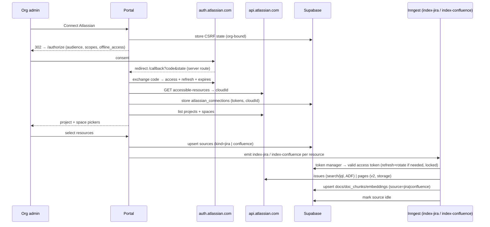
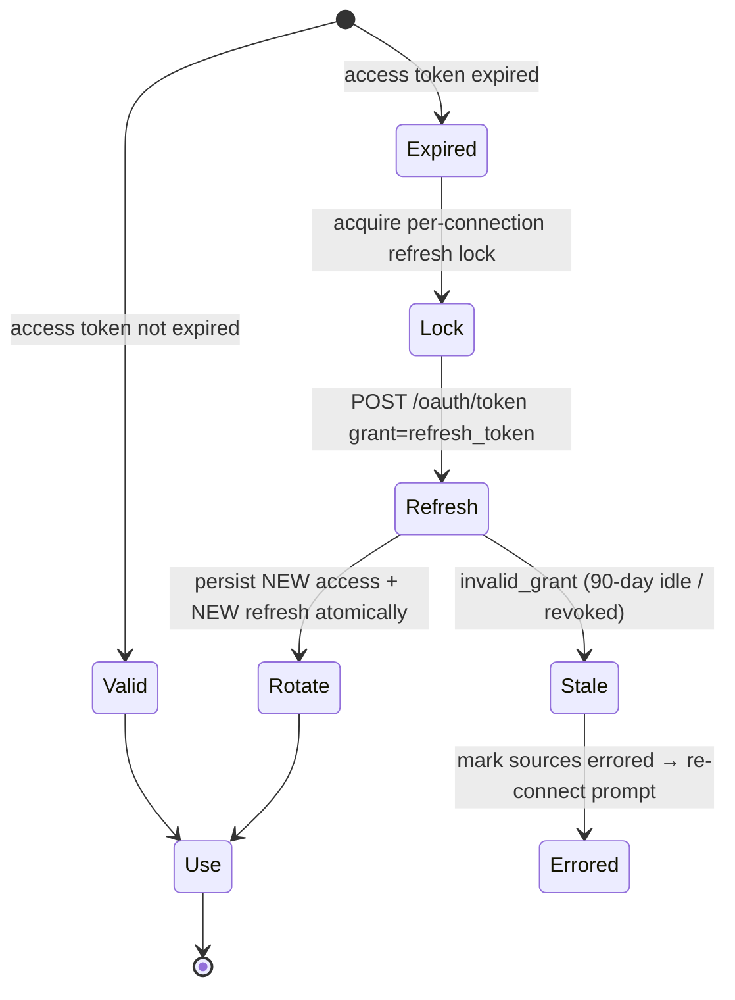

# feat: Atlassian (Jira + Confluence) source connector

## Summary

Add an **Atlassian** connector on the source-connector foundation built for
Trello. One org-level Atlassian connection via **OAuth 2.0 3LO with refresh
tokens** (single cloud site) feeds **two source kinds** off the same connection:
`jira` (a project → its issues + comments) and `confluence` (a space → its pages
+ body). Both flow through the existing corpus pipeline and surface as cited
cards. This is the first connector to use refresh-token auth and the first to put
two kinds behind one connection — exercising the foundation against OAuth and
making the next OAuth connector cheaper.

**Stacks on the unmerged `feat/trello-source-connector` branch** (the connector
foundation: `sources.kind`, the per-kind indexer + Sources-UI patterns, the
corpus pipeline, branded surfacing). Build on that branch.

---

## Problem Frame

Teams run planning in Jira and docs in Confluence; both hold the status,
decisions, and documentation Risezome surfaces in meetings, and neither is
connectable. The Trello work generalized `sources` to non-GitHub kinds and proved
the connect → pick-resources → index → surface loop. Atlassian extends that to
two high-demand sources, but introduces real new ground the foundation hasn't
faced: **OAuth 2.0 3LO with rotating refresh tokens**, a cloud-site (`cloudId`)
lookup, and two distinct content shapes (Jira **ADF**, Confluence **storage
format**).

See origin: `docs/brainstorms/2026-05-31-atlassian-jira-confluence-connector-requirements.md`.

---

## Requirements Traceability

- **R1** — One Atlassian connection per org via OAuth 2.0 3LO (Jira+Confluence read) → U1, U2
- **R2** — Store + refresh tokens (access + refresh + expiry) → U1, U3
- **R5** — Record the chosen Atlassian site (cloudId); single site v1 → U2
- **R6** — Select Jira projects to index → U4
- **R7** — Select Confluence spaces to index (independent of Jira) → U4
- **R3** — Jira: issue summary + description + comments + metadata → U5
- **R4** — Confluence: page title + body (no page comments) → U7
- **R8** — Both through the existing corpus pipeline + status lifecycle → U5, U7
- **R9** — Freshness: on connect + manual full re-index; webhooks deferred → U4, U5, U7
- **R10** — Surface `jira`/`issue` and `confluence`/`page`, citable, branded → U6
- **R11** — Surfaced card shows title + link → U5, U7, U6
- **R12** — Sources page status + re-index; stale token → re-connect prompt → U4, U3

Success criteria (origin): connect once, pick Jira/Confluence resources, reach
indexed state with no second auth; a Jira- or Confluence-answerable question
surfaces that item cited + linked; indexing keeps working past access-token
expiry (refresh works unattended); reuses the foundation without re-architecting.

---

## Key Technical Decisions

### KTD1. Dedicated `atlassian_connections` store (not Trello's table)

Trello's connection holds a static, non-expiring token; Atlassian needs access
token + **refresh token** + expiry + `cloudId` (+ site URL, granted scopes).
Add a new `atlassian_connections` table (one per org, service-role-only RLS like
`trello_connections`). `sources.kind` extends to allow `jira` and `confluence`,
both pointing at `connection_id` → `atlassian_connections`, with `external_id` =
project id (Jira) or space id (Confluence). Rationale: the refresh/rotation/site
fields don't belong on the Trello table, and one Atlassian connection backing two
kinds is exactly the brainstorm's shape.

### KTD2. Server-side OAuth 2.0 3LO authorization-code flow

Unlike Trello's token-in-fragment hack, Atlassian uses a standard auth-code flow:
connect route redirects to `auth.atlassian.com/authorize` (with
`audience=api.atlassian.com` — **required**, `prompt=consent`, `state`, read
scopes + `offline_access`); the callback is a **server route** that receives
`?code&state`, exchanges it server-side at `auth.atlassian.com/oauth/token`
(needs `ATLASSIAN_CLIENT_ID` + `ATLASSIAN_CLIENT_SECRET`), then calls
`accessible-resources` to resolve the `cloudId` and stores the connection. Reuse
the `pending_installations` CSRF-state pattern. Scopes (classic):
`read:jira-work read:jira-user read:confluence-content.all
read:confluence-space.summary offline_access`.

### KTD3. Refresh-on-use with atomic rotation + a per-connection refresh lock

Atlassian refresh tokens **rotate**: each refresh returns a new refresh token and
invalidates the old, with a 90-day idle expiry (reset on each refresh). A token
manager returns a valid access token, refreshing when expired and **atomically
replacing** the stored refresh token. Because Jira and Confluence indexers can run
concurrently and both might refresh the same connection, **serialize refresh per
connection** (a Postgres advisory lock or a guarded conditional update) so a race
can't rotate-and-invalidate the other's token. On `invalid_grant` (stale/expired
refresh), mark the connection's sources `errored` with a re-connect message.
Periodic keepalive refresh is deferred.

### KTD4. Two indexers (Jira, Confluence) dispatched by `source.kind`

Mirror the Trello/GitHub pattern: `index-jira` and `index-confluence` Inngest
functions, each triggered by its own event, dispatched from the Sources actions
by `source.kind`. The corpus-write half is shared with the existing indexers; the
fetch + text-extraction halves differ per product (Jira REST v3 / ADF vs
Confluence REST v2 / storage). One generic indexer would be a conditional mess.

### KTD5. Content APIs + text extraction (Jira v3/ADF, Confluence v2/storage)

- **Jira:** projects via `/rest/api/3/project/search`; issues via the **new**
  `/rest/api/3/search/jql` (token pagination via `nextPageToken`, no `total`),
  fields `summary,description,comment,status,issuetype,assignee,key`; full comments
  via `/rest/api/3/issue/{key}/comment`. `description`/comment bodies are **ADF
  JSON** → a recursive **ADF→text** extractor (collect `text` nodes; guard null
  descriptions).
- **Confluence:** spaces via `/wiki/api/v2/spaces`; pages via
  `/wiki/api/v2/pages?space-id=…&body-format=storage` (cursor pagination via
  `_links.next`); body is **storage format (XHTML-like)** → a **storage→text**
  extractor (strip tags). Use **v2**, not the deprecated v1.

All Atlassian calls are `cloudId`-namespaced
(`api.atlassian.com/ex/{jira|confluence}/{cloudId}/…`).

### KTD6. Rate-limit handling (points model + Retry-After)

Atlassian's points-based limits (enforced 2026) return `429` + `Retry-After`. The
shared client honors `Retry-After` strictly, adds exponential backoff with jitter
(cap retries), and stays well under burst limits. Jira's `/search/jql` loop bug
(repeating `nextPageToken`) is guarded by tracking seen issue keys + a max-iter
cap (treat repeats / `isLast` as termination).

### KTD7. Surfacing reuses the generic path; only Confluence needs new branding

Retrieval already carries `docs.source/type/title/url`, and `jira` is already a
known HUD source (chip) with an existing `issue` type — so Jira issues surface
branded with no UI change. Confluence adds a `confluence` source chip (color) and
a `page` type (label + glyph) to the shared HUD components, additively.

---

## High-Level Technical Design

### Connect + index flow

### Token refresh (per-connection, serialized)

Schema/field names are directional; final shape is the implementer's within KTD1.

---

## Implementation Units

### U1. Migration: extend `sources.kind` + `atlassian_connections`

**Goal:** `sources` accepts `jira`/`confluence` kinds; an `atlassian_connections`
table stores the org's OAuth tokens + cloudId.

**Requirements:** R1, R2, R5

**Dependencies:** the Trello foundation migration (already on this branch)

**Files:**
- `supabase/migrations/<new>_atlassian_connections.sql` (extend the `sources.kind`
  check to include `jira`,`confluence`; add `atlassian_connections` with
  `org_id`, `access_token`, `refresh_token`, `expires_at`, `cloud_id`, `site_url`,
  `scopes`, timestamps; service-role-only RLS; extend the per-kind identity check
  so `jira`/`confluence` rows require `connection_id` + `external_id`; unique
  index per (org, kind, external_id))
- `apps/portal/test/rls/atlassian-sources.test.ts`

**Approach:** Mirror the Trello migration (`...generalize_sources_and_trello.sql`)
and `trello_connections`. The `sources.kind` check is currently
`in ('github','trello')` → add the two kinds. Reuse the generic
`connection_id`/`external_id`/`display_name` columns from the foundation.

**Patterns to follow:** the Trello migration + `trello_connections` (service-role
RLS, per-kind check, partial unique index).

**Test scenarios:**
- Migration applies; existing rows unaffected; a `jira` and a `confluence` source
  insert (with `connection_id` + `external_id`, no `installation_id`).
- The per-kind check rejects a `jira`/`confluence` row missing `connection_id`.
- RLS: members read their org's jira/confluence sources; `atlassian_connections`
  is not readable by an authenticated member (service-role only).
- Unique index blocks a duplicate (org, kind, external_id).

**Verification:** migration runs; a Jira project + a Confluence space source can
be created against an `atlassian_connections` row; other connectors unaffected.

---

### U2. Atlassian OAuth 2.0 3LO connect + callback

**Goal:** An org admin authorizes Atlassian once; the org's tokens + cloudId are
stored.

**Requirements:** R1, R5

**Dependencies:** U1

**Files:**
- `apps/portal/app/(authed)/sources/atlassian/connect/route.ts` (mint CSRF state;
  302 to `auth.atlassian.com/authorize` with `audience`, scopes, `offline_access`,
  `prompt=consent`, `state`)
- `apps/portal/app/api/atlassian/callback/route.ts` (server callback: verify
  state, exchange `code` → tokens, resolve `cloudId` via accessible-resources,
  store connection; pick the first/only site for v1)
- `apps/portal/app/_lib/atlassian.ts` (authorize-URL builder, token exchange,
  accessible-resources, scope constants)
- `apps/portal/test/atlassian/connect.test.ts`

**Approach:** Per KTD2. Standard auth-code flow — the callback is a server GET
(no client fragment page). Reuse `pending_installations` for CSRF. `ATLASSIAN_
CLIENT_ID`/`ATLASSIAN_CLIENT_SECRET` env (add to `.env.example`). On a single
accessible resource, store its `cloudId` + `url`; if multiple, pick the first for
v1 (note the limit). Handle a denied consent / error redirect gracefully.

**Patterns to follow:** `apps/portal/app/(authed)/sources/install/route.ts` +
`api/github/install-callback` (state mint/verify/bind); the Trello connect flow.

**Test scenarios:**
- Connect route mints org-bound state + redirects to an `auth.atlassian.com/
  authorize` URL carrying `audience=api.atlassian.com`, the read scopes,
  `offline_access`, and the state.
- Callback with valid state + code exchanges for tokens (mock the token endpoint),
  resolves cloudId (mock accessible-resources), stores the connection, clears state.
- Replay / expired state rejected; nothing stored.
- Token-exchange failure (non-200) → error redirect, nothing stored.
- A second connect for the same org updates (not duplicates) the connection.

**Verification:** completing the flow yields one `atlassian_connections` row with
tokens + cloudId; Sources shows Atlassian connected.

---

### U3. Atlassian token manager + REST client + text extractors

**Goal:** A reusable layer that yields a valid (refreshed) access token and makes
cloudId-namespaced Jira/Confluence GETs, plus ADF→text and storage→text.

**Requirements:** R2, R3, R4, R12

**Dependencies:** U1, U2

**Files:**
- `apps/portal/app/_lib/atlassian-token.ts` (get-valid-token: refresh-if-expired
  with atomic rotation persistence + per-connection lock; `invalid_grant` → typed
  `AtlassianAuthError`)
- `apps/portal/app/_lib/atlassian-client.ts` (cloudId-namespaced GET with
  Retry-After/429 backoff + jitter; Jira issue search + comments; Confluence
  spaces + pages; cursor + nextPageToken pagination with the loop safeguard)
- `apps/portal/app/_lib/atlassian-text.ts` (`adfToText`, `storageToText`)
- `apps/portal/test/atlassian/token.test.ts`
- `apps/portal/test/atlassian/client.test.ts`
- `apps/portal/test/atlassian/text.test.ts`

**Approach:** Per KTD3/KTD5/KTD6. The token manager reads the connection, returns
the access token if unexpired, else refreshes (POST `oauth/token`
`grant_type=refresh_token`) and **atomically** writes the new access+refresh+
expiry, guarded so concurrent callers don't double-rotate (conditional update on
the old refresh token, or advisory lock). The client builds
`api.atlassian.com/ex/{product}/{cloudId}/…` URLs, honors `Retry-After`, backs off
with jitter, and paginates (Jira `nextPageToken` + seen-keys loop guard;
Confluence `_links.next` cursor). Extractors: ADF walk collecting `text` nodes
(null-safe); storage strip-tags to text.

**Execution note:** Build `adfToText`/`storageToText` and the token-refresh
rotation logic test-first — they carry the connector's correctness and the
auth-staleness risk.

**Patterns to follow:** the Trello client's typed auth error + backoff
(`apps/portal/app/_lib/trello-client.ts`); `@risezome/engine` embed rate-limit
error as a model for retryable typed errors.

**Test scenarios:**
- Token: unexpired → returns stored access token, no refresh. Expired → refreshes,
  persists the new access+refresh+expiry, returns the new access token.
- Rotation: after refresh, the OLD refresh token is replaced (not appended).
- `invalid_grant` on refresh → `AtlassianAuthError` (no retry).
- Concurrency: two simultaneous get-valid-token calls on an expired connection
  result in a single refresh (lock/guard), not two competing rotations.
- Client: `429` with `Retry-After` → waits + retries (injected clock); persistent
  429 → gives up after the cap.
- Jira pagination: a `nextPageToken` page then a final page concatenate; a
  repeating token (loop bug) terminates via the seen-keys guard.
- Confluence pagination: follows `_links.next` until absent.
- `adfToText`: extracts text from nested paragraphs/headings/lists; `null`
  description → empty string. `storageToText`: strips XHTML tags to readable text.

**Verification:** against recorded fixtures, the client returns issues (with
comments) and pages (with body text), and the token manager refreshes unattended.

---

### U5. Jira indexer (Inngest `index-jira`)

**Goal:** Index a selected Jira project's issues + comments into the corpus.

**Requirements:** R3, R8, R9

**Dependencies:** U1, U3

**Files:**
- `apps/portal/src/inngest/functions/index-jira.ts`
- `apps/portal/app/api/inngest/route.ts` (register), `src/inngest/client.ts` (event)
- `apps/portal/app/_lib/atlassian-doc.ts` (`buildIssueDocText`, doc id) — shared with U7
- `apps/portal/test/inngest/index-jira.test.ts`
- `apps/portal/test/atlassian/doc.test.ts`

**Approach:** Per KTD4. Triggered by `risezome/jira.index-requested {orgId,
sourceId}`. Steps mirror `index-trello`: load source + connection, mark indexing;
search the project's issues (U3), fetch each issue's comments, build doc text =
summary + description + comments (ADF→text), chunk as text, Voyage-embed, upsert
`docs` (`source='jira'`, `type='issue'`, `title=summary`, `url` = the issue's
browse URL from `site_url`+key, `id='jira:<cloudId>:<issueKey>'`); update counters;
mark idle. `AtlassianAuthError` → mark errored with re-connect message (no retry);
Voyage rate-limit → rethrow for Inngest retry.

**Execution note:** Build `buildIssueDocText` (ADF-aware) test-first.

**Patterns to follow:** `apps/portal/src/inngest/functions/index-trello.ts` (step
structure, upsert shape, batching, status machine).

**Test scenarios:**
- 3 issues (each with description + comments) → 3 `docs` (`source='jira'`,
  `type='issue'`), chunk + embedding rows, source ends idle, count 3.
- Doc text includes summary, description (ADF-extracted), and comment bodies.
- An issue with a `null` description still indexes (summary + comments only).
- Re-index is idempotent (upsert, no duplicates).
- `invalid_grant`/auth error mid-run → source `errored` + re-connect message.
- Voyage rate-limit error propagates (Inngest retry).
- Empty project → idle, count 0.

**Verification:** triggering the function for a connected project populates the
corpus; issues are retrievable via the corpus search RPCs.

---

### U7. Confluence indexer (Inngest `index-confluence`)

**Goal:** Index a selected Confluence space's pages into the corpus.

**Requirements:** R4, R8, R9

**Dependencies:** U1, U3

**Files:**
- `apps/portal/src/inngest/functions/index-confluence.ts`
- `apps/portal/app/api/inngest/route.ts` (register), `src/inngest/client.ts` (event)
- `apps/portal/app/_lib/atlassian-doc.ts` (`buildPageDocText`, doc id) — shared with U5
- `apps/portal/test/inngest/index-confluence.test.ts`

**Approach:** Per KTD4/KTD5. Triggered by `risezome/confluence.index-requested`.
List the space's current (non-archived) pages with `body-format=storage` (U3),
build doc text = title + body (storage→text), chunk, embed, upsert `docs`
(`source='confluence'`, `type='page'`, `title=page title`, `url` = page URL,
`id='confluence:<cloudId>:<pageId>'`); counters; idle. Same auth/rate-limit
failure handling as U5.

**Execution note:** Build `buildPageDocText` (storage-aware) test-first.

**Patterns to follow:** `index-trello.ts` + U5.

**Test scenarios:**
- 2 pages (title + storage body) → 2 `docs` (`source='confluence'`,`type='page'`),
  chunks + embeddings, idle, count 2.
- Doc text includes the title and the tag-stripped body.
- Archived/trashed pages (separate status) are not indexed.
- Re-index idempotent.
- Auth error → errored + re-connect; rate-limit → retry; empty space → idle 0.

**Verification:** triggering for a connected space populates the corpus; pages are
retrievable.

---

### U4. Sources page: Atlassian connect + project/space pickers + status

**Goal:** Replace any Jira "Coming soon" stub with a working Atlassian connector:
connect, pick Jira projects and Confluence spaces, see per-resource status.

**Requirements:** R6, R7, R9, R11, R12

**Dependencies:** U2, U3, U5, U7

**Files:**
- `apps/portal/app/(authed)/sources/page.tsx` (Atlassian section: connection +
  project picker + space picker + status list, alongside GitHub/Trello)
- `apps/portal/app/(authed)/sources/_atlassian-pickers.tsx` (project + space pick)
- `apps/portal/app/(authed)/sources/atlassian-select-action.ts` (upsert jira/
  confluence sources + emit the right index event)
- `apps/portal/app/(authed)/sources/reindex-action.ts` (extend kind dispatch:
  jira → `jira.index-requested`, confluence → `confluence.index-requested`)
- `apps/portal/app/(authed)/sources/_source-actions.tsx` / connector cards (Jira +
  Confluence cards → Connect/Connected)
- `apps/portal/test/sources/atlassian-select.test.ts`

**Approach:** When connected, list the account's projects + spaces (U3) and show
pickers; selecting upserts `kind='jira'`/`'confluence'` sources and emits the
matching index event. Reuse the Trello source-row status UI (item label "issues"
/ "pages"). A stale/`invalid_grant` connection surfaces a re-connect prompt.

**Patterns to follow:** the Trello Sources-page integration (board picker,
`trello-select-action.ts`, the per-kind reindex dispatch, the connector cards).

**Test scenarios:**
- With a connection, the page lists projects + spaces; Jira + Confluence cards
  show "Connected".
- Selecting a project + a space creates a `jira` and a `confluence` source and
  emits one event each (correct event per kind).
- Re-index on a jira source emits `jira.index-requested`; confluence →
  `confluence.index-requested`.
- Re-selecting an indexed resource does not duplicate its source row.
- A stale connection shows a re-connect affordance.

**Verification:** connecting + picking resources lands source rows that progress
pending → indexing → idle.

---

### U6. Surface Atlassian cards (Confluence branding)

**Goal:** Jira issues and Confluence pages surface as cited cards with correct
chips/types.

**Requirements:** R10, R11

**Dependencies:** U5, U7

**Files:**
- `packages/hud-ui/src/types.ts` (add `confluence` source + `page` type to the
  KNOWN lists; `jira` + `issue` already exist)
- `packages/hud-ui/src/components/card-bits.tsx` (`page` → "Page" label)
- `packages/hud-ui/src/components/glyphs.tsx` (`page` glyph)
- `packages/hud-ui/src/styles.css` (`--src-confluence` + `.chip-source-confluence`,
  light + dark)
- `packages/hud-ui/test/card-bits-atlassian.test.tsx`

**Approach:** Per KTD7. Retrieval already carries `source/type/url`, and
`cards.source` is free-text, so both surface functionally with no retrieval
change. Jira reuses the existing `jira` chip + `issue` type. This unit adds only
the additive Confluence branding (chip color + `page` label/glyph) to the shared
HUD components. **Coordinate with the in-flight hud-ui work** (sequence last;
these are additive to the same type/style files the Trello U6 also touched).

**Patterns to follow:** the Trello U6 branding additions (the `trello`/`card`
entries in the same files).

**Test scenarios:**
- `sourceChipClass('confluence')` → `chip-source-confluence`; `jira` → its
  existing chip.
- A `confluence`/`page` card renders the confluence chip + "Page" label; a
  `jira`/`issue` card renders the jira chip + "Issue".
- Mixed result set (github + jira + confluence) renders each with its chip.

**Verification:** in a meeting whose transcript matches a Jira issue or Confluence
page, the card surfaces with the right chip + a working link.

---

## Scope Boundaries

**In scope**
- One Atlassian OAuth connection (3LO + refresh, single site) per org.
- Two source kinds off it (Jira projects → issues+comments; Confluence spaces →
  pages+body), independent resource selection.
- Two indexers into the corpus; branded surfacing; Sources UI.

**Deferred for later**
- Live freshness via Atlassian webhooks; incremental (changed-since) re-index.
- Multiple Atlassian sites per org.
- Confluence page comments, attachments, Jira JQL-scoped/filtered indexing.
- Per-member connections (one org-level connection).
- A periodic keepalive-refresh cron to beat the 90-day idle expiry.

**Outside this product's identity**
- Risezome reads Atlassian to ground meetings; it never writes back (no creating/
  transitioning issues, no editing pages).

### Deferred to Follow-Up Work
- Granular OAuth scopes (start with classic scopes per KTD2).
- Multi-site selection UI once a multi-site customer appears.

---

## System-Wide Impact

- **Migration:** extends `sources.kind`; adds `atlassian_connections`. Existing
  connectors unaffected — verify after migration.
- **New external dependency + secrets:** Atlassian OAuth app (`ATLASSIAN_CLIENT_
  ID` + `ATLASSIAN_CLIENT_SECRET` env) and stored per-org access/refresh tokens
  (service-role-only table; redaction at log sinks per AGENTS.md).
- **hud-ui:** U6 touches the shared type/style files (same ones the Trello U6
  touched, and an area another instance is editing) — sequence last + coordinate.
- **Inngest:** two new functions + events; reuses concurrency posture.
- **Stacked branch:** depends on the unmerged Trello foundation; land order
  matters (foundation first).

---

## Risks & Dependencies

- **R: Refresh-token rotation race.** Concurrent Jira+Confluence indexing could
  rotate-and-invalidate the same connection's token. Mitigation: per-connection
  refresh serialization (KTD3, U3 concurrency test).
- **R: Stale connection (90-day idle / revoked).** Refresh fails with
  `invalid_grant`. Mitigation: typed auth error → sources `errored` + re-connect
  prompt; keepalive cron deferred.
- **R: Jira `/search/jql` loop bug + no `total`.** Mitigation: seen-keys guard +
  max-iter cap; stream-until-`isLast` (no progress total) (KTD6, U3).
- **R: Confluence v1 deprecation.** Build on v2 only (KTD5).
- **R: ADF/storage extraction correctness.** Null descriptions, nested nodes.
  Mitigation: extractors built test-first (U3).
- **R: Rate limits (points model).** Mitigation: Retry-After + backoff, stay under
  burst (KTD6).
- **R: hud-ui coordination.** U6 overlaps in-flight work; sequence last.
- **Dependency:** the Trello connector foundation (this branch) + the corpus
  pipeline + Inngest pattern.

---

## Testing Strategy

- **Logic-heavy units (real coverage):** token manager (refresh/rotation/lock,
  U3), text extractors (ADF/storage, U3), the client (pagination/loop-guard/429,
  U3), and the indexers' doc-building (U5/U7) — extractors + refresh + doc-building
  built test-first.
- **Connect (U2):** state mint/verify, code exchange, cloudId resolution,
  failure paths (mock the Atlassian token + resources endpoints).
- **Migration (U1):** applies, kind-check + RLS on the token table.
- **UI (U4):** select-action behavior (rows + events per kind, reindex dispatch).
- **Surfacing (U6):** confluence chip + page label; mixed-source render.
- Mock the Atlassian APIs (recorded fixtures for issue/comment/page/ADF/storage
  shapes); never hit live Atlassian in CI.

---

## Sources & Research

- Origin: `docs/brainstorms/2026-05-31-atlassian-jira-confluence-connector-requirements.md`
- Foundation + pattern (this branch): the Trello plan
  `docs/plans/2026-05-31-004-feat-trello-source-connector-plan.md`, `apps/portal/
  src/inngest/functions/index-trello.ts`, `apps/portal/app/_lib/trello-client.ts`,
  `supabase/migrations/...generalize_sources_and_trello.sql`
- Corpus + retrieval: `supabase/migrations/...corpus_pgvector...`,
  `apps/bot-worker/src/retrieval.ts`
- **Atlassian APIs (external research, load-bearing):**
  - OAuth 2.0 3LO + refresh (rotation, 90-day idle):
    https://developer.atlassian.com/cloud/oauth/getting-started/implementing-oauth-3lo/ ,
    https://developer.atlassian.com/cloud/oauth/getting-started/refresh-tokens/
  - accessible-resources / cloudId + base URLs:
    https://developer.atlassian.com/cloud/oauth/getting-started/making-calls-to-api/
  - Jira scopes + `/search/jql` (token pagination, no total, the migration):
    https://developer.atlassian.com/cloud/jira/platform/scopes-for-oauth-2-3LO-and-forge-apps/
  - ADF structure (text extraction):
    https://developer.atlassian.com/cloud/jira/platform/apis/document/structure/
  - Confluence v2 pages/spaces + storage body:
    https://developer.atlassian.com/cloud/confluence/rest/v2/api-group-page/
  - Rate limiting (points model + Retry-After):
    https://developer.atlassian.com/cloud/jira/platform/rate-limiting/

---

## Open Questions (deferred to implementation)

- Exact refresh-serialization mechanism (Postgres advisory lock vs. a guarded
  conditional update on the stored refresh token) — settle in U3.
- Jira project content scope: all issues vs. recent/open only (volume + points
  budget) — default all for v1; revisit if rate limits bite.
- Whether a small ADF/storage extraction dependency is worth pulling in vs. a
  minimal in-repo walker (U3) — lean in-repo to avoid the Atlaskit dep tree.
- The browse-URL shape for issues/pages (`site_url` + key vs. the API `_links`) —
  confirm against real responses (U5/U7).
- Single-site assumption: where to surface "multiple sites detected" if it occurs.
