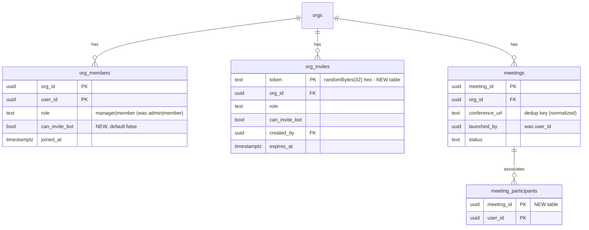
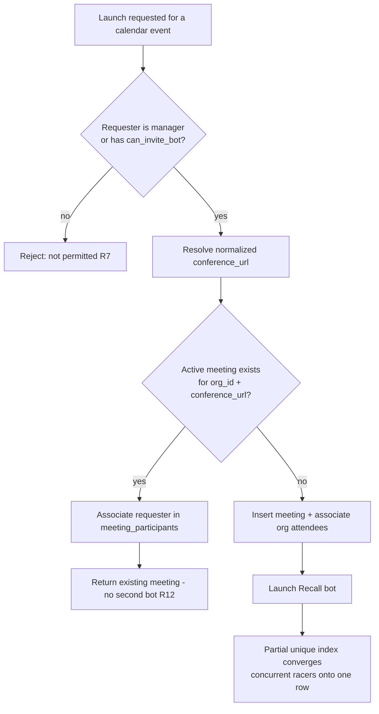
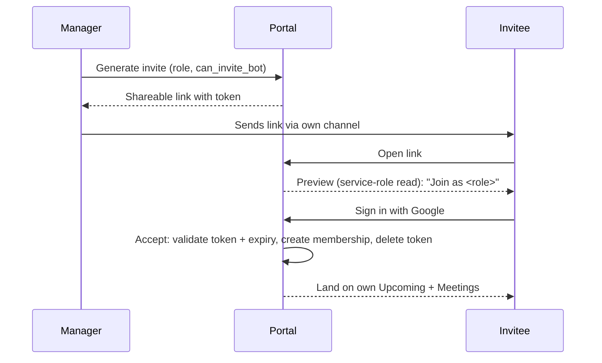

# feat: Workspace invitations, roles, and one-bot-per-meeting

## Summary

Add multi-person workspaces to the Risezome portal: a manager can invite teammates via a shareable link as either a **manager** (controls sources, settings, the bot, and the member list) or a **member** (sees only their own calendar and the meetings they attended). Managers can grant individual members a separate "can invite the bot" permission. Visibility is per-person and uniform — managers included. As part of this, the meeting model moves from one-bot-per-user-event to **one bot per real meeting**, with multiple workspace users associated with a single meeting instance.

---

## Problem Frame

A workspace is single-tenant today: onboarding creates one org and inserts the creator as its only member (`apps/portal/app/(authed)/onboarding/actions.ts`), and there is no path to add a second person. The immediate need is a co-manager; a secondary need is read-only viewers who can see what Risezome captured for them.

Two structural facts from the codebase make this more than a UI change:

1. **Authorization is membership-only.** Every RLS policy gates on "is this user a member of this org" (`org_id in (select org_id from public.org_members where user_id = (select auth.uid()))`); no policy, page, or server action checks `role` today. The `org_members.role` column exists (`'admin'` for creators, default `'member'`) but is read only by `listUserOrgs()` and never used for gating.

2. **Meetings and calendar events are per-user, and visibility is currently org-wide.** `meetings` and `calendar_events` each carry a `user_id`, but their SELECT policies let any org member read all org rows. Per-person visibility is therefore a *tightening* of existing policies — a visibility regression risk that must be tested first.

The one-bot-per-meeting requirement compounds (2): because each attendee has their own `calendar_events` row for the same call, the current per-event dedup (`meetings` partial-unique on `calendar_event_id`) would let two attendees in the same workspace each launch a bot. The fix is to de-duplicate on the actual meeting (its conference URL) and associate multiple users with the single instance — which then also defines what "a meeting I attended" means for per-person visibility.

---

## Requirements

Origin R-IDs (`see origin: docs/brainstorms/2026-06-01-workspace-invitations-roles-requirements.md`) are preserved; R12–R14 are new, added for one-bot-per-meeting. R5 and R8 refine the origin's "their own meetings/captures" into participation terms (R14) — a deliberate sharpening so "your own meeting" has a concrete definition once a meeting can have multiple users; the product intent (you see meetings you were in) is unchanged.

**Roles & permissions**

- R1. A workspace supports two roles, `manager` and `member`; the workspace creator is a manager.
- R2. Each membership carries a separate "can invite the bot" permission. Managers have it implicitly; for members it defaults to off and is set by a manager.
- R3. Managers can change settings, connect/update/remove sources, toggle the bot, invite people, assign roles at invite time, change members' roles, grant/revoke bot-invite, and remove members.
- R4. Members can view their own upcoming calendar events and the meetings/captures they attended; they cannot access Sources or Settings; they can launch the bot only if granted bot-invite.

**Visibility**

- R5. Visibility is per-person and uniform: every member, managers included, sees only their own upcoming calendar events and only the meetings/captures for meetings they attended (R14). No member sees a meeting they did not attend.
- R6. The member-management surface is visible only to managers and lists each member's role, bot-invite state, and any pending (unaccepted) invites.

**Bot control & de-duplication**

- R7. Launching the bot into a meeting requires either the manager role or the bot-invite grant. A plain member without the grant cannot launch the bot, even onto their own event.
- R8. A member without bot-invite still sees captures of meetings they attended where the bot was launched by another participant, consistent with R5/R14.
- R12. At most one active bot — one `meetings` instance — exists per real meeting within a workspace, de-duplicated on the conference join URL rather than per-user calendar event. Concurrent launch attempts for the same meeting converge on the single instance (no second bot).
- R13. When multiple workspace users attend the same meeting, they are all associated with the single meeting instance as participants, rather than each getting a separate meeting/bot.
- R14. A user is a participant of a meeting when that meeting's conference URL appears on their synced calendar; participation is what grants the per-person visibility in R5 — including meetings whose bot another participant launched.

**Invitations**

- R9. A manager can generate a shareable invite link that encodes the assigned role and the initial bot-invite grant. A pending invite can be revoked before acceptance; a manager can also rescind a member after acceptance (R3).
- R10. Accepting an invite requires signing in with Google; on acceptance the invitee becomes a member with the role the link specified, and must connect their own calendar before meetings appear for them.
- R11. A workspace always retains at least one manager — the last manager cannot be removed or demoted.

---

## Key Technical Decisions

- KTD1. **Role vocabulary: rename `'admin'` → `'manager'`, with backfill.** Workspace creators are stored as `role = 'admin'` today; UI and brainstorm speak "manager." Backfill existing `'admin'` rows to `'manager'` so DB and UI share one vocabulary. Before adding any `CHECK (role in ('manager','member'))`, verify at execution time that no live code path stores `'platform_admin'` (or other values) in `org_members.role` — an archived plan referenced a `platform_admin` cost-dashboard gate; if any such value is live, widen the constraint or omit it rather than break that path. (See Open Questions.)

- KTD2. **All role/membership authorization goes through `SECURITY DEFINER` helpers, never an inline `org_members` self-join.** A SELECT policy on `org_members` that joins `org_members` re-triggers the infinite-recursion login-loop bug fixed in `supabase/migrations/20260530110000_fix_org_members_rls_recursion.sql`. Add `public.is_org_manager(p_org_id uuid)` and a co-member reader (e.g. `public.org_member_ids(p_org_id uuid)`) as `SECURITY DEFINER` functions that read `org_members` outside RLS, and call them from the manager member-list policy, the manager-only config-write policies, and the bot-launch grant checks.

- KTD3. **Per-person visibility = tighten existing SELECT policies to participant/owner scope; managers are not exempt.** The `calendar_events` and `meetings` SELECT policies, the `realtime.messages` policy (`supabase/migrations/20260602100000_realtime_meeting_rls.sql`), and the `meeting_events` reconnect read are org-scoped today. Narrow meeting visibility to "meetings I participate in" (via the participant association, KTD6) and calendar events to `user_id = (select auth.uid())`. The sidebar recording count and the live/captures/review pages inherit the narrowing. RLS is the real authorization boundary; app-layer checks are defense-in-depth.

- KTD4. **`can_invite_bot` is a new `org_members` boolean (default false).** Managers are implicitly true. Enforced at the two launch entry points (KTD app units) and, where a user-RLS write is involved, in policy — defense-in-depth, since the service-role launch path bypasses RLS and must check explicitly.

- KTD5. **Invite tokens get their own table, modeled on `pending_installations`.** Mint with `randomBytes(32).toString('hex')`; store `{ token, org_id, role, can_invite_bot, created_by, expires_at }`; single-use, deleted-on-redeem to prevent replay; explicit `expires_at` check. Unlike `pending_installations`, the invitee must read the invite *before* they have membership, so the preview and accept go through a service-role-backed route/action (not user RLS). The accept flow hooks in after Google sign-in (the auth callback already runs in a service-role context with a `next` param).

- KTD6. **One bot per meeting: dedup on conference URL, associate users via a participant join.** `meetings` has **no `conference_url` column today** — it lives on `calendar_events`; this work adds it to `meetings` as the dedup anchor. Replace the per-`calendar_event_id` dedup with a dedup key of `(org_id, normalized conference_url)` enforced by a partial unique index over active (non-failed) meetings with a non-null URL. Add a `meeting_participants` join (`meeting_id`, `user_id`). The launch path becomes **find-or-create-then-associate**: look up an active meeting for the conference URL; if found, associate the requesting user and return without launching a second bot; else insert, associate the launcher **and** all org attendees sharing the URL, and launch. The launcher is always inserted into `meeting_participants` (it is the anchor for their own realtime/visibility access).

- KTD8. **Conference-URL normalization is a design decision, not an execution detail — it is both the dedup key and the privacy boundary.** Under-normalizing splits one meeting into two bots (violates R12); over-merging is worse — two distinct meetings on a reused recurring/personal-room URL (e.g. a Zoom PMI link) would collapse into one instance, reusing the wrong bot and associating the second meeting's attendees as participants of the first, leaking captures across meetings (violates R5). The partial-unique index is **not** a backstop for the PMI case — it actively causes the wrong merge. Decide the key explicitly: at minimum strip volatile query params (`pwd`, tracking), and evaluate whether `(org_id, conference_url)` must be combined with a start-time bucket so two meetings on the same recurring link do not merge.

- KTD9. **Participation is maintained, not snapshotted at launch.** If `meeting_participants` is populated only at bot-launch from already-synced calendars, a member invited minutes before a call (or whose 5-minute calendar sync hasn't run, or whose event's URL extraction missed) is never associated — and since visibility (R5/R14) is gated entirely on that join, they would be **permanently** unable to see their own meeting's capture, silently. Recompute participation on every calendar sync: when a synced event's normalized conference URL matches an existing active/recent meeting in the org, associate that user. Launch-time association is the fast path; sync-time association is the correctness guarantee.

- KTD7. **Surface `role` + `can_invite_bot` from the central auth helper; add a `requireManager()` guard.** `requireAuthedUserWithOrg()` already resolves and validates the current org but drops `role`. Extend it (or add a sibling) to carry `role` and `can_invite_bot`, and add `requireManager()` that redirects non-managers — used by Sources/Settings/member pages and their server actions. Reuse the existing cookie-validation logic; do not reinvent org resolution.

---

## High-Level Technical Design

### Data model (new and changed tables)

### Bot-launch: find-or-create-then-associate (R12/R13)

### Invite accept (R9/R10)

---

## Implementation Units

Grouped into three phases. Execution posture: the RLS units are **test-first** — write the cross-role and cross-person denial tests before the policies, because RLS bugs are silent and this work *narrows* existing visibility.

### Phase A — Schema foundation

### U1. Roles, bot-invite grant, and SECURITY DEFINER authorization helpers

- **Goal:** Add the role/grant data model and the recursion-safe authorization primitives everything else builds on.
- **Requirements:** R1, R2, R3 (foundation), R7 (grant column)
- **Dependencies:** none
- **Files:**
  - `supabase/migrations/<new-ts>_roles_and_authz_helpers.sql` (create)
  - `apps/portal/app/(authed)/onboarding/actions.ts` (modify) — the org-creator insert
  - `apps/portal/test/rls/roles.test.ts` (create)
- **Approach:** Add `org_members.can_invite_bot boolean not null default false`. Backfill `role = 'manager'` where `role = 'admin'`. **Also change the only org-creator write site** — `onboarding/actions.ts` currently hardcodes `role: 'admin'` on the creator insert; change it to `'manager'`. Without this, every newly onboarded workspace re-creates an `'admin'` row, and if KTD1's `CHECK (role in ('manager','member'))` lands, the insert fails and onboarding's compensating delete bounces the user. Add `is_org_manager(p_org_id uuid)` and `org_member_ids(p_org_id uuid)` as `SECURITY DEFINER` functions reading `org_members` outside RLS (mirror the recursion-fix rationale). Reconcile/guard the `role` CHECK per KTD1. Keep `org_members` with **zero user-facing UPDATE policies** (writes stay service-role-only) so a member cannot self-set `can_invite_bot = true`. Do not yet change other tables' policies — just land the primitives.
- **Patterns to follow:** `supabase/migrations/20260530110000_fix_org_members_rls_recursion.sql` (recursion rationale), `(select auth.uid())` wrapping in `supabase/migrations/20260530090000_init_orgs.sql:40-42`, policy-naming idiom across `supabase/migrations/`.
- **Test scenarios:**
  - Covers R1. After migration, a pre-existing workspace creator's role reads `'manager'`, not `'admin'`.
  - `is_org_manager()` returns true for a manager, false for a member, false for a non-member — invoked as each user.
  - `org_member_ids()` returns the full member set for a member of the org and does **not** recurse / does not error (the bug it must avoid).
  - Covers R2. `can_invite_bot` defaults to false for a newly inserted member row.
  - Covers R1. A newly onboarded workspace creator gets `role = 'manager'` (the `onboarding/actions.ts` change), not `'admin'`.
  - A member-role UPDATE on their own `org_members` row attempting to set `can_invite_bot = true` is rejected (no user UPDATE policy exists).
- **Verification:** Migration applies cleanly on a DB with existing `'admin'` rows; new onboarding produces a `'manager'` creator; helper functions exist and return correct booleans per role; no RLS recursion when reading members; members cannot self-grant `can_invite_bot`.

### U2. Invite token table

- **Goal:** Persist shareable invite tokens carrying the role + grant.
- **Requirements:** R9
- **Dependencies:** U1
- **Files:** `supabase/migrations/<new-ts>_org_invites.sql` (create)
- **Approach:** Create `org_invites` per KTD5: `token text primary key`, `org_id` FK (cascade), `role text not null`, `can_invite_bot boolean not null default false`, `created_by uuid` FK to `auth.users`, `created_at`, `expires_at default now() + interval '7 days'`. Enable RLS with **no policies** (service-role only), mirroring `pending_installations`. Index on `expires_at`. Consider a partial unique guard only if reusable links are later added (out of scope now).
- **Patterns to follow:** `pending_installations` in `supabase/migrations/20260531000000_sources_and_indexer.sql:96-107` (table shape, "no policies: service-role only" idiom, expiry index).
- **Test scenarios:** `Test expectation: none -- pure schema; behavior is covered by U7's accept-flow tests.`
- **Verification:** Table and index exist; RLS enabled with zero policies (no user can read/write directly).

### U3. One-bot-per-meeting: conference-URL dedup + participant association

- **Goal:** Move dedup from per-user-event to per-meeting and associate multiple users with one meeting.
- **Requirements:** R12, R13, R14
- **Dependencies:** U1
- **Files:**
  - `supabase/migrations/<new-ts>_meeting_dedup_and_participants.sql` (create)
  - `apps/portal/test/rls/meeting-participants.test.ts` (create)
- **Approach:** `meetings` has no `conference_url` column today (it lives on `calendar_events`); **add it** as `text` (nullable — legacy/failed rows and deleted-event rows may have none). Backfill it from `calendar_events.conference_url` by joining `meetings.calendar_event_id`; rows whose `calendar_event_id` is null (`ON DELETE SET NULL`) or whose event had a null URL stay null and are excluded from the unique index. Add the new partial-unique index on `(org_id, conference_url) where status <> 'failed' and conference_url is not null`. Add `meeting_participants(meeting_id, user_id, primary key(meeting_id,user_id))` and backfill one row per existing `meetings.user_id`.
  - **This migration is strictly additive (expand phase).** Do **not** drop `meetings.user_id` or the old `calendar_event_id` index in this unit — `launch-bot.ts` still writes `{ user_id, calendar_event_id }` and relies on the old index for dedup until U6 ships. There is no backward-compatible ordering that drops the old guard before U6: keep both columns and both indexes live across the U3→U6 gap. Add `launched_by` as the new launcher column (or treat `user_id` as `launched_by` until the contract phase). A follow-up migration (after U6) drops the legacy column/index (contract phase).
- **Patterns to follow:** partial-unique-index dedup idiom in `supabase/migrations/20260601300000_meetings.sql:44-48`; participant scoping mirrors the per-owner RLS idiom (`user_id = (select auth.uid())`).
- **Test scenarios:**
  - Covers R12. Two active meetings cannot exist for the same `(org_id, conference_url)`; a second insert with active status violates the unique index.
  - A `'failed'` meeting does not block a new active meeting for the same conference URL (retry still works).
  - Covers R13. Backfill produces exactly one participant row per legacy meeting owner.
- **Verification:** Unique index rejects a duplicate active meeting per conference URL; participant join exists and is backfilled; existing meetings still readable.

### U4. Tighten visibility & config-write RLS (test-first)

- **Goal:** Enforce per-person visibility (R5/R14) and manager-only config writes (R3) at the data layer.
- **Requirements:** R3, R5, R6, R14
- **Dependencies:** U1, U3
- **Files:**
  - `supabase/migrations/<new-ts>_visibility_and_config_rls.sql` (create)
  - `apps/portal/test/rls/visibility.test.ts` (create)
  - `apps/portal/test/rls/config-writes.test.ts` (create)
- **Approach:**
  - `meetings` SELECT → visible when the user is in `meeting_participants` for that meeting (managers included; no exemption).
  - **`cards`, `syntheses`, and `gaps` SELECT** → these ARE the "captures" R5/R8 name, and each carries its own independent org-scoped SELECT policy today. Narrowing only `meetings` leaves them readable org-wide — a member could query another member's captures directly via the REST API. Narrow each to `meeting_id in (select meeting_id from meeting_participants where user_id = (select auth.uid()))`. **Without this, R5 is violated at the data layer even though the UI looks correct.**
  - `calendar_events` SELECT → narrow to `user_id = (select auth.uid())`.
  - `realtime.messages` policy and the `meeting_events` reconnect read → narrow from org-scope to participant-scope. The topic is `meeting:<orgId>:<meetingId>`; the rewritten policy must extract the **`meetingId` (3rd segment)** and verify the caller is in `meeting_participants` for it via the `SECURITY DEFINER` participant lookup (not a self-join). A policy that checks only the org segment leaves the participant-isolation gap open.
  - `org_members` SELECT → a manager may read all rows of their org **via the `SECURITY DEFINER` reader**, members read only their own row (R6).
  - `workspace_bot_settings` INSERT/UPDATE and the `sources` write policies → gate on `is_org_manager()` (R3). **Narrow `sources` SELECT to managers too** — leaving it membership-scoped lets a gated-out member read raw source config via the REST API (app-layer redirect is not authorization).
  - **Meeting title resolution.** Titles are read by joining `meetings.calendar_event_id → calendar_events`, but that event belongs to the *launcher*. After this unit narrows `calendar_events` to the owner, a non-launcher participant (the central R8/AE7 case) reads the meeting but not the launcher's event, so the title silently degrades to the "Meeting" fallback. Resolve by denormalizing a `title` onto the `meetings` row at create time (U6), or by resolving each participant's own `calendar_events` row for the meeting's conference URL. Decide here, not at runtime.
- **Execution note:** Start with the failing cross-person and cross-role denial tests, then add the policies until they pass. These narrow current visibility — a regression here is silent.
- **Patterns to follow:** existing org-scoped policies in `supabase/migrations/20260601300000_meetings.sql:58-65`, `20260602200000_workspace_bot_settings.sql:35-68`, `20260602100000_realtime_meeting_rls.sql`; the two-user isolation harness in `apps/portal/test/rls/orgs.test.ts`.
- **Test scenarios:**
  - Covers R5/AE3. User A and user B in one org each attend different meetings; B's `meetings` SELECT returns only B's participated meetings, none of A's — and the same holds when B is a manager.
  - Covers R14/AE7. A member who participated in a meeting whose bot was launched by another user can SELECT that meeting and its captures.
  - Covers R5. A non-participant querying `cards`, `syntheses`, or `gaps` for a meeting they did not attend receives zero rows (direct-API denial, not just UI hiding).
  - A non-participant subscribing to `meeting:<orgId>:<otherMeetingId>` is denied even within their own org; `meeting_events` for a non-attended meeting returns nothing.
  - A non-manager member's `sources` SELECT returns nothing (managers see org sources).
  - Covers R3. A member's UPDATE on `workspace_bot_settings` is denied; a manager's is allowed.
  - Covers R6. A manager reads all `org_members` rows of their org without recursion error; a member reads only their own.
  - `calendar_events` SELECT returns only the requesting user's events.
- **Verification:** All denial tests pass; managers retain config-write and member-list access; no recursion on member-list read.

### Phase B — Authorization, gating, and bot launch

### U5. Role-aware auth helpers and manager guard

- **Goal:** Make role and grant available to pages/actions and provide a manager gate.
- **Requirements:** R3, R4
- **Dependencies:** U1
- **Files:**
  - `apps/portal/app/_lib/auth.ts` (modify)
  - `apps/portal/test/auth/require-manager.test.ts` (create)
- **Approach:** Extend `requireAuthedUserWithOrg()` to surface `role` and `can_invite_bot` for the resolved org, and add `requireManager()` that redirects members away. `listUserOrgs()` already selects `role` but **not** `can_invite_bot` (a new column) — widen its select to include `can_invite_bot` and thread it through the returned shape, so a granted member's flag is carried rather than defaulting to falsy (which would wrongly deny bot launch). Keep the cookie-validation/fallback logic intact.
- **Patterns to follow:** `apps/portal/app/_lib/auth.ts` (`requireAuthedUserWithOrg`, `listUserOrgs`), redirect idiom used by existing page guards.
- **Test scenarios:**
  - `requireAuthedUserWithOrg()` returns `role` and `can_invite_bot` for the active org.
  - `requireManager()` resolves for a manager and redirects for a member.
  - A spoofed `current_org_id` cookie still falls back to a validated membership (no privilege escalation via cookie).
- **Verification:** Helpers expose role/grant; manager-only callers can rely on `requireManager()`.

### U6. Bot-launch gating and find-or-create dedup

- **Goal:** Enforce R7 at every launch entry point and make launching converge on one bot per meeting.
- **Requirements:** R7, R8, R12, R13
- **Dependencies:** U1, U3, U5
- **Files:**
  - `apps/portal/app/(authed)/upcoming/opt-in-action.ts` (modify)
  - `apps/portal/app/(authed)/meetings/[meetingId]/live/retry-launch-server.ts` (modify)
  - `apps/portal/src/inngest/functions/launch-bot.ts` (modify)
  - `apps/portal/test/inngest/launch-bot-dedup.test.ts` (create)
  - `apps/portal/test/actions/opt-in-gating.test.ts` (create)
- **Approach:** In `toggleBotOptInAction` and `retryFailedLaunchAction`, check manager-or-`can_invite_bot` before sending the launch event (reject otherwise per R7). **`retryFailedLaunchAction` gating is role/grant-based, not participation-based** — a failed meeting has no participant rows, so gate on the caller's `role`/`can_invite_bot`, not on `meeting_participants`. In `launch-bot.ts`, replace the per-event dedup with find-or-create-then-associate keyed on normalized `conference_url` (KTD6, KTD8): if an active meeting exists, associate the requesting user in `meeting_participants` and return; else insert, associate the launcher + org attendees sharing the conference URL, and launch.
  - **Concurrency correctness (KTD6).** Today `launch-bot.ts` serializes via an Inngest `concurrency` key of `event.data.calendarEventId` and dedups on the `calendar_event_id` index — both per-user, so two attendees of the same real meeting have *different* keys and are **not** serialized. Re-key (or drop) the Inngest concurrency hint so it no longer falsely implies serialization, and rely on the U3 `(org_id, conference_url)` partial-unique index. Replace the current exit-on-`23505` branch (which returns `duplicate` and exits **without associating**) with: on unique-violation, SELECT the winning meeting by `(org_id, conference_url)` (service-role) and associate the user — so the losing racer joins the existing meeting instead of silently dropping out.
  - **Sequential opt-ins.** The org-attendee sweep runs on the create branch; a user opting in *after* the meeting exists hits the found branch and is associated then. Either path must leave every opting-in attendee in `meeting_participants` (see the sequential test below).
- **Patterns to follow:** the existing belt-and-suspenders exits and `meetings` insert in `apps/portal/src/inngest/functions/launch-bot.ts`; service-role explicit-check note (service-role bypasses RLS, so the grant check must be explicit here); discriminated-union action returns in `apps/portal/app/(authed)/upcoming/opt-in-action.ts`.
- **Test scenarios:**
  - Covers R7. A member without grant toggling their own event on is rejected; a manager and a granted member succeed.
  - Covers R12/AE6. Two granted users opt into the same conference URL → exactly one `meetings` row and one launch; both users appear in `meeting_participants`.
  - A concurrent second launch that loses the unique-index race associates the user instead of erroring or launching a second bot.
  - Covers R8. A granted user launches; a non-granted co-attendee is associated and can later view the capture.
  - Covers R13. Sequential opt-ins: user A opts in (creating the meeting), user B opts in later for the same URL → exactly one meeting, both A and B in `meeting_participants` (not just concurrent launches).
  - Covers R7. A member without grant calling `retryFailedLaunchAction` on their own failed meeting is rejected; a manager or granted member succeeds.
  - A `'failed'` prior meeting for the same conference URL does not block a fresh launch.
- **Verification:** No path launches a second bot for an active meeting; ungranted members cannot launch; participants are correctly associated.

### U7. Invite generation, preview, and accept flow

- **Goal:** Mint shareable links and turn an accepted link into a membership.
- **Requirements:** R9, R10, R11 (revoke side)
- **Dependencies:** U1, U2, U5
- **Files:**
  - `apps/portal/app/(authed)/members/invite-action.ts` (create) — mint + revoke
  - `apps/portal/app/invite/[token]/page.tsx` (create) — preview (service-role read)
  - `apps/portal/app/invite/[token]/accept-action.ts` (create) — accept post-sign-in
  - `apps/portal/app/api/auth/callback/route.ts` (modify) — honor an invite `next`/redirect
  - `apps/portal/test/actions/invite-flow.test.ts` (create)
- **Approach:** `inviteAction` (manager-only via `requireManager`) mints a token row (`randomBytes(32)`), returns the shareable URL. The preview page reads the invite via service-role (invitee has no membership yet) and shows "Join as \<role\>"; if unauthenticated it routes through Google sign-in with the invite as the post-auth `next`. `acceptAction` validates token + expiry, creates the `org_members` row, deletes the token (anti-replay), sets the current-org cookie. Revoke deletes the pending token.
  - **Role/grant come only from the token's DB row.** `acceptAction` reads `role` and `can_invite_bot` exclusively from the `org_invites` row fetched by token — never from a request/form parameter. Accepting these as inputs would let a member-invited user self-upgrade to manager.
  - **Validate the post-auth `next` redirect.** The auth callback currently passes `next` into `new URL(next, url.origin)` unchecked — an open-redirect an anonymous invite-link holder can exploit for phishing. Constrain `next` to a relative path (must start with `/`, no `://`/protocol); the accept redirect should be a hard-coded relative path. *(This is arguably a pre-existing hotfix independent of this feature — flag it as such.)*
  - **Idempotent-accept is security-relevant.** Default to **no-op** when the invitee is already a member — do not modify an existing member's role/grant on re-accept. Otherwise a manager could mint a manager-role link and use it to escalate an existing member outside the member-management flow, bypassing the last-manager checks.
- **Patterns to follow:** mint/consume/delete-on-redeem in `apps/portal/app/(authed)/sources/install/route.ts` and `apps/portal/app/api/github/install-callback/route.ts:52-72`; membership insert + compensating logic in `apps/portal/app/(authed)/onboarding/actions.ts`; `next`-param handling in `apps/portal/app/api/auth/callback/route.ts`.
- **Test scenarios:**
  - Covers R9. A manager mints a manager-role invite; the token row carries role + can_invite_bot.
  - A non-manager calling `inviteAction` is rejected.
  - Covers R10. Accepting a valid token creates membership with the encoded role and deletes the token; the same token cannot be redeemed twice (replay denied).
  - An expired token is rejected with a coded error.
  - Accepting when already a member is a no-op — an existing member's role/grant is unchanged on re-accept (and a manager accepting their own org's link changes no one's role).
  - A crafted accept request claiming `role=manager` while the token encodes `role=member` produces a member row, not a manager (role read from the token row only).
  - A callback `next` of `https://evil.example` (or any absolute URL) does not redirect off-origin.
  - Revoking a pending invite makes a subsequent accept fail.
- **Verification:** A link generated by a manager, opened by a new Google account, results in exactly one membership with the right role; revoked/expired/replayed tokens are refused.

### Phase C — Membership UI and role-aware navigation

### U8. Manager-only member-management page

- **Goal:** Let managers see and manage the member list and pending invites.
- **Requirements:** R3, R6, R9, R11
- **Dependencies:** U1, U2, U5, U7
- **Files:**
  - `apps/portal/app/(authed)/members/page.tsx` (create)
  - `apps/portal/app/(authed)/members/_member-list.tsx` (create)
  - `apps/portal/app/(authed)/members/member-actions.ts` (create) — change role, toggle grant, remove
  - `apps/portal/app/(authed)/_components/sidebar.tsx` (modify) — add Members link (manager-only)
  - `apps/portal/app/(authed)/_components/nav-icons.tsx` (modify) — Members icon
  - `apps/portal/test/actions/member-management.test.ts` (create)
- **Approach:** `requireManager()`-gated page listing members (via the `SECURITY DEFINER` reader or service role), each with role, bot-invite toggle, and remove; a pending-invites list with revoke; and an "invite" affordance calling `inviteAction` (U7). `member-actions.ts` uses service-role with an explicit in-action manager check (RLS won't permit writing another member's row) and enforces the last-manager guard (R11) before any demote/remove.
  - **DB-level last-manager backstop.** The in-action count-then-write check is racy: two concurrent demotes can each read "2 managers", both pass, and leave the org with zero managers. Add a `BEFORE UPDATE/DELETE` trigger on `org_members` that aborts if the operation would drop the org's manager count to zero, making R11 atomic regardless of application-layer races.
- **Patterns to follow:** server-action structure and `revalidatePath` in `apps/portal/app/(authed)/sources/_source-actions.tsx` and `apps/portal/app/(authed)/settings/meeting-bot/save-action.ts`; client optimistic toggle in `apps/portal/app/(authed)/upcoming/_opt-in-toggle.tsx`; sidebar link/icon pattern in `apps/portal/app/(authed)/_components/sidebar.tsx`.
- **Test scenarios:**
  - Covers R6. A manager sees all members + pending invites; a member cannot reach the page (redirected).
  - Covers R3. A manager changes a member's role and toggles their bot-invite grant; changes persist.
  - Covers R11/AE5. The last manager cannot be demoted or removed (action refused); with two managers, one can be demoted.
  - Two concurrent demotes of two different managers in a 2-manager org cannot both succeed — the DB trigger leaves at least one manager standing.
  - Removing a member deletes their membership; revoking a pending invite removes the token.
- **Verification:** Managers can fully administer membership; members are blocked; the last-manager invariant holds.

### U9. Role-aware navigation and page guards

- **Goal:** Gate the manager-only surfaces in nav and at the route/action layer.
- **Requirements:** R4
- **Dependencies:** U5
- **Files:**
  - `apps/portal/app/(authed)/_components/sidebar.tsx` (modify)
  - `apps/portal/app/(authed)/sources/page.tsx` (modify)
  - `apps/portal/app/(authed)/settings/meeting-bot/page.tsx` (modify)
  - `apps/portal/app/(authed)/settings/meeting-bot/save-action.ts` (modify)
  - `apps/portal/test/auth/page-guards.test.ts` (create)
- **Approach:** In the sidebar (already a server component with the active org's `role`), omit the Sources and Settings links for members (omit, don't disable). Replace the membership-only guards on the Sources and Settings pages and the settings save-action with `requireManager()` (nav hiding is not authorization). Sources/Settings server actions inherit the guard.
- **Patterns to follow:** `requireAuthedUserWithOrg()` call sites at the top of `apps/portal/app/(authed)/sources/page.tsx` and `settings/meeting-bot/page.tsx`; `SidebarNavLink` usage in `apps/portal/app/(authed)/_components/sidebar.tsx`.
- **Test scenarios:**
  - Covers R4/AE2. A member's rendered sidebar omits Sources and Settings; a manager's includes them.
  - A member navigating directly to `/sources` or `/settings/meeting-bot` is redirected.
  - A member invoking the settings save-action is rejected even via a crafted request.
- **Verification:** Members cannot reach or mutate manager surfaces by nav or direct URL; managers are unaffected.

---

## Acceptance Examples

Carried from origin (AE1–AE5), plus AE6–AE7 for one-bot-per-meeting.

- AE1. **Covers R2, R7.** A member with bot-invite off cannot launch the bot on their own event; after a manager grants it, they can.
- AE2. **Covers R4, R6.** A member's navigation shows no Sources or Settings — only their own Upcoming and Meetings.
- AE3. **Covers R5.** With two members each having their own meetings, each sees only their own — and so does a manager.
- AE4. **Covers R9, R10.** A manager-generated link, opened and signed into with Google, joins the person as the encoded role; a revoked link does not grant membership.
- AE5. **Covers R11.** The sole manager cannot demote or remove themselves.
- AE6. **Covers R12, R13.** Two granted members on the same call both opt in → exactly one bot and one meeting instance, with both associated as participants and both able to view the capture.
- AE7. **Covers R8, R14.** A member without the grant who attended a meeting another participant's bot captured can view that capture, but could not have launched the bot themselves.

---

## Scope Boundaries

**Deferred for later** (from origin)

- Email-based invitations (a sent, branded invite email) — no transactional email exists today; ship the shareable link first.
- Reusable / multi-use invite links (e.g. one link for a whole team) — current model is single-use per invite.

**Outside this product's identity** (from origin)

- Cross-member oversight — managers reading meetings/captures they did not attend. Excluded by the per-person model (R5), not merely deferred.
- Domain allowlist / auto-join.
- A general role/permission policy engine — two roles plus one grant is the ceiling for this round.

**Deferred to follow-up work** (plan-local)

- Wiring `workspace_bot_settings.auto_join` to an actual launch path. It is config-only today (no code consumes it), so R8's "workspace auto-joined" wording has no auto-launch to interact with yet; this plan does not build auto-join.
- Ad-hoc participants who attend a meeting that is not on their synced calendar — participation is defined via calendar match (R14); ad-hoc association is out of scope.

---

## System-Wide Impact

- **Authorization boundary changes from membership to membership + role + participation.** Multiple SELECT policies are *narrowed*; this is a visibility regression surface. The RLS units are test-first for that reason.
- **Meeting identity changes** from per-user-event to per-conference-URL with a participant set. The launcher (`launched_by`) and the participant set are now distinct concepts; downstream readers of `meetings.user_id` (sidebar count, live/captures/review pages) must move to participant-scoped reads.
- **New service-role surfaces** (invite preview/accept, member management) bypass RLS and must carry explicit role checks.

---

## Risks & Dependencies

- **Silent RLS regression.** Narrowing visibility can hide rows users currently see — and the captures live across several tables (`cards`, `syntheses`, `gaps`), each with its own org-scoped policy, so missing one leaves a data-layer leak even when the UI looks correct. Mitigation: denial tests first (U4) covering every captures-bearing table, run against the local Supabase stack (`RISEZOME_RUN_RLS_TESTS=1`).
- **Role-rename completeness.** The rename must also change the org-creator write path (`onboarding/actions.ts`), or new workspaces regress to `'admin'` and break under the CHECK. Grep confirmed no live `platform_admin` usage, so the CHECK is safe (KTD1, U1).
- **Conference-URL normalization (privacy-critical).** Under-normalizing splits one meeting into two bots; **over-merging is worse** — two meetings on a reused personal-room/PMI link collapse into one, leaking captures across meetings (R5 violation). The partial-unique index is a backstop only against double-bot, **not** against wrong-merge. Mitigation: treat normalization as an explicit design decision (KTD8) with a PMI-specific test, not a tuning detail.
- **Launch race.** Two attendees launching simultaneously. Mitigation: unique-index-driven convergence with associate-on-conflict fallback (U6).
- **Bearer-token invites.** A shareable link is bearer auth by origin decision — whoever holds an unexpired token joins with its encoded role (including manager). The preview also discloses org name + role to any holder. Mitigations are the 7-day expiry, single-use delete-on-redeem, and manager revoke; the accept/preview must not log the token value, and rate-limiting the `/invite/[token]` route is worth considering to slow enumeration.
- **Shared branch coordination.** Membership/RLS is the same surface as in-flight corpus-reconciliation work; sequence this after that consolidation to avoid migration-ordering and policy conflicts.

---

## Open Questions

**Resolve during implementation**

- Re-confirm before adding the `role` `CHECK`: a grep at planning time found **no live `platform_admin` usage** and no existing CHECK (default is `'member'`), so the rename is safe; verify nothing landed since, then add `CHECK (role in ('manager','member'))` (KTD1).
- Conference-URL normalization strategy (KTD8) — decide whether `(org_id, conference_url)` alone is safe or must combine with a start-time bucket to avoid merging two meetings on a reused personal-room/PMI link. This is a correctness + privacy decision, not just param-stripping; validate against real Recall/Google/Zoom URLs.
- The participation-maintenance trigger (KTD9) — confirm participation is recomputed on every calendar sync (not only at launch) so late-invited/late-syncing attendees can see their own captures.

**Deferred (answered by code during implementation)**

- Whether to denormalize the meeting title onto `meetings` vs. resolve each participant's own `calendar_events` row (U4/U6) — pick the least-disruptive option against existing readers.
- Whether `meetings.user_id` is renamed to `launched_by` in the contract-phase migration or retained alongside `launched_by`, based on the least-disruptive change against existing readers (U3).
