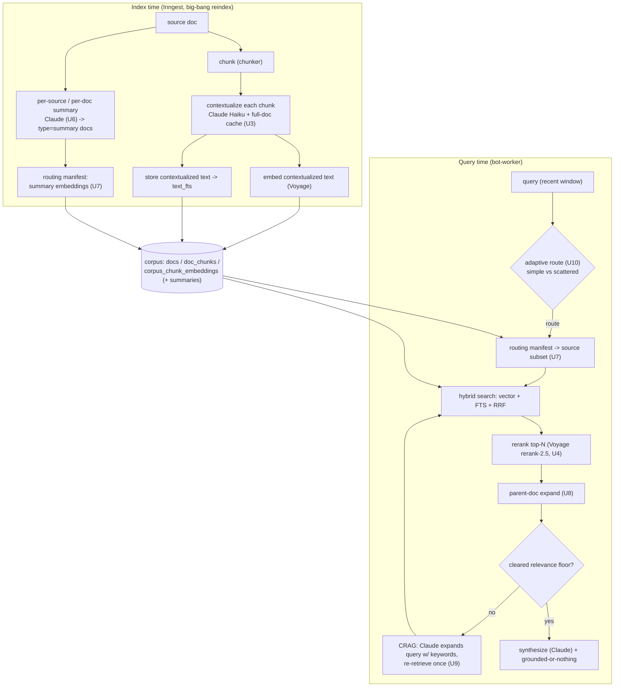
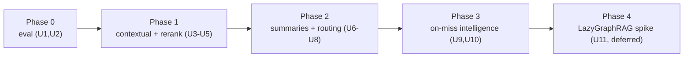

# Claude-Augmented Corpus Retrieval & Synthesis

> **Status note (2026-06-02):** Phases 0–3 shipped — U1–U6, U8, U9 are in
> production. **U10 is closed as right-sized**: rather than the planned eager
> `{single-shot | expansion | parent-doc}` path classifier, the shipped design is
> lazy escalation — run the cheap path, escalate to CRAG expansion only on a miss
> **or** a low-confidence first pass (`isLowConfidenceHits`); rerank + parent-doc
> are cheap enough to stay always-on. **U7 (routing manifest / source pre-routing)
> is deliberately deferred** (scale optimization; high-risk silent-prune failure
> mode; rerank is a cheaper precision lever). **U11 (LazyGraphRAG) is deferred**
> (see `2026-06-01-003-spike-lazygraphrag-decision.md`). This plan is now a
> design/spec record — the canonical description of what actually shipped lives
> in [`docs/architecture/retrieval-pipeline.md`](../architecture/retrieval-pipeline.md).

## Summary

Evolve the corpus retrieval pipeline from "chunk → Voyage embeddings →
hybrid search (cosine + FTS + RRF) → Claude synthesis" into a
Claude-augmented pipeline that reliably answers questions whose answer is
scattered across a customer's sources. Delivered in five ROI-ordered
phases, each independently shippable and measured against an eval harness
built first (Phase 0). Phase 1 (index-time Contextual Retrieval + a
reranker) is the load-bearing increment and is expected to fix the anchor
failure on its own.

Origin: `docs/brainstorms/2026-06-01-corpus-retrieval-improvements-requirements.md`.

---

## Problem Frame

The synthesis layer is correct (grounded-or-nothing + citation
verification shipped on branch `fix/synthesis-window-question-and-clean-refusal`).
The remaining gap is **retrieval recall + assembly**: the corpus often
can't answer real questions because the answer is scattered and no single
chunk consolidates it, and keyword-dense noise (a `*.test.ts`, the
summarizer's own prompt file) outranks the answer-bearing chunks.

Anchor failure: *"what AI models are used in the project"* honestly refuses
— `Deepgram`/`Voyage`/`Claude Haiku` are each mentioned somewhere, but no
chunk states them together and "models" isn't dense in the answer chunks.

Verified current state (this session):
- Hybrid search lives in `apps/bot-worker/src/corpus-search.ts` (`hybridSearch` + pure `fuseRrf`), calling RPCs `search_corpus_vector` and `search_corpus_fts` (`supabase/migrations/20260601100000_search_corpus_rpcs.sql`).
- Live read paths: `apps/bot-worker/src/retrieval.ts` (prod) and `apps/bot-worker/src/debug/local-debug-ws.ts` (debug).
- Synthesis: `packages/engine/src/synthesize/` (prompt + parse + verify).
- Embeddings: `packages/engine/src/embed/voyage.ts`; chunking: `packages/engine/src/chunker/`.
- Corpus write: per-source Inngest indexers in `apps/portal/src/inngest/functions/` (`index-repo.ts`, `index-github-issues.ts`, `index-trello.ts`, `index-jira.ts`, `index-confluence.ts`); connectors share `apps/portal/src/inngest/lib/connector-index.ts` (`writeReconciledDoc` in `corpus-reconcile.ts`). Chunk text feeds both the embedding and the generated `text_fts` column.

---

## Requirements Trace

From the origin doc:
- **R0.1–R0.3** Eval harness (golden set + replay runner + RAGAS-style metrics) → Phase 0 (U1, U2).
- **R1.1** Contextual Retrieval at index time → U3. **R1.2** Reranker → U4.
- **R2.1** Per-source summaries → U6. **R2.2** Routing manifest → U7. **R2.3** Parent-document retrieval → U8.
- **R3.1** On-miss CRAG query expansion → U9. **R3.2** Adaptive routing → U10.
- **R4.1** LazyGraphRAG (deferred evaluation) → U11.
- Success criteria (measurable lift per phase; anchor query answers) → enforced by U1/U2 and each phase's Verification.

---

## Key Technical Decisions

- **KTD-1 — RAGAS as an in-repo TS LLM-judge.** Reimplement the four metrics (context recall, context precision, faithfulness, answer relevancy) as Claude-judge prompts in TypeScript rather than standing up a Python RAGAS service. Rationale: keep the pnpm monorepo single-language; no Python added to the Fly/Vercel deploy; the metrics are LLM-judge prompts, cheap to port. (Resolves origin open question 1.)
- **KTD-2 — Contextual Retrieval rollout is a big-bang full reindex.** After U3 lands, reindex all corpora once (full mode via the existing reconcile path) so every chunk gets its context. Rationale: incremental enrich-on-reconcile leaves a long-lived mixed corpus (some chunks contextualized, some not) that muddies eval signal; pre-launch makes a one-time full reindex cheap. (Resolves origin open question 4.)
- **KTD-3 — Context is prepended to chunk text before embedding AND before the `text_fts` column is generated.** A single contextualized chunk-text string feeds both legs, so contextual embeddings and contextual BM25 both benefit with no schema split. The original chunk body is preserved separately for display/citation so the user still sees the verbatim source.
- **KTD-4 — Contextualization is a shared engine helper** (`packages/engine/src/contextualize/`) using Claude Haiku with the full source doc in a `cache_control: ephemeral` block; called from every indexer's chunk loop. Process document-by-document to maximize cache hits.
- **KTD-5 — Reranker is Voyage rerank-2.5** via a new method on the existing Voyage client (`packages/engine/src/embed/voyage.ts` or a sibling `rerank` module). We already use Voyage; rerank-2.5's 32K context fits long issues/pages and supports instruction steering ("prefer application code and docs over tests"). Runs in the already-async synthesis slot.
- **KTD-6 — Summaries and routing manifest are new corpus doc types** (`type='summary'`, `type='source-summary'`), reusing the existing docs/chunks/embeddings tables and reconcile machinery rather than new infra.
- **KTD-7 — On-miss intelligence is gated, not always-on.** Adaptive routing + CRAG expansion fire only when the relevance floor isn't cleared, so the common-case live path keeps today's latency.

---

## High-Level Technical Design

Phases are dependency-ordered; the eval (Phase 0) is the yardstick every later phase reports against.

---

## Implementation Units

### U1. Golden-question set + replay runner

**Goal:** A re-runnable harness that replays curated questions through the live retrieval + synthesis path and reports per-question hit-rate on labeled must-surface sources plus the answer/refusal.

**Requirements:** R0.1, R0.2.

**Dependencies:** none.

**Files:**
- Create: `apps/bot-worker/eval/golden-questions.jsonl` (the labeled set)
- Create: `apps/bot-worker/eval/replay.ts` (runner)
- Create: `apps/bot-worker/eval/lib/corpus-replay.ts` (shared replay against `corpus-search.ts` + synthesizer)
- Test: `apps/bot-worker/test/eval/replay.test.ts`

**Approach:** Seed ~30–50 questions about a representative org's corpus, each labeled `{ q, must_surface: [docId|title-substr...], expect_answer_contains: [...], expect_refusal?: bool }`, including the known failures (anchor: "what AI models are used" → must surface architecture/README chunks; answer must contain Haiku/Voyage/Deepgram). The runner embeds the query, calls `hybridSearch` (reusing the real code path), records which labeled sources surfaced (recall@k), then runs the synthesizer and records answer text + refusal. Output a JSON/markdown report. Reuse `createServiceClient` + env like the existing bot-worker scripts. Keep the runner offline-friendly (one org, read-only).

**Patterns to follow:** the corpus-peek script shape used this session; `corpus-search.ts` for the retrieval call; `packages/engine/src/synthesize` for synthesis.

**Test scenarios:**
- Happy path: a labeled question whose must-surface doc is present scores recall=1 and the answer contains the expected substring.
- Edge: a question with `expect_refusal: true` records a refusal, not a hit.
- Edge: must-surface doc absent from corpus → recall=0 reported (not an error).
- Runner is deterministic given fixed corpus + temperature 0 where possible; report schema is stable.

**Verification:** `replay.ts` runs against a seeded corpus and emits a report with per-question recall + answer/refusal; the anchor question is present and currently reports the failure (baseline).

### U2. TS LLM-judge RAGAS-style metrics

**Goal:** Compute context recall, context precision, faithfulness, and answer relevancy over the replay output via Claude-as-judge, with no ground-truth answers required.

**Requirements:** R0.3. **Dependencies:** U1.

**Files:**
- Create: `packages/engine/src/eval/ragas-metrics.ts` (pure-ish metric functions taking {question, retrieved chunks, answer} + an LLM-judge fn)
- Create: `packages/engine/src/eval/index.ts`
- Modify: `apps/bot-worker/eval/replay.ts` (emit metrics alongside hit-rate)
- Test: `packages/engine/test/eval/ragas-metrics.test.ts`

**Approach:** Implement each metric as a Claude-judge prompt (KTD-1): faithfulness = decompose answer into claims, judge each against retrieved chunks; context precision = fraction of retrieved chunks the answer actually used; context recall = were the claim-supporting chunks retrieved; answer relevancy = does the answer address the question. Judge model is a small Claude; temperature 0. Metrics return [0,1] with the per-claim breakdown for debugging.

**Patterns to follow:** the synthesizer's Anthropic client + prompt-caching shape in `packages/engine/src/synthesize/anthropic.ts`; structured tool-use output like the summarizer/classifier.

**Test scenarios:**
- Faithfulness: an answer whose claims are all in the chunks scores ~1; an answer with a fabricated claim scores < 1 (mock the judge to assert the decomposition→judge wiring, not the model).
- Context precision: retrieved-but-unused chunks lower the score.
- Empty answer / refusal → metrics handle gracefully (no divide-by-zero).
- Judge errors degrade to a recorded null metric, not a crash.

**Verification:** Running the harness produces the four metrics for the golden set; a baseline snapshot is recorded so later phases show deltas.

### U3. Contextual Retrieval at index time

**Goal:** Prepend a Claude-generated, document-situated context to each chunk before embedding and before the `text_fts` column is generated, so scattered/keyword-mismatched chunks become findable. Then big-bang reindex.

**Requirements:** R1.1. **Dependencies:** U1, U2 (baseline must exist to measure the lift).

**Files:**
- Create: `packages/engine/src/contextualize/contextualize.ts` (+ `index.ts`) — `contextualizeChunks(docText, chunks)` → per-chunk context strings, Claude Haiku with full doc in an ephemeral-cache block.
- Modify: `apps/portal/src/inngest/lib/connector-index.ts` (prepend context in the prepare→write path; store original body separately)
- Modify: `apps/portal/src/inngest/functions/index-repo.ts`, `index-github-issues.ts` (their chunk loops)
- Modify: `supabase/migrations/` — new migration: add `doc_chunks.context text` (the generated context) and ensure the embedded/FTS text = context + body; keep `text` as the verbatim body for display, OR add `embed_text` generated/stored column. (Decide exact column shape at execution; see Deferred.)
- Test: `packages/engine/test/contextualize/contextualize.test.ts`

**Approach (KTD-3, KTD-4):** For each source doc, one cached prompt holds the full doc; each chunk gets a 50–100 token context ("This chunk is from `apps/bot-worker/src/transcribe`; it configures the Deepgram client…"). The string fed to Voyage embed and to `text_fts` becomes `context + "\n\n" + body`; the verbatim `body` is preserved for card display + citation quotes (so citation verification still matches the visible text). Rerun under full reconcile for all sources (big-bang, KTD-2). Cost-control: document-by-document ordering for cache hits; cap context length.

**Execution note:** Land the engine helper test-first; it's a pure transform around an injectable LLM client.

**Patterns to follow:** `AnthropicSummarizer` (cache_control, Haiku, retry) in `packages/engine/src/summarize/anthropic.ts`; `writeReconciledDoc` chunk-write contract in `corpus-reconcile.ts`.

**Test scenarios:**
- A chunk's contextualized text includes the generated context prefix and the original body; the stored verbatim body is unchanged.
- Citation verification (existing `verifyCitations`) still matches a quote from the visible body after contextualization (regression guard).
- Empty/whitespace chunk → skipped, no LLM call.
- LLM failure for one chunk → that chunk falls back to body-only (no crash, logged), per indexer atomicity rules.
- Cache-block shape: full doc in the ephemeral block, chunk in the turn (assert request shape against a mock).

**Verification:** After reindex, the eval harness shows improved context recall on the golden set (esp. the anchor question now surfacing the right chunks); citation/faithfulness metrics do not regress.

### U4. Reranker (Voyage rerank-2.5)

**Goal:** Add a cross-encoder rerank stage to hybrid search: retrieve a larger candidate pool, rerank, keep top-K.

**Requirements:** R1.2. **Dependencies:** U3 (measure combined lift), U1/U2.

**Files:**
- Create/Modify: `packages/engine/src/embed/voyage-rerank.ts` (a `rerank(query, documents, {model, topK, instruction})` client) + export from engine embed index.
- Modify: `apps/bot-worker/src/corpus-search.ts` (`hybridSearch`: widen candidate pool to ~50+50, fuse, then rerank to top-K; keep `fuseRrf` as the pre-rerank fuser)
- Modify: `apps/bot-worker/src/retrieval.ts`, `apps/bot-worker/src/debug/local-debug-ws.ts` (pass query text for rerank; surface rerank score on debug cards)
- Test: `packages/engine/test/embed/voyage-rerank.test.ts`, `apps/bot-worker/test/corpus-search.test.ts` (extend)

**Approach (KTD-5):** Candidate pool from existing vector+FTS (RRF orders the pool), send pool + query to Voyage rerank-2.5 with an instruction to deprioritize tests/fixtures, keep top-K. Latency budget: runs in the synthesis slot (cards already emitted). Make rerank optional behind an env flag for A/B on the eval.

**Patterns to follow:** `VoyageEmbedder` client shape in `packages/engine/src/embed/voyage.ts`; the `hybridSearch` structure + `fuseRrf` tests.

**Test scenarios:**
- Rerank reorders a fused pool so a topically-relevant but lower-RRF doc rises above a keyword-dense test file (mock the rerank API).
- topK truncation; empty pool → no rerank call, returns [].
- Rerank API error → degrade to RRF order (logged), never hard-fail.
- Instruction steering is passed through to the request (assert request shape).

**Verification:** Eval shows context precision + answer relevancy improve over U3-only; the `*.test.ts`-noise case from this session no longer appears in top-K for the anchor query.

### U5. Phase 1 rollout: reindex + eval gate

**Goal:** Execute the big-bang reindex and record the Phase 1 eval delta as the go/no-go signal.

**Requirements:** R1.1, R1.2 (verification). **Dependencies:** U3, U4.

**Files:**
- Modify: `apps/portal/app/(authed)/sources/` reindex trigger if a bulk "reindex all" affordance is needed (else use existing per-source full reindex).
- Create: `apps/bot-worker/eval/reports/phase-1.md` (committed baseline→phase-1 delta snapshot).

**Approach:** Trigger full reconcile for every source (KTD-2), confirm contextualized chunks land, run the harness, commit the delta report. No new behavior — this unit is the measurement gate.

**Test scenarios:** `Test expectation: none — operational rollout + measurement unit; correctness covered by U1–U4 tests.`

**Verification:** Phase-1 report shows the targeted recall/precision lift; anchor question answers with grounded citations.

### U6. Per-source / per-document summaries

**Goal:** Generate Claude summaries per source document (and optionally per repo/board/space) and index them as first-class corpus docs so high-level questions hit a consolidating summary.

**Requirements:** R2.1. **Dependencies:** U3 (shares the index-time Claude plumbing), U1/U2.

**Files:**
- Create: `packages/engine/src/summarize-doc/` (doc-summary generator, distinct from the meeting summarizer)
- Modify: the indexers + `connector-index.ts` to emit `type='summary'` docs alongside chunks
- Modify: `supabase/migrations/` if a `type` enum/check needs the new value
- Test: `packages/engine/test/summarize-doc/*.test.ts`

**Approach (KTD-6):** At index time, summarize each doc into a compact "what this doc/source is about + key facts" doc; index it like any other doc (chunked/embedded). Granularity decision (per-doc vs per-source rollup) is an origin open question — start per-document; add per-source rollups only if eval shows high-level questions still miss. Summaries are regenerated on reconcile when the source changes (content-hash gated, reusing reconcile).

**Test scenarios:**
- A doc summary captures named entities/facts and is indexed as `type='summary'`.
- Reconcile: unchanged doc → summary not regenerated (cost guard); changed doc → regenerated.
- Summary doc participates in retrieval (appears as a candidate for a matching query).

**Verification:** Eval shows lift on consolidating/high-level questions (e.g., "what does this project do") without regressing precise lookups.

### U7. Routing manifest (source/doc-summary pre-routing)

**Goal:** Pre-route a query to the relevant source subset before chunk-level retrieval, using a summary-embedding index, to prune cross-source noise.

**Requirements:** R2.2. **Dependencies:** U6.

**Files:**
- Modify: `apps/bot-worker/src/corpus-search.ts` (optional pre-route: embed query, match against source/summary embeddings, constrain the chunk search to top sources; always fall back to all-source on low routing confidence)
- Modify: `apps/portal/src/inngest/...` to maintain the manifest (summary embeddings)
- Test: `apps/bot-worker/test/corpus-search.test.ts` (routing-gate cases)

**Approach:** Lightweight document-summary index (one embedding per source/summary). At query time, if routing confidence is high, scope the chunk search to the top sources; otherwise search all (safety margin — origin open question 5). Keep it a pure, testable scoping function over candidate sources.

**Test scenarios:**
- High-confidence route narrows to the right source; the answer chunk still surfaces.
- Low-confidence route → no narrowing (searches all sources) — the safety fallback.
- A query whose answer is in a de-prioritized source still resolves via fallback (no silent loss).

**Verification:** Eval shows precision lift (less cross-source noise) with no recall regression on the labeled set.

### U8. Parent-document (small-to-big) retrieval

**Goal:** Embed precise child chunks but return the surrounding parent section/document when a child scores high, so scattered facts arrive with enough context to synthesize.

**Requirements:** R2.3. **Dependencies:** U3.

**Files:**
- Modify: `apps/bot-worker/src/corpus-search.ts` / retrieval enrichment (expand a winning child chunk to its parent doc/section text for the synthesizer)
- Possibly modify chunk metadata at index time to record parent/section linkage
- Test: `apps/bot-worker/test/corpus-search.test.ts`

**Approach:** When a child chunk is selected, fetch the parent doc (or a window of adjacent chunks) to pass to synthesis, while citations still point at the precise child. Bounded by a max-context size.

**Test scenarios:**
- A high-scoring child expands to its parent/window; citation still maps to the child chunk.
- Expansion respects a max-size cap (doesn't blow the synthesis context).
- No parent linkage → returns the child alone (graceful).

**Verification:** Eval shows answer-relevancy/faithfulness lift on scattered-fact questions.

### U9. On-miss CRAG query expansion

**Goal:** When retrieval is weak (relevance floor not cleared), have Claude expand the query with candidate keywords and re-retrieve once, before refusing.

**Requirements:** R3.1. **Dependencies:** U4 (floor/scoring), U1/U2.

**Files:**
- Create: `packages/engine/src/query-expand/` (Claude keyword/synonym expansion for a weak query)
- Modify: `apps/bot-worker/src/retrieval.ts`, `apps/bot-worker/src/debug/local-debug-ws.ts` (on weak result: expand + re-retrieve once, capped)
- Test: `packages/engine/test/query-expand/*.test.ts`, retrieval tests

**Approach (KTD-7):** On a weak first pass, ask Claude for candidate terms ("what AI models" → Gemini, Claude, Haiku, GPT/OpenAI, Voyage, Deepgram, embeddings, transcription), re-run hybrid search with the augmented query, cap at ≤2 total passes to bound latency. Only fires on a miss, so the common case is unaffected.

**Test scenarios:**
- Weak first pass triggers expansion; second pass surfaces the answer (mock expansion + search).
- Strong first pass → no expansion (latency guard).
- Expansion capped (no unbounded retry loop).
- Expansion LLM error → fall through to the original refuse path (no crash).

**Verification:** Eval shows the anchor-style scattered queries that still missed after Phase 1/2 now resolve via the fallback, without raising common-case latency.

### U10. Adaptive routing classifier

**Goal:** A fast classifier that routes simple/lookup queries to single-shot retrieval and scattered/thematic queries to the richer path (expansion/parent-doc), so the common case stays fast.

**Requirements:** R3.2. **Dependencies:** U9.

**Files:**
- Create: `packages/engine/src/query-route/` (fast classifier — heuristic-first, optional small-LLM)
- Modify: `apps/bot-worker/src/retrieval.ts`, `local-debug-ws.ts`
- Test: `packages/engine/test/query-route/*.test.ts`

**Approach:** Mirror the existing relevance/router heuristic-gate pattern: a sub-50ms heuristic decides the path; only ambiguous cases pay an LLM classify. Routes to {single-shot | expansion | parent-doc-heavy}.

**Patterns to follow:** `packages/engine/src/router/` and `packages/engine/src/relevance/` heuristic-then-LLM gating.

**Test scenarios:**
- A simple lookup query routes to single-shot (no expansion).
- A scattered/thematic query routes to the rich path.
- Heuristic handles the common case without an LLM call; ambiguous → LLM.

**Verification:** Eval shows no common-case latency regression while scattered queries still get the rich path.

### U11. LazyGraphRAG evaluation spike (deferred)

**Goal:** Decide whether a near-zero-indexing entity/co-occurrence graph adds enough on thematic, corpus-wide questions to justify building it — only after Phases 0–3 are deployed and measured.

**Requirements:** R4.1. **Dependencies:** U1–U10 deployed + measured.

**Files:**
- Create: `docs/plans/` follow-up spike doc (this unit produces a decision, not production code).

**Approach:** Evaluate marginal benefit over contextual retrieval + reranking + routing on the eval set's thematic questions. Full Microsoft GraphRAG remains out of scope (cost/latency). Outcome is a go/no-go + a follow-up plan if go.

**Test scenarios:** `Test expectation: none — evaluation spike; produces a decision + follow-up plan, not shipped code.`

**Verification:** A written recommendation (build / don't build) grounded in eval deltas.

---

## Scope Boundaries

**In scope:** the five phases above — eval harness, contextual retrieval, reranking, summaries + routing, parent-document retrieval, on-miss expansion, adaptive routing, and the deferred LazyGraphRAG decision.

**Outside this product's identity (from origin):**
- **Full Microsoft GraphRAG** — indexing + query cost too high for a real-time assistant.
- **Replacing the stack** — stay on pgvector + Voyage + Claude; no new vector DB or vendor.
- **HyDE** — high latency, diminishing returns once contextual retrieval is applied.
- **Heavy multi-iteration agentic loops** (3+ reflection passes) — incompatible with the real-time path; capped CRAG (≤2) only.

**Deferred to follow-up work:**
- Per-source rollup summaries beyond per-document (U6) — add only if eval shows high-level misses.
- Exact `doc_chunks` column shape for contextualized text vs verbatim body (U3) — finalize at execution.
- Any production LazyGraphRAG build (gated on U11's decision).

---

## Risks & Dependencies

- **Index-time cost / reindex window (U3, big-bang).** Contextualizing every chunk is a one-time Claude spend; mitigated by prompt caching + document-by-document ordering. Pre-launch corpus is small, so acceptable; revisit for large customer repos.
- **Citation regression (U3).** Prepending context must not break `verifyCitations` (quotes match the visible body). Mitigated by storing the verbatim body separately (KTD-3) and a regression test.
- **Reranker latency (U4).** ~600ms in the synthesis slot; behind an env flag so it can be tuned (rerank-2.5-lite / smaller pool) against the eval.
- **Routing hides the answer (U7).** A wrong route can drop the answer-bearing source; mitigated by a low-confidence all-source fallback (origin open question 5).
- **Dependency:** Voyage rerank API access; Anthropic prompt caching; the existing reconcile/reindex path.

---

## Sources & Research

External research (this session, via `ce-web-researcher`) grounding the approach:
- Anthropic — Contextual Retrieval (49% / 67% retrieval-failure reduction): https://www.anthropic.com/news/contextual-retrieval
- Voyage rerank-2.5: https://blog.voyageai.com/2025/08/11/rerank-2-5/
- Agentic RAG survey (CRAG / Adaptive RAG): https://arxiv.org/abs/2501.09136
- LlamaIndex document-summary index / parent-document retrieval (per-source summaries + small-to-big)
- Microsoft LazyGraphRAG: https://www.microsoft.com/en-us/research/blog/lazygraphrag-setting-a-new-standard-for-quality-and-cost/
- RAGAS (metric definitions reimplemented in TS per KTD-1): https://arxiv.org/abs/2309.15217

Origin requirements: `docs/brainstorms/2026-06-01-corpus-retrieval-improvements-requirements.md`.
