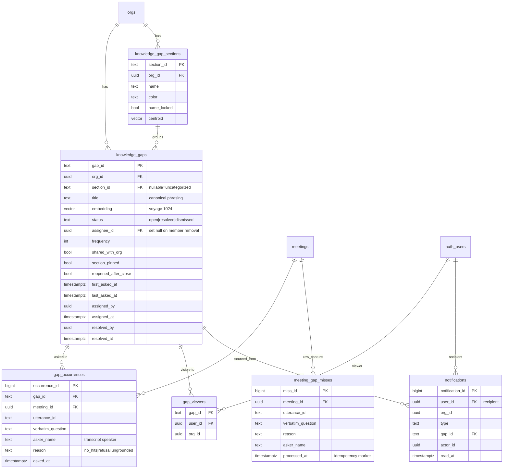
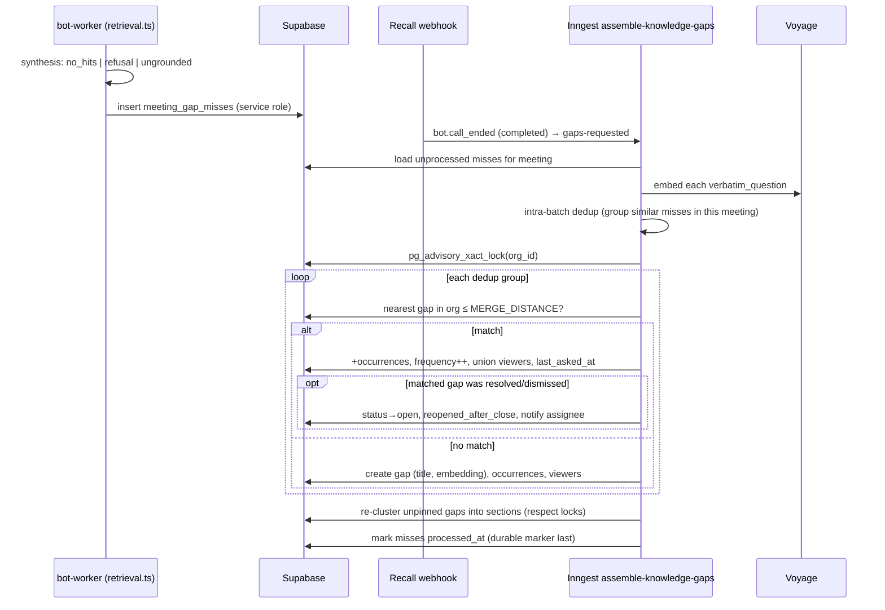

# feat: Knowledge Gaps

## Summary

Turn questions the copilot couldn't answer in meetings ("misses") into a managed, demand-ranked backlog. The bot-worker writes a raw miss row the moment synthesis can't ground an answer; a post-meeting Inngest job dedups that meeting's misses against each other and against the existing library by semantic similarity, merging recurrences into one gap with a frequency count and a list of occurrences ("moments"). Gaps auto-cluster into manager-editable sections whose curation survives re-clustering. Each gap moves through an open/resolved/dismissed lifecycle that re-surfaces on re-ask, can be assigned to a member (with in-app notification), and is visible per a **per-gap viewer list** rather than org-wide.

This plan covers the full brainstorm (R1–R22, AE1–AE6) plus the UI surface in the five attached mockups, with one product decision revised from the origin (see KTD1).

---

## Problem Frame

Every meeting generates questions the corpus can't answer yet, and today they evaporate at meeting end. The same question gets re-asked next week by someone else, each time costing an interruption and an answer that's never captured. The copilot already knows precisely which questions it couldn't ground — making those misses visible, deduplicated, and ranked by recurrence turns a diffuse, unowned cost into a concrete backlog of "what to document next" (see origin: `docs/brainstorms/2026-06-02-knowledge-gaps-requirements.md`).

---

## Requirements Traceability

All origin requirements are carried. Visibility (R21/R22) is revised per KTD1.

| Origin | Where addressed |
|---|---|
| R1 capture on ungrounded answer | U3 (miss capture), U6 (assembly) |
| R2 verbatim + meeting + asker + time | U1 (`gap_occurrences`), U3, U6 |
| R3 appears after meeting, not live | U6 (Inngest on `bot.call_ended`) |
| R4 semantic merge of recurrences | U4 (merge), U6 |
| R5 frequency + occurrence list | U1, U6, U10 (drawer "moments") |
| R6 rank by recurrence | U8 (sort default "Most asked") |
| R7 auto-group into sections | U5 (clustering), U6 |
| R8 rename/merge/split/move sections | U11 (curation actions) |
| R9 best-fit placement / uncategorized | U5 |
| R10 curation survives re-clustering | U5 (pin model), AE3 |
| R11 assign to one member | U10 (assign action) |
| R12 in-app notification + "assigned to me" | U7 (notify), U12 (surface) |
| R13 status open/resolved/dismissed | U1, U10 |
| R14 mark resolved/dismiss + audit | U10 |
| R15 closed leave default view, filter to see | U9 (status filter) |
| R16 re-ask re-surfaces a closed gap | U7 (resurface) , AE4 |
| R17 search + filter section/assignee/status | U9 |
| R18 sort most-asked/newest/unassigned | U9 |
| R19 "assigned to me" view | U9, U12 |
| R20 link gap/occurrence to transcript moment | U10 ("Open moment →") |
| R21 visibility | **Revised → KTD1** (per-gap viewer ACL) |
| R22 manager curation, assignee resolves own | U2 (RLS), U10, U11 |

---

## Key Technical Decisions

### KTD1 — Per-gap viewer ACL (revises R21/R22 origin "org-wide")

The origin said the library is org-wide. The user revised this: **a gap is visible only to the people who were in the meetings where it was asked**, with three escalation paths:

- **Viewer list per gap.** Each gap has an explicit set of allowed viewers, seeded from the participants of every meeting an occurrence came from.
- **Merge unions viewers.** Merging gap B into gap A unions B's viewers into A.
- **Share with org.** A per-gap action flips the gap to org-wide visible (`shared_with_org = true`).
- **Assignment grants access.** Assigning a gap to a member adds them to the viewer list even if they weren't a participant.

Rationale for an **explicit `gap_viewers` table** (rather than deriving viewers from `occurrences → meeting_participants` at query time): it matches the user's stated mental model ("each gap has a list"), keeps the RLS SELECT predicate a simple membership check instead of a correlated multi-join, and makes merge/assign semantics a row operation. The cost is that the assembly job must maintain the list (add participants on occurrence insert, union on merge) — acceptable and well-contained.

**Manager visibility (assumption, vetoable):** managers can `SELECT` all gaps in their org, because the mockups give managers library-wide curation (assign, dismiss noise, rename/merge/split sections, move gaps) which requires seeing the whole library. Non-manager members remain scoped to their viewer list. If the user wants managers also scoped to participation, the `is_org_manager(org_id)` disjunct in the SELECT policy is removed and section curation degrades to "within visible gaps." Flagged in Open Questions.

This supersedes the participant-scoped policies on the old `gaps` table (`supabase/migrations/20260603330000_visibility_and_config_rls.sql`), which are dropped with that table in U1.

### KTD2 — Supersede the vestigial `gaps` table; new normalized model

The existing `gaps` table (`supabase/migrations/20260602000000_meeting_events_and_artifacts.sql:158`) is per-meeting (`meeting_id NOT NULL`), has `confirmed`/`dismissed` booleans instead of a status enum, and no frequency, occurrences, assignee, or section. It has **zero write sites** in the codebase. A deduped, cross-meeting gap cannot be represented as a row there. Because nothing reads or writes it, U1 **drops it** (pre-launch; migrations allowed anytime) and introduces a normalized model: a `knowledge_gaps` parent, a `gap_occurrences` child (one row per ask — gives R5 frequency and R20 moment links), `knowledge_gap_sections`, `gap_viewers` (KTD1), `meeting_gap_misses` (raw capture staging), and `notifications` (R12). The "+N phrasings" shown in the mockups is **derived** from distinct `verbatim_question` values across a gap's occurrences — no separate phrasings table.

### KTD3 — Live raw capture, batch assembly

The bot-worker writes a raw `meeting_gap_misses` row the instant synthesis can't ground an answer (mirroring how `cards`/`syntheses` are written live), and the Inngest job assembles them at meeting end (mirroring `recap`). This is chosen over buffering misses in bot-worker memory (lost on crash/restart) and over re-deriving misses from `syntheses` at meeting end (the `no_hits` outcome never creates a synthesis row, so it isn't persisted there — research confirmed). A uniform raw table also makes AE6 enforceable at one capture point: only utterances that passed the relevance gate and reached synthesis can produce a miss, so filler never becomes a gap.

### KTD4 — Idempotent assembly with org-level serialization

The assembly job has `retries: 3` and does **additive** writes (unlike recap's single-row upsert), so it must be idempotent and concurrency-safe:

- **Per-occurrence idempotency:** `gap_occurrences` carries a unique `(meeting_id, utterance_id)`; every insert is on-conflict-do-nothing, so a retried step never double-counts frequency.
- **Cross-meeting create race:** two meetings ending together both see the library *without the other's new gap* and could create duplicate gaps for the same question. The per-meeting Inngest concurrency key does not protect this. The merge/cluster step takes a **Postgres transaction advisory lock keyed on `org_id`** (`pg_advisory_xact_lock(hashtext(org_id))`) so creates within an org serialize.
- **Durable marker last:** `meeting_gap_misses.processed_at` is set only after dependent rows commit; on failure the step throws so Inngest retries cleanly (the corpus-reconcile contract, `docs/plans/2026-05-31-004-feat-corpus-reconciliation-plan.md`).

### KTD5 — Merge precision over recall; tunable thresholds

Semantic merge must satisfy both AE1 (same question merges) and AE2 (keyword-overlap-but-different does **not** merge), so it favors precision. Cosine distance over Voyage `voyage-3-large` 1024-dim embeddings (the corpus stack); reference anchors are 0.30 "strong" / 0.45 "relevance floor" from `corpus-search.ts`. **Starting constants (calibrate against a fixture set, not shipped blind):** `GAP_MERGE_MAX_DISTANCE = 0.22` (tight, to protect AE2), `SECTION_ASSIGN_MAX_DISTANCE = 0.45` (loose grouping). These live as named constants with env overrides, exactly like the corpus thresholds. The exact values and the re-cluster cadence are tunable, not load-bearing to the architecture.

### KTD6 — Curation-pin model guarantees AE3

Re-clustering may only touch never-curated structure:
- `knowledge_gaps.section_pinned` — set true when a manager manually moves a gap; re-cluster never re-places a pinned gap.
- `knowledge_gap_sections.name_locked` — set true on manual rename/merge/split; re-cluster never renames or restructures a locked section.
- Empty **curated** sections persist; empty **auto-generated** sections are garbage-collected.
- Section writes from assembly use an `updated_at` optimistic check so a manager edit mid-assembly isn't clobbered.

### KTD7 — Notifications are a new minimal table + portal surface

No notification infrastructure exists (research confirmed: no table, no toast provider, only a sidebar pulsing-dot pattern). U7/U12 add a `notifications` table (recipient, type, gap link, read_at) and the smallest surface that serves the mockups: a sidebar unread dot (reusing the existing `sidebar.tsx` dot pattern), an in-page "N gaps assigned to you" banner, a toast on new assignment, and the "Assigned to me" view. Email/Slack stay deferred (origin scope boundary).

---

## High-Level Technical Design

### Data model (ERD)



### Gap lifecycle (state machine)

```mermaid
stateDiagram-v2
    [*] --> open: assembly creates gap
    open --> resolved: person marks done (assignee or manager)
    open --> dismissed: person dismisses (manager; assignee on own)
    resolved --> open: re-ask matches (assembly) → reopened_after_close=true
    dismissed --> open: re-ask matches (assembly) → reopened_after_close=true
    resolved --> dismissed: manager dismisses a done gap
    dismissed --> resolved: rejected (illegal) 
    note right of resolved
      re-open retains assignee + re-notifies (KTD); 
      re-resolve / re-dismiss in same state = no-op;
      assigning forces status→open
    end note
```



### Capture → assembly flow



---

## Output Structure

New files (repo-relative; existing files modified are listed per unit):

```
supabase/migrations/
  2026XXXXXXXXXX_knowledge_gaps.sql            # U1 tables + indexes + triggers
  2026XXXXXXXXXX_knowledge_gaps_rls.sql        # U2 policies + can_view_gap helper

packages/engine/src/
  gaps/
    contract.ts          # U3/U4 Miss, Gap, Occurrence, MergeResult types
    capture.ts           # U3 miss → MissRecord shaping + AE6 guard
    merge.ts             # U4 embedding compare, intra-batch + library dedup
    cluster.ts           # U5 section assignment + Haiku auto-naming
    index.ts

apps/bot-worker/src/
  gap-capture.ts         # U3 onMiss handler → insert meeting_gap_misses

apps/portal/src/inngest/
  functions/assemble-knowledge-gaps.ts   # U6
  lib/knowledge-gaps.ts                  # U6/U7 assembly + notify helpers

apps/portal/app/(authed)/gaps/
  page.tsx               # U8 server page
  _client.tsx            # U8/U9 list, filters, sort, search
  _gap-row.tsx           # U8 row + demand sparkline
  _gap-drawer.tsx        # U10 detail drawer
  _curation.tsx          # U11 section/gap curation menus + dialogs
  _empty-state.tsx       # U8 empty state
  gap-actions.ts         # U10 resolve/dismiss/assign/share server actions
  section-actions.ts     # U11 rename/merge/split/move/delete + merge-gaps
  notification-actions.ts # U12 mark-read

apps/portal/test/
  rls/knowledge-gaps.test.ts             # U2
  inngest/assemble-knowledge-gaps.test.ts # U6/U7
```

---

## Implementation Units

### U1. Schema migration — drop old `gaps`, create normalized model

**Goal:** Replace the unused per-meeting `gaps` table with the full Knowledge Gaps data model.
**Requirements:** R2, R5, R13, KTD2.
**Dependencies:** none.
**Files:** `supabase/migrations/2026XXXXXXXXXX_knowledge_gaps.sql`.
**Approach:**
- `drop table public.gaps cascade;` (drops its participant-scoped RLS policies from `20260603330000` too). Confirm zero references first.
- Create `knowledge_gaps`, `gap_occurrences`, `knowledge_gap_sections`, `gap_viewers`, `meeting_gap_misses`, `notifications` per the ERD. `text` PKs for gap/section (engine-generated, e.g. `gap_${randomUUID()}`), `bigserial` for occurrence/miss/notification. FKs: `org_id → orgs(id)`, `meeting_id → meetings(meeting_id)`, `assignee_id → auth.users(id) ON DELETE SET NULL`, `gap_viewers.user_id → auth.users(id) ON DELETE CASCADE`, `section_id → knowledge_gap_sections ON DELETE SET NULL`.
- `embedding vector(1024)` on `knowledge_gaps`; `centroid vector(1024)` on sections. HNSW `vector_cosine_ops` index on `knowledge_gaps.embedding` (mirror `corpus_chunk_embeddings_hnsw_idx`).
- `status text not null default 'open' check (status in ('open','resolved','dismissed'))`.
- Unique `(meeting_id, utterance_id)` on `gap_occurrences` (idempotency, KTD4). Indexes: `knowledge_gaps (org_id, status, frequency desc)`, `gap_occurrences (gap_id)`, `gap_viewers (user_id)`, `notifications (user_id, read_at)`.
- `set_updated_at` trigger on `knowledge_gaps` and `knowledge_gap_sections` (reuse existing trigger fn).
**Patterns to follow:** the four tables in `20260602000000_meeting_events_and_artifacts.sql`; vector/HNSW from `20260601000000_corpus_pgvector.sql`; `set_updated_at` from `20260605000000`.
**Test scenarios:** Test expectation: none — pure DDL; behavior is exercised by U2 (RLS) and U6 (assembly) tests. Verify `pnpm` migration applies cleanly and `supabase db push` succeeds on a scratch DB.
**Verification:** migration applies; `\d knowledge_gaps` shows the columns/indexes; old `gaps` table is gone with no dangling references.

### U2. RLS policies + `can_view_gap` helper + denial tests (test-first)

**Goal:** Enforce the KTD1 viewer-ACL visibility and KTD/R22 curation permissions at the database.
**Requirements:** R21→KTD1, R22.
**Dependencies:** U1.
**Files:** `supabase/migrations/2026XXXXXXXXXX_knowledge_gaps_rls.sql`, `apps/portal/test/rls/knowledge-gaps.test.ts`.
**Approach:**
- `can_view_gap(p_gap_id text)` SECURITY DEFINER, `set search_path = public`, returns bool: `shared_with_org AND org member` OR `assignee_id = auth.uid()` OR `exists gap_viewers(gap_id,auth.uid())` OR `is_org_manager(org_id)`. Reuse `is_org_manager` (`20260603300000`) — never inline an `org_members` self-join (recursion bug, per workspace-invitations learnings).
- `knowledge_gaps` SELECT: `can_view_gap(gap_id)`. UPDATE: `is_org_manager(org_id) OR assignee_id = auth.uid()` (with check same). No INSERT/DELETE policy (service-role + manager server actions via service role).
- `gap_occurrences` / `gap_viewers` SELECT: `can_view_gap(gap_id)`.
- `knowledge_gap_sections` SELECT: org member; INSERT/UPDATE/DELETE: `is_org_manager(org_id)`.
- `notifications` SELECT + UPDATE(read_at): `user_id = auth.uid()`; no INSERT policy.
**Execution note:** RLS bugs are silent — write the denial tests first, then the policies (project discipline; tests live in `apps/portal/test/rls/`, auto-skip without a local stack unless `RISEZOME_RUN_RLS_TESTS=1`).
**Patterns to follow:** `apps/portal/test/rls/roles.test.ts`; `is_org_manager`/`is_meeting_participant` helpers.
**Test scenarios:**
- Covers R22. Non-participant member: cannot SELECT a gap they're not a viewer of; CAN after being added to `gap_viewers`; CAN once `shared_with_org`; CAN once assigned.
- Covers R22. Member who is the assignee: CAN UPDATE status (resolve/dismiss); CANNOT UPDATE another member's gap.
- Covers R22. Manager: CAN SELECT all org gaps; CAN UPDATE/insert/delete sections; non-manager CANNOT.
- Cross-org isolation: a user in org B cannot SELECT org A's gaps/occurrences/sections/notifications even when shared_with_org within A.
- `notifications`: a user reads only their own; cannot read another user's.

### U3. Bot-worker miss capture

**Goal:** Persist a raw miss the moment synthesis can't ground an answer, with AE6 correctness.
**Requirements:** R1, R2, AE6.
**Dependencies:** U1.
**Files:** `packages/engine/src/gaps/contract.ts`, `packages/engine/src/gaps/capture.ts`, `apps/bot-worker/src/gap-capture.ts`, modify `apps/bot-worker/src/retrieval.ts`, `apps/bot-worker/src/index.ts`; tests `packages/engine/test/gaps/capture.test.ts`.
**Approach:**
- Add an `onMiss?(miss: MissRecord)` callback to the retrieval args, fired from the three branches: zero-hit (`retrieval.ts:~334`, after CRAG), refusal (`~917`), ungrounded suppression (`~995`). `MissRecord = { verbatimQuestion, utteranceId, meetingId, orgId, reason: 'no_hits'|'refusal'|'ungrounded', askerName?, sourcesSearched? }` — `askerName` from the triggering transcript speaker.
- Wire `onMiss` in `index.ts` (alongside `onGroundedAnswer`/`onSynthesisRequested`) to `apps/bot-worker/src/gap-capture.ts`, which inserts a `meeting_gap_misses` row via the service-role client.
- AE6 is satisfied structurally: only utterances that passed the relevance gate and reached synthesis can fire these branches — filler skipped upstream never produces a `MissRecord`. Add a guard for the skill path: if the miss came via a skill whose `SkillResult.recovery` is `suspect`/`repaired` (misparse-zero, per self-healing-skills), do **not** record a miss.
**Patterns to follow:** the existing `onGroundedAnswer` callback wiring; service-role insert pattern from `card`/`synthesis` writers.
**Test scenarios:**
- Covers AE6. A `clearly_filler` / relevance-skipped utterance never reaches the branches → `onMiss` not called.
- Each of the three branches (`no_hits`, refusal, ungrounded) calls `onMiss` once with the correct `reason` and the verbatim question + utteranceId.
- A skill-sourced suspect/repaired zero does **not** record a miss (misparse-zero guard).
- The cooldown-dropped utterance limitation is documented (a question throttled before synthesis won't generate a miss) — assert current behavior, flag as known gap.

### U4. Engine — embedding, intra-batch dedup, library merge

**Goal:** Pure, testable semantic-merge logic (no DB, no network beyond the injected embedder).
**Requirements:** R4, AE1, AE2, KTD5.
**Dependencies:** U3 (types).
**Files:** `packages/engine/src/gaps/merge.ts`, `packages/engine/src/gaps/contract.ts`; tests `packages/engine/test/gaps/merge.test.ts`.
**Approach:**
- `dedupeWithinBatch(misses, embeddings): DedupGroup[]` — greedy union of misses within `GAP_MERGE_MAX_DISTANCE` of each other (solves the intra-meeting near-dup hole: two phrasings in one call → one group).
- `findMergeTarget(groupCentroid, candidateGaps): GapId | null` — nearest existing org gap within `GAP_MERGE_MAX_DISTANCE`, else null (create new). Candidate gaps come from a pgvector NN query in U6.
- Named constants `GAP_MERGE_MAX_DISTANCE = 0.22` (env override), with a comment citing the 0.30/0.45 corpus anchors and the AE2 precision rationale.
**Patterns to follow:** `VoyageEmbedder` usage in `retrieval.ts`; cosine-distance literal serialization for pgvector.
**Test scenarios:**
- Covers AE1. Two semantically-equivalent phrasings → one group; a third equivalent phrasing matches an existing gap (target found).
- Covers AE2. Two questions sharing keywords but different topics ("refund window" vs "window manager refund UI") → two groups, no merge target.
- Borderline at the threshold: distance just inside merges, just outside creates — assert the boundary is deterministic.
- Empty batch → no groups; single miss → one group of one.

### U5. Engine — section clustering + auto-naming (curation-aware)

**Goal:** Assign gaps to sections automatically while preserving manual curation (AE3).
**Requirements:** R7, R9, R10, KTD6, AE3.
**Dependencies:** U4.
**Files:** `packages/engine/src/gaps/cluster.ts`; tests `packages/engine/test/gaps/cluster.test.ts`.
**Approach:**
- `assignSections(unpinnedGaps, sections): Placement[]` — each unpinned gap → nearest section by `centroid` cosine within `SECTION_ASSIGN_MAX_DISTANCE`; none within → Uncategorized (`section_id = null`).
- `proposeSections(uncategorizedGaps, namer): NewSection[]` — when the uncategorized pile clusters (size ≥ 2 within section distance), call an injected `namer` (Haiku, bounded `max_tokens`) to name the cluster; create a section with a rotating `color`. Pinned gaps and `name_locked` sections are inputs the function must never reassign or rename.
- Directional pseudo-code only; exact cadence (re-cluster every assembly vs. every N) is tunable.
**Patterns to follow:** engine Haiku call shape from `packages/engine/src/summarize/anthropic.ts`.
**Test scenarios:**
- Covers R9. A gap within section distance joins that section; one beyond all sections → Uncategorized.
- Covers R10/AE3. A `section_pinned` gap is never re-placed; a `name_locked` section is never renamed by `proposeSections`, even when its members would cluster differently.
- A cluster of ≥2 uncategorized gaps yields one new named section via the namer; a single uncategorized gap does not spawn a section.

### U6. Inngest assembly job

**Goal:** Post-meeting batch: consume misses → dedup → merge-or-create → occurrences/viewers/frequency → re-cluster, idempotently and race-safely.
**Requirements:** R3, R4, R5, R7, KTD3, KTD4, KTD6.
**Dependencies:** U1, U4, U5.
**Files:** `apps/portal/src/inngest/functions/assemble-knowledge-gaps.ts`, `apps/portal/src/inngest/lib/knowledge-gaps.ts`, modify `apps/portal/src/inngest/client.ts` (event), `apps/portal/app/api/inngest/route.ts` (register), `apps/portal/app/api/recall/webhook/route.ts` (emit `risezome/meeting.gaps-requested` alongside recap); test `apps/portal/test/inngest/assemble-knowledge-gaps.test.ts`.
**Approach:**
- Function shape mirrors `generate-meeting-recap.ts`: `concurrency: [{ key: 'event.data.meetingId', limit: 1 }]`, `retries: 3`, `onFailure`, `createServiceRoleClient()`.
- Steps: `load-misses` (unprocessed for meeting) → `embed` → `dedupe-within-batch` (U4) → `merge-or-create` (inside `pg_advisory_xact_lock(hashtext(org_id))`, KTD4) → `recluster` (U5) → `mark-processed` (durable marker last).
- Merge-or-create per group: NN query over org `knowledge_gaps.embedding`; on match append occurrences (on-conflict `(meeting_id,utterance_id)` do nothing), `frequency = (select count …)` or atomic increment, union viewers (insert meeting participants on-conflict do nothing), update `last_asked_at`; on no match create gap.
- Title = first occurrence's verbatim (canonical); "+N phrasings" derives later from distinct verbatim.
- Empty-meeting early return (no misses → no writes, no re-cluster), mirroring recap's empty finalize.
- Viewers seeded from `meeting_participants` of the occurrence's meeting; unknown-speaker occurrences still insert with `asker_name = 'Unknown'`.
**Patterns to follow:** `generate-meeting-recap.ts`; `corpus-reconcile.ts` idempotency; webhook emit at `recall/webhook/route.ts:~165`.
**Test scenarios (mock Supabase client, per `_mock-db.ts` harness):**
- Covers R4/AE1. Same meeting asks two equivalent phrasings → ONE gap, frequency 2, two occurrences.
- Covers R5. Occurrences carry meeting_id, utterance_id, asker_name, asked_at.
- Idempotency: re-running the function for the same meeting (retry) leaves frequency unchanged (unique `(meeting_id,utterance_id)`).
- Cross-meeting: two assemblies for the same question, serialized by the advisory lock, produce ONE gap not two (simulate by ordering).
- Empty meeting → no gap/section writes, terminates clean.
- Viewers: each occurrence's meeting participants are added to `gap_viewers`; a merge unions both meetings' participants.

### U7. Resurface + notification on assembly

**Goal:** Re-ask of a closed gap reopens it and notifies; new assignment notifies.
**Requirements:** R16, R12, AE4, KTD7.
**Dependencies:** U6.
**Files:** `apps/portal/src/inngest/lib/knowledge-gaps.ts` (resurface + `createNotification`); tests in `apps/portal/test/inngest/assemble-knowledge-gaps.test.ts`.
**Approach:**
- In merge-or-create, when the matched gap's status is `resolved`/`dismissed`: set `status = 'open'`, `reopened_after_close = true`, `reopened_at = now()`, retain `assignee_id`, and if an assignee exists insert a `gap_resurfaced` notification.
- `createNotification(recipient, type, gapId, actor)` helper (also used by U10's assign action).
**Test scenarios:**
- Covers R16/AE4. A resolved gap whose question is re-asked → status back to open, `reopened_after_close = true`, a `gap_resurfaced` notification for the assignee.
- A dismissed gap re-asked → same reopen; flag distinguishes "asked again after dismissed" from "after resolved" (copy only).
- Re-ask of an *open* gap → frequency++ only, no notification, no flag.
- Concurrent close + re-ask: occurrence write leaves the gap reopened (occurrence wins).

### U8. Gaps library page — server fetch, hero, stats, rows, empty state

**Goal:** The main library view (mockup #7, #11).
**Requirements:** R6, R17–R20 (display), KTD1 (RLS-scoped read).
**Dependencies:** U1, U2.
**Files:** `apps/portal/app/(authed)/gaps/page.tsx`, `_gap-row.tsx`, `_empty-state.tsx`, modify `apps/portal/app/(authed)/_components/sidebar.tsx` + `nav-icons.tsx`.
**Approach:**
- Server component: `requireAuthedUserWithOrg()` → `createServerClient()` (RLS-scoped — members see only their viewer-listed gaps, managers see all) → fetch gaps + sections + per-gap occurrence aggregates (people count, meetings count, last asked, distinct-phrasing count) via an RPC mirroring `capture_card_stats`, with a JS fallback.
- Stat counters (OPEN / UNASSIGNED / SECTIONS) and "Most-asked gap this month" (top frequency with an occurrence in last 30d).
- Gap row: demand number + colored sparkline (tier by frequency in the client — orange/purple/gray, presentational only), title + "+N phrasings" pill, meta (people, meetings, relative time, "N moments"), status pill, owner avatar or "Assign" button, ⋮ menu.
- Empty state (mockup #11): illustration, copy, "View captures" + "How gaps work".
- Sidebar: add "Knowledge gaps" nav link **outside** the `isManager` gate (members see it), with an unread-dot for assigned gaps (reuse the `sidebar.tsx` dot pattern).
**Patterns to follow:** `captures/page.tsx` (server fetch + RPC + fallback), `captures/_client.tsx` (row/layout), `sidebar.tsx` dot.
**Test scenarios:**
- Renders sections as collapsible groups ordered with most-asked gap first within each (R6).
- Empty state shows when the org has zero visible gaps.
- A member sees only gaps they can view; the count chips reflect the visible set.
- "+N phrasings" reflects distinct verbatim count minus the canonical title.

### U9. Filters, search, sort, "assigned to me"

**Goal:** Client-side library controls (mockup #7 toolbar, #9 banner).
**Requirements:** R15, R17, R18, R19.
**Dependencies:** U8.
**Files:** `apps/portal/app/(authed)/gaps/_client.tsx`.
**Approach:** `useMemo` filtering over the fetched set: search (title + phrasings), Section / Assignee / Status filters (Status default `:Open`, so resolved/dismissed are hidden until filtered — R15), "Assigned to me" toggle (R19), Sort (Most asked / Newest / Unassigned — R18). In-page banner "N gaps are assigned to you · M need an answer this week."
**Patterns to follow:** `captures/_client.tsx` filter/sort.
**Test scenarios:**
- Covers R15. Default status filter `:Open` hides resolved/dismissed; switching the filter reveals them.
- Covers R18. Sort by Most asked orders by frequency desc; Newest by last_asked_at; Unassigned floats assignee-null gaps.
- Covers R19. "Assigned to me" shows only the current user's owned gaps; banner count matches.
- Search matches a merged phrasing, not just the canonical title.

### U10. Gap detail drawer + actions (resolve/dismiss/assign/share/open-moment)

**Goal:** The right-side gap drawer and its actions (mockup #8).
**Requirements:** R11, R12, R14, R20, R22, KTD1.
**Dependencies:** U2, U8.
**Files:** `apps/portal/app/(authed)/gaps/_gap-drawer.tsx`, `gap-actions.ts`.
**Approach:**
- Drawer: section dropdown + status pill + close; question; "Mark resolved" (green) / "Dismiss" / locate icon; OWNER (avatar + name + Change); DEMAND (flame ×, people · meetings); MERGED PHRASINGS · N (distinct verbatim); WHERE IT WAS ASKED · N MOMENTS (asker avatar/name/date, quote, meeting name, "Open moment →"); audit footer ("Captured automatically · first asked … · assigned to … by … N ago").
- "Open moment →" deep-links to the meeting review page anchored at `utterance_id` (reuse `trigger_utterance_id` anchoring from the review-page work).
- Server actions: `resolveGapAction`/`dismissGapAction` (assignee on own gap OR manager — RLS enforces), `assignGapAction` (manager-gated via `requireManager`; sets assignee + `assigned_by`/`assigned_at`, **inserts assignee into `gap_viewers`**, forces `status→open` if closed, creates `gap_assigned` notification), `shareWithOrgAction` (manager-gated; sets `shared_with_org = true`). All `revalidatePath('/gaps')` and return `{ ok }`.
- Optimistic UI with rollback (`useTransition`), per `members/_member-list.tsx`.
**Patterns to follow:** `members/member-actions.ts` (manager-gated actions), `members/_member-list.tsx` (optimistic), review-page utterance anchoring.
**Test scenarios:**
- Covers R14. Assignee marks own gap resolved → status resolved, `resolved_by`/`resolved_at` set, leaves default view.
- Covers R11/R12/KTD1. Assigning a member adds them to `gap_viewers` (they can now see it) and creates a `gap_assigned` notification; assigning a closed gap reopens it.
- Covers KTD1. Share-with-org sets `shared_with_org`; the gap becomes visible to all org members (verify via RLS test hook).
- Covers R20. "Open moment" builds the correct meeting+utterance deep link.
- A non-manager, non-assignee cannot resolve/assign (action rejected).

### U11. Curation — sections + manual gap merge

**Goal:** Manager curation menus and dialogs (mockup #10).
**Requirements:** R8, R10, R22, KTD6.
**Dependencies:** U6 (sections exist), U10.
**Files:** `apps/portal/app/(authed)/gaps/_curation.tsx`, `section-actions.ts`.
**Approach:**
- Section options: Rename (sets `name_locked`), Merge into another (re-point gaps, `name_locked`), Split into new (`name_locked`), Move all gaps, Delete (only if empty or reassign). Move a gap between sections (sets `section_pinned`), "+ New section". All `requireManager`-gated.
- **Manual merge two gaps** (mockup #10 dialog "Merge 2 gaps? … Demand becomes 11×. This can't be undone."): re-point gap B's occurrences to A (on-conflict do nothing), union `gap_viewers`, recompute frequency, delete B. Irreversible — confirm dialog. No un-merge in v1 (explicit scope boundary; the flow-analysis zero-occurrence-after-unmerge case is out of scope).
- Curated structure persistence is enforced by the pins set here (U5/U6 respect them).
**Patterns to follow:** `members/member-actions.ts`; optimistic menus from `_member-list.tsx`.
**Test scenarios:**
- Covers R8. Rename/merge/split/move actions update sections and set the curation pins; a non-manager is rejected.
- Covers R10/AE3. After a manual rename + gap move, a subsequent assembly re-cluster leaves the renamed section and moved gap untouched.
- Manual gap merge: B's occurrences re-parent to A, viewers union, frequency = combined, B deleted; the dialog blocks if not confirmed.
- Delete section: empty section deletes; non-empty prompts reassignment (no orphaned gaps).

### U12. Notifications surface

**Goal:** In-app notification delivery (mockup #9) and "assigned to me".
**Requirements:** R12, R19, KTD7.
**Dependencies:** U7, U8.
**Files:** `apps/portal/app/(authed)/gaps/notification-actions.ts`, drawer/banner/toast components under `gaps/`, modify `sidebar.tsx` (unread dot).
**Approach:** Sidebar unread dot from a `notifications` COUNT (`read_at is null`); in-page banner "N gaps assigned to you · M need an answer this week"; toast on a fresh `gap_assigned` notification with "View gap" / "Dismiss"; `markNotificationReadAction`. "Assigned to me" view reuses U9's toggle.
**Patterns to follow:** `sidebar.tsx:82–91` pulsing-dot COUNT pattern.
**Test scenarios:**
- A new `gap_assigned` notification increments the sidebar unread count and renders the banner/toast.
- "View gap" opens the drawer for that gap; "Dismiss" marks the notification read (count decrements).
- A user sees only their own notifications (RLS, covered in U2 too).

### U13. Cleanup — remove vestigial hud-ui gap types; eval coverage

**Goal:** Remove dead scaffolding and lock in regression coverage.
**Requirements:** KTD2 hygiene; eval-regression discipline (user memory).
**Dependencies:** U3.
**Files:** modify `packages/hud-ui/src/types.ts` (remove `GapEvent`, the `gap` event-union member), `packages/hud-ui/src/state/app-state.tsx` (remove `gaps` map + `case 'gap'` reducer); add a deterministic unit test or golden row for the miss-capture decision.
**Approach:** Delete the unused live-gap `GapEvent`/reducer (no write sites; live in-meeting surfacing is an origin scope boundary). Add coverage for the miss-detection boundary (AE6) — a deterministic unit test in `packages/engine/test/gaps/capture.test.ts` (already in U3) plus, if any retrieval/synthesis grounding logic is touched, a golden question in `apps/bot-worker/eval/golden-questions.jsonl` per the user memory.
**Test scenarios:**
- hud-ui still typechecks and builds with `GapEvent`/`gap` removed; no references remain.
- The AE6 boundary is pinned by a deterministic unit test (LLM-dependent behavior stays out of CI-blocking asserts).

---

## Scope Boundaries

### Carried from origin (deferred for later)
- Pushing a gap to an external tracker (Trello/GitHub/Jira).
- Automatic close-the-loop (re-running a gap's question against the updated corpus to auto-resolve/reopen).
- Capturing a canonical answer / mini-FAQ on resolve.
- Live in-meeting gap surfacing.
- Email/Slack notification of assignment (in-app only; no email infra).
- Capturing questions raised in a meeting but never asked to the copilot.

### Deferred to follow-up work (plan-local)
- **Un-merge gaps** — gap merge is irreversible in v1 (mockup confirms). The zero-occurrence-after-unmerge edge case is therefore out of scope.
- **Auto-split of oversized sections** — only manual split in v1; "how large before splitting" stays a tuning question.
- **Cooldown-dropped misses** — questions throttled before synthesis don't generate a miss (U3 documents this); broadening capture to pre-synthesis utterances is future work.

---

## Risks & Open Questions

- **Manager-sees-all visibility (KTD1 assumption).** Managers can read every org gap to curate; non-managers are viewer-scoped. If the user wants managers also participation-scoped, drop the `is_org_manager` disjunct in `can_view_gap` — but section curation then only spans a manager's visible gaps. *Default: managers see all.*
- **Privacy of "who asked what."** Even with viewer-scoping, a gap's drawer shows asker names and verbatim questions to everyone on the viewer list (and the whole org once shared). This is the intended model but worth a deliberate confirmation before launch.
- **Section auto-naming quality (U5).** Haiku-named clusters may be generic; managers can always rename. Cadence/threshold are tunable, not architectural.
- **Merge threshold calibration (KTD5).** `0.22` is a precision-first starting point; build the AE1/AE2 fixture set before trusting it in production. Any change to grounding/miss logic needs eval coverage (user memory).
- **Advisory-lock contention (KTD4).** Org-level lock serializes assembly within an org; fine at current volume, revisit if many meetings for one org end simultaneously.

---

## Sources & Research

- Origin requirements: `docs/brainstorms/2026-06-02-knowledge-gaps-requirements.md`.
- Existing `gaps` table + schema neighborhood: `supabase/migrations/20260602000000_meeting_events_and_artifacts.sql`.
- Participant-scoped gaps RLS being superseded: `supabase/migrations/20260603330000_visibility_and_config_rls.sql`, helper `is_meeting_participant` (`20260603320000`), roles/`is_org_manager` (`20260603300000`).
- Inngest job pattern: `apps/portal/src/inngest/functions/generate-meeting-recap.ts`; webhook emit `apps/portal/app/api/recall/webhook/route.ts`; idempotency contract `docs/plans/2026-05-31-004-feat-corpus-reconciliation-plan.md`.
- Embeddings/pgvector: `packages/engine/src/embed/voyage.ts`, `supabase/migrations/20260601000000_corpus_pgvector.sql`; distance anchors `apps/bot-worker/src/corpus-search.ts`, `docs/architecture/retrieval-pipeline.md`.
- Miss-detection branches: `apps/bot-worker/src/retrieval.ts` (zero-hit ~334, refusal ~917, ungrounded ~995); skill misparse-zero guard `docs/plans/2026-06-02-001-feat-self-healing-skills-plan.md`.
- Portal UI patterns: `apps/portal/app/(authed)/captures/` (server fetch + RPC + fallback, list/filter client), `members/` (manager-gated actions, optimistic UI), `_components/sidebar.tsx` (nav + dot).
- Vestigial types: `packages/hud-ui/src/types.ts`, `packages/hud-ui/src/state/app-state.tsx`.
- Eval discipline: user memory `eval-regression-coverage`; golden set `apps/bot-worker/eval/golden-questions.jsonl`.
- Mockups: five attached screens (library list, gap drawer, notifications, curation menus, empty state).
