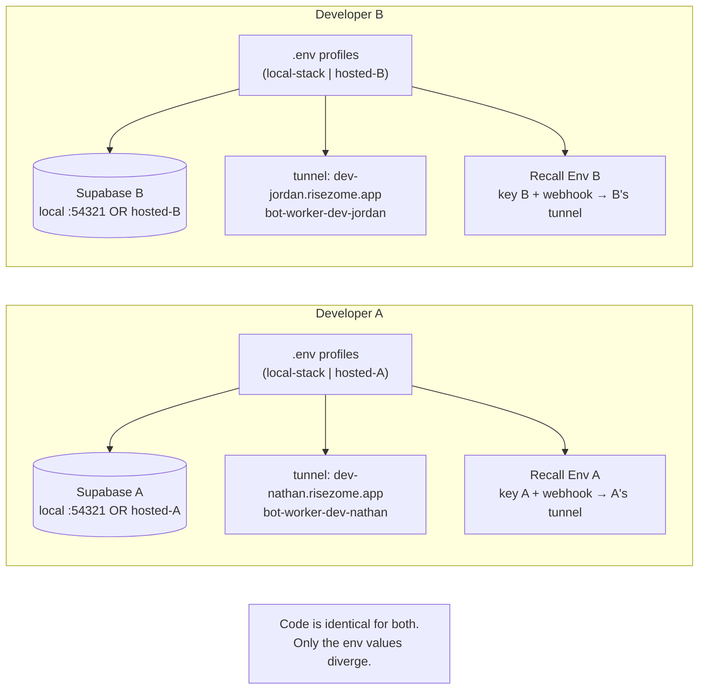

# feat: Isolated local dev environments

## Summary

Make local development conflict-free for two (or more) developers, and make
running the whole stack a **single command**. Today both developers point at the
**one** hosted Supabase project, the **one** named cloudflared tunnel, and the
**one** Recall webhook endpoint — so their writes and callbacks collide — and
starting up means juggling three terminals plus manual env wiring. This plan
gives each developer their own isolated Supabase (switchable between a local
`supabase start` stack and a hosted project), their own tunnel hostname, and
their own Recall Environment, all keyed off **one developer tag**; and a single
`pnpm dev` that takes that tag, wires every per-developer env value from it,
brings up all components, and multiplexes their logs into one stream. The
guiding principle: **isolation is env divergence, not code forks** — every
externally-reachable target is already a single env var; the work is keying that
divergence off a tag, a one-command orchestrator, a usable seed, and the setup
docs around it.

---

## Problem Frame

The runbook states it plainly: "the dev servers talk to the hosted Supabase
project via the env-var URL/key. There's no local Postgres or `supabase start`
in this setup" (`docs/runbooks/local-dev-processes.md`). So when Nathan writes a
meeting, org, or corpus row, it lands in the same database his partner is
writing to — meeting IDs, gaps, and the bot↔portal handshake all collide. The
same single-owner problem exists for the `risezome-dev` cloudflared tunnel
(only one machine can own the hostnames) and the Recall webhook (one
dashboard-global endpoint, so lifecycle events cross-deliver).

None of this is a code problem. Every collision surface is already a single
configuration value: the Supabase URL/keys, `BOT_WORKER_BASE_URL` (the host
Recall dials), the tunnel hostname, and the Recall API key/webhook. What's
missing is (a) a way to point those at per-developer targets, (b) a switch
between a free local Supabase stack and a hosted one, and (c) the setup story
that makes a fresh isolated environment usable. Ports and the Inngest dev
server are already per-machine, so they are not the conflict.

---

## Requirements

- R1. Each developer's database writes never collide — each runs against their own isolated Supabase.
- R2. A developer can switch their apps (portal + bot-worker + RLS tests) between a local `supabase start` stack and a hosted Supabase project via env alone, with no code changes.
- R3. A fresh local stack is immediately usable — a sign-in-able user, an org, and membership exist after `supabase db reset` — not an empty schema.
- R4. Each developer can expose their own portal and bot-worker over their own stable tunnel hostname without clashing with the other developer.
- R5. Each developer's Recall test bots route both their real-time transcript stream **and** their lifecycle webhooks (e.g. `bot.call_ended`) to that developer's machine only.
- R6. Setup and day-to-day run are documented and scripted; secrets stay gitignored and out of `NEXT_PUBLIC_*`.
- R7. Running the full stack is **one command** that: resolves the developer tag (prompt or remembered), derives every per-developer env value from it, brings up all components (local Supabase when in local mode, portal, Inngest dev, bot-worker, and the per-dev tunnel), streams all of their logs into one prefixed view, and tears everything down together on exit.

---

## Key Technical Decisions

### KTD1 — Isolation is env divergence, not code forks

Every externally-reachable target is already a single env var, and the
codebase's existing "local-dev parity" convention is config-by-env-var with no
hardcoded prod URLs (origin: `docs/plans/archive/2026-05-30-002-feat-upwell-portal-saas-plan.md`).
So the plan adds env **layering and switching** plus setup docs — it does not
fork app logic. The one committed hardcoded host (`apps/portal/next.config.mjs`
`allowedDevOrigins`) is converted to read from env (U4) to honor this.

### KTD2 — Switchable Supabase via env-profile files + a switch script

The apps have no env layering today: the portal relies on Next's automatic
`.env.local`, and the bot-worker is pinned to `tsx --env-file=.env`. Rather than
introduce a runtime env-name framework, each developer keeps **two profile
files per app** — a hosted profile and a local-stack profile — and a small
`scripts/use-env.sh <local|hosted>` copies the chosen profile into the active
locations (`apps/portal/.env.local`, `apps/bot-worker/.env`). It's explicit, has
no magic resolution order, and works with both Next's auto-load and the
bot-worker's `--env-file`. The script warns that a portal/bot-worker restart is
required for the swap to take effect. (Alternative considered: a `dev:local` /
`dev:hosted` script pair passing `--env-file` — rejected because Next dev does
not accept `--env-file` and would need a parallel mechanism, splitting the two
apps' switch surface.)

### KTD3 — The local-stack keys are well-known and non-secret → ship a template

`supabase start` prints a fixed `anon` and `service_role` key that are
**identical on every machine** (the public Supabase local-dev demo JWTs) and the
static URL `http://127.0.0.1:54321`. Because they're not secrets, the local-stack
profile can be a **committed `.env.local-stack.example`** that maps those known
values into every var-name convention the codebase uses — resolving the
name-impedance the research surfaced:

| Surface | URL var | Key var(s) | Local-stack value |
|---|---|---|---|
| Portal browser/SSR | `NEXT_PUBLIC_SUPABASE_URL` | `NEXT_PUBLIC_SUPABASE_PUBLISHABLE_KEY` | local URL + **anon** JWT |
| Portal service-role | `NEXT_PUBLIC_SUPABASE_URL` | `SUPABASE_SECRET_KEY` | local URL + **service_role** JWT |
| Bot-worker | `SUPABASE_URL` | `SUPABASE_SECRET_KEY` | local URL + service_role JWT |
| RLS tests | `SUPABASE_URL` | `SUPABASE_ANON_KEY`, `SUPABASE_SERVICE_ROLE_KEY` | local URL + anon + service_role JWT |

The Supabase JS clients accept JWT-style keys regardless of the publishable/secret
var name, so the same anon/service_role JWTs are simply written under whichever
name each surface expects. The hosted profile stays a gitignored per-dev file
(real secrets), built from the existing `.env.example` files.

### KTD4 — Per-dev hosted Supabase = per-dev `supabase link` ref

For the hosted mode, each developer creates and links their **own** hosted
Supabase project (`supabase link --project-ref <theirs>`, then `supabase db
push`). `supabase/.temp/` (the active link) is already gitignored, so per-dev
linking never collides in git. This is a documentation/runbook concern, not
code.

### KTD5 — A minimal, local-only seed makes fresh stacks usable

`supabase/seed.sql` seeds nothing today, so a reset local stack has no way to
sign in. The seed gains a **minimal, explicitly local-only** baseline: one
confirmed email/password auth user, one org, and a manager membership (and a
small optional sample so the UI isn't barren). This runs only via `supabase db
reset` against the local stack — never against hosted. Email/password (not
Google OAuth) is chosen for the seed user so local sign-in needs no OAuth
credentials.

### KTD6 — Per-dev tunnel + env-driven `allowedDevOrigins`

The `persistent-bot-worker-tunnel.md` runbook already recommends one named
tunnel per developer with unique subdomains; this plan adopts it and removes the
last blocker to it being self-serve: `apps/portal/next.config.mjs` currently
**hardcodes** `dev.risezome.app` in `allowedDevOrigins`, so a second developer's
host would never hydrate. That list becomes env-driven (read a
`RISEZOME_DEV_ORIGIN` var) so each developer sets their own host without editing
committed code. Per-dev hostnames must stay **one level deep**
(`dev-nathan.risezome.app`) because Cloudflare's free Universal SSL doesn't cover
two-level subdomains (a gotcha already burned this session).

### KTD7 — Per-dev Recall Environment isolates both callbacks

Research is decisive: Recall has **no per-bot webhook field**, and
`realtime_endpoints` (the per-bot array we already use for transcripts) cannot
carry lifecycle events — those go only to an account-level Svix endpoint. The
supported isolation mechanism is Recall **Environments** (a.k.a. workspaces): up
to 50 per org, no extra fee, each with its own API key and its own webhook
endpoint config. So each developer uses their own Recall Environment — their own
`RECALL_API_KEY` + `RECALL_WEBHOOK_SECRET` + a webhook URL pointed at their
tunnel — which isolates the lifecycle webhook, while `BOT_WORKER_BASE_URL`
(already per-dev) isolates the real-time WS dial-back. **Fallback** (documented,
not built by default): a single shared Environment plus tagging each bot with
`metadata.developer_id` at create time and demultiplexing in the webhook handler
— messier, kept as an option if separate Environments aren't feasible.

### KTD8 — One developer tag drives everything; one command runs everything

A single **developer tag** (e.g. `nathan`) is the isolation key. It is resolved
once (CLI arg, or prompt remembered in a gitignored `.dev-tag`) and every
per-developer value is **derived** from it rather than hand-set in N places:
`RISEZOME_DEV_ORIGIN=dev-<tag>.risezome.app`,
`BOT_WORKER_BASE_URL=wss://bot-worker-dev-<tag>.risezome.app`, the tunnel name,
and the per-dev secret/Recall block (loaded from a gitignored `.env.<tag>`). A
single **`pnpm dev`** orchestrator then: (1) resolves the tag + mode
(local|hosted); (2) assembles + writes the active env files (the U1 switch
logic); (3) in local mode ensures the Supabase stack is up (`supabase start`)
and migrated/seeded; (4) launches portal, Inngest dev, bot-worker, and — when
configured — the per-dev cloudflared tunnel, **concurrently**, with each
process's logs prefixed and color-coded into one terminal; (5) on Ctrl-C tears
all of them down together.

**`concurrently`** (a small, cross-platform devDependency) is chosen for the
multiplexed-logs + unified-teardown behavior rather than a hand-rolled bash
`trap`/`wait` (works the same on the partner's Mac and on Linux, gives named
prefixes for free). Heavy/optional components (`supabase start`, the tunnel) are
brought up conditionally — checked-then-started — so a developer already running
Docker/Supabase isn't disrupted. This promotes what was previously deferred:
single-command run is now a core requirement (R7).

---

## High-Level Technical Design

### The env-divergence model — what each developer holds differently



### The single-command flow (`pnpm dev`)

```mermaid
sequenceDiagram
  participant Dev
  participant Run as pnpm dev (orchestrator)
  participant Env as active env files
  participant SB as Supabase (local|hosted)
  participant Procs as concurrently
  Dev->>Run: pnpm dev  (or: pnpm dev nathan local)
  Run->>Run: resolve tag (.dev-tag or prompt) + mode
  Run->>Env: assemble + write portal/.env.local, bot-worker/.env\n(derive DEV_ORIGIN, BOT_WORKER_BASE_URL from tag; pick Supabase block)
  alt local mode
    Run->>SB: ensure `supabase start` + migrated/seeded
  else hosted mode
    Run->>SB: (uses the tag's linked hosted project)
  end
  Run->>Procs: launch portal + inngest dev + bot-worker (+ tunnel if configured)
  Procs-->>Dev: one stream, prefixed/colored logs per process
  Dev->>Procs: Ctrl-C
  Procs-->>Dev: all processes torn down together
```

The standalone `scripts/use-env.sh` (U1) remains available for switching env
without launching, and is the function the orchestrator reuses for step 2.

---

## Output Structure

New + modified files (repo-relative; per-unit `Files` are authoritative):

```
scripts/
  use-env.sh                         # U1 — tag-aware env assembly / switch
  dev.sh                             # U7 — single-command orchestrator (pnpm dev)
package.json                         # U7 — "dev" script + concurrently devDependency (root)
.dev-tag                             # U1 — gitignored; remembered developer tag
apps/portal/
  .env.local-stack.example           # U2 — committed local-stack profile (non-secret keys)
  .env.hosted.example                # U2 — committed hosted-profile template (no secrets)
  next.config.mjs                    # U4 — allowedDevOrigins reads env (modified)
apps/bot-worker/
  .env.local-stack.example           # U2 — committed local-stack profile
  .env.hosted.example                # U2 — committed hosted-profile template
supabase/
  seed.sql                           # U3 — minimal local-only seed (modified)
apps/portal/src/inngest/functions/
  launch-bot.ts                      # U5 — optional metadata.developer_id tag (modified)
docs/runbooks/
  two-developer-local-setup.md       # U6 — the end-to-end setup guide (new)
  local-dev-processes.md             # U6 — cross-link + Supabase-now-switchable note (modified)
test/                                # U1 — switch-script test (location per harness)
```

---

## Implementation Units

### U1. Tag-aware env assembly + switch script

**Goal:** A `scripts/use-env.sh [<tag>] <local|hosted>` that resolves the developer tag, assembles the active env files from the tag's per-dev block + the chosen Supabase block, and (standalone) leaves the apps pointed at the right target. This is the env layer the orchestrator (U7) reuses.
**Requirements:** R2, R6, R7 (env-assembly portion), KTD8.
**Dependencies:** none.
**Files:** `scripts/use-env.sh`, `.dev-tag` (gitignored, written on first resolve), `apps/bot-worker/package.json` (confirm `--env-file=.env` stays the active target), root `package.json` (`env:use` passthrough), test file for the script (e.g. `test/use-env.test.sh` or a vitest shell wrapper — per harness), `.gitignore` (ignore `.dev-tag`).
**Approach:** Resolve the tag from the arg, else `.dev-tag`, else prompt (and persist to `.dev-tag`). Validate mode against `{local, hosted}`. Assemble each app's active env (`apps/portal/.env.local`, `apps/bot-worker/.env`) from: the **Supabase block** (the committed local-stack profile for `local`, or the dev's `.env.<tag>.hosted` for `hosted`) plus the **per-dev derived values** (`RISEZOME_DEV_ORIGIN=dev-<tag>.risezome.app`, `BOT_WORKER_BASE_URL=wss://bot-worker-dev-<tag>.risezome.app`, and the dev's secret/Recall block from a gitignored `.env.<tag>`). Refuse unknown modes with a non-zero exit + usage. Never delete an active file without writing a replacement. Print a "restart needed" reminder. Idempotent. Keep secret values out of stdout (AGENTS.md rule).
**Patterns to follow:** `sidecars/*/scripts/compute-sha256.sh` style (`set -euo pipefail`, usage on bad args); AGENTS.md "copy secrets between env files without echoing them."
**Test scenarios:**
- Happy path: `use-env.sh nathan local` → portal `.env.local` + bot-worker `.env` contain the local-stack Supabase block and tag-derived `RISEZOME_DEV_ORIGIN`/`BOT_WORKER_BASE_URL`; exit 0.
- `use-env.sh nathan hosted` assembles from the dev's hosted Supabase block instead.
- Tag resolution: no arg + a `.dev-tag` present → uses it; no arg + no `.dev-tag` → prompts and persists.
- Error: unknown mode (`use-env.sh nathan prod`) → non-zero exit, usage printed, no files touched.
- Error: a referenced source block file is missing → non-zero exit with a clear message, active file unchanged.
- The script prints no secret values (assert stdout has the reminder, not key material).
**Verification:** after `use-env.sh nathan local`, the apps point at `127.0.0.1:54321` and the tag-derived hostnames; `hosted` points at the dev's project.

### U7. Single-command dev orchestrator (`pnpm dev`) with multiplexed logs

**Goal:** One command that resolves the tag, sets up env, brings up all components, streams their logs into one prefixed view, and tears them all down on exit.
**Requirements:** R7, KTD8.
**Dependencies:** U1 (env assembly), U2 (profiles), and benefits from U3/U4 being in place.
**Files:** `scripts/dev.sh` (or a Node entry under `scripts/`), root `package.json` (`"dev"` script + `concurrently` devDependency), `pnpm-lock.yaml` (dependency add). Reuses `scripts/use-env.sh`.
**Approach:** `pnpm dev [<tag>] [local|hosted]`: (1) resolve tag + mode via U1's logic and write the active env; (2) in `local` mode, ensure the Supabase stack is up — check, then `supabase start` if needed, and apply migrations + seed (`supabase db reset` on first bring-up; document the trade-off of reset wiping local data); in `hosted` mode skip Supabase startup; (3) launch portal (`next dev`), Inngest dev CLI, and bot-worker via **`concurrently`** with named, color-prefixed output; optionally launch the per-dev cloudflared tunnel when a tunnel config for the tag exists; (4) propagate Ctrl-C / SIGINT to all children so the whole stack exits together. Keep the heavy/optional pieces (Supabase, tunnel) guarded so a developer who manages those separately isn't disrupted (flags like `--no-supabase`, `--tunnel`). Do not print secrets.
**Patterns to follow:** the three-process startup in `docs/runbooks/local-dev-processes.md` (the exact commands + ordering: portal, Inngest, bot-worker); `concurrently` for prefix/teardown; the per-dev tunnel recipe in `docs/runbooks/persistent-bot-worker-tunnel.md`.
**Test scenarios:**
- Happy path (mockable layer): given a resolved tag + mode, the orchestrator invokes the env-assembly step before launching any process (assert ordering — env written first).
- Process set: in `local` mode the launch set includes Supabase-up + portal + inngest + bot-worker; in `hosted` mode it excludes Supabase startup.
- Teardown: a SIGINT to the orchestrator terminates all child processes (no orphaned portal/bot-worker) — verify via the process-runner's exit behavior.
- Flags: `--no-supabase` skips the stack bring-up; absent tunnel config → tunnel not launched, no error.
- Note: the launch wiring is integration-heavy; unit-test the tag/mode → action-list decision (pure) and smoke-test the full bring-up manually per U6.
**Verification:** on a clean machine, `pnpm dev nathan local` brings the portal up authed (against the seeded local stack) with all logs visible in one terminal, and Ctrl-C stops everything.

### U2. Committed env profiles (local-stack non-secret; hosted template)

**Goal:** Per-app `.env.local-stack.example` (ready-to-use, with the well-known local keys mapped to every var-name convention) and `.env.hosted.example` (template, no real secrets) so a developer can stand up either mode by copying a template.
**Requirements:** R2, R6, and KTD3's name-mapping.
**Dependencies:** none (consumed by U1).
**Files:** `apps/portal/.env.local-stack.example`, `apps/portal/.env.hosted.example`, `apps/bot-worker/.env.local-stack.example`, `apps/bot-worker/.env.hosted.example`; update root `.gitignore` if needed (the `.env.<profile>` *working* files must stay ignored; only `*.example` are tracked).
**Approach:** The local-stack examples carry `http://127.0.0.1:54321` plus the fixed local `anon`/`service_role` JWTs written under each surface's expected names (portal: `NEXT_PUBLIC_SUPABASE_URL`, `NEXT_PUBLIC_SUPABASE_PUBLISHABLE_KEY`, `SUPABASE_SECRET_KEY`; bot-worker: `SUPABASE_URL`, `SUPABASE_SECRET_KEY`; include `SUPABASE_ANON_KEY`/`SUPABASE_SERVICE_ROLE_KEY` for the RLS harness). The hosted examples mirror the existing `.env.example` files with placeholders and a comment to paste the dev's own project URL/keys. Comments note which keys are non-secret (local) vs must-never-commit (hosted). A developer's actual usable files are `apps/<app>/.env.local-stack` and `.env.hosted` (gitignored), created by copying the examples.
**Patterns to follow:** existing `apps/portal/.env.example`, `apps/bot-worker/.env.example`; AGENTS.md secret-handling.
**Test scenarios:** Test expectation: none — these are config templates. Verify the local-stack example's keys match what `supabase start` prints on a clean machine, and that copying them yields a working sign-in against a freshly-seeded local stack (covered end-to-end by U3's verification).

### U3. Usable local seed

**Goal:** Make `supabase db reset` produce a sign-in-able baseline so a fresh local stack is immediately usable.
**Requirements:** R3.
**Dependencies:** none (but exercised together with U2).
**Files:** `supabase/seed.sql`.
**Approach:** Seed, local-only and idempotent: one confirmed email/password user in `auth.users` (+ `auth.identities` as Supabase requires for email login), one org, and a manager `org_members` row linking them. Optionally a tiny sample (a source or a completed meeting) so the portal isn't empty. Use fixed UUIDs and `on conflict do nothing` so re-running `db reset` is stable. Guard the file with a comment that it is local-only (it runs only on `db reset`, never on `db push`). Mirror the column/constraint shapes from the existing migrations (orgs, org_members role check `manager|member`).
**Patterns to follow:** the org/member shapes in `supabase/migrations/20260530090000_init_orgs.sql` and the roles migration; the RLS test harness's user/org creation (`apps/portal/test/rls/roles.test.ts`) as a reference for what a valid seeded user/org/membership needs.
**Test scenarios:**
- After `supabase db reset`, the seeded user can sign in via email/password against the local Auth (manual or scripted check).
- The seeded org + membership satisfy `requireAuthedUserWithOrg` so the portal renders an authed page for the seed user.
- Re-running `db reset` twice yields the same rows (idempotent; no duplicate-key errors).
- Covers R3. The local stack is non-empty: at least one org visible to the seed user.

### U4. Env-driven `allowedDevOrigins`

**Goal:** Remove the hardcoded `dev.risezome.app` so each developer's tunnel host hydrates without editing committed code.
**Requirements:** R4.
**Dependencies:** none.
**Files:** `apps/portal/next.config.mjs`.
**Approach:** Read the dev origin(s) from an env var (e.g. `RISEZOME_DEV_ORIGIN`, comma-separated) and merge into `allowedDevOrigins`, keeping a sensible default (localhost / LAN) when unset. Document the var in the portal env examples (U2). Note the restart requirement (next.config changes need a portal restart — already a known gotcha).
**Patterns to follow:** existing `next.config.mjs` structure; the runbook's note on `allowedDevOrigins` + restart.
**Test scenarios:** Test expectation: none — build-time config. Verify: with `RISEZOME_DEV_ORIGIN=dev-nathan.risezome.app` set, the portal hydrates when loaded over that tunnel host; unset, localhost still works.

### U5. Recall per-developer isolation (env primary; optional metadata tag)

**Goal:** Each developer's bots route real-time and lifecycle callbacks to their own machine; provide the documented fallback path.
**Requirements:** R5.
**Dependencies:** U2 (env), U6 (docs).
**Files:** `apps/portal/src/inngest/functions/launch-bot.ts` (optional, for the fallback), `apps/portal/app/_lib/recall-bot-launcher.ts` (reference only).
**Approach:** Primary path is **per-dev Recall Environment** — pure env divergence: each dev sets their own `RECALL_API_KEY`, `RECALL_WEBHOOK_SECRET`, and `BOT_WORKER_BASE_URL` (their tunnel), and registers their webhook URL in their own Recall Environment. No code change is required for this path. **Optional code** (the fallback for a shared Environment): tag each launched bot with `metadata.developer_id` (a per-dev env value) at Create Bot time so a shared webhook handler could demultiplex by owner. Implement the tag behind the env var so it's inert when unset. Keep the demux handler itself deferred (see Scope Boundaries) — the tag is the cheap hook that makes it possible later.
**Patterns to follow:** `recall-bot-launcher.ts` Create Bot body construction (the `metadata` field exists); `BOT_WORKER_BASE_URL` usage in `launch-bot.ts`.
**Test scenarios:**
- If the optional tag is implemented: launching a bot with `RECALL_DEVELOPER_ID` set includes `metadata.developer_id` in the Create Bot body; unset → no `metadata.developer_id` key (existing behavior unchanged). Cover via the launcher's existing test harness if present, else a focused unit test of the body builder.
- Covers R5 (env path): documented verification that a bot launched with dev A's key/tunnel streams to A's bot-worker and A's webhook receives `bot.call_ended` (manual, in U6's guide).

### U6. Two-developer setup runbook + env-example + cross-links

**Goal:** The end-to-end guide that ties Supabase switching, per-dev hosted projects, per-dev tunnels, and per-dev Recall Environments together, plus the env matrix and the known footguns.
**Requirements:** R1–R6 (documentation surface).
**Dependencies:** U1–U5.
**Files:** `docs/runbooks/two-developer-local-setup.md` (new), `docs/runbooks/local-dev-processes.md` (modified: note Supabase is now switchable, cross-link), `docs/runbooks/persistent-bot-worker-tunnel.md` (cross-link the per-dev recipe), `apps/portal/.env.example` + `apps/bot-worker/.env.example` (add the new vars: `RISEZOME_DEV_ORIGIN`, optional `RECALL_DEVELOPER_ID`).
**Approach:** A single guide covering: (1) **day-to-day run is `pnpm dev`** (resolves your tag, sets env, brings up everything with one log stream) — lead with this; (2) one-time setup keyed by your tag: your `.env.<tag>` secret/Recall block, your hosted project (`supabase link` + `db push`) or the local stack (`supabase start` → `db reset` seeds a login), and the key-name mapping; (3) per-dev tunnel (one named tunnel, one-level subdomain per the SSL limit, derived `RISEZOME_DEV_ORIGIN`); (4) per-dev Recall Environment (own key + webhook URL) with the fallback noted; (5) the env matrix table from KTD3; (6) the footguns: RLS tests **silently skip** unless `supabase start` is up and `RISEZOME_RUN_RLS_TESTS=1` (skipped ≠ passed), `supabase db reset` wipes local data, restart-required for next.config/env changes, and never commit hosted secrets.
**Patterns to follow:** the existing two runbooks' structure; AGENTS.md "operational procedures belong in `docs/runbooks/`".
**Test scenarios:** Test expectation: none — documentation. Verification: a second developer can follow the guide start-to-finish and reach an authed portal on an isolated Supabase + their own tunnel without touching committed code.

---

## Scope Boundaries

### Deferred to Follow-Up Work
- **Shared-Recall-Environment webhook demux handler.** U5 adds the optional `metadata.developer_id` tag; the actual receiver-side routing (one shared webhook fanning to the right developer) is deferred — the primary path is separate Environments, which needs no handler.
- **Seeding richer sample data** (sample corpus/embeddings, multiple meetings). U3 seeds the minimum to log in and render; a fuller demo fixture is separate.
- **Auto-provisioning the per-dev tunnel + Recall Environment.** `pnpm dev` (U7) *launches* a tunnel that already exists; first-time creation of the named tunnel, the DNS CNAME, and the Recall Environment stays a documented one-time setup (U6), not scripted automation.
- **CI changes.** The RLS harness already runs against a local stack with `RISEZOME_RUN_RLS_TESTS=1`; making CI spin one up is out of scope here.

### Out of scope (non-goals)
- Production hosting, the deployed Vercel/Fly environments, and prod Supabase.
- Any product behavior or feature change.
- Per-machine port remapping — ports are already isolated by being on different machines.

---

## Risks & Open Questions

- **Recall Environment availability.** KTD7 assumes the shared Recall account can create per-developer Environments (research: 50/org, no extra fee). If the account plan restricts this, fall back to the shared-Environment + `metadata.developer_id` demux (the deferred handler becomes required). *Verify the account supports Environments before relying on the primary path.*
- **Shared Recall webhook during transition.** Until each dev has their own Environment, lifecycle webhooks land on whoever owns the dashboard URL; with separate Supabase, a cross-delivered webhook simply finds no matching meeting and no-ops, but the intended dev won't get `bot.call_ended` → recap/gaps won't auto-fire. The manual end-meeting path (`apps/portal/app/(authed)/meetings/live/end-action.ts`) is the interim fallback. Call this out in U6.
- **Local stack auth seeding.** Seeding a working email/password user requires the right `auth.users` + `auth.identities` shape; Supabase's internal auth schema can shift across CLI versions. Pin the approach to the installed CLI and verify sign-in after `db reset`.
- **Migration drift between local and hosted.** A dev on the local stack must `supabase db reset` after pulling new migrations; a dev on hosted must `db push`. The guide must make the "after pulling, re-apply migrations to your target" step explicit, or schemas drift from the code.
- **Key-name fragility.** Three URL/key naming conventions coexist (portal `NEXT_PUBLIC_SUPABASE_*`, bot-worker `SUPABASE_*`, RLS tests anon/service_role). The profiles set all of them; a future consolidation of the names would simplify this but is out of scope.
- **Orchestrator portability + `supabase start` weight (U7).** `pnpm dev` must work on both the partner's Mac and Linux; `concurrently` covers the process side, but `supabase start` needs Docker running and is slow on first boot, and `supabase db reset` wipes local data. The orchestrator must guard these (check-then-start, `--no-supabase`) and not silently `reset` a stack a developer is actively using. SIGINT propagation to all children (including the tunnel + Supabase) is the main correctness risk — verify no orphaned processes on Ctrl-C.

---

## Sources & Research

- Current local-dev baseline + tunnel gotchas: `docs/runbooks/local-dev-processes.md`, `docs/runbooks/persistent-bot-worker-tunnel.md`.
- Supabase env read sites: `apps/portal/app/_lib/supabase-server.ts` (single service-role factory), `apps/portal/app/_lib/supabase-browser.ts`, `apps/portal/middleware.ts`, `apps/bot-worker/src/db.ts`; RLS harness `apps/portal/test/rls/*` (anon/service_role names, auto-skip pattern).
- Local stack: `supabase/config.toml`, `supabase/seed.sql` (empty today), `apps/portal/README.md` (db push vs db reset; single linked ref in `supabase/.temp/`).
- Recall callback wiring: `apps/portal/src/inngest/functions/launch-bot.ts`, `apps/portal/app/_lib/recall-bot-launcher.ts` (`realtime_endpoints[0].url` from `BOT_WORKER_BASE_URL`), `apps/portal/app/api/recall/webhook/route.ts`; `apps/bot-worker/src/index.ts` + `jwt.ts` (WS route + per-meeting JWT).
- Env-divergence convention: `docs/plans/archive/2026-05-30-002-feat-upwell-portal-saas-plan.md` (local-dev parity KTDs).
- Recall isolation (external, load-bearing): Recall.ai docs — no per-bot webhook field ([Create Bot](https://docs.recall.ai/reference/bot_create)); `realtime_endpoints` are in-call only ([real-time endpoints](https://docs.recall.ai/docs/real-time-webhook-endpoints), [status-change events](https://docs.recall.ai/docs/bot-status-change-events)); **Environments** are the supported per-dev isolation (own key + webhook, 50/org, no fee) ([Environments](https://docs.recall.ai/docs/environments)); multiple Svix endpoints fan out, no per-bot delivery filter ([webhook setup](https://docs.recall.ai/docs/status-change-webhooks-setup-verification), [webhook FAQ](https://docs.recall.ai/docs/faq-webhooks)).
- Conventions: `AGENTS.md` (secrets/env, gitignore, runbook location); memory `rls-no-client-update-when-service-role-writes` (if seeding adds tables).
