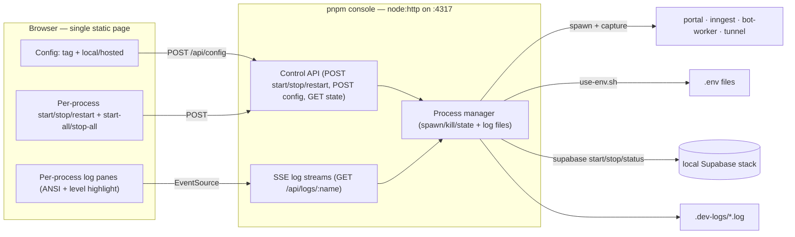

# feat: Local dev console

## Summary

A small, always-on **local web console** to run and debug the stack without
juggling terminals. You start it once (`pnpm console`), then from the browser:
set your developer tag, pick local vs hosted Supabase, start/stop/restart each
tool (Supabase, portal, Inngest, bot-worker, tunnel), and watch each one's live
logs with per-process lanes and log-level highlighting. It builds on the
existing tag/env switch (`scripts/use-env.sh`) and adds the per-process control
and persisted, browsable logs that `pnpm dev`'s single combined stream doesn't
give you. Zero build step, zero runtime dependencies — plain `node:http` +
Server-Sent Events. The CLI path (`pnpm dev`) stays as the no-UI option.

---

## Problem Frame

Running locally today means: edit/switch env, then start three or four
processes (portal, Inngest, bot-worker, tunnel) plus the Supabase stack, each in
its own terminal. `pnpm dev` improved this to one command, but its `concurrently`
stream is all-or-nothing: you can't stop and restart just the bot-worker, the
logs are interleaved into one scroll, and there's no at-a-glance state ("is
Supabase up? did Inngest crash?"). Reconfiguring (tag, local↔hosted) means
re-running the CLI.

A local control console turns the whole loop — configure → start/stop a single
tool → watch its logs → restart it — into point-and-click, which is exactly the
inner loop of local development and debugging. It's a dev tool for the two of us,
so it should be dependency-light and disposable, not a production surface.

---

## Requirements

- R1. Start the console with one command; it serves a web UI on a fixed local port and manages everything else.
- R2. Configure the **developer tag** and **Supabase mode** (local | hosted) from the UI; applying it writes the env via the existing switch.
- R3. Per-process **start / stop / restart** for: Supabase (local stack), portal, Inngest, bot-worker, cloudflared tunnel — plus **start-all / stop-all**.
- R4. Each process shows **live logs**, streamed to the browser and persisted to a log file (survives a page refresh and a console restart).
- R5. Logs render with **highlighting**: per-process lane color, ANSI colors from the process preserved, and log-level tinting (error/warn/info).
- R6. At-a-glance **state** per process (stopped / starting / running / exited[code]); the console reflects externally-changed state (e.g. Supabase already running, a port already taken).
- R7. No build step and no new runtime dependencies; the console never becomes one of the processes it manages, and it tears its children down on exit.

---

## Key Technical Decisions

### KTD1 — Zero-dependency, no-build: `node:http` + SSE

The console server is a single `node:http` server run via `tsx` (the repo's
existing way to run TypeScript scripts — bot-worker dev, the eval scripts), so
there's no build step. It serves a static HTML/CSS/JS page and exposes a small
JSON control API. **Live logs use Server-Sent Events** (`text/event-stream` +
browser `EventSource`) rather than WebSockets — log streaming is one-directional
(server → browser), SSE is built into both `node:http` and the browser with no
library, and control actions are ordinary `POST` + `fetch`. Net new runtime
dependencies: none.

### KTD2 — The console reuses the env switch, owns the processes

Configuring the tag/mode calls `scripts/use-env.sh <tag> <mode>` (single source
of truth for the env mapping — no duplicated env logic). For the processes
themselves the console does **not** shell out to `dev.sh`/`concurrently` —
that's a combined-stream, all-or-nothing runner. The console spawns and tracks
each process individually (it needs per-process control + per-process log files),
mirroring the spawn/stdio-capture pattern in
`apps/bot-worker/src/debug/sidecar-runner.ts` (and `apps/daemon/.../sidecar-runner.ts`).

### KTD3 — Process model: four spawned children + Supabase-as-commands

Portal, Inngest, bot-worker, and the tunnel are long-running foreground children
the console spawns, captures, and signals (SIGTERM → SIGKILL on stop). **Supabase
is different** — `supabase start` returns once the Docker stack is up (the
containers run in the background), so it isn't a foreground child. The console
models Supabase as an item whose **start/stop are `supabase start` / `supabase
stop` actions** and whose **state comes from `supabase status`**; its "log" pane
shows the output of those commands (and `supabase db reset` on first bring-up).
This split is the one place the five managed items aren't uniform.

### KTD4 — Logs are file-backed and live-streamed

Each process's merged stdout+stderr is appended to `.dev-logs/<name>.log`
(gitignored — `*.log` already is) **and** broadcast to any connected SSE clients.
On connect, the server sends the last N lines from the file (the tail) then
switches to live. Files persist across page refreshes and console restarts, so
logs are browsable after the fact and a crash's output isn't lost.

### KTD5 — Highlighting without a dependency

The managed processes already emit ANSI color (next dev, the Inngest CLI, etc.).
The client converts ANSI escapes → styled `<span>`s with a small hand-rolled
parser (~40 lines, the common SGR codes), layers a per-process lane color, and
applies a log-level tint by matching `error`/`warn`/level markers. No
`ansi-to-html` or syntax-highlighter dependency.

### KTD6 — The console is the parent, not a managed process; clean teardown

The console runs on its own fixed port (default `4317`, overridable) and is
explicitly excluded from the managed set. On the console process exiting (Ctrl-C
/ SIGINT), it terminates all spawned children so nothing orphans — the same
teardown contract `dev.sh` has. Start-all brings things up in order (Supabase
first in local mode, then portal, Inngest, bot-worker, tunnel-if-configured);
stop-all is the reverse. The console reconciles externally-changed state on a
light poll (port in use, `supabase status`) so a process started outside it
still reads as "running".

---

## High-Level Technical Design

### Components



### Per-process state machine

```mermaid
stateDiagram-v2
  [*] --> stopped
  stopped --> starting: start
  starting --> running: spawned / supabase up
  starting --> exited: spawn failed
  running --> stopping: stop
  stopping --> stopped: exited (signal)
  running --> exited: process died on its own
  exited --> starting: restart
  note right of running
    external reconcile: a process started
    outside the console reads as running
    (port check / supabase status)
  end
```

---

## Output Structure

```
scripts/dev-console/
  server.ts            # U2 — node:http: static serving, control API, SSE endpoints
  process-manager.ts   # U1 — spawn/kill/state, log-file append, line event emitter
  supabase-control.ts  # U3 — start/stop/status wrapper (commands, not a child)
  registry.ts          # U1 — managed-process definitions (name, command, args, cwd, order)
  public/
    index.html         # U5 — the single-page UI shell
    app.js             # U5 — config form, controls, SSE rendering, ANSI→HTML, level tint
    styles.css         # U5
test/dev-console/
  process-manager.test.ts  # U1
  ansi.test.ts             # U5 (pure ANSI→HTML parser)
  server.test.ts           # U2 (control API + SSE against fake commands)
package.json             # U7 — root "console" script
.gitignore               # U7 — .dev-logs/
docs/runbooks/two-developer-local-setup.md  # U7 — "Dev console" section
```

---

## Implementation Units

### U1. Process manager core + registry

**Goal:** A dependency-injectable manager that spawns a defined process, captures merged stdout/stderr to a log file + emits line events, tracks state, and kills cleanly. The testable heart of the console.
**Requirements:** R3, R4, R6, R7.
**Dependencies:** none.
**Files:** `scripts/dev-console/process-manager.ts`, `scripts/dev-console/registry.ts`, `test/dev-console/process-manager.test.ts`.
**Approach:** `registry.ts` exports the managed-process definitions `{ name, command, args, cwd, order }` for portal/inngest/bot-worker/tunnel (Supabase handled in U3). The manager takes a registry (injectable — tests pass harmless fake commands), and per process exposes `start()`, `stop()`, `restart()`, `state`, and an `onLine(name, cb)` subscription. `start` spawns via `node:child_process.spawn`, merges stdout+stderr, appends each line to `.dev-logs/<name>.log` (create dir if absent), and emits the line to subscribers; tracks `stopped|starting|running|exited(code)`. `stop` sends SIGTERM, then SIGKILL after a grace timeout; `restart` = stop→start. Mirror the spawn + stdio-capture + lifecycle handling in `apps/bot-worker/src/debug/sidecar-runner.ts`.
**Execution note:** Start with a failing test that spawns a trivial command and asserts captured output + state transitions, then implement.
**Patterns to follow:** `apps/bot-worker/src/debug/sidecar-runner.ts` (spawn, stdout/stderr wiring, SIGTERM/SIGKILL, close handling).
**Test scenarios:**
- Happy path: starting a fake process (`bash -c "echo hello; sleep 5"`) → state goes starting→running, the line "hello" reaches an `onLine` subscriber and is appended to `.dev-logs/<name>.log`.
- Stop: `stop()` on a running fake → SIGTERM kills it, state → stopped, no orphaned child (pid gone).
- Restart: `restart()` on a running process → it stops then a new pid starts, state ends running.
- Exit detection: a process that exits on its own (`bash -c "exit 3"`) → state → exited(3), code captured.
- Spawn failure: an unknown command → state → exited with an error line, not a thrown crash.
- Idempotent start: `start()` on an already-running process is a no-op (no second child).
**Verification:** the manager can start/stop/restart a fake process, output lands in both the subscriber and the log file, and stopping leaves no child process.

### U2. Console HTTP server (static + control API + SSE)

**Goal:** The `node:http` server that serves the page, exposes the control API, and streams logs over SSE — wiring the U1 manager.
**Requirements:** R1, R3, R4, R7.
**Dependencies:** U1.
**Files:** `scripts/dev-console/server.ts`, `test/dev-console/server.test.ts`.
**Approach:** `node:http` server on a fixed port (default `4317`, env override `DEV_CONSOLE_PORT`). Routes: `GET /` + `/app.js` + `/styles.css` (static from `public/`); `GET /api/state` (all process states as JSON); `POST /api/proc/:name/(start|stop|restart)`; `POST /api/all/(start|stop)`; `GET /api/logs/:name` (SSE — on connect, replay the file tail then stream live `onLine` events). Exclude the console itself from the managed set. No auth (localhost-only bind to `127.0.0.1`). On `SIGINT`, stop all children then exit (KTD6).
**Patterns to follow:** the daemon's SSE test helper `apps/daemon/test/_helpers/sse-response.ts` for the event-stream shape; `node:http` usage.
**Test scenarios:**
- `POST /api/proc/<fake>/start` → 200, `GET /api/state` then shows that process running.
- `GET /api/logs/<fake>` (SSE) receives the process's emitted lines as events; reconnecting replays the tail first.
- `POST /api/proc/<fake>/stop` → 200, state → stopped.
- `POST /api/all/start` starts the registry set in order; `POST /api/all/stop` stops them (reverse).
- Unknown process name → 404; malformed route → 404, server stays up.
- Server binds `127.0.0.1` only (not `0.0.0.0`).
**Verification:** against a registry of fake commands, the API starts/stops/streams correctly and the server is reachable only on localhost.

### U3. Supabase control (commands, not a child)

**Goal:** Treat Supabase as a managed item driven by `supabase start|stop|status` + capture command output as its log.
**Requirements:** R3, R4, R6.
**Dependencies:** U1, U2.
**Files:** `scripts/dev-console/supabase-control.ts`.
**Approach:** `start()` runs `supabase start` (and `supabase db reset` only when the stack was freshly started — same guard as `dev.sh`), streaming the command output into the `supabase` log + SSE; `stop()` runs `supabase stop`; `status()` shells `supabase status` (exit 0 = running). Export `GOOGLE_OAUTH_CLIENT_ID/SECRET` from the generated portal env before `supabase start` (same fix `dev.sh` carries, so local Google sign-in works). Represent Supabase in `/api/state` as running|stopped from `status()`. Only relevant in local mode (hidden/greyed in hosted mode).
**Patterns to follow:** the Supabase bring-up block in `scripts/dev.sh` (status-check, start, conditional reset, env export).
**Test scenarios:**
- `status()` maps `supabase status` exit 0 → running, non-zero → stopped (inject a fake `supabase` command).
- `start()` runs start then reset only when status was stopped first (assert reset skipped when already running).
- Command output is appended to the `supabase` log + emitted (a fake command echoing lines is captured).
- Error: `supabase` CLI absent → a clear error line in the log, state stays stopped (no crash).
**Verification:** with a fake `supabase` shim, start/stop/status drive state and stream output correctly.

### U4. Config endpoint (tag + Supabase mode → use-env.sh)

**Goal:** Apply the developer tag + Supabase mode from the UI by invoking the existing switch, and remember the selection.
**Requirements:** R2.
**Dependencies:** U2.
**Files:** `scripts/dev-console/server.ts` (route), reuse `scripts/use-env.sh` and `.dev-tag`.
**Approach:** `POST /api/config { tag, mode }` validates `mode ∈ {local,hosted}` and a sane tag, runs `scripts/use-env.sh <tag> <mode>` (which already persists `.dev-tag` and writes the active env), and returns the resulting config. `GET /api/config` returns the current tag (from `.dev-tag`) + last mode. Surface in the UI a note that applying a config change while processes run requires a restart of those processes (the env is read at boot) — the console offers a restart-affected action.
**Patterns to follow:** `scripts/use-env.sh` arg contract (`[tag] <local|hosted>`), its no-secret-echo rule.
**Test scenarios:**
- `POST /api/config {tag:'nathan',mode:'local'}` → runs use-env.sh, `.dev-tag` becomes `nathan`, portal `.env.local` shows the local Supabase URL + `dev-nathan` origin.
- Invalid mode → 400, no env write.
- `GET /api/config` returns the remembered tag.
- The response contains no secret values (no key material echoed).
**Verification:** changing tag/mode in the UI rewrites the env via the same script the CLI uses.

### U5. Frontend — config, controls, log panes, highlighting

**Goal:** The single static page: config form, per-process control grid with state, start-all/stop-all, and a live log pane per process with ANSI + level highlighting.
**Requirements:** R2, R3, R4, R5, R6.
**Dependencies:** U2, U4.
**Files:** `scripts/dev-console/public/index.html`, `public/app.js`, `public/styles.css`, `test/dev-console/ansi.test.ts`.
**Approach:** Vanilla JS. On load, `GET /api/state` + `/api/config` to render the tag/mode form and a row per managed process (state badge + start/stop/restart). Buttons `POST` the control routes; an `EventSource` per visible log pane renders incoming lines. A small pure ANSI→HTML function (extracted so it's unit-testable) converts SGR escapes to `<span>` styles; the renderer adds a per-process lane color and a level tint (error → red-ish row, warn → amber) by matching common markers. State refreshes on a light interval. Keep the layout simple: a config bar on top, a process grid, and an expandable log pane per process (or a tabbed log area).
**Patterns to follow:** the portal's semantic Tailwind tokens are NOT available here (no build) — use plain CSS with a small dark palette consistent with the app's look; mirror the log-level coloring intent from the live-mic debug page conceptually.
**Test scenarios:**
- ANSI parser (pure): a string with SGR color codes → the expected `<span style>` segments; a plain string → escaped text, no spans; an unтерminated/па partial escape → handled without throwing.
- ANSI parser: HTML-escapes `<`, `>`, `&` in log text so log content can't inject markup.
- Level tint (pure helper): lines containing `error`/`ERROR` classify as error, `warn` as warn, else info.
- (Manual) the page renders state, buttons drive the API, and log panes stream live.
**Verification:** opening the console shows live state + logs, the controls work, and logs are readable with color.

### U6. Orchestration polish: ordering, teardown, reconciliation

**Goal:** Start-all/stop-all ordering, console-exit teardown, and external-state reconciliation.
**Requirements:** R6, R7.
**Dependencies:** U1, U2, U3.
**Files:** `scripts/dev-console/server.ts`, `scripts/dev-console/process-manager.ts`.
**Approach:** Start-all uses the registry `order` (Supabase first in local mode, then portal/inngest/bot-worker, tunnel last if its config exists); stop-all reverses it. On `SIGINT`/`SIGTERM` to the console, stop all spawned children (await SIGTERM, then exit) so nothing orphans. A light reconcile loop marks a process "running" when its port is already bound (e.g. portal on :3000) or `supabase status` is up, so processes started outside the console (or surviving a console restart) read correctly.
**Patterns to follow:** `dev.sh` teardown (`concurrently --kill-others` intent) and its Supabase status-check.
**Test scenarios:**
- Start-all on a fake registry starts in `order`; stop-all stops in reverse.
- Console SIGINT → all fake children receive termination (no orphans left).
- Reconcile: a fake "already bound" port → that process reads running without the console having started it.
- Tunnel with no config present → excluded from start-all (no spurious failure).
**Verification:** start-all/stop-all behave in order, Ctrl-C on the console leaves nothing running, and externally-up processes show as running.

### U7. Wire-up: `pnpm console`, gitignore, runbook

**Goal:** One command to launch it, ignore the logs, and document it.
**Requirements:** R1, R7.
**Dependencies:** U2–U6.
**Files:** root `package.json` (`"console"` script via `tsx`), `.gitignore` (`.dev-logs/`), `docs/runbooks/two-developer-local-setup.md` (a "Dev console" section).
**Approach:** Add `"console": "tsx scripts/dev-console/server.ts"` to the root scripts. Add `.dev-logs/` to `.gitignore` (belt-and-suspenders over `*.log`). Document the workflow in the runbook: `pnpm console` → open `http://localhost:4317` → set tag + mode → start/stop/monitor; note it's the UI counterpart to `pnpm dev`, and that applying a config change restarts the affected processes.
**Patterns to follow:** existing root `package.json` script style; the runbook's structure.
**Test scenarios:** Test expectation: none — wiring + docs. Verify `pnpm console` boots the server and the runbook steps are accurate.
**Verification:** `pnpm console` serves the page; the runbook walks a new developer through using it.

---

## Scope Boundaries

### Deferred to Follow-Up Work
- **Auth / non-localhost exposure.** The console binds `127.0.0.1` and has no auth; exposing it (e.g. through a tunnel for remote pairing) would need access control — out of scope.
- **Editing individual env values from the UI.** The console sets tag + Supabase mode (via `use-env.sh`); editing arbitrary secrets in `.env.dev` stays a text-editor task.
- **Log search / filtering / download UI.** Live tail + file persistence only; a search box or per-line filtering is a later nicety (the files are on disk for `grep` meanwhile).
- **Managing the audio sidecar or other one-off tools.** The five named processes only.

### Out of scope (non-goals)
- Replacing `pnpm dev` — the CLI runner stays as the no-UI path.
- Any production surface, deployment, or the app's own features.
- Cross-machine / remote process control.

---

## Risks & Open Questions

- **Spawned-process environment.** Children must inherit the right cwd + env (e.g. the bot-worker reads `apps/bot-worker/.env` via `tsx --env-file`; the portal reads `.env.local`). The manager spawns with the repo root context the CLI uses; verify each child boots identically to how `pnpm --filter … dev` does from a terminal.
- **`npx inngest-cli@latest dev`** does a network fetch on first run and is slow to settle; the console should show it as "starting" until it's actually serving, not assume running-on-spawn.
- **Port reconciliation accuracy.** Treating "port bound" as "running" can mislabel a *different* process on that port. Pair the port check with ownership where cheap (pid match) or clearly label it as "port in use".
- **SIGINT teardown vs. detached children.** `pnpm --filter` and `npx` wrap the real process; killing the wrapper must also kill the grandchild (process group / `detached` + negative-pid kill) so nothing orphans — the same care `dev.sh` needs.
- **Console restart loses live subscriptions but not logs.** Files persist; in-memory state resets. On restart the reconcile loop must re-detect already-running processes (it can't re-attach to their stdout, so their live log resumes only for new lines appended by… nothing — a spawned child whose parent died keeps running but its output is lost). Document that stop-all before quitting the console is the clean path; reconciliation covers the "left them running" case for state only.

---

## Sources & Research

- Process commands + ordering + Supabase bring-up: `scripts/dev.sh`; env switch contract: `scripts/use-env.sh` + `.dev-tag`.
- Spawn + stdio capture + SIGTERM/SIGKILL lifecycle: `apps/bot-worker/src/debug/sidecar-runner.ts`, `apps/daemon/src/audio/ipc/sidecar-runner.ts`.
- SSE shape reference: `apps/daemon/test/_helpers/sse-response.ts`.
- Ports / process list / footguns: `docs/runbooks/local-dev-processes.md`, `docs/runbooks/two-developer-local-setup.md`.
- `tsx` script-run convention + root scripts: root `package.json`, `apps/bot-worker/package.json` (`tsx --env-file`).
- `*.log` already gitignored: `.gitignore`.
