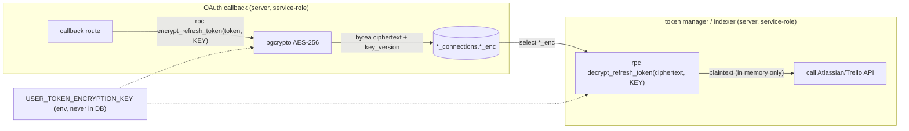
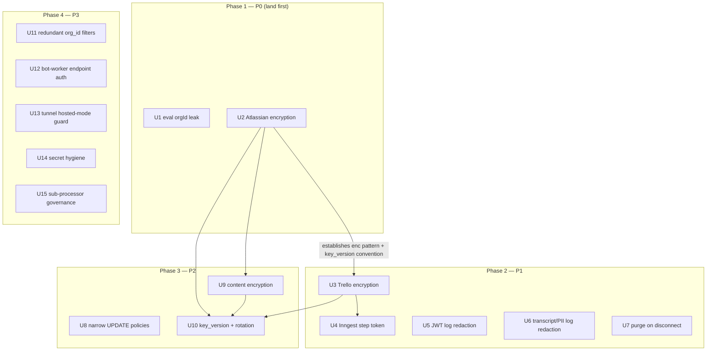

# fix: Security remediation — credentials, isolation, encryption (P0–P3)

## Summary

A four-surface security audit (credential storage, multi-tenant isolation, secret/PII handling, customer-content protection) of the Risezome multi-tenant SaaS found one confirmed cross-tenant data leak, two plaintext third-party OAuth token stores, two classes of secret/PII leaking into logs, a retention gap, and several hardening items. This plan remediates all 15 findings (P0–P3), grouped by surface, and adds a regression/RLS test for each so it cannot recur.

The product connects to customers' GitHub repos, Jira/Confluence, and Trello, and stores their access tokens plus ingested code/doc/transcript content. The bar the work is held to: **every credential encrypted at rest, every tenant boundary enforced server-side, and no secret or customer content in logs** — using only vetted, industry-standard cryptography.

The remediation does **not** change product behavior, the retrieval architecture, or the OAuth flows themselves (which the audit verified are correct: signed webhooks, single-use CSRF state, alg-pinned JWTs).

---

## Problem Frame

The codebase already established the correct credential-protection primitive — `pgcrypto` `pgp_sym_encrypt` (OpenPGP/AES-256) with an env-supplied key, in `supabase/migrations/20260530100000_user_google_tokens.sql` — but applied it to exactly one secret (the Google refresh token). Later token stores (Atlassian, Trello) regressed to plaintext, customer content is plaintext, and two debug/log paths leak secrets and transcripts. One authz path trusts client-supplied `orgId` over the verified JWT.

The fixes are mostly **consistency** work: extend the existing vetted pattern to the surfaces that skipped it, close the authz hole, and stop logging secrets/PII. No new cryptography is invented.

---

## Requirements (finding trace)

Each finding from the audit is a requirement. Severity drives sequencing (Phase 1 = P0, etc.).

| Req | Sev | Finding | Surface |
|-----|-----|---------|---------|
| **S1** | P0 | Eval `/run` prefers client `orgId` over JWT org → cross-tenant corpus leak | Authz/isolation |
| **S2** | P0 | Atlassian access+refresh tokens plaintext at rest | Token encryption |
| **S3** | P1 | Bot-worker WS-auth JWT logged verbatim (→ browser stream + disk) | Log redaction |
| **S4** | P1 | Full customer transcripts logged plaintext | Log redaction (PII) |
| **S5** | P1 | Trello token plaintext at rest | Token encryption |
| **S6** | P1 | Plaintext token leaks into Inngest memoized step state | Token encryption |
| **S7** | P1 | Source disconnect never purges ingested content/embeddings | Retention/purge |
| **S8** | P2 | Non-column-scoped client `UPDATE` on `cards` (and vestigial `gaps`) | Authz/isolation |
| **S9** | P2 | No column-level encryption on customer content | Content encryption |
| **S10** | P2 | Single static encryption key, no rotation path | Key management |
| **S11** | P3 | Service-role corpus reads omit redundant `org_id` filter | Authz/isolation (defense-in-depth) |
| **S12** | P3 | Public dev tunnel can expose a `hosted`-mode local stack | Dev-tooling hardening |
| **S13** | P3 | Unauthenticated bot-worker `POST /meetings/:id/end` | Authz/isolation |
| **S14** | P3 | Voyage + Anthropic data egress undisclosed as sub-processors | Governance |
| **S15** | P3 | Stale `.env*.bak` secret duplicates + live secrets in `.dev-logs/` | Secret hygiene |
| **S16** | —  | No single security-posture doc describing how we protect our infra + customer data | Governance |

---

## Key Technical Decisions

### KTD1 — Industry-standard cryptography only; never roll our own
All encryption reuses vetted, audited libraries — no hand-written ciphers, key derivation, or comparison routines.
- **At the DB layer:** reuse the existing generic `public.encrypt_refresh_token(plaintext, key)` / `public.decrypt_refresh_token(ciphertext, key)` helpers, which wrap `extensions.pgp_sym_encrypt`/`pgp_sym_decrypt` — `pgcrypto`'s OpenPGP symmetric encryption with `cipher-algo=aes256` (AES-256). These helpers are not Google-specific (verified: `user_google_tokens.sql:44-64`); every new encrypted column uses them. We do **not** write new SQL crypto.
- **At the app layer:** any non-DB crypto uses Node's `node:crypto` (OpenSSL-backed) — already the pattern for webhook HMAC (`timingSafeEqual`) and CSRF `randomBytes`. No custom primitives.
- **Constant-time comparison:** all secret/MAC comparisons use `crypto.timingSafeEqual`, never `===`.
- **Key management:** the symmetric key stays env-supplied (`USER_TOKEN_ENCRYPTION_KEY`) for now — the DB never stores it, so a dump alone is inert. The plan adds a `key_version` column to every encrypted column and documents a re-wrap rotation procedure; migrating to a KMS/Vault envelope key (the industry-standard upgrade) is recorded as deferred operational work, not invented here. Rationale for staying on pgcrypto over Supabase Vault now: Vault's RLS/revocation maturity concerns documented at `user_google_tokens.sql:10-13`.

### KTD2 — Encrypt non-searched content; document the searched-column exception
`doc_chunks.text` backs a generated-tsvector FTS index and feeds HNSW vector search — encrypting it breaks both, and embeddings cannot be both encrypted and similarity-searchable. So content encryption (S9) targets the **high-sensitivity, non-searched** columns only: meeting transcripts (`meeting_events.payload`), `syntheses.accumulated_text`, `meetings.recap_text`. For the searched columns we record an explicit, signed-off "disk-level encryption only, because searchability" decision in `docs/solutions/` so the residual is deliberate, not a silent gap.

### KTD3 — Server-side org is the only source of truth
Tenant boundary decisions never trust client-supplied identifiers. The JWT-/session-derived org is authoritative; any client-supplied `orgId` is dropped (S1) or treated as untrusted. Service-role queries that operate on client-supplied ids re-assert `org_id` (S11) even when an upstream RPC already scoped them (defense-in-depth per the `apps/bot-worker/src/db.ts` convention).

### KTD4 — Optimistic-concurrency guards must not compare ciphertext
`pgp_sym_encrypt` is non-deterministic (random session key per call), so two encryptions of the same plaintext differ. Any update guard currently matching on a token value (e.g. `atlassian-token.ts` `.eq('refresh_token', …)`) must switch to a non-secret discriminator — `expires_at` or a monotonic `token_version` column — after the column is encrypted.

### KTD5 — Reversible, low-risk migrations (pre-launch)
Pre-launch with low data volume, so encryption migrations may transform existing rows in-place within the migration (decrypt-nothing; the few existing plaintext rows are encrypted via an `UPDATE … SET col_enc = encrypt_refresh_token(col, current_setting(...))` step, or simply truncated/re-authed if simpler and acceptable). Each migration drops the plaintext column in the same migration so no plaintext lingers. Migrations are applied via `supabase db push` (hosted) / `supabase db reset` (local).

---

## High-Level Technical Design

### Token encryption data flow (applies to Atlassian S2, Trello S5; mirrors Google)

The key never touches the DB; a dump yields only `bytea` ciphertext. The plaintext exists only transiently in the server process during an API call and is never logged (S3/S4 redaction enforces this).

### Phase sequencing and dependencies

---

## Implementation Units

> Units are grouped into phases by severity. The pgcrypto-pattern units (U2 → U3 → U9) are sequenced so U2 establishes the reusable approach (including the `key_version` column convention) that the others mirror. U10 (rotation procedure) lands after the encrypted columns exist.

### Phase 1 — P0 (land first)

### U1. Close cross-tenant corpus leak in eval `/run`

**Goal:** The eval debug endpoint can only ever query the caller's own org corpus; the client cannot override the org.
**Requirements:** S1.
**Dependencies:** none.
**Files:** `apps/bot-worker/src/debug/eval-routes.ts` (drop the `req.body.orgId` override at ~:111; remove `orgId` from the request `Body` type), `apps/portal/app/api/debug/eval/route.ts` (stop forwarding `orgId` in the proxied body, ~:54), `apps/bot-worker/test/debug/eval-routes.test.ts` (new or existing test file under `apps/bot-worker/test/`).
**Approach:** Always use the JWT-derived `a.orgId` as the org for `evaluateQuestion`. Delete the body field end-to-end so it is not even parsed. The JWT already binds the org (verified at the route boundary); the body field is pure attack surface. Per KTD3, server-derived org is the only source of truth.
**Patterns to follow:** the JWT-derivation already present in `eval-routes.ts` (`a.orgId` from the verified token); the org-trust pattern in the live WS path (`apps/bot-worker/src/index.ts` using `payload.orgId`).
**Test scenarios:**
- A request whose JWT is for org A but whose body contains `orgId: <org-B>` runs the eval against **org A** (assert the org passed to `evaluateQuestion`/search is A, never B). This is the core regression.
- A request with no `orgId` in the body still works (uses JWT org).
- The portal proxy (`api/debug/eval/route.ts`) no longer includes `orgId` in the forwarded body (assert the outbound payload shape).
**Verification:** No code path reads org from request input; a crafted cross-org body cannot retrieve another org's chunks. Existing eval behavior for the legitimate same-org case is unchanged.

### U2. Encrypt Atlassian access + refresh tokens at rest

**Goal:** Atlassian tokens are stored as `pgcrypto` ciphertext; a DB dump yields no usable credential without the env key.
**Requirements:** S2 (also advances KTD1, KTD4).
**Dependencies:** none (establishes the pattern U3/U9 reuse).
**Files:** new migration `supabase/migrations/<ts>_encrypt_atlassian_tokens.sql`; `apps/portal/app/api/atlassian/callback/route.ts` (write path ~:75-76); `apps/portal/app/_lib/atlassian-token.ts` (read path + the `:107` concurrency guard); `apps/portal/test/rls/atlassian-sources.test.ts` (extend).
**Approach:**
- Migration: add `access_token_enc bytea`, `refresh_token_enc bytea`, and `token_version int not null default 0` to `atlassian_connections`; encrypt any existing rows in-place via `encrypt_refresh_token(col, current_setting('...key...'))` (or accept re-auth — see KTD5); drop the plaintext `access_token` / `refresh_token` columns in the same migration. RLS stays no-policy (service-role only) — unchanged.
- Write path: encrypt via `service.rpc('encrypt_refresh_token', { plaintext, key })` before upsert (mirror `apps/portal/app/api/auth/callback/route.ts` Google pattern); pass the env key, never log it.
- Read path: decrypt via `service.rpc('decrypt_refresh_token', { ciphertext, key })` in `readConnection`/`doRefresh` (mirror `apps/portal/app/_lib/google-token.ts`).
- **KTD4:** replace the optimistic-concurrency guard at `atlassian-token.ts:107` (`.eq('refresh_token', conn.refresh_token)`) — ciphertext is non-deterministic — with a guard on `token_version` (increment on each refresh) or `expires_at`.
**Patterns to follow:** `supabase/migrations/20260530100000_user_google_tokens.sql` (column shape + helpers), `apps/portal/app/api/auth/callback/route.ts` + `apps/portal/app/_lib/google-token.ts` (encrypt-on-write / decrypt-on-read).
**Execution note:** Add the failing RLS/storage test first (assert no plaintext token column exists), then migrate + wire the code.
**Test scenarios:**
- Schema: `atlassian_connections` has no `access_token`/`refresh_token` text column; `*_enc` are `bytea`. (Covers S2.)
- Round-trip: a token written via the callback path decrypts back to the original value through the read path (using a test key).
- Concurrency guard: a refresh updates `token_version` and the guarded update matches on it, not on token bytes (two encryptions of the same plaintext differ — assert the guard still works).
- No member-readable RLS policy on the table (service-role only).
- No decrypted token value appears in any thrown error or log line on the refresh path.
**Verification:** Atlassian connect + a subsequent token refresh both work end-to-end against a local stack; the stored columns are ciphertext; the concurrency guard no longer depends on token equality.

### Phase 2 — P1

### U3. Encrypt Trello token at rest

**Goal:** The Trello org token is stored as ciphertext, mirroring U2.
**Requirements:** S5 (advances KTD1).
**Dependencies:** U2 (reuses the established pattern + `token_version` convention).
**Files:** new migration `supabase/migrations/<ts>_encrypt_trello_token.sql`; write path `apps/portal/app/api/trello/connect/route.ts`; read paths `apps/portal/src/inngest/functions/index-trello.ts`, `apps/bot-worker/src/skills/trello/source-resolver.ts`, `apps/portal/app/(authed)/sources/trello-select-action.ts`; `apps/portal/test/rls/trello-sources.test.ts` (extend).
**Approach:** Add `token_enc bytea` (+ `token_version int default 0` if a guard is needed), encrypt existing rows, drop plaintext `token`. Encrypt on write; decrypt on each read site via `decrypt_refresh_token`. The bot-worker reads under service-role and calls the same RPC. RLS unchanged (no-policy).
**Patterns to follow:** U2; `apps/bot-worker/src/db.ts` org-scoping convention for the bot-worker read.
**Test scenarios:**
- Schema: no plaintext `token` column; `token_enc` is `bytea`.
- Round-trip through `connect` → `index-trello` read.
- The bot-worker `source-resolver` decrypts and uses the token (mock the Trello client; assert it receives the decrypted value, never the ciphertext).
- No member-readable RLS policy.
**Verification:** Trello connect + indexing + bot-worker resolution all succeed; stored token is ciphertext.

### U4. Stop leaking the Trello token into Inngest memoized step state

**Goal:** The Trello token never appears in an Inngest step's persisted return value.
**Requirements:** S6.
**Dependencies:** U3.
**Files:** `apps/portal/src/inngest/functions/index-trello.ts` (the `load-source` `step.run` at ~:67).
**Approach:** Inngest memoizes and persists each `step.run` return value as run state (a second at-rest copy outside our DB and redaction layer). Change `load-source` to return only the non-secret `connection_id`/`boardId`; re-read and decrypt the token inside the step that actually calls Trello (non-memoized, or memoize only the non-secret result). Never return plaintext (or even ciphertext) from a memoized step.
**Patterns to follow:** other Inngest functions in `apps/portal/src/inngest/functions/` that resolve secrets at call time.
**Test scenarios:**
- The `load-source` step's return value contains no `token`/secret field (assert the returned object shape).
- The function still successfully indexes (the token is resolved where the Trello call happens).
**Verification:** Inspecting an Inngest run's step output shows no token; indexing still works.

### U5. Redact the WS-auth JWT from bot-worker request logs

**Goal:** The `BOT_WORKER_SECRET` JWT (carried in the URL path) never appears in any log line, browser stream, or on-disk log.
**Requirements:** S3.
**Dependencies:** none.
**Files:** `apps/bot-worker/src/index.ts` (Fastify logger config ~:142); a new `apps/bot-worker/test/log-redaction.test.ts` (or extend an existing logging test).
**Approach:** Configure Fastify with `disableRequestLogging: true`, or supply a `req` serializer that strips the JWT path segment (and any token query param) from `req.url` before logging. Keep useful request logging (method, route template, status) without the token. Defense-in-depth (record as a follow-up, not required here): move the token from the URL path into a `Sec-WebSocket-Protocol`/`Authorization` header where Recall supports it — URLs are the worst place for bearer tokens. The one-time scrub of the existing `.dev-logs/bot-worker.log` is handled in U14.
**Patterns to follow:** the existing connector log-redaction helper `apps/bot-worker/src/skills/github/log-redaction.ts` (redaction approach + the set of sensitive keys).
**Test scenarios:**
- An incoming request to `/recall/:meetingId/<jwt>` (or `/local-debug/<jwt>`) produces **no** log line containing the token substring (capture the logger output; assert the JWT is absent). Core regression.
- Normal request metadata (method, route) is still logged (so we didn't blind ourselves).
**Verification:** Driving a WS-auth request emits logs with no JWT; the dev-console stream and `.dev-logs/bot-worker.log` no longer receive tokens.

### U6. Redact verbatim customer transcripts from logs

**Goal:** Spoken customer transcript bodies are not written to logs by default; only IDs/metadata are.
**Requirements:** S4.
**Dependencies:** none.
**Files:** the bot-worker logging sites that emit `rawUtterance` / `effectiveUtterance` / `text` (search `apps/bot-worker/src/` — likely `index.ts`, the pipeline/adapter, and any retrieval debug logs); a test under `apps/bot-worker/test/`.
**Approach:** Replace utterance-body fields in log payloads with `utteranceId`, length, and `traceId`. Gate any verbatim-text logging behind an explicit, off-by-default local flag (e.g. `LOG_TRANSCRIPTS=1`) so it is never on in production. Audit `portal.log` / `inngest.log` paths similarly for doc/code bodies and apply the same rule where found.
**Patterns to follow:** the level/flag-gating already used for local debug in the bot-worker; the redaction helper in `apps/bot-worker/src/skills/github/log-redaction.ts`.
**Test scenarios:**
- An utterance log entry contains `utteranceId`/length but **not** the verbatim `text` (assert the body string is absent) when the flag is unset. Core regression.
- With the local flag set, verbatim text may appear (assert the flag gate works both ways).
**Verification:** A meeting run produces logs with no transcript bodies by default; `.dev-logs/bot-worker.log` no longer accumulates spoken content.

### U7. Purge ingested content + embeddings on source disconnect

**Goal:** Disconnecting a source (GitHub uninstall, Trello/Atlassian disconnect) deletes the org's ingested content and embeddings; nothing is retained as an orphan.
**Requirements:** S7.
**Dependencies:** none.
**Files:** `apps/portal/app/api/github/webhook/route.ts` (uninstall handler ~:164-173); the Trello/Atlassian disconnect action(s) under `apps/portal/app/(authed)/sources/`; possibly a new Inngest cleanup function under `apps/portal/src/inngest/functions/`; a reconcile sweep (scheduled Inngest function) for stale `status='removed'`; tests under `apps/portal/test/`.
**Approach:** On uninstall/disconnect, delete the `sources` row(s) for that installation/connection — the `on delete cascade` from `docs`/`doc_chunks`/`corpus_chunk_embeddings` keyed on `source_id` then purges the content + embeddings (verify the cascade chain in the corpus migrations). Keep a minimal tombstone/audit record if needed, but the **content** must go. Add a scheduled reconcile that purges content for any `sources.status='removed'` older than N days (covers rows soft-flagged before this change and any future soft-flag path). Do the deletion via an Inngest job (so a slow purge doesn't block the webhook) keyed on the trusted installation/connection id.
**Patterns to follow:** existing Inngest functions for indexing (`apps/portal/src/inngest/functions/`); the org-scoping in `apps/portal/app/(authed)/sources/*-action.ts`.
**Test scenarios:**
- After a GitHub uninstall webhook, the `sources` row is deleted and its `docs`/`doc_chunks`/`corpus_chunk_embeddings` are gone (assert zero rows by `source_id`). Core regression.
- Trello/Atlassian disconnect similarly purges that source's content.
- The reconcile sweep deletes content for a `status='removed'` source older than the threshold and leaves recent/active sources untouched.
- Deletion is org-scoped — disconnecting org A's source does not touch org B's content.
**Verification:** Disconnect → the org's indexed code/docs and embeddings are removed; no orphaned content remains; an active org's content is unaffected.

### Phase 3 — P2

### U8. Narrow client `UPDATE` policies on `cards` (and remove vestigial `gaps`)

**Goal:** Meeting participants can no longer PATCH arbitrary columns; pin/confirm/dismiss go only through org-checked service-role actions.
**Requirements:** S8.
**Dependencies:** none.
**Files:** new migration `supabase/migrations/<ts>_drop_client_update_policies.sql` (drop the two policies from `20260603330000_visibility_and_config_rls.sql:46,65`); verify the existing server actions (`card-actions-server.ts`, the gap confirm/dismiss actions) already cover the behavior; `apps/portal/test/rls/visibility.test.ts` (extend).
**Approach:** RLS cannot restrict *which columns* an UPDATE touches, so a `for update using (is_meeting_participant(...))` policy lets a participant rewrite any column. Drop both client UPDATE policies; route pin/confirm/dismiss exclusively through the existing service-role actions, which already filter `.eq('org_id', orgId)`. Confirm migration ordering: the `gaps` table is dropped entirely by `20260606020000_knowledge_gaps.sql` — if a fully-migrated DB no longer has `gaps`, only the `cards` policy needs removal (the migration should `drop policy if exists` defensively).
**Patterns to follow:** `knowledge_gaps` deliberately has no client UPDATE policy (`20260606030000_knowledge_gaps_rls.sql:58-65`); `pinCardAction` / `pinSynthesisAction` org-checked write pattern.
**Test scenarios:**
- A meeting participant cannot UPDATE `cards` directly via the client (PostgREST) — the policy is gone, the update is denied. Core regression (matches the saved learning `rls-no-client-update-when-service-role-writes`).
- Pin/confirm/dismiss still work through the server action (behavior preserved).
- `drop policy if exists` is idempotent against a DB where `gaps` was already dropped.
**Verification:** No client UPDATE path on `cards`; pin/confirm/dismiss unchanged for users.

### U9. Encrypt high-sensitivity customer content columns

**Goal:** Meeting transcripts, syntheses, and recaps are encrypted at rest; the searched-column exception is documented.
**Requirements:** S9 (advances KTD1, KTD2).
**Dependencies:** U2 (pattern).
**Files:** new migration `supabase/migrations/<ts>_encrypt_content_columns.sql` covering `meeting_events.payload` (transcripts), `syntheses.accumulated_text`, `meetings.recap_text`; the read/write sites for those columns (bot-worker summarizer/synthesis writers; portal readers — search by column name); a new `docs/solutions/<date>-content-encryption-at-rest.md` recording KTD2; tests under `apps/portal/test/` and/or `apps/bot-worker/test/`.
**Approach:** Add `*_enc bytea` (+ `key_version`) alongside each target column, encrypt on write / decrypt on read via the same helpers, drop the plaintext column. `meeting_events.payload` is `jsonb` — encrypt the serialized JSON to `bytea` and decrypt+parse on read (decide whether the whole payload or only the transcript sub-fields are sensitive; prefer encrypting the whole payload if it is transcript-only). Per KTD2, do **not** touch `doc_chunks.text` (FTS) or embeddings; instead write the `docs/solutions/` decision record stating those rely on disk-level encryption because of searchability, so the residual is deliberate.
**Patterns to follow:** U2 encrypt/decrypt wiring; `docs/solutions/` doc format (frontmatter + Why/How per the repo's learning convention).
**Execution note:** Characterize current read/write behavior of each content column before changing storage, so the migration + code change preserves the exact round-trip.
**Test scenarios:**
- Schema: `meeting_events.payload` / `syntheses.accumulated_text` / `meetings.recap_text` plaintext columns are gone; `*_enc` are `bytea`.
- Round-trip: a transcript written through the bot-worker path decrypts to the same content on the portal read path.
- A synthesis and a recap round-trip correctly.
- The `docs/solutions/` decision record exists and names the searched columns left disk-only. (`Test expectation: none` for the doc itself — verified by presence.)
**Verification:** Transcripts/syntheses/recaps are ciphertext at rest and render correctly in the app; FTS/vector search still works (untouched); the disk-only exception is documented.

### U10. Add `key_version` + a documented re-wrap rotation procedure

**Goal:** Encryption keys can be rotated without re-auth, and the procedure is documented.
**Requirements:** S10 (advances KTD1 key-management).
**Dependencies:** U2, U3, U9 (the encrypted columns + their `key_version`).
**Files:** a new migration providing a re-wrap function `supabase/migrations/<ts>_token_key_rotation.sql` (decrypt-with-old-key, re-encrypt-with-new-key, bump `key_version`), parameterized so it runs as an operational job; `docs/runbooks/encryption-key-rotation.md`; optional test under `apps/portal/test/rls/`.
**Approach:** With `key_version` already on every encrypted column (added in U2/U3/U9), implement a re-wrap procedure: for each row, `decrypt_refresh_token(col_enc, OLD_KEY)` → `encrypt_refresh_token(plaintext, NEW_KEY)`, set `key_version = N+1`. Document running it (old+new key both supplied transiently, never stored) and the rollback. Migrating to a KMS/Vault envelope key is recorded as **deferred** operational work (KTD1), not built here.
**Patterns to follow:** the helper-call pattern from U2; runbook format under `docs/runbooks/`.
**Test scenarios:**
- A row encrypted under key v0 is re-wrapped to key v1 and still decrypts under the new key (and no longer under the old). Core behavior.
- Re-wrap is idempotent / skippable for rows already at the target `key_version`.
**Verification:** A dry-run rotation over a test table re-encrypts rows and bumps `key_version`; the runbook steps are accurate.

### Phase 4 — P3

### U11. Add redundant `org_id` filters to service-role corpus reads

**Goal:** Every service-role corpus read re-asserts `org_id`, per the `db.ts` convention — defense-in-depth so a future caller can't turn a leak into full disclosure.
**Requirements:** S11 (advances KTD3).
**Dependencies:** none.
**Files:** `apps/bot-worker/src/corpus-search.ts` (~:201-204), `apps/bot-worker/src/corpus-eval.ts` (~:251-254, :267, :279); test under `apps/bot-worker/test/`.
**Approach:** Add `.eq('org_id', orgId)` to the `doc_chunks`/`docs` reads that currently filter only by id. Thread the (already-verified) org through to these helpers. Currently safe because the ids come from org-scoped RPCs; this makes it robust regardless of id provenance and satisfies the `apps/bot-worker/src/db.ts:9-12` "every call must filter by org_id" rule.
**Patterns to follow:** `apps/bot-worker/src/db.ts` convention; org-scoped reads elsewhere in the bot-worker.
**Test scenarios:**
- A corpus read for org A with a chunk id that belongs to org B returns nothing (the `org_id` filter excludes it). Core regression.
- Normal same-org reads still return their chunks.
**Verification:** Every `doc_chunks`/`docs` service-role read carries an `org_id` filter; same-org retrieval is unchanged.

### U12. Authenticate the bot-worker `POST /meetings/:id/end` endpoint

**Goal:** The meeting-end control endpoint requires a valid `BOT_WORKER_SECRET` credential.
**Requirements:** S13.
**Dependencies:** none.
**Files:** `apps/bot-worker/src/index.ts` (the `/meetings/:id/end` route ~:151); the portal caller `notifyBotWorkerEnd` (search `apps/portal/`); test under `apps/bot-worker/test/`.
**Approach:** Require the same `BOT_WORKER_SECRET` JWT the WS routes use (or a shared header secret compared with `crypto.timingSafeEqual` per KTD1) on `/meetings/:id/end`; have `notifyBotWorkerEnd` send it. Reject unauthenticated calls with 401. Cheap closure of an unauthenticated state-mutating endpoint that is internet-reachable over the tunnel.
**Patterns to follow:** the WS-upgrade JWT verification in `apps/bot-worker/src/jwt.ts` + `index.ts`; `timingSafeEqual` usage in `apps/portal/app/api/github/webhook/route.ts`.
**Test scenarios:**
- An unauthenticated `POST /meetings/:id/end` is rejected (401). Core regression.
- A correctly-signed/secret-bearing request succeeds and ends the meeting.
- A wrong/forged secret is rejected; comparison is constant-time.
**Verification:** The endpoint requires auth; the portal's legitimate end-notification still works.

### U13. Guard the dev tunnel against exposing a `hosted`-mode stack

**Goal:** The cloudflared tunnel refuses to expose a stack backed by a real hosted database unless explicitly acknowledged.
**Requirements:** S12.
**Dependencies:** none.
**Files:** `scripts/ensure-tunnel.sh`, `scripts/dev.sh`, `scripts/dev-console/` (the start path that runs ensure-tunnel), `docs/runbooks/two-developer-local-setup.md`; tests under `test/` (e.g. extend `test/ensure-tunnel.test.ts` / `test/dev-orchestrator.test.ts`).
**Approach:** When the active Supabase mode is `hosted`, refuse to bring up the tunnel unless an explicit opt-in flag is set (e.g. `--tunnel-hosted-i-understand` / an env ack), since the tunnel publishes `localhost:3000`/`:8787` to the internet backed by real data. Document the exposure clearly and recommend Cloudflare Access (auth in front of the tunnel hostname) as the hardening path. Local/seed mode is the intended tunnel use.
**Patterns to follow:** the existing mode handling in `scripts/use-env.sh` / `scripts/dev.sh`; the tunnel-skip logic already in `scripts/dev-console/registry.ts` / `process-manager.ts`.
**Test scenarios:**
- `ensure-tunnel`/dev-console start in `hosted` mode without the ack flag does not start the tunnel and prints the exposure warning. Core regression.
- `local` mode starts the tunnel normally.
- `hosted` + ack flag starts the tunnel (escape hatch works).
**Verification:** Hosted-mode tunnel exposure requires explicit acknowledgement; runbook documents the risk.

### U14. Immediate secret hygiene: delete `.env*.bak`, scrub `.dev-logs`, document secret sourcing

**Goal:** Live secrets duplicated on disk are removed, and the practice that created them is discouraged.
**Requirements:** S15 (and the one-time cleanup for S3/S4).
**Dependencies:** none (but the scrub is more durable after U5/U6 stop new leaks).
**Files:** delete `apps/portal/.env.local.bak`, `apps/bot-worker/.env.bak` (and any other `*.bak`); truncate/scrub `.dev-logs/*.log` (contains live JWTs + transcripts); `docs/runbooks/two-developer-local-setup.md` (note: source dev secrets from a manager / `op run`; never `sed -i.bak` env files); confirm `.gitignore` already covers `*.bak` + `.dev-logs/` (it does).
**Approach:** One-time operational cleanup. Delete the `.bak` duplicates (pure copies of live secrets — gitignored, never committed, but live on disk). Truncate the `.dev-logs` files that hold leaked JWTs/transcripts. Add a runbook note steering devs away from on-disk `.env` duplication toward a secret manager; recommend the production `USER_TOKEN_ENCRYPTION_KEY` be distinct from any value present in dev `.env` files (so a dev-machine compromise doesn't yield the prod key). No application code change.
**Patterns to follow:** existing `.gitignore` entries; the runbook's "Never commit" footgun section.
**Test scenarios:** `Test expectation: none` — operational cleanup + docs. Verify the `.bak` files are gone, `.dev-logs` no longer contains token/transcript strings, and `git status` is clean (files were already gitignored).
**Verification:** No `*.env.bak` on disk; `.dev-logs` scrubbed; runbook documents secret sourcing.

### U15. Disclose Voyage + Anthropic as data sub-processors

**Goal:** The external data egress (customer code/docs/transcripts → Voyage embeddings, Anthropic LLM) is documented as sub-processor usage with zero-retention posture recorded.
**Requirements:** S14.
**Dependencies:** none.
**Files:** new `docs/security/sub-processors.md` (or a section in an existing security/privacy doc); optionally reference it from `README.md`.
**Approach:** Document that customer source code / doc text / transcript context is sent to Voyage (embeddings) and Anthropic (contextualize/summarize/synthesis); record that zero-retention / no-train terms are contractually in place (confirm with the providers' DPAs); note a future per-org egress opt-out / self-hosted-embedding tier as a deferred option. Governance/disclosure, not a code change.
**Patterns to follow:** existing docs under `docs/`.
**Test scenarios:** `Test expectation: none` — governance doc. Verify the doc names both sub-processors, the data categories sent, and the retention posture.
**Verification:** A sub-processor disclosure exists and is accurate against the actual egress points (`packages/engine/src/embed/voyage.ts`, the contextualize/summarize/synthesis call sites).

### U16. Security posture README (how we protect infrastructure + customer data)

**Goal:** A single, authoritative security document describing every control protecting our own infrastructure and customers' data and infrastructure — kept accurate against the codebase.
**Requirements:** S16 (synthesizes the protections delivered by all other units + the controls the audit verified already exist).
**Dependencies:** written/finalized after the other units so it reflects the implemented state (U2, U3, U5, U6, U7, U8, U9, U10, U11, U12, U13, U15). Can be drafted earlier and updated as units land.
**Files:** new `SECURITY.md` at repo root (the conventional, discoverable location; GitHub surfaces it) — or `docs/security/README.md` with a `SECURITY.md` stub linking to it; cross-link the U15 sub-processor doc and the U10 key-rotation runbook.
**Approach:** Write a clear, customer-and-auditor-readable overview organized by what's protected, citing the actual mechanisms (not aspirational claims — every statement must be true against the code at write time):
- **Credentials & secrets at rest:** pgcrypto AES-256 (OpenPGP) column encryption for all third-party OAuth tokens (Google, Atlassian, Trello) with an env-supplied key the DB never stores; `key_version` + rotation; secrets only in env, never committed (gitignored), never logged (redaction).
- **Tenant data isolation:** Postgres RLS enabled and org-scoped on every customer-data table; secret tables service-role-only (no client policies); server-derived org is the only source of truth (no client `orgId` trust); participant-scoping for meeting content.
- **Customer content protection:** column encryption of transcripts/syntheses/recaps; disk-level encryption + documented searchable-column exception; purge-on-disconnect; cascade-on-org-delete.
- **Transport & request authenticity:** TLS everywhere; HMAC/svix-verified webhooks with constant-time compare; alg-pinned (`HS256`) JWTs for the bot-worker WS; single-use CSRF state in OAuth flows; authenticated control endpoints.
- **Cryptography policy:** industry-standard libraries only (pgcrypto, `node:crypto`/OpenSSL); never roll our own (KTD1).
- **Data egress / sub-processors:** Voyage + Anthropic disclosure and retention posture (link U15).
- **Operational:** dev-tunnel exposure guards; secret-sourcing guidance; key-rotation runbook (link U10).
Include a "Reporting a vulnerability" section (contact + disclosure expectations) since `SECURITY.md` is GitHub's conventional home for it.
**Patterns to follow:** the migration comments that already document threat models (`supabase/migrations/20260530100000_user_google_tokens.sql:1-17`); the runbook style under `docs/runbooks/`.
**Test scenarios:** `Test expectation: none` — documentation. Verify every claim is true against the implemented code (no aspirational/false statements), all internal links resolve, and it covers credentials, isolation, content, transport, crypto policy, egress, and vuln reporting.
**Verification:** `SECURITY.md` exists, is accurate against the shipped controls, links the sub-processor doc and rotation runbook, and reads as a coherent security overview for a customer or auditor.

---

## Scope Boundaries

### In scope
All 15 audit findings (S1–S15), each with a regression/RLS test, reusing the existing vetted pgcrypto primitive.

### Deferred to Follow-Up Work
- **KMS / Supabase Vault envelope encryption** — the industry-standard key-management upgrade over a single env key. Recorded in KTD1; revisit when Vault's RLS/revocation maturity allows or a KMS is adopted. U10 ships `key_version` + a re-wrap procedure to make this migration non-breaking later.
- **Moving the WS-auth token out of the URL path** into a header (defense-in-depth beyond U5's redaction) — depends on Recall realtime-endpoint URL constraints.
- **Per-org data-egress opt-out / self-hosted embedding tier** (U15 notes it) — a product decision, not this remediation.
- **Encrypting the searched content columns** (`doc_chunks.text`, embeddings) — out by KTD2 (breaks FTS/HNSW); the disk-only decision is documented instead.

### Out of scope (non-goals)
- Changing product behavior, the retrieval architecture, or the OAuth flows (audited as correct).
- The `apps/daemon/` local-first single-user product (separate SQLite store, not the multi-tenant cloud surface).

---

## Risks & Mitigation

- **Encryption migration breaks an existing read path.** Mitigation: per-column round-trip tests (U2/U3/U9); pre-launch low data volume (KTD5); characterize behavior before changing storage.
- **Non-deterministic ciphertext breaks an `.eq(token)` guard** (KTD4). Mitigation: switch guards to `token_version`/`expires_at`; U2 test explicitly covers this.
- **`jsonb` transcript encryption (U9) changes payload shape** consumed elsewhere. Mitigation: characterize all `meeting_events.payload` read sites first; encrypt the serialized whole-payload to keep the contract simple.
- **Purge-on-disconnect (U7) could over-delete** if `source_id` cascade scope is wider than expected. Mitigation: verify the cascade chain in the corpus migrations; org-scope the delete; test that an active org's content is untouched.
- **Dropping the `cards` UPDATE policy (U8) regresses pin/confirm UX** if a client path still relies on it. Mitigation: confirm the service-role actions fully cover the behavior before dropping; behavior-preservation test.
- **Migration ordering for the vestigial `gaps` table** (U8). Mitigation: `drop policy if exists` is idempotent against a DB where `gaps` was already dropped.

---

## Verification Strategy

- Each unit lands with its named test(s); RLS/storage assertions live in `apps/portal/test/rls/` (existing homes: `atlassian-sources.test.ts`, `trello-sources.test.ts`, `visibility.test.ts`).
- Encryption units assert **schema-level** absence of any plaintext token/content column (the durable regression) plus an application round-trip.
- Isolation units assert the **cross-org negative case** (org A cannot read org B), not just the happy path.
- After Phase 1, run the full suite + portal RLS tests (`RISEZOME_RUN_RLS_TESTS=1`) against a local Supabase stack before proceeding.
- Per the `eval-regression-coverage` learning: every fix adds a test so it cannot silently recur.
