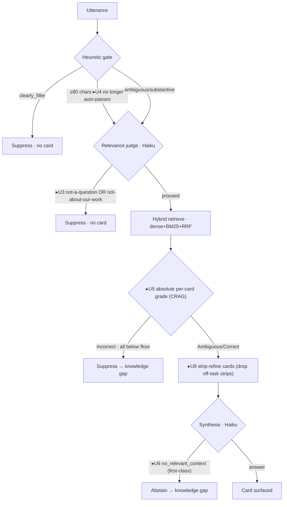
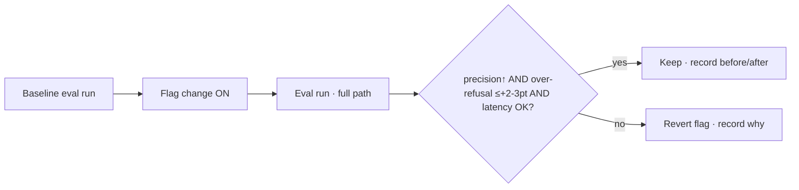

# feat: RAG synthesis precision — eval-gated suppression of side-conversation

## Summary

The real-time RAG pipeline surfaces too many cards from side conversations — off-topic chit-chat and topically-adjacent chatter that isn't about our code/docs. This plan raises precision through a sequence of small, individually **eval-gated** changes: a synthetic three-bucket eval set and a harness that runs the **full real-time path** come first, then each relevance/threshold/synthesis change lands one at a time, kept-or-reverted on **precision (up), over-refusal (≤~2–3 pts), latency (within budget)**. Engine-level changes are made once in `packages/engine` (both retrieval paths benefit); threshold/gate wiring is written against the eval-faithful cloud bot-worker path, with the local daemon brought to parity last.

The acceptance rule is **precision-first, recall-guarded** (origin KD1). Every tuning unit is feature-flagged for one-line revert.

---

## Problem Frame

Every gate in the current pipeline is deliberately **fail-open**: the heuristic auto-passes any utterance ≥80 chars; the Haiku relevance judge says "when in doubt, surface" and only skips at ≥70% noise-confidence; retrieval uses a very low RRF floor (0.012/0.025); the synthesis prompt answers "whenever the sources touch the topic at all, even tangentially." There is **no "is this about our products/codebase/work?" decision**. The result optimizes recall at the cost of precision — the exact failure the origin doc describes.

Research (cited in origin) says the fix is absolute per-card relevance grading (CRAG) rather than rank-fusion floors, an adaptive "should we retrieve / is this ours?" gate (Self-RAG), and strip-level filtering of off-task content inside adjacent hits — while watching over-refusal, which vanilla RAG inflates up to ~35.5% on all-irrelevant context. Tightening cuts both ways, so nothing ships without an eval that measures both directions.

**Two retrieval paths exist** and share `packages/engine` logic:
- **Cloud bot-worker** — `apps/bot-worker/src/retrieval.ts` (`maybeRetrieveAndEmit`); the path the eval harness already mirrors.
- **Local daemon** — `apps/daemon/src/retrieve/pipeline.ts` (`RetrievalPipeline`); the path the research mapped (RRF floors ~107/109, skip threshold ~430).

This plan optimizes + evals the **bot-worker path first**, then ports kept changes to the daemon for parity (U10).

---

## Requirements (traceability to origin)

- **R1/R2 — suppress off-topic + adjacent-not-ours** → U3 (judge gate), U5 (absolute grade), U8 (strip refinement).
- **R3 — "about-our-work" decision** → U3.
- **R4 — absolute relevance gate replaces RRF floor** → U5; off-task strips dropped → U8.
- **R5 — first-class honest abstention** → U6.
- **R6 — recall guardrail (over-refusal ≤~2–3 pts)** → enforced by U2 metrics on every unit.
- **R7 — latency budget** → measured by U2 on every unit; reranker latency gate in U9.
- **R8 — incremental + reversible (flag-gated, keep-or-revert)** → every tuning unit (U3–U9) carries a flag and an eval-acceptance gate.
- **R9 — eval set exists first** → U1 (dataset) + U2 (harness) are prerequisites for all tuning units.

---

## Key Technical Decisions

- **KTD1 — Prompt-only Haiku judge for the absolute grade; no cross-encoder dependency by default.** Research *refuted* a universal cross-encoder threshold, so a reranker would need per-corpus calibration. Start with a prompt-only Haiku per-card relevance grade (cheap, no new infra); the cross-encoder reranker (U9) is held conditional on the prompt-only grade proving insufficient on the eval set. (Origin open-question resolved.)
- **KTD2 — The "about-our-work" check is folded into the relevance judge and gates *pre-retrieval* (Self-RAG adaptive-retrieve).** This realizes both Q1 and L2 in one unit (U3) — the merge the origin flagged. A standalone stricter pre-retrieval gate is spun out only if the folded version underperforms (conditional follow-up, not a planned unit).
- **KTD3 — CRAG absolute grading is applied as a *post-retrieval* gate (Correct/Ambiguous/Incorrect → surface/soften/suppress), with RRF kept for ranking only.** Pairs with KTD2: pre-retrieval kills "not ours / not a question"; post-retrieval kills "retrieved something, but it's not actually on-task." (Origin open-question resolved.)
- **KTD4 — Engine-once, path-second.** Judge (U3), heuristic (U4), synthesis prompt (U6), and strip-refinement (U8) change shared `packages/engine` code and flow to both paths automatically. Threshold/gate-wiring (U5, U7, U9) is written against the bot-worker path; the daemon is reconciled in U10.
- **KTD5 — Every tuning change is behind an env/feature flag** so revert is one toggle and the eval can A/B old-vs-new without a code revert. Default OFF until the eval gate passes, then flipped ON (and the flag retired in a later cleanup).
- **KTD6 — The eval gate is the same on every unit:** precision **up** vs. the pre-change baseline AND over-refusal on bucket 3 up by **≤~2–3 pts** AND p95 full-path latency within the real-time budget. Fail any leg → revert the flag, record the result, move on. (Origin KD1.)

---

## High-Level Technical Design

Target real-time path after this plan (new/changed gates marked **▸**):

Eval-gate loop applied to every tuning unit (U3–U9):

Unit → flag → eval-acceptance map:

| Unit | Change | Flag (default OFF) | Primary metric watched |
|------|--------|--------------------|------------------------|
| U3 | Judge: about-our-work + question/task, stop fail-open | `RISEZOME_RELEVANCE_STRICT` | precision↑, bucket-3 over-refusal |
| U4 | Remove 80-char heuristic auto-pass | `RISEZOME_HEURISTIC_NO_LENGTH_BYPASS` | precision↑ on long chatter |
| U5 | Absolute per-card grade gate (CRAG) | `RISEZOME_ABSOLUTE_GRADE` | precision↑ on adjacent hits |
| U6 | Synthesis: soften "tangential", first-class abstain | `RISEZOME_SYNTHESIS_STRICT` | precision↑, over-refusal |
| U7 | Raise RRF floors (stopgap) | `RISEZOME_RRF_FLOOR_*` (numeric) | precision↑ (cheap A/B) |
| U8 | CRAG strip-level refinement | `RISEZOME_STRIP_REFINE` | precision↑ on adjacent hits |
| U9 | Calibrated reranker (conditional) | `RISEZOME_RERANKER` (existing hook) | precision↑ vs latency |

---

## Implementation Units

Grouped into phases. Phase A is the prerequisite foundation; Phases B/C land one unit at a time, each gated by a fresh eval run; Phase D reconciles the second path.

### Phase A — Eval foundation (prerequisite)

### U1. Synthetic three-bucket eval dataset

**Goal:** A version-controlled, labeled set of plausible meeting utterances across the three buckets, extending the existing golden set so the scorer reuses its fields.

**Requirements:** R9; origin Eval Dataset Design; AE1–AE5.

**Dependencies:** none.

**Files:**
- `apps/bot-worker/eval/golden-questions.jsonl` (extend) — or a sibling `eval/precision-set.jsonl` if keeping the suppression set separate is cleaner at implementation time.
- `apps/bot-worker/src/corpus-eval.ts` (extend `GoldenQuestion` with an optional `bucket` tag).
- `apps/bot-worker/eval/README.md` (create/extend — document buckets, labels, how to regenerate).

**Approach:** Add a `bucket: 'offtopic' | 'adjacent' | 'relevant'` field to `GoldenQuestion`. Bucket 1 (offtopic) and bucket 2 (adjacent) items carry `expect_refusal: true` (the scorer already treats refusal/suppression as pass). Bucket 3 keeps `must_surface` + `expect_answer_contains`. Generate ~30–40 offtopic + ~30–40 adjacent negatives (LLM-assisted, human-reviewed); keep/expand the existing ~65 relevant items as bucket 3. **Adjacent negatives must be genuinely hard** — phrased near real corpus subjects (e.g., generic "how do you do hybrid search in Postgres" vs. "how does *our* corpus search work", or chit-chat mentioning "remote" against the repo's "remote debugging" doc, per AE3) so they exercise the gate, not just lexical mismatch.

**Patterns to follow:** existing JSONL line shape and `note` curation field in `golden-questions.jsonl`; `appendGoldenQuestion` for programmatic adds.

**Test scenarios:**
- `loadGoldenSet` parses items with the new `bucket` field and items without it (back-compat) without throwing.
- A bucket-2 item with `expect_refusal: true` round-trips through `scoreQuestion` as pass-on-suppress. Covers AE2/AE3.
- A bucket-3 item with `must_surface` + `expect_answer_contains` round-trips as pass-on-grounded-answer. Covers AE4.
- Dataset lints: every item has exactly one bucket; offtopic/adjacent imply `expect_refusal: true`; relevant implies `expect_answer_contains`.

**Verification:** the set loads, lints clean, and a baseline eval run produces per-bucket counts. No tuning change has shipped yet.

### U2. Eval harness: full-path run + precision/over-refusal/latency metrics

**Goal:** Make the eval run the **full real-time path** (heuristic gate → relevance judge → retrieval → synthesis) so suppression is measured where it happens, and report precision, over-refusal, and latency per bucket.

**Requirements:** R6, R7, R9; origin KD2.

**Dependencies:** U1.

**Files:**
- `apps/bot-worker/src/corpus-eval.ts` (`evaluateQuestion` — run the relevance gate before retrieval; thread a `relevanceClassifier` into `EvalDeps`; time the run).
- `apps/bot-worker/src/corpus-eval.ts` (`summarize` / new `summarizePrecision` — add precision, over-refusal, per-bucket pass rates, latency p50/p95).
- `apps/bot-worker/src/debug/eval-routes.ts` (surface the new metrics to `/debug/eval`).
- `apps/portal/app/(authed)/debug/eval/_client.tsx` (render the new metric block — precision / over-refusal / latency, per bucket).
- `apps/bot-worker/test/corpus-eval.test.ts` (or existing eval test) — metric math + gate-invocation tests.

**Approach:** Before retrieval, `evaluateQuestion` runs `classifyRelevanceHeuristic` and, on `ambiguous`, the optional `relevanceClassifier` — mirroring `maybeRetrieveAndEmit` in `apps/bot-worker/src/retrieval.ts`. If the gate skips, the item is "suppressed → no card" (no retrieval/synthesis). "Surfaced" = a non-suppressed, non-refused, grounded answer came out. **Metrics:** precision = `relevant_surfaced / total_surfaced`; over-refusal = `relevant_suppressed / total_relevant`; latency = wall-clock per item (p50/p95) across the full path. Report overall + per bucket. Keep the existing `passRate`/`meanRecall` for continuity.

**Patterns to follow:** `maybeRetrieveAndEmit`'s heuristic→classifier branching (`apps/bot-worker/src/retrieval.ts`); `EvalDeps`/`evaluateQuestion` structure; the existing `/debug/eval` route + client rendering.

**Test scenarios:**
- A `clearly_filler` utterance is suppressed by the gate with **no** retrieval call (assert the search dep is not invoked). Covers AE1.
- An ambiguous utterance the classifier marks `skip ≥ threshold` is suppressed; below threshold proceeds to retrieval.
- Precision math: given a mixed surfaced/suppressed result set, `precision`, `over-refusal`, and per-bucket rates compute correctly (table-driven).
- Latency: p50/p95 are computed from per-item timings; empty set yields null without throwing.
- A bucket-3 item that the gate wrongly skips is counted as **over-refusal**, not as a pass.

**Verification:** a baseline run reports precision, over-refusal, and latency per bucket on the U1 set, visible in `/debug/eval`. This baseline is the comparison point for every later unit.

---

### Phase B — Quick wins (one unit per eval run)

### U3. Relevance judge: about-our-work + question/task decision; stop failing open (Q1 + L2)

**Goal:** The Haiku relevance judge gains an explicit "is this about our products/codebase/work?" and "is this a real question/task?" decision and gates **pre-retrieval**, replacing "when in doubt, surface."

**Requirements:** R1, R2, R3, R8; origin KD6; AE1, AE2.

**Dependencies:** U2.

**Files:**
- `packages/engine/src/relevance/contract.ts` (extend the decision shape: `about_our_work`, `is_question_or_task`).
- `packages/engine/src/relevance/prompt.ts` (add the two decisions; flip the bias from fail-open to a calibrated decision with few-shot offtopic/adjacent/relevant examples).
- `packages/engine/src/relevance/anthropic-classifier.ts` (parse/return the new fields).
- `apps/bot-worker/src/retrieval.ts` (`maybeRetrieveAndEmit` — consume `about_our_work`/`is_question_or_task` to skip; behind `RISEZOME_RELEVANCE_STRICT`).
- `packages/engine/test/relevance/*.test.ts` (classifier + prompt-parse tests).

**Approach:** Structured JSON decision (Self-RAG-style): `{ proceed | skip, about_our_work, is_question_or_task, confidence, reason }`. When the flag is on, the gate skips when `about_our_work=false` OR `is_question_or_task=false` (subject to the skip-confidence threshold, still env-tunable). Few-shot the prompt with bucket-1/2/3 exemplars. Keep the 3s timeout → on timeout default to proceed (latency safety), but log it.

**Execution note:** add the failing classifier-output test first (the new structured fields), then the prompt change.

**Patterns to follow:** existing `RelevanceClassifier` contract + `AnthropicRelevanceClassifier`; the temp-0 deterministic call; the router classifier's few-shot JSON prompt in `packages/engine/src/router/`.

**Test scenarios:**
- Offtopic ("did anyone catch the game?") → `is_question_or_task=false` → skip. Covers AE1.
- Adjacent ("best way to handle CORS in React?") → `about_our_work=false` → skip. Covers AE2.
- Relevant ("how does our corpus search work?") → proceed. Covers AE4.
- Malformed model output → safe fallback (proceed + logged), not a crash.
- Flag OFF → behaviour identical to today (fail-open), proving the revert path.

**Eval acceptance (KTD6):** precision↑ on buckets 1–2, bucket-3 over-refusal ≤+2–3 pts, latency unchanged (no new call — reuses the existing judge call). Keep or revert the flag on the numbers.

**Verification:** eval run with the flag ON beats baseline precision within the over-refusal/latency guardrails; flag OFF reproduces baseline.

### U4. Remove the 80-char heuristic auto-pass (Q2)

**Goal:** Long utterances no longer bypass pattern checks — long chit-chat must still face the gate.

**Requirements:** R1, R8.

**Dependencies:** U2 (independent of U3; either order).

**Files:**
- `packages/engine/src/relevance/heuristic.ts` (`SUBSTANTIVE_MIN_LENGTH` bypass — behind `RISEZOME_HEURISTIC_NO_LENGTH_BYPASS`: long utterances route to `ambiguous` (LLM-judged) rather than auto-`clearly_substantive`).
- `packages/engine/test/relevance/heuristic.test.ts`.

**Approach:** When the flag is on, a ≥80-char utterance with no substantive pattern resolves to `ambiguous` (so the LLM judge — strengthened in U3 — decides) instead of `clearly_substantive`. Do not over-correct into `clearly_filler` (that would skip the LLM entirely and risk over-refusal).

**Patterns to follow:** the three-state `classifyRelevanceHeuristic` return.

**Test scenarios:**
- A long off-topic monologue (≥80 chars, no question) → `ambiguous` (not `clearly_substantive`). 
- A long genuine question → still `clearly_substantive` via the question/imperative patterns (unchanged).
- A short filler ack → still `clearly_filler` (unchanged).
- Flag OFF → 80-char bypass intact (revert path).

**Eval acceptance:** precision↑ specifically on long-utterance chatter, over-refusal guardrail intact, latency: small expected rise (more items reach the LLM judge) — must stay within budget.

**Verification:** eval shows fewer long-chatter false positives; latency within budget.

### U5. Absolute per-card relevance grade for the gate (Q3, CRAG grading)

**Goal:** Replace the rank-based RRF floor as the surface/suppress decision with an absolute per-card grade; keep RRF for ranking.

**Requirements:** R4, R8; origin KD5; AE3.

**Dependencies:** U2.

**Files:**
- `packages/engine/src/relevance/` or a new `packages/engine/src/grade/` (a per-card absolute relevance grader — prompt-only Haiku, KTD1).
- `apps/bot-worker/src/retrieval.ts` / `apps/bot-worker/src/corpus-search.ts` (apply the grade as the gate; CRAG Correct/Ambiguous/Incorrect; behind `RISEZOME_ABSOLUTE_GRADE`).
- `packages/engine/test/grade/*.test.ts`.

**Approach:** After hybrid retrieval (RRF ranking preserved), grade each top card on absolute on-task relevance to the utterance. **Correct** (≥ upper) → keep; **Incorrect** (all cards < lower) → suppress → knowledge gap; **Ambiguous** (between) → keep but mark for the softened synthesis (U6) to abstain more readily. Reuse `isLowConfidenceHits` as a cheap pre-filter so the grader only runs when the rank signal is borderline (latency control). Upper/lower thresholds are env-tunable and **calibrated against the U1 eval set**, not borrowed.

**Technical design (directional, not spec):** grade is a single batched Haiku call over the ≤3–5 retrieved cards returning `[{rank, grade: correct|ambiguous|incorrect}]`; thresholds map a numeric confidence to the three bands.

**Patterns to follow:** `optionalReranker`/`isLowConfidenceHits` hooks in the bot-worker path; the synthesis Haiku call shape for batching.

**Test scenarios:**
- All cards off-task (adjacent utterance) → all `incorrect` → suppress → gap recorded. Covers AE3.
- One card on-task → `correct` → keep.
- Borderline → `ambiguous` → kept, flagged for softened synthesis.
- Grader timeout/malformed → fall back to the existing RRF-floor behaviour (no regression), logged.
- Flag OFF → RRF-floor gate unchanged (revert path).

**Eval acceptance:** precision↑ on adjacent hits (bucket 2), over-refusal ≤+2–3 pts, latency within budget (the extra Haiku call is the main risk — gate it behind `isLowConfidenceHits` and measure p95).

**Verification:** eval shows adjacent-bucket suppression up without bucket-3 regression; p95 within budget.

### U6. Synthesis prompt: soften "answer even tangentially" + first-class abstention (Q4)

**Goal:** The synthesizer answers only when a source **directly addresses** the asked question, and abstains cleanly otherwise — without tipping into over-refusal.

**Requirements:** R5, R8; origin AE3, AE5; related: shared with the skills-robustness honesty change.

**Dependencies:** U2.

**Files:**
- `packages/engine/src/synthesize/prompt.ts` (soften the "answer whenever sources touch the topic even tangentially" directive; keep the STATUS protocol; behind `RISEZOME_SYNTHESIS_STRICT`).
- `packages/engine/test/synthesize/*.test.ts` (STATUS-parse + abstention behaviour).

**Approach:** Change the "high bar to refuse" wording to "answer only if a source directly addresses the asked question; otherwise `STATUS: no_relevant_context`." Preserve the cacheable prefix structure (the prompt must stay long enough for ephemeral caching) and the citation-quote-verification downstream. **Guardrail:** this is the unit most likely to raise over-refusal — the eval gate is decisive here; if bucket-3 over-refusal exceeds the guardrail, revert and try a milder wording.

**Patterns to follow:** existing STATUS protocol + `parseSynthesisOutput`; the cacheable-prefix layout in `synthesize/prompt.ts`.

**Test scenarios:**
- Sources directly answer → `STATUS: answer` (unchanged).
- Sources only tangentially related → `STATUS: no_relevant_context` (was previously answered). Covers AE3.
- Real question with good sources → still answers (over-refusal guard). Covers AE5.
- Flag OFF → current "answer tangentially" wording (revert path).

**Eval acceptance:** precision↑, bucket-3 over-refusal ≤+2–3 pts (watch closely), latency unchanged (prompt-only change, cache prefix preserved).

**Verification:** eval shows tangential answers converted to abstentions without bucket-3 regression.

### U7. Raise the RRF floors behind a flag (Q5, stopgap)

**Goal:** A cheap, reversible A/B that raises the retrieval/synthesis floors as an interim precision lever.

**Requirements:** R8.

**Dependencies:** U2. **Relationship:** largely **superseded by U5** (absolute grading); keep as an independent cheap experiment that can run *early* (before U5) or be skipped if U5 lands first.

**Files:**
- `apps/bot-worker/src/retrieval.ts` / `corpus-search.ts` (floor constants → env-tunable `RISEZOME_RRF_FLOOR_RETRIEVAL` / `RISEZOME_RRF_FLOOR_SYNTHESIS`, defaults unchanged).
- (daemon parity for the same constants deferred to U10.)

**Approach:** Promote the hardcoded floors to env-tunable numbers (default = current values, so OFF = no change). A/B a raised value (e.g. retrieval 0.012→~0.03, synthesis 0.025→~0.05) on the eval set.

**Test scenarios:**
- Default env (unset) reproduces today's floors exactly.
- A raised floor suppresses weak-tail hits in a synthetic borderline case.
- `Test expectation: minimal` — this is a constant→env promotion; the behavioural proof is the eval A/B, not unit coverage.

**Eval acceptance:** precision↑ at acceptable over-refusal; if it underperforms U5, leave the floors at default and rely on U5.

**Verification:** an eval A/B table of floor values vs precision/over-refusal is recorded; the chosen value (possibly the default) is documented.

---

### Phase C — Larger additions (one unit per eval run)

### U8. CRAG decompose-then-recompose strip-level refinement (L1)

**Goal:** Drop off-task knowledge strips *inside* an otherwise-relevant card before it reaches synthesis — the core fix for adjacent content that retrieves a topically-near doc.

**Requirements:** R4; origin KD-research (CRAG); AE3.

**Dependencies:** U2; complements U5 (grades whole cards) by refining *within* kept cards.

**Files:**
- `packages/engine/src/grade/` or `packages/engine/src/synthesize/` (a strip-refine step: segment a card into strips, re-score each on on-task relevance, recompose only the relevant strips; behind `RISEZOME_STRIP_REFINE`).
- `apps/bot-worker/src/retrieval.ts` (insert between retrieval/grade and the sources handed to synthesis).
- `packages/engine/test/grade/strip-refine.test.ts`.

**Approach:** Segment each kept card into fine-grained strips (heuristic split on sentence/paragraph/code-block boundaries), score strips with the same Haiku grader (batched), keep only on-task strips, recompose in original order. Cap to the top-N cards already passed to synthesis to bound latency. If all strips in a card are off-task, drop the card (feeds U5's suppress path).

**Patterns to follow:** the parent-doc expand/dedupe flow in `apps/bot-worker/src/parent-doc.ts` (it already reshapes card text pre-synthesis); the batched grader from U5.

**Test scenarios:**
- A card with one on-task paragraph and three off-task → recomposed to the on-task paragraph only.
- A fully off-task card → dropped.
- A fully on-task card → unchanged (no spurious truncation).
- Strip-refine timeout/error → pass the card through unrefined (no regression), logged.
- Flag OFF → cards reach synthesis unrefined (revert path).

**Eval acceptance:** precision↑ on adjacent hits beyond U5 alone, over-refusal guardrail intact, latency within budget (extra batched grader pass — measure p95).

**Verification:** eval shows incremental adjacent-bucket precision over the U5 baseline without bucket-3 regression.

### U9. Calibrated reranker (L3, conditional)

**Goal:** A cross-encoder reranker for the absolute gate — **only if** U5's prompt-only grade leaves precision short on the eval set.

**Requirements:** R4 (conditional); origin open-question (calibrate per-corpus).

**Dependencies:** U5 (decision gate: pursue only if U5 under-delivers). **Research caveat:** a universal cross-encoder threshold was *refuted* — thresholds must be calibrated against the U1 set, never borrowed.

**Files:**
- `apps/bot-worker/src/reranker.ts` (the existing `optionalReranker` hook — wire a real reranker behind `RISEZOME_RERANKER`).
- `apps/bot-worker/src/corpus-search.ts` (apply reranker scores to the absolute gate).
- `apps/bot-worker/test/reranker.test.ts`.

**Approach:** Reuse the existing `optionalReranker()` seam. Calibrate the keep/suppress threshold on the U1 eval set (sweep, pick the precision/over-refusal knee). Treat the reranker score as the absolute grade input to U5's bands rather than a second independent gate.

**Test scenarios:**
- Reranker promotes an on-task card above an adjacent one (ordering).
- Calibrated threshold suppresses a known adjacent false-positive from the eval set.
- Reranker unavailable/flag OFF → U5 prompt-only grade path unchanged (revert).
- `Covers` the adjacent hard-negative class that U5 alone missed (if any).

**Eval acceptance:** precision↑ beyond U5 that justifies the added latency/dependency; if not, leave OFF and close L3 as "not needed."

**Verification:** a recorded eval comparison (U5-only vs U5+reranker) drives the keep/drop decision.

---

### Phase D — Path parity

### U10. Daemon-path parity for kept changes

**Goal:** Port the changes that passed their eval gates to the local daemon path so both surfaces behave identically.

**Requirements:** parity for R1–R6 across paths.

**Dependencies:** all kept units from Phases B/C.

**Files:**
- `apps/daemon/src/retrieve/pipeline.ts` (apply the kept threshold/grade/gate changes; the engine-level judge/heuristic/synthesis/strip changes already flow via `packages/engine`).
- `apps/daemon/src/cli/serve.ts` (wire the same env flags/thresholds).
- `apps/daemon/test/retrieve/*.test.ts`.

**Approach:** Engine-level units (U3, U4, U6, U8) already affect the daemon through shared imports — verify and add the daemon-side flag wiring. Port only the **kept** threshold/gate units (U5, U7, U9 as applicable) with the same calibrated values. Confirm via the daemon's own tests + a daemon-mode eval if available.

**Test scenarios:**
- Daemon relevance gate now skips offtopic/adjacent identically to the bot-worker path (parity assertion on a shared fixture).
- Daemon absolute-grade gate suppresses an adjacent hit the bot-worker path also suppresses.
- Flags OFF on the daemon reproduce its current behaviour.

**Verification:** daemon tests pass; a parity check shows the two paths agree on the U1 set's surface/suppress decisions.

---

## Scope Boundaries

### In scope
- The synthetic three-bucket eval set + harness extension (U1, U2).
- Quick wins U3–U7 and larger additions U8–U9, each flag-gated and eval-gated.
- Daemon parity (U10).

### Deferred to Follow-Up Work
- **Post-meeting Sonnet re-pass** for the durable Captures/recap view (the "after the fact" tier) — a separate track, not in this 1-by-1 sequence (origin Deferred).
- **A standalone stricter pre-retrieval "should-we-act" gate** beyond the judge-folded version — only if U3's folded gate underperforms.
- **Flag retirement / cleanup** — once a change is proven and stable, remove its env flag and dead OFF-path (a later housekeeping unit).

### Outside this product's identity (from origin)
- Re-litigating the skill-vs-RAG boundary.
- Skill-argument misparse self-healing (`docs/brainstorms/2026-06-02-skills-rag-robustness-requirements.md`) — different problem; shares only the synthesis prompt (coordinate the U6 edit with that work).
- Changing corpus contents or indexing — this effort tunes what surfaces, not what's indexed.

---

## Risks & Mitigation

- **Over-refusal regression (highest risk).** Tightening U3/U5/U6 can suppress real questions. *Mitigation:* over-refusal is a hard leg of the eval gate on every unit; U6 (most likely culprit) reverts on a milder wording if it breaches the guardrail.
- **Latency creep from added Haiku calls (U5, U8).** *Mitigation:* gate the absolute grader behind `isLowConfidenceHits`, batch grading over the ≤3–5 cards, measure p95 each unit, revert if budget blown.
- **Eval set not representative / too easy.** Synthetic adjacent negatives that are only lexically distant won't catch real leaks. *Mitigation:* U1 explicitly requires hard adjacent negatives (AE3-style); review against observed live leaks; the set is versioned and can grow as new leaks appear (ties to eval-regression-coverage).
- **Two-path drift.** Optimizing the bot-worker path could diverge from the daemon. *Mitigation:* engine-once changes (KTD4) + U10 parity + a parity assertion on a shared fixture.
- **Prompt-cache invalidation on synthesis edits (U6).** *Mitigation:* preserve the cacheable-prefix layout; measure cache-hit/latency before/after.

---

## Success Metrics

- Measurable **precision increase** on the U1 set with over-refusal within ≤~2–3 pts and p95 latency within budget, recorded per shipped unit (before/after).
- The **adjacent hard-negative bucket stops leaking** (its suppression rate climbs materially).
- **Zero bucket-3 regressions** ship (every kept unit cleared the recall guard).
- The eval set + metrics are re-runnable from `/debug/eval` so future changes inherit the guardrail.

---

## Open Questions (execution-time)

- Exact upper/lower band values for U5 and the raised-floor value for U7 — calibrated against the U1 set during implementation, not pre-set here.
- Whether U7 runs at all (it may be fully superseded by U5) — decide from the U5 eval result.
- Whether U9 (reranker) is needed — decide from the U5 eval result.
- Final numeric latency budget figure to gate p95 against (assume the existing real-time window; confirm the exact ms during U2).
- Whether the suppression set lives in `golden-questions.jsonl` or a sibling file — decide in U1 based on harness ergonomics.

---

## Sources & Research

- **Origin requirements:** `docs/brainstorms/2026-06-03-rag-synthesis-precision-requirements.md` (problem frame, R1–R9, eval design, KD1–KD8, AE1–AE5).
- **Research (verified, this session):** CRAG absolute grading + decompose-recompose ([arXiv 2401.15884](https://arxiv.org/pdf/2401.15884)); Self-RAG adaptive retrieve + ISREL/ISSUP ([arXiv 2310.11511](https://arxiv.org/abs/2310.11511)); over-refusal up to 35.5% ([arXiv 2509.01476](https://arxiv.org/html/2509.01476v2)); bi-encoder/RRF query-dependent (Elastic); relevance-only can degrade answers ([arXiv 2504.07104](https://arxiv.org/pdf/2504.07104)). Refuted: universal cross-encoder threshold; multi-criteria rerankers; one-positive-doc-eliminates-over-refusal.
- **Pipeline (verified map):** `packages/engine/src/relevance/{heuristic,prompt,anthropic-classifier,contract}.ts`; `apps/bot-worker/src/retrieval.ts` (`maybeRetrieveAndEmit`), `apps/bot-worker/src/corpus-search.ts` (`hybridSearch`, `isLowConfidenceHits`), `apps/bot-worker/src/reranker.ts` (`optionalReranker`), `apps/bot-worker/src/parent-doc.ts`; `apps/daemon/src/retrieve/pipeline.ts`; `packages/engine/src/synthesize/prompt.ts`.
- **Eval harness:** `apps/bot-worker/eval/golden-questions.jsonl` (65 items), `apps/bot-worker/src/corpus-eval.ts` (`GoldenQuestion`, `evaluateQuestion`, `scoreQuestion`, `summarize`), `apps/bot-worker/src/debug/eval-routes.ts`, the `/debug/eval` page.
- **Prior art:** `docs/architecture/retrieval-pipeline.md`; `docs/brainstorms/2026-06-01-corpus-retrieval-improvements-requirements.md`; `docs/plans/2026-06-01-002-feat-corpus-retrieval-claude-augmented-rag-plan.md`.
