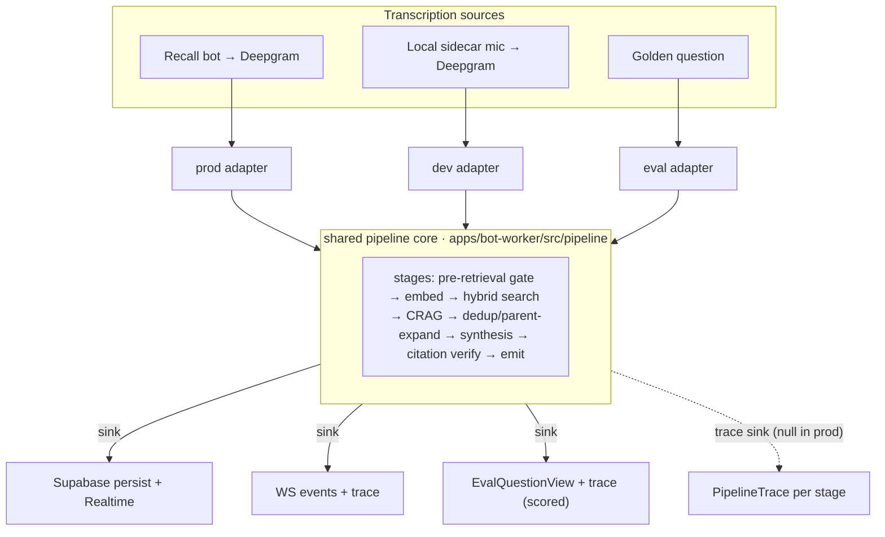
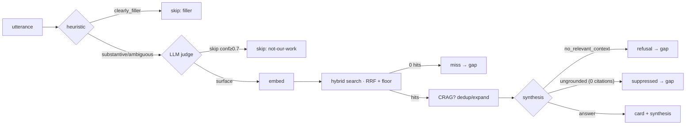

# refactor: one retrieval/synthesis pipeline + per-utterance trace debugger

## Summary

The post-transcription pipeline (relevance gate → embed → hybrid search → CRAG → dedup/parent-expand → synthesis → citation verification → emit) is reimplemented in **four hand-mirrored copies** that have already drifted. This plan consolidates the three bot-worker copies (prod Recall path, local-sidecar dev page, eval harness) into **one shared pipeline core** — utterance source in, a pluggable sink out — so the dev page and the eval run the *exact same code* as production, the only difference being where the transcript comes from. It then adds a **per-utterance, stage-by-stage trace** surfaced on the dev page: click any transcript line, see which stages ran, their results, and why it passed or stopped. The daemon (a separate desktop deployment with a different DB layer) is a documented follow-up.

Faithfulness is gated by the corpus eval: once the eval calls the shared core, it **must reproduce the U3 precision numbers** (99% precision / 1% over-refusal). That gate is the proof the consolidation didn't change behavior.

---

## Problem Frame

Four copies, verified this session:

| Copy | Entry | Gate placement | TOP_K | Sink |
|------|-------|----------------|-------|------|
| **Prod** (Recall → bot-worker) | `apps/bot-worker/src/retrieval.ts` `maybeRetrieveAndEmit` | **post-retrieval** | 3 | Supabase cards + Realtime |
| **Dev sidecar** (live-mic page) | `apps/bot-worker/src/debug/local-debug-ws.ts` `runDebugPipeline` | pre-retrieval | 5 | WS JSON events |
| **Eval** | `apps/bot-worker/src/corpus-eval.ts` `evaluateQuestion` | pre-retrieval | 5 | structured `EvalQuestionView` |
| **Daemon** (desktop) | `apps/daemon/src/retrieve/pipeline.ts` `RetrievalPipeline` | pre-retrieval | 3 | EventEmitter |

Two consequences the user is right to call out:

1. **Local sidecar testing does not exercise prod.** `local-debug-ws.ts` rolls its own retrieval + relevance gate; it never calls `maybeRetrieveAndEmit`. This session's U3 strict gate (`RISEZOME_RELEVANCE_STRICT`) went into prod + eval but **not** the dev sidecar — so the dev page already disagrees with prod.

2. **The eval's precision number overstates prod's card behavior.** The eval gates **pre-retrieval** and measures precision as "did a *card* surface." Prod gates **post-retrieval** — it emits cards first and the gate only suppresses *synthesis*. So **prod today still surfaces the adjacent/off-topic cards** (the exact noise the user complained about); U3 only stops the synthesized answer. The card-level precision win is realized in prod **only** by moving the gate pre-retrieval — which is this consolidation. This ties the refactor directly to the precision goal (and to PR #33).

The target the user stated: **one pipeline; the only difference is the transcription source** — local sidecar audio → Deepgram → utterances, vs. Recall bot → Deepgram → utterances. Everything from the utterance onward is the same code, and the eval calls it too.

---

## Requirements

- **R1 — One pipeline core.** The relevance gate → retrieve → CRAG → dedup/expand → synthesize → verify → emit logic exists in exactly one place; prod, dev-sidecar, and eval call it. No hand-mirrored copies remain among the three.
- **R2 — Source-in / sink-out seams.** The core takes an utterance + context (rolling window / summary) and writes results through a pluggable **sink** (emit card, synthesis start/delta/done/refusal, knowledge-gap miss, skip, trace). Prod's sink persists to Supabase + Realtime; the dev sink streams WS events; the eval sink collects scored intermediates.
- **R3 — Behavior preserved + canonicalized.** Prod's load-bearing behaviors are preserved: flash-fix synthesis buffering (grounded-or-nothing), stale-card retraction, knowledge-gap miss capture, org-scoping/security, the U3 strict gate. The intentional divergences (gate placement, TOP_K) are resolved to one canonical choice (see KTD3).
- **R4 — Eval faithfulness gate.** With the eval calling the shared core, the corpus eval reproduces the U3 numbers (≥99% precision / ≤1% over-refusal, latency within budget). This is the acceptance gate for the consolidation.
- **R5 — Live path stays fast.** The trace adds **zero** cost on the Recall path: the trace sink is null in prod, and the core does no trace work when no trace sink is attached.
- **R6 — Per-utterance trace.** The core emits a structured per-stage trace (each stage: ran/skipped, inputs, decision, pass/fail, the why, timing, outputs) on dev/eval only.
- **R7 — Clickable transcript debugger.** On the live-mic dev page, each transcript utterance is clickable and shows its full stage-by-stage trace and exactly where/why it stopped or produced a card.

---

## Key Technical Decisions

- **KTD1 — The shared core is a bot-worker-local module, not `packages/engine`.** `hybridSearch`, `dedupeByDoc`, `expandWinnersToParents`, `optionalReranker`, `optionalQueryExpander` are Supabase-bound and live in `apps/bot-worker/src/`; the daemon has its own SQLite-backed equivalents. Prod + dev-sidecar + eval all use the bot-worker Supabase versions, so a bot-worker-local `pipeline/` module unifies all three cleanly. (A future engine-level pure core that takes pre-fetched DB rows could unify the daemon too — deferred, see KTD2.)
- **KTD2 — Daemon parity is deferred.** Its different DB layer makes true sharing a larger refactor, and it already emits the richest structured trace of the four (`RetrievalTrace` + `relevanceSkip`/`relevanceClassified` events), so it's the least-broken copy. Bringing it onto the shared core (or extracting an engine pure-core) is a follow-up.
- **KTD3 — Canonical gate placement is PRE-retrieval** (skip before embed/search). This resolves the prod-vs-dev/eval divergence toward the behavior that is (a) faster — a skipped utterance never pays for embed + search, (b) more precise — **gated utterances emit no cards**, not just no synthesis, and (c) already eval-validated (U3 measured pre-retrieval). **This is a deliberate behavior change to the live Recall path** (today prod flashes cards then gates only synthesis); it is the change that delivers U3's card-level precision win to prod, and it is gated by R4's eval. TOP_K is canonicalized too (prod uses 3, dev/eval 5 — resolve to one value and re-confirm via eval).
- **KTD4 — Trace is dev/eval-only via an optional sink** that is null on the live path (R5, user decision). The core checks "trace sink attached?" and skips all trace assembly otherwise.
- **KTD5 — Trace transport is a live WS event for the dev page + the eval view.** A new structured `trace` message on the local-debug WS carries per-stage records to the dev client; the eval attaches the same trace to `EvalQuestionView`. A persisted/after-the-fact trace store is deferred.
- **KTD6 — The sink is an interface with three implementations.** `emitCard`, `synthesisStart/Delta/Done/Refusal`, `recordMiss`, `recordSkip`, `recordTrace`. Prod = Supabase-persist + Realtime; dev = WS send; eval = in-memory collector that builds `EvalQuestionView`. The core is sink-agnostic and never imports a transport.

---

## High-Level Technical Design

Target architecture — one core, three sinks (daemon deferred):

Per-utterance trace shape (subsumes today's scattered logger lines, WS events, and the daemon's `RetrievalTrace`):

Each node becomes a trace record: `{ stage, status: ran|skipped|short-circuited, decision, reason, latencyMs, data }`. The dev page renders this as the clickable per-utterance panel (R7).

---

## Implementation Units

Phase A consolidates (one core, three callers, eval-gated). Phase B adds the trace + debugger UI.

### U1. Extract the shared pipeline core + seams + trace schema

**Goal:** One module that runs the full pipeline against an utterance, sink-agnostic, with the divergences resolved to canonical behavior and an optional trace.

**Requirements:** R1, R2, R3, R5, R6.

**Dependencies:** none.

**Files:**
- `apps/bot-worker/src/pipeline/core.ts` (create) — the pipeline; takes `PipelineInput`, `PipelineDeps`, `PipelineSink`.
- `apps/bot-worker/src/pipeline/contract.ts` (create) — `PipelineInput` (utterance, context/window, summary), `PipelineDeps` (embedder, synthesizer, classifiers, db, search/rerank/expand fns), `PipelineSink` interface (KTD6), `PipelineTrace` + per-stage record types.
- `apps/bot-worker/test/pipeline/core.test.ts` (create).

**Approach:** Lift the common stage sequence from `maybeRetrieveAndEmit`. Canonicalize: **pre-retrieval gate** (KTD3) — heuristic → (ambiguous|strict-substantive) LLM judge → skip-or-proceed *before* embed; single TOP_K; the existing dedup/parent-expand. The core calls `sink.*` at each emit point and `sink.recordTrace(...)` per stage **only when a trace sink is present**. Keep the U3 strict routing. The core must NOT import any transport (no Supabase, no WS) — DB access is via injected `PipelineDeps` functions so the same core works behind any sink.

**Patterns to follow:** the stage logic in `apps/bot-worker/src/retrieval.ts`; the eval's `EvalQuestionView` intermediates as the shape the eval sink rebuilds; the daemon's `RetrievalTrace`/`relevanceSkip` events as prior art for the trace schema.

**Test scenarios:**
- Heuristic `clearly_filler` → core calls `sink.recordSkip(stage:'heuristic', reason:'filler')`, no embed/search call (assert deps not invoked).
- Strict substantive judged `skip ≥ threshold` → `recordSkip(stage:'judge', confidence, reason)`, no embed/search.
- Surface → embed → hybrid search returns hits → dedup → `sink.emitCard` per surviving doc with rank/score.
- Zero hits → `sink.recordMiss(reason:'no_hits')` (gated by heuristic per existing gap rules).
- Synthesis `no_relevant_context` → `sink.synthesisRefusal` + miss(`refusal`); ungrounded (0 surviving citations) → suppressed + miss(`ungrounded`).
- Trace sink present → a `PipelineTrace` with one record per stage (status/decision/reason/latency); trace sink **absent** → zero trace records assembled (R5 — assert no trace work).
- TOP_K canonical value honored.

**Verification:** the core, exercised with fake deps + a recording sink, produces the documented stage sequence and trace; no transport imports in the module.

### U2. Migrate the prod Recall path onto the core

**Goal:** `maybeRetrieveAndEmit` becomes a thin adapter: build `PipelineInput` from the rolling window + `lastSummary`, run the core with a **Supabase-persist sink**.

**Requirements:** R1, R3.

**Dependencies:** U1.

**Files:**
- `apps/bot-worker/src/retrieval.ts` (modify — delegate to the core; keep the public signature used by `index.ts`).
- `apps/bot-worker/src/pipeline/sink-supabase.ts` (create — implements `PipelineSink`: persist cards + syntheses, Realtime broadcast, stale-card retraction, knowledge-gap miss).
- `apps/bot-worker/test/retrieval-safety-net.test.ts`, `apps/bot-worker/test/pipeline/sink-supabase.test.ts`.

**Approach:** The Supabase sink owns everything transport-specific that lives in `maybeRetrieveAndEmit` today: `persistAndBroadcast`, `runSynthesisAndBroadcast` (flash-fix buffering, grounded-or-nothing), `liveCardByDocId` stale-card retraction, `trace_id` on rows, org-scoping. **Behavior change (KTD3):** prod now gates pre-retrieval — a gated utterance emits no cards. The router/skill path (toolSource at rank [1]) and the parallel skill classifier are preserved.

**Execution note:** characterize prod's current observable outputs (cards/synthesis/miss for a fixture) before refactoring, so the migration is provably behavior-preserving except the intended gate-placement change.

**Patterns to follow:** existing `persistAndBroadcast` / `runSynthesisAndBroadcast` / retraction logic in `retrieval.ts`.

**Test scenarios:**
- A substantive on-topic utterance → cards persisted + synthesis broadcast, same as before.
- A gated (off-topic) utterance → **no cards persisted** (the intended change), miss recorded if applicable.
- Stale duplicate doc → prior card retracted (unless pinned).
- Synthesis ungrounded → suppressed, no synthesis row, gap recorded.
- Org-scoping: a card/synthesis only ever reads/writes the caller's org (security regression guard).
- `index.ts` integration: the Recall WS handler still calls the adapter with the same args and gets `{ emitted, skipped? }`.

**Verification:** `retrieval-safety-net` passes; a fixture meeting produces identical cards/synthesis to pre-refactor except gated utterances now emit no cards.

### U3. Migrate the local-sidecar dev page onto the core (+ trace)

**Goal:** `runDebugPipeline` becomes a thin adapter with a **WS sink**; attach the trace sink so the dev page receives a structured per-stage trace. The dev sidecar now runs the same core as prod.

**Requirements:** R1, R6, R7 (transport half).

**Dependencies:** U1.

**Files:**
- `apps/bot-worker/src/debug/local-debug-ws.ts` (modify — replace the bespoke pipeline with the core + a WS sink).
- `apps/bot-worker/src/pipeline/sink-ws.ts` (create — implements `PipelineSink` over the WS `send`; maps emits to the existing `card`/`synthesis*`/`retrieval-skip` events and adds a new `trace` event).
- `apps/bot-worker/test/debug/local-debug-ws.test.ts` (or pipeline sink test).

**Approach:** The WS sink emits the existing event vocabulary (`utterance` stays in the handler; `embed-start`/`card`/`retrieval-skip`/`synthesisStart`/`synthesisDelta`/`synthesisDone`/`synthesisRefusal`) plus a new `trace` event carrying the `PipelineTrace` for the utterance. Keep the dev-only continuation-merge + Deepgram wiring in the handler (that's the transcription *source*, which legitimately differs). The strict gate now applies here automatically (it's in the shared core) — fixing the drift where the dev page lacked U3.

**Test scenarios:**
- A final utterance runs the core; the WS sink emits the same `card`/`synthesis*` events as today for an on-topic question.
- A gated utterance → `retrieval-skip` + a `trace` event whose gate record shows the skip reason.
- The `trace` event shape matches `PipelineTrace` (one record per stage).
- The dev sidecar and prod produce the **same** surface/suppress decision for a shared fixture utterance (parity assertion — the core is shared, so this is by construction, but assert it).

**Verification:** a live-mic debug session streams `trace` events; the dev path's decisions match prod's for the fixture.

### U4. Migrate the eval onto the core (the faithfulness gate)

**Goal:** `evaluateQuestion` becomes a thin adapter with a **scoring sink** that collects intermediates into `EvalQuestionView` (+ the `PipelineTrace`). The eval now calls the same core as prod — "the eval validates prod" by construction.

**Requirements:** R1, R4, R6.

**Dependencies:** U1.

**Files:**
- `apps/bot-worker/src/corpus-eval.ts` (modify — `evaluateQuestion` builds input, runs the core with the scoring sink, returns the view).
- `apps/bot-worker/src/pipeline/sink-eval.ts` (create — collector sink → `EvalQuestionView` fields: sources, citations, refusal/suppressed, latency, gateSuppressed, trace).
- `apps/bot-worker/test/eval/replay.test.ts` (extend), `apps/bot-worker/eval/replay.ts` (no API change expected).

**Approach:** The scoring sink records cards/sources, the synthesis result + citation statuses, and the trace, then `evaluateQuestion` runs the existing scorer (`scoreQuestion`, `summarizePrecision`) over them. Keep RAGAS optional. `summarizePrecision` / the three-bucket scoring are unchanged — they now read from the shared-core outputs.

**Test scenarios:**
- A relevant golden question → core surfaces a card, scorer marks pass; an offtopic/adjacent → core skips, scorer marks pass-on-suppress.
- `EvalQuestionView` carries a `PipelineTrace` with per-stage records.
- Existing `replay.test.ts` (dataset lint, precision math, gate suppression) still passes against the core path.

**Verification (the gate):** run the corpus eval against the consolidated pipeline on the hosted corpus — it must **reproduce ≥99% precision / ≤1% over-refusal** (strict mode), latency within budget. If it doesn't, the consolidation changed behavior and U1–U4 are revised until it does.

### U5. Dev-page clickable-transcript trace debugger

**Goal:** On the live-mic dev page, each transcript utterance is clickable and opens a per-utterance, stage-by-stage trace: which stages ran, pass/fail/skip, the why, and the stage data (gate decision + confidence, retrieved cards + scores, CRAG, synthesis STATUS + citations + suppression, timings).

**Requirements:** R7.

**Dependencies:** U3 (the `trace` WS event).

**Files:**
- `apps/portal/app/(authed)/debug/live-mic/_client.tsx` (modify — make transcript utterances clickable; keep a `traceByUtteranceId` map from the `trace` events; render a trace panel for the selected utterance).
- `apps/portal/app/(authed)/debug/live-mic/_trace-panel.tsx` (create — the stage-by-stage view).
- (No bot-worker change beyond U3's `trace` event.)

**Approach:** The client already keeps utterances (the left transcript column) and receives WS events. Index incoming `trace` events by `utteranceId`. Make each final utterance a button → select it → render `_trace-panel` showing the ordered stages with pass/fail badges, the reason string, latencies, and expandable stage data (retrieved cards with scores, the synthesis status + citations + drop/downgrade counts). Coordinate styling with the existing `/debug/eval` precision panel from this session.

**Test scenarios:**
- Test expectation: light — this is a dev-only debug UI. Cover the trace-indexing reducer (a `trace` event is stored under its `utteranceId`; selecting an utterance with no trace shows an empty state) and that a gated-utterance trace renders the skip stage with its reason. Visual/manual verification for the panel layout.

**Verification:** in a live-mic session, clicking a transcript line shows its full stage-by-stage trace; a gated line shows exactly which gate skipped it and why; a card-producing line shows retrieval scores + synthesis status.

---

## Scope Boundaries

### In scope
- One shared pipeline core for **prod + dev-sidecar + eval**, with source-in/sink-out seams and the canonical pre-retrieval gate.
- The dev/eval-only per-stage trace and the clickable-transcript debugger.
- The eval faithfulness gate (reproduce U3 numbers).

### Deferred to Follow-Up Work
- **Daemon parity** — migrate `apps/daemon/src/retrieve/pipeline.ts` onto a shared core (likely requires extracting an engine-level pure core that takes pre-fetched DB rows, since the daemon's DB layer differs). KTD2.
- **Persisted / after-the-fact trace** — a stored trace inspectable after a meeting ends (this plan does live WS + eval-view only). KTD5.
- The U3 latency follow-up (run the judge in parallel with retrieval) — separate from consolidation.

### Outside this product's identity
- Changing pipeline *tuning* or behavior beyond resolving the gate-placement/TOP_K divergences (that's the precision plan / PR #33).
- Re-architecting transcription or audio capture — the transcription source is intentionally the one thing that differs between callers.

---

## Risks & Mitigation

- **Behavior drift during consolidation (highest risk).** Folding three copies into one can silently change prod. *Mitigation:* the eval faithfulness gate (R4/U4) must reproduce the U3 numbers; U2 carries a characterization step capturing prod's outputs before the refactor.
- **The gate-placement change is a real prod behavior change** — gated utterances stop emitting cards. *Mitigation:* it's the intended precision fix (and what the eval already measures); ship behind the existing `RISEZOME_RELEVANCE_STRICT` posture and verify on the eval + a dogfood session before enabling broadly.
- **Latency regression on the live path.** *Mitigation:* trace sink null in prod (R5); pre-retrieval gating is *faster* on skips (no wasted embed/search); measure p50/p95 via the eval before/after.
- **Lost prod nuance** (flash-fix buffering, stale-card retraction, gap capture, security scoping) when moving logic into the Supabase sink. *Mitigation:* these live in the sink, not the core, and each has an explicit U2 test scenario.

---

## Success Metrics

- **One pipeline:** prod, dev-sidecar, and eval all call `pipeline/core.ts`; no hand-mirrored retrieval/synthesis remains among the three (grep proof).
- **Faithfulness:** corpus eval against the consolidated core reproduces ≥99% precision / ≤1% over-refusal, latency within budget.
- **Parity:** dev-sidecar and prod produce identical surface/suppress decisions for a shared fixture (the drift that motivated this is gone).
- **Debugger:** clicking a transcript utterance on the dev page shows its full stage-by-stage pass/fail trace with reasons.

---

## Open Questions (execution-time)

- The exact canonical **TOP_K** (prod 3 vs dev/eval 5) — pick during U1 and confirm via the U4 eval; the value that holds precision/recall wins.
- The precise **sink interface** method set and the `PipelineTrace` record fields — settle in U1 against the real emit points; don't over-design before the three sinks are written.
- Whether prod's **rolling-window query text** vs the dev/eval **single-utterance** query is a divergence to canonicalize or a legitimate per-source input difference (likely the latter — it's part of the source seam, not the core).
- Whether the **router/skill** stage belongs in the shared core or stays a prod/dev concern the eval omits (eval has no skills today) — resolve in U1.

---

## Sources & Context

- **This session's pipeline map** (four-copy seams, divergences, event protocols, daemon status) — the basis for KTD1–KTD3.
- **Related precision work:** PR #33 / `docs/plans/2026-06-03-004-feat-rag-synthesis-precision-plan.md` (U3 strict gate, three-bucket eval, `summarizePrecision`) — this plan makes U3's card-level win real in prod and locks the eval to prod by construction.
- **Key files:** `apps/bot-worker/src/{retrieval.ts, debug/local-debug-ws.ts, corpus-eval.ts, index.ts, corpus-search.ts, parent-doc.ts, reranker.ts, query-expand.ts}`; `apps/portal/app/(authed)/debug/live-mic/_client.tsx`; `apps/daemon/src/retrieve/pipeline.ts` (deferred); `packages/engine/src/{relevance,synthesize,embed}`.
