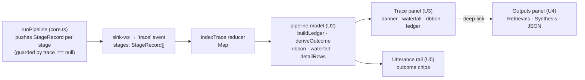

# feat: Pipeline Trace Debug page

## Summary

Rebuild the center **Trace** column of the local-mic debug page (`apps/portal/app/(authed)/debug/live-mic/`) into the *Pipeline Trace Debug* design: a per-utterance, gate-by-gate ledger of how each finalized utterance flowed through `runPipeline`. The hero is a stage ledger with a terminal-**outcome banner**, an **end-to-end latency waterfall**, a **suppression-gate ribbon**, and **expandable per-stage detail grids** with PASS / SKIP / MISS / FAIL-OPEN status; the utterance rail gains **terminal-outcome chips** (GROUNDED · MISS·GAP · SKIPPED · UNGROUNDED); and Retrievals + Synthesis collapse into a **tabbed Outputs panel** (Retrievals · Synthesis · Trace JSON) that stage rows deep-link into.

The design models the pipeline as **16 stages**, but the live trace contract emits only **8** discrete `PipelineStage` records today. Per the chosen direction (full fidelity), this plan **enriches the trace** in the bot-worker core to emit the currently-implicit stages (empty-query, router, no-hits, emit, skill, refusal-gate, reveal) so the ledger is complete and faithful to `runPipeline` — while keeping the live Recall path zero-cost (trace work stays guarded behind the optional trace sink). Everything renders from the **live WS trace**, never seed data.

---

## Problem Frame

The current debug page (`_trace-panel.tsx`, 461 lines) already indexes a real per-utterance trace, but renders it as a flat list of 8 `StageRow`s with terse stage-specific detail. It answers "what stages ran" but not, at a glance: *where did this utterance end up, and why?* There is no terminal outcome, no sense of where latency went, no one-line "which gate killed it" ribbon, and several meaningful pipeline decisions (empty-query gate, router fire/skip, no-hits → knowledge-gap, card emit + stale retraction, the refusal vs reveal split) are never surfaced because the core doesn't emit them as trace stages.

The design's thesis (from the handoff chat): *"the empty Trace column is the whole point of a pipeline debugger"* — it should become a gate-by-gate ledger showing every stage, its status, what it returned, and its latency, with a terminal-outcome banner and a suppression-gate ribbon. Clicking an utterance drives the trace; clicking a stage jumps the Outputs panel to the relevant tab.

**Who it's for:** the developer debugging why a given utterance did or didn't surface a grounded card — the same person who, in the prior session, had to reason about two duplicate Claude syntheses by hand. This page should make that reasoning visual and per-stage.

---

## Requirements

- **R1.** Each finalized utterance shows a **terminal outcome** — one of `grounded · miss(→gap) · skip(heuristic) · skip(judge) · ungrounded · refusal` — derived from its real trace, in both the rail (chip) and the trace header (banner).
- **R2.** The trace shows a **complete 16-row stage ledger** in canonical pipeline order, each row carrying: stage code (PRE / S04–S17), name, engine, latency (ms), the returned result line, a PASS/SKIP/MISS/FAIL-OPEN status chip, and an expandable key/value **detail grid**. Stages downstream of a terminal stop render greyed ("not reached").
- **R3.** A **suppression-gate ribbon** renders the one-line chain (`threshold › cooldown › empty › relevance › floor › CRAG › no-hits › refusal › citations`), colored to show where the utterance died.
- **R4.** An **end-to-end latency waterfall** renders proportional, per-stage colored segments so the expensive stages (judge, CRAG, synthesis) are obvious; an end-to-end total is shown.
- **R5.** The bot-worker trace emits discrete records for the currently-implicit stages so the ledger is faithful: **empty-query, router, no-hits, emit, skill, refusal-gate, reveal** — in addition to the existing 8.
- **R6.** The **live Recall path stays zero-cost**: all new trace work is guarded behind the optional trace sink (no allocations/pushes when `recordTrace` is absent), preserving KTD4/R5 from the consolidation.
- **R7.** Outputs collapse into a **tabbed panel** — Retrievals (distance / RRF / rerank / body size per hit), Synthesis (grounded answer + verified citations, or the suppressed/ungrounded state), Trace JSON (the selected utterance's trace) — and stage detail rows **deep-link** to the relevant tab.
- **R8.** Everything renders from the **live WS trace + events** for the selected utterance; no seeded/mock data ships.
- **R9.** Threshold + cooldown render as **informational PRE rows** marked "not gated in dev" (the dev path runs `runPipeline` directly and does not apply the prod adapter's throttle) — no fabricated trace records.

---

## High-Level Technical Design

### Stage mapping: design ledger → real trace

The portal owns a **canonical display catalog** that maps each design ledger row to a real trace stage id (or marks it portal-derived). Two real stages (`heuristic-gate` + `llm-judge`) merge into one **Relevance** display row whose detail grid carries both sub-decisions.

| # | Design row (code) | Real trace stage id | Source |
|---|---|---|---|
| 1 | Utterance gate (PRE) | — | **portal-derived** info row ("not gated in dev", R9) |
| 2 | Cooldown (PRE) | — | **portal-derived** info row ("not gated in dev", R9) |
| 3 | Empty-query gate (S04) | `empty-query` | **NEW** (U1) |
| 4 | Relevance gate (S05) | `heuristic-gate` + `llm-judge` | existing, **merged** at display (U2) |
| 5 | Router (parallel) (S06) | `router` | **NEW** (U1) |
| 6 | Embed (S07) | `embed` | existing |
| 7 | Hybrid search (S08) | `hybrid-search` | existing (`data.hits`) |
| 8 | CRAG expansion (S09) | `crag` | existing |
| 9 | No-hits gate (S10) | `no-hits` | **NEW** (U1) |
| 10 | Enrichment (S11) | `dedup-expand` | existing |
| 11 | Emit cards (S12) | `emit` | **NEW** (U1) |
| 12 | Router collect + skill (S13) | `skill` | **NEW** (U1) |
| 13 | Synthesis (S14) | `synthesis` | existing |
| 14 | Refusal gate (S15) | `refusal-gate` | **NEW** (U1) |
| 15 | Citation verify (S16) | `citation-verify` | existing |
| 16 | Reveal (S17) | `reveal` | **NEW** (U1) |

> Directional, not a contract: the portal catalog is the source of truth for *display order, codes, names, ribbon membership, and outputs deep-links*; the trace is the source of truth for *what actually ran*. A stage id present in the catalog but absent from a given trace renders as "not reached" if downstream of a stop, or omitted-as-skipped per its status.

### Status palette (matches the mockup; diagnostic surface)

```
pass       #46c08a  proceeded
skip       #e6a23c  gated (recordSkip)
miss       #f0616d  recordMiss (no_hits / refusal / ungrounded)
failopen   #4d8df6  error/timeout but proceeded
notreached #4a4b57  downstream of a stop
```

`StageStatus` (`ran|skipped|short_circuited`) + the stage's `decision`/`reason` map to this display palette in U2: a `short_circuited` relevance gate → `skip`; a `no-hits`/`citation-verify` miss → `miss`; a CRAG that ran on a miss but did not adopt → `failopen`; a stage past the terminal stop → `notreached`.

### Data flow



---

## Key Technical Decisions

- **KTD1 — Enrich the trace, don't fake it.** The 7 new stages are emitted by `runPipeline` from real execution state (U1), not synthesized in the portal. This keeps "the trace validates prod by construction" true and means the eval/dev sinks get the richer trace for free. Threshold/cooldown are the only portal-derived rows, and they are explicitly labeled "not gated in dev" rather than fabricated (R9) — because the dev path genuinely doesn't run the prod throttle.
- **KTD2 — Zero-cost on the live path is non-negotiable.** Every new `trace.push(...)` sits inside the existing `if (trace !== null)` guards (R6). The prod Supabase sink has no `recordTrace`, so `tracing` is false and none of the new records allocate. U1 tests assert this.
- **KTD3 — Merge `heuristic-gate` + `llm-judge` into one Relevance display row.** The mockup shows a single "Relevance gate" row with heuristic + judge inside its detail grid. This is a portal display concern (U2), not a contract change — the two real records still exist on the wire.
- **KTD4 — Portal keeps its own stage catalog + types.** The portal does not import bot-worker types (cross-package, React peer deps). `_trace-panel.tsx` already duplicates `PipelineStage`/`StageRecord`; U2 extends that local copy with the new ids and owns the display catalog. The bot-worker contract is the wire format; the portal catalog is the presentation.
- **KTD5 — Reuse the real synthesis renderer.** The Synthesis tab reuses the existing `@risezome/hud-ui` `SynthesisStream` + the card/citation rendering already wired in `_client.tsx`, rather than re-implementing the mockup's static answer card — so streaming, citations, and the suppressed/ungrounded state stay correct.
- **KTD6 — Derive outcome + waterfall in pure functions.** `deriveOutcome`, `buildLedger`, `reachedCount`, `stageDetailRows`, and `waterfallSegments` are pure (U2), unit-tested independently of React, mirroring the existing `indexTrace` test posture.

---

## Implementation Units

### U1. Enrich the pipeline trace with the full stage set (bot-worker)

**Goal:** Emit discrete trace records for the currently-implicit pipeline stages so the dev ledger is faithful to `runPipeline`, with zero cost on the untraced (prod) path.

**Requirements:** R5, R6.

**Dependencies:** none.

**Files:**
- `apps/bot-worker/src/pipeline/contract.ts` — extend the `PipelineStage` union with `'empty-query' | 'router' | 'no-hits' | 'emit' | 'skill' | 'refusal-gate' | 'reveal'`.
- `apps/bot-worker/src/pipeline/core.ts` — add `trace.push(stageRecord(...))` calls (all inside existing `if (trace !== null)` guards) at: the empty-query early return; after the router-eligibility/parallel-classifier decision (`router`); the `hits.length === 0` branch (`no-hits`, distinct from the empty `hybrid-search` record); after the card-emit loop (`emit` — emitted/retracted counts); inside `collectToolSource` (`skill` — fired/kept/dropped via safety-net); in `runSynthesis` at the STATUS check (`refusal-gate`) and at the grounded reveal (`reveal`).
- `apps/bot-worker/test/pipeline/sink-ws.test.ts`, `apps/bot-worker/test/pipeline/sink-supabase.test.ts` — extend.
- (No change to `sink-ws.ts`: it forwards `stages: trace.stages` verbatim, so new records flow automatically.)

**Approach:** Follow the existing `stageRecord(stage, status, startedAt, { decision, reason, data })` helper and the established status vocabulary (`ran | skipped | short_circuited`). Carry the same per-stage facts the mockup's detail grids show (e.g. `emit`: `{ emitted, retracted }`; `router`: `decision: 'fired'|'not_fired'`, `reason: 'not_tool_shaped'|...`; `no-hits`: `decision: 'miss'`, `reason: 'no_hits_after_crag'`, `data: { filler: boolean }`; `skill`: `decision: 'kept'|'dropped'|'none'`; `refusal-gate`: `decision: 'pass'|'refusal'`; `reveal`: `data: { encrypted: true }`). Push records in execution order so the stages array is naturally ordered.

**Patterns to follow:** the existing trace pushes in `apps/bot-worker/src/pipeline/core.ts` (`heuristic-gate`, `crag`, `citation-verify`) and the `stageRecord` helper; the zero-cost guard pattern (`const tracing = sink.recordTrace !== undefined`).

**Test scenarios:**
- Grounded utterance: trace now contains `empty-query`(ran), `router`(ran, not_fired), `no-hits`(ran, pass — hits present), `emit`(ran, emitted≥1), `skill`(ran/none), `refusal-gate`(ran, pass), `reveal`(ran) in addition to the existing stages.
- Miss → gap utterance (0 hits after CRAG): `no-hits` record has status reflecting the miss + `decision: 'miss'`, and stages after it are absent (pipeline returns).
- Heuristic filler skip: still short-circuits at `heuristic-gate`; no `empty-query`/`router`/downstream records emitted.
- Judge skip: `llm-judge` short_circuits; downstream stages absent.
- Ungrounded: `refusal-gate`(pass) present, `citation-verify`(miss) present, `reveal` absent.
- **Zero-cost:** with a sink lacking `recordTrace` (prod-shaped), `runPipeline` pushes no trace records and the new branches allocate nothing (assert via a sink spy that `recordTrace` is never called and outputs are unchanged from the pre-U1 baseline).

---

### U2. Portal pipeline-model: stage catalog + outcome/ledger/ribbon/waterfall derivation (pure, tested)

**Goal:** A pure, React-free module that turns a `UtteranceTrace` into everything the UI renders: the ordered 16-row ledger, the terminal outcome, the ribbon, the waterfall segments, the reached-count, and per-stage detail rows.

**Requirements:** R1, R2, R3, R4, R9; supports KTD3, KTD6.

**Dependencies:** U1 (new stage ids).

**Files:**
- `apps/portal/app/(authed)/debug/live-mic/_pipeline-model.ts` (new) — exports: `STAGE_CATALOG` (ordered `{ id, code, name, engine, ribbon?, outputsLink? }`), `STATUS_COLORS`, `deriveOutcome(trace)`, `buildLedger(trace)`, `reachedCount(ledger)`, `gateRibbon(ledger)`, `waterfallSegments(ledger)`, `stageDetailRows(record)`.
- `apps/portal/app/(authed)/debug/live-mic/_trace-panel.tsx` — extend the local `PipelineStage`/`StageRecord` types with the new ids (the wire types the panel already duplicates).
- `apps/portal/test/live-mic-pipeline-model.test.ts` (new).

**Approach:** `STAGE_CATALOG` is the canonical display list including the two portal-derived PRE rows (threshold/cooldown, flagged `derived: true`). `buildLedger` walks the catalog, joins each row to the matching trace record(s) (merging `heuristic-gate`+`llm-judge` → Relevance per KTD3), maps `StageStatus` + `decision`/`reason` → display status (pass/skip/miss/failopen/notreached), and marks every catalog row after the terminal stop as `notreached`. `deriveOutcome` reads the terminal (last non-`notreached`, non-pass) stage to classify `grounded|miss|skip|ungrounded|refusal` and composes the headline/sub/ms (ms = sum of stage latencies). `stageDetailRows` flattens a record's `decision`/`reason`/`data` into `[label, value][]` for the detail grid. PRE rows always resolve to an informational "not gated in dev" line (R9).

**Patterns to follow:** the existing `indexTrace`/`STAGE_ORDER` pure helpers in `_trace-panel.tsx`; the mockup's `build(diedAt, ov)` + `COLORS`/`statusMeta` in `risezome/project/components/debug-data.jsx` for the downstream-of-stop and palette semantics.

**Test scenarios:**
- `deriveOutcome` returns `grounded` for a full-reach trace; `miss` when terminal stop is `no-hits`; `skip` for `heuristic-gate`/`llm-judge` short-circuits; `ungrounded` when `citation-verify` is a miss; `refusal` when `refusal-gate` decided refusal.
- `buildLedger` marks all rows after the stop `notreached`; a grounded trace reaches 16/16; a judge-skip reaches through Relevance then greys the rest.
- Relevance row merges heuristic + judge detail into one row (KTD3).
- `gateRibbon` colors the ribbon segment where the utterance died (skip→amber, miss→red).
- `waterfallSegments` produces proportional widths summing to ~100% and excludes zero-latency stages from labels.
- `stageDetailRows` transforms a `hybrid-search` record (`data.hits`, count) and a `citation-verify` record (total/surviving/dropped) into readable key/value pairs.
- PRE rows always render the "not gated in dev" informational line (R9).

---

### U3. Trace panel redesign — outcome banner, latency waterfall, gate ribbon, stage ledger (the hero)

**Goal:** Replace the flat `StageRow` list with the design's hero: outcome banner + waterfall, suppression-gate ribbon, and the spine/node stage ledger with expandable detail grids and outputs deep-links.

**Requirements:** R2, R3, R4, R7 (deep-link emit), R8.

**Dependencies:** U2.

**Files:**
- `apps/portal/app/(authed)/debug/live-mic/_trace-panel.tsx` — rewrite the render layer (keep `indexTrace` + the `UtteranceTrace`/`StageRecord` types).
- `apps/portal/test/live-mic-trace.test.tsx` — update for the new structure (keep the `indexTrace` tests).

**Approach:** Translate `risezome/project/components/debug-trace.jsx` (outcome banner, `Waterfall`, `GateRibbon`, `StageRow` with spine/node + chip + expandable `[k,v]` grid + `view {link} →` button) into the portal's Tailwind + token system. Drive entirely from U2's `buildLedger`/`deriveOutcome`/`gateRibbon`/`waterfallSegments`. Status colors come from `STATUS_COLORS`. The stage row's expandable grid renders `stageDetailRows(record)`; rows carrying an `outputsLink` render a deep-link button that calls an `onOpenOutput(tab)` prop (wired in U5). Header shows `Pipeline trace · {traceId}` + the utterance text; ledger header shows `Stage ledger · {reached}/16 reached`. Empty state distinguishes "no utterance selected" from "gated/in-flight".

**Patterns to follow:** `risezome/project/components/debug-trace.jsx` for layout/visual treatment; existing `_trace-panel.tsx` `StatusBadge`/`StageRow` for the Tailwind token vocabulary (`text-fg`, `text-muted`, `bg-card`, `border-border`, emerald/amber/rose); the portal `globals.css` token set.

**Test scenarios:**
- Renders the outcome banner with the correct headline + end-to-end seconds for a grounded trace; a `MISS · GAP` banner for a miss.
- Renders the suppression-gate ribbon with the dying segment colored.
- Stage detail grid toggles open/closed on click; a stage with no detail is not clickable.
- Stages downstream of a stop render greyed ("not reached") and are not expandable.
- A stage with `outputsLink` renders the deep-link button and fires `onOpenOutput` with the right tab.
- Covers R2/R3/R4: ledger shows 16 rows with codes PRE/S04–S17 in order.

---

### U4. Tabbed Outputs panel — Retrievals · Synthesis · Trace JSON

**Goal:** Collapse the separate Retrievals + Synthesis columns into one tabbed panel and add a Trace JSON tab, deep-linkable from stage rows.

**Requirements:** R7, R8.

**Dependencies:** U2 (outcome state for the suppressed/ungrounded synthesis treatment).

**Files:**
- `apps/portal/app/(authed)/debug/live-mic/_outputs-panel.tsx` (new) — `OutputsPanel` with `tab` + `onTab` props and `retrievals | synthesis | json` tabs.
- `apps/portal/test/live-mic-outputs.test.tsx` (new).

**Approach:** Translate `risezome/project/components/debug-outputs.jsx`. **Retrievals**: the selected utterance's card group (existing `cardGroups` in `_client.tsx`) rendered as ranked rows with distance / RRF / rerank / body-size and the top-match flag; empty states distinguish "gated before embed" vs "no hits survived the floor". **Synthesis**: reuse the existing `@risezome/hud-ui` `SynthesisStream` + sources already wired in `_client.tsx` (KTD5), plus the suppressed/ungrounded treatment (struck-through answer + "grounded-or-nothing killed this" note) driven by U2's outcome and the `synthesisRefusal` event. **Trace JSON**: pretty-print the selected `UtteranceTrace` (reached stages only), matching the mockup's JSON shape. Tab state is owned by `_client.tsx` (U5) so stage deep-links can switch it.

**Patterns to follow:** `risezome/project/components/debug-outputs.jsx` (tab bar, `Retrievals`/`Synthesis`/`Json`, `SrcPill`, `Cite`, `Empty`); the existing Retrievals + Synthesis rendering in `_client.tsx` for the real data shapes (`cardGroups`, `SynthesisStream`, `skillResults`).

**Test scenarios:**
- Tab bar switches between Retrievals / Synthesis / Trace JSON; counts render per tab.
- Retrievals render rank, source, distance, RRF, rerank, body size; top-match flagged.
- Retrievals empty state differs for a `skip` (gated before embed) vs a `miss` (no hits survived floor).
- Synthesis renders a grounded answer with verified citation chips; an ungrounded outcome renders the struck-through suppressed answer + grounded-or-nothing note.
- Trace JSON tab pretty-prints the selected utterance's reached stages.
- `onTab` is called when a tab is clicked (deep-link target for U3).

---

### U5. Utterance-rail outcome chips, header context strip, and 3-zone layout assembly

**Goal:** Wire the three zones together: outcome chips on the rail, the topic/open-Q/key-terms context strip in the header, and the relayout from four columns to Utterances rail · Trace hero · Outputs tabs — with stage deep-links switching the Outputs tab.

**Requirements:** R1, R7, R8.

**Dependencies:** U3, U4.

**Files:**
- `apps/portal/app/(authed)/debug/live-mic/_client.tsx` — relayout (`DebugInner`), add `selectedOutputTab` state + `onOpenOutput` handler, render outcome chips per rail row, restyle the header context strip.
- `apps/portal/test/live-mic-trace.test.tsx` — add rail/integration assertions (or a small `_client` integration test if feasible).

**Approach:** Compute each rail row's terminal outcome from its trace via `deriveOutcome` (U2) — rows without a trace yet show a neutral/pending pip. Add the `OutcomePip` chip from `risezome/project/components/debug-rail.jsx`. Restyle the existing `SummaryStrip` into the header **context strip** (TOPIC · OPEN Q · KEY TERMS) per the mockup header. Replace the 4-column grid with a 3-zone layout: rail (left), `TracePanel` (center, hero), `OutputsPanel` (right). Lift Outputs `tab` state into `DebugInner`; pass `onOpenOutput(tab)` into `TracePanel` so a stage's deep-link sets the active Outputs tab and (if needed) scrolls it into view. Preserve all existing WS wiring, the HUD providers, and `indexTrace`.

**Patterns to follow:** `risezome/project/components/debug-rail.jsx` (rail rows + `OutcomePip`) and the mockup header/context strip in `risezome/project/Pipeline Trace Debug.html` / `screen-live.jsx`; the existing `DebugInner` layout, `SummaryStrip`, and provider wiring in `_client.tsx`.

**Test scenarios:**
- A rail row whose trace is grounded shows the GROUNDED chip; a miss shows MISS·GAP; a judge-skip shows SKIPPED; an ungrounded shows UNGROUNDED.
- A rail row with no trace yet shows the neutral/pending state (no crash).
- Selecting an utterance drives both the Trace panel and the Outputs panel to that utterance.
- A stage deep-link in the Trace panel switches the Outputs tab (e.g. Hybrid search → Retrievals; Synthesis → Synthesis).
- The header context strip renders topic, open question, and key terms from the rolling summary.
- Covers R1/R8: the whole zone updates coherently on selection.

---

## Scope Boundaries

**In scope**
- The dev-only local-mic debug page (`apps/portal/app/(authed)/debug/live-mic/`).
- Trace-contract enrichment in the bot-worker core (dev/eval trace path only; prod stays zero-cost).

**Deferred to Follow-Up Work** (the design chat's suggested next steps)
- **Side-by-side trace compare** — two utterance traces diffed in parallel.
- **Live-streaming stage lighting** — stages light up pending → resolved in real time as an utterance flows through, rather than appearing all at once on the terminal `trace` event. (Would need per-stage WS events, not just the terminal trace.)
- **Per-LLM-stage prompt-cache hit / cost** surfacing for spend debugging.

**Out of scope (non-goals)**
- Changing any pipeline *behavior* — this is observability only.
- The production live-meeting page (`apps/portal/.../meetings/[meetingId]/live`) — untouched.
- Persisting traces to the database — traces remain in-browser for the session, as today.

---

## Risks & Dependencies

- **Live-path latency regression (highest-care).** New trace pushes must stay inside the `if (trace !== null)` guards. *Mitigation:* U1's zero-cost test asserts `recordTrace`-absent sinks allocate/push nothing; review the diff specifically for any push outside a guard.
- **Catalog ↔ trace drift.** If a future pipeline change adds/removes a stage, the portal catalog can fall out of sync. *Mitigation:* `buildLedger` renders any catalog row with no matching record honestly (not-reached/skipped) and tolerates unknown trace ids by appending them; a model test pins the 16-row catalog order.
- **Synthesis renderer reuse.** Reusing `SynthesisStream` inside a tab (vs the old dedicated column) must preserve streaming + citation behavior. *Mitigation:* KTD5 keeps the existing component; U4 tests cover grounded + ungrounded.
- **Threshold/cooldown honesty.** Showing PRE rows that don't exist in dev risks implying they ran. *Mitigation:* R9 — explicit "not gated in dev" label, no fake records.

---

## Sources & Research

- **Design bundle** (Claude Design handoff): `Pipeline Trace Debug.html` + `debug-data.jsx` (data model / 16-stage canon / palette), `debug-trace.jsx` (hero panel), `debug-outputs.jsx` (tabbed outputs), `debug-rail.jsx` (rail + outcome chips). Intent transcript: `risezome/chats/chat1.md` lines 1561–1668 ("the empty Trace column is the whole point of a pipeline debugger").
- **Current implementation:** `apps/portal/app/(authed)/debug/live-mic/{page,_client,_trace-panel}.tsx`, `apps/portal/test/live-mic-trace.test.tsx`.
- **Trace contract / emission:** `apps/bot-worker/src/pipeline/{contract,core,sink-ws}.ts`, `apps/bot-worker/src/debug/local-debug-ws.ts`. The `trace` WS event forwards `StageRecord[]` verbatim, so new stage ids reach the portal without a sink change.
- **Consolidated pipeline reference:** `docs/plans/2026-06-04-001-refactor-unify-retrieval-pipeline-plan.md` (U5 shipped the initial trace debugger; KTD4/R5 established the zero-cost optional-trace contract this plan preserves).
