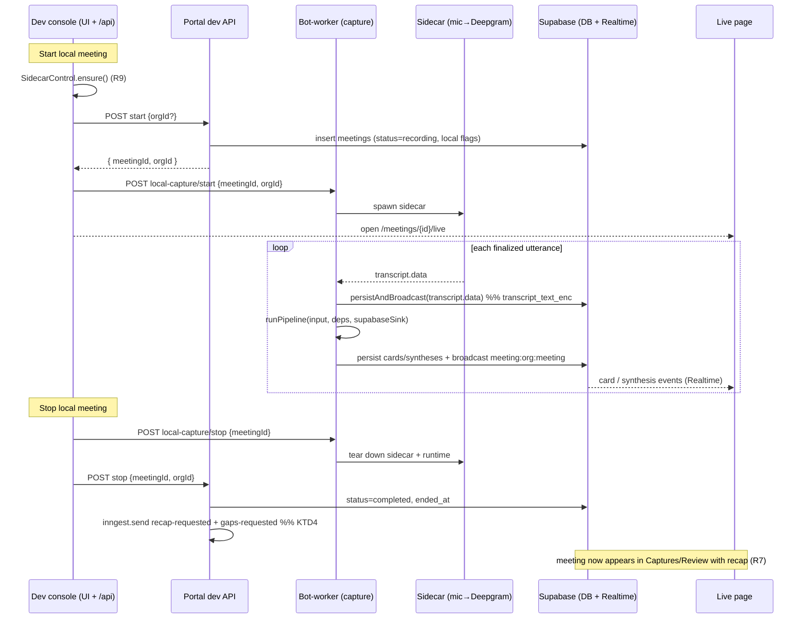

# feat: Local-audio live meeting capture (dev)

## Summary

Add a dev-only **Start / Stop local meeting** control on the dev console that captures a **real meeting from local microphone audio** instead of a Recall.ai bot. Start mints an ad-hoc `meetings` row in the dev org, begins capturing from the local sidecar (mic → Deepgram), and the audio drives the **same production retrieval/synthesis pipeline** a Recall meeting uses — cards, syntheses, and transcript persist to the meeting and broadcast over Supabase Realtime to the (unchanged) live page. Stop marks the meeting `completed` and fires the **same** post-meeting jobs (recap + knowledge-gaps), so it lands in Captures/Review with full fidelity. The **only** difference from a Recall meeting is where the audio comes from — which makes it a free way to dogfood the *entire* app.

This reuses the consolidated `runPipeline` + the production Supabase sink + transcript persistence **unchanged** (the local path only swaps the audio *source*). The Recall ingest path is untouched.

---

## Problem Frame

Capturing meeting data today means launching a paid Recall.ai bot, so every dogfood/test meeting costs money. The sidecar → Deepgram → `runPipeline` path already works locally (the local-mic debug page proves it), but it streams to a *debug* surface (`sink-ws`) and never persists as a real meeting. We want to feed that same local audio into the **production persist+broadcast path** bound to a real meeting, end-to-end through Captures/Review/recap/gaps — free, and exercising every downstream feature.

(see origin: `docs/brainstorms/2026-06-04-local-audio-live-meeting-capture-requirements.md`)

---

## Requirements

Carried from the origin doc (R1–R10):

- **R1.** Dev console exposes **Start / Stop local meeting** (dev-only; not product UI).
- **R2.** Start creates a **real ad-hoc `meetings` row** in the current dev org, no calendar event, distinguishable as local.
- **R3.** Start begins capturing from the **local sidecar** (mic → Deepgram) bound to that meeting; the meeting's live page is reachable.
- **R4.** Local audio drives the **same pipeline as Recall** — cards/syntheses/transcript **persist to the meeting** and **broadcast over Realtime**. The live page is unchanged (source-agnostic).
- **R5.** The live page shows cards + streaming syntheses in real time, identical to a Recall meeting.
- **R6.** Stop ends capture, marks the meeting **`completed`**, and fires the **same post-meeting jobs** — recap **and** knowledge-gaps.
- **R7.** The completed local meeting appears in **Captures and Review** with full fidelity (transcript, cards, syntheses, recap).
- **R8.** **One local meeting at a time** (one mic); starting another while active is rejected with a clear message.
- **R9.** Start reuses the dev console's **existing sidecar readiness/build check**; no sidecar → build or clear error.
- **R10.** **Recall behavior unchanged** — a local meeting never launches a Recall bot; production Recall meetings are unaffected.

---

## Key Technical Decisions

- **KTD1 — Reuse the pipeline + sink unchanged; swap only the audio source.** The local capture builds the *same* `createSupabaseSink` + `PipelineDeps` the Recall path builds (in `apps/bot-worker/src/retrieval.ts` / `index.ts`) and calls the same `runPipeline` (`apps/bot-worker/src/pipeline/core.ts`). The utterances come from the sidecar instead of the Recall WS. No fork of the pipeline or sink. *(R4)*
- **KTD2 — Split orchestration by where the dependencies already live.** Three thin surfaces:
  - **bot-worker** owns *capture* (sidecar + pipeline + Supabase sink + transcript persistence) — it already has all of these.
  - **portal** owns *meeting lifecycle* (mint the row; on stop mark `completed` + fire the Inngest jobs) — it already has the `inngest` client, the service-role client, and the exact end-of-meeting logic in the Recall webhook.
  - **dev console** is the thin **trigger + UI** that sequences them.
  This avoids reimplementing Inngest-send in the dev console or meeting-mint in the bot-worker.
- **KTD3 — Flag a local meeting with existing nullable fields, no migration.** `conference_url = null`, `calendar_event_id = null`, `title = "Local meeting <timestamp>"`. The live-dedup unique index only applies when `conference_url` is non-null, so null avoids any collision. *(R2; user-confirmed — no schema change)*
- **KTD4 — Stop mirrors the Recall webhook exactly.** Set `status='completed'` + `ended_at`, then `inngest.send` **both** `risezome/meeting.recap-requested` and `risezome/meeting.gaps-requested` with `{ meetingId, orgId }` — so the local meeting exercises the *full* post-meeting feature set, not just recap. *(R6, R7; user-confirmed — "all features working")*
- **KTD5 — Single concurrent local capture.** The bot-worker enforces one active local capture; a second Start is rejected (surfaced by the dev console). One mic = one meeting. *(R8)*
- **KTD6 — Additive + dev-guarded; Recall path untouched.** The new bot-worker control and portal route are dev-only (guarded; the bot-worker control reuses the `BOT_WORKER_SECRET` shared-secret pattern). `index.ts`'s Recall ingest is unchanged. *(R10)*
- **KTD7 — The live page needs zero changes.** It's a source-agnostic Realtime subscriber on `meeting:${orgId}:${meetingId}`; the Supabase sink already broadcasts there. *(R4, R5)*
- **KTD8 — Dev-org resolution.** The portal dev route resolves "the dev org" from an env var (e.g. `RISEZOME_DEV_ORG_ID`) when set, else the single/most-recent org. Exact fallback is an execution-time detail.

---

## High-Level Technical Design

Cross-process orchestration — the dev console sequences a portal lifecycle API and a bot-worker capture control; everything downstream of "utterance" is the unchanged production path.

---

## Implementation Units

### U1. Bot-worker local-capture control (sidecar → pipeline → Supabase sink)

**Goal:** A dev-only control on the bot-worker that, given a real `meetingId`/`orgId`, captures from the local sidecar and drives the **production** pipeline + Supabase sink + transcript persistence — the core mechanism. Start/stop, one active capture at a time.

**Requirements:** R3, R4, R5, R8, R10.

**Dependencies:** none.

**Files:**
- `apps/bot-worker/src/debug/local-capture.ts` (new) — the capture controller: spawn sidecar, per-utterance persist transcript + run the pipeline, teardown.
- `apps/bot-worker/src/index.ts` — register a dev-only HTTP control surface (`/local-capture/start` + `/stop`), `BOT_WORKER_SECRET`-guarded (mirror the existing bot-worker control/`notifyBotWorkerEnd` auth pattern).
- Reuse (do not fork): `apps/bot-worker/src/pipeline/core.ts` (`runPipeline`), `apps/bot-worker/src/pipeline/sink-supabase.ts` (`createSupabaseSink`), `apps/bot-worker/src/retrieval.ts` (the Recall path's `PipelineDeps`/runtime/sink construction — factor a shared builder if it isn't already callable standalone), `apps/bot-worker/src/db.ts` (`persistAndBroadcast` for `transcript.data`), `apps/bot-worker/src/debug/sidecar-runner.ts` (sidecar lifecycle), `apps/bot-worker/src/debug/local-debug-ws.ts` (existing sidecar→pipeline wiring to mirror — but with the Supabase sink, not `sink-ws`).
- `apps/bot-worker/test/debug/local-capture.test.ts` (new).

**Approach:** Mirror `local-debug-ws.ts`'s sidecar→`runPipeline` wiring, but (a) bind to the passed real `meetingId`/`orgId` (not the dev placeholder), (b) use `createSupabaseSink` (persist + broadcast) instead of `createWsSink`, and (c) on each finalized utterance ALSO call `persistAndBroadcast` for the `transcript.data` event (the Recall path persists transcripts; the debug path doesn't — the local capture must, so Review shows the transcript). Construct `PipelineDeps` the same way the Recall path does (embedder, synthesizer, relevance/router classifiers, skill registry, hybridSearch, reranker, parent-doc, `relevanceStrict`, `topK`). Track a single active capture; reject a second start while one runs (KTD5). Stop tears down the sidecar + any in-flight runtime cleanly.

**Patterns to follow:** `apps/bot-worker/src/debug/local-debug-ws.ts` (sidecar→pipeline wiring), `apps/bot-worker/src/retrieval.ts` (`maybeRetrieveAndEmit` deps + `createSupabaseSink` + `RetrievalRuntime` with `liveCardByDocId`), the Recall WS handler in `apps/bot-worker/src/index.ts` (meeting-bound runtime + teardown via `notifyBotWorkerEnd`).

**Test scenarios:**
- *Covers R4.* Given a fake sidecar feeding a finalized utterance, the controller calls `runPipeline` with a Supabase sink bound to the passed `meetingId`/`orgId` (assert the sink received the meeting/org; cards/syntheses go through the persist+broadcast path, not `sink-ws`).
- *Covers R4/R7.* A `transcript.data` utterance triggers `persistAndBroadcast` (transcript persisted) in addition to running the pipeline.
- *Covers R8.* Start while a capture is already active → rejected with a clear error; the first capture is unaffected.
- Stop tears down the sidecar and marks the controller idle (a subsequent Start succeeds).
- *Error path.* Sidecar spawn fails → start returns a clear error, no partial/zombie capture left registered.
- *Auth.* The control endpoint rejects a request without the shared secret.

---

### U2. Portal dev-only local-meeting lifecycle API (mint + complete + Inngest)

**Goal:** A dev-guarded portal route that mints the ad-hoc meeting on start and, on stop, marks it `completed` and fires the same post-meeting Inngest jobs the Recall webhook fires.

**Requirements:** R2, R6, R7, R10.

**Dependencies:** none (independent of U1).

**Files:**
- `apps/portal/app/api/dev/local-meeting/route.ts` (new) — `start` (mint) + `stop` (complete + Inngest), guarded to non-production.
- Reuse: `apps/portal/src/inngest/client.ts` (`inngest.send`), `apps/portal/app/api/recall/webhook/route.ts` (the end-of-meeting block — `status='completed'` + `ended_at` + `recap-requested` + `gaps-requested` — as the pattern to mirror), the service-role client (`createServiceRoleClient` / `app/_lib/supabase-server`).
- `apps/portal/test/api/dev-local-meeting.test.ts` (new).

**Approach:** Dev guard first (return 404/403 when `NODE_ENV === 'production'`). **start:** resolve the dev org (KTD8), insert a `meetings` row with `status='recording'`, `conference_url=null`, `calendar_event_id=null`, `title="Local meeting <ts>"`, `started_at=now`; return `{ meetingId, orgId }`. **stop:** update `status='completed'`, `ended_at=now` (org-scoped), then `inngest.send` `risezome/meeting.recap-requested` and `risezome/meeting.gaps-requested` with `{ meetingId, orgId }` — copying the webhook's exact event names/payloads (KTD4). Service-role throughout (no user session; dev-only).

**Patterns to follow:** the completion block in `apps/portal/app/api/recall/webhook/route.ts` (the `update(...).eq(meeting_id).eq(org_id)` + the two `inngest.send` calls); existing dev/debug API routes for the dev-guard shape; `apps/portal/app/api/inngest/route.ts` for the registered event names.

**Test scenarios:**
- *Covers R2.* start inserts a meeting in the resolved dev org with `status='recording'`, null `conference_url`/`calendar_event_id`, and a "Local meeting …" title; returns its id.
- *Covers R6.* stop sets `status='completed'` + `ended_at` and sends **both** `recap-requested` and `gaps-requested` with the correct `{ meetingId, orgId }` (assert via a mocked `inngest.send`).
- *Covers R10.* The route is rejected/404 when `NODE_ENV==='production'`.
- *Edge.* stop on an unknown/foreign-org meeting id → no-op/error, no events sent.
- Org resolution: with `RISEZOME_DEV_ORG_ID` set it's honored; unset → falls back deterministically.

---

### U3. Dev console Start/Stop local meeting (routes + orchestration + UI)

**Goal:** The dev-console trigger: a Start/Stop control that ensures the sidecar, sequences the portal mint + bot-worker capture, surfaces the live link and the active-meeting state, and runs the stop teardown.

**Requirements:** R1, R3, R8, R9.

**Dependencies:** U1, U2.

**Files:**
- `scripts/dev-console/server.ts` — add `POST /api/local-meeting/start` + `/stop` routes; track active-local-meeting in console state (surfaced via `/api/state`).
- `scripts/dev-console/local-meeting-control.ts` (new) — orchestration: ensure sidecar → portal start → bot-worker start (and the reverse on stop); holds the single active meeting.
- `scripts/dev-console/sidecar-control.ts` — reuse `SidecarControl.ensure()`/`status()` (R9).
- `scripts/dev-console/public/*` — Start/Stop buttons, active-meeting indicator + live-page link, error surfacing.
- `scripts/dev-console/test/local-meeting.test.ts` (new) or extend `test/dev-console/server.test.ts`.

**Approach:** **Start:** call `SidecarControl.ensure()` (build if needed, clear error if it can't — R9); `POST` the portal start route → get `{ meetingId, orgId }`; `POST` the bot-worker capture-start; record the active meeting + expose the `/meetings/<id>/live` URL (open or link). Block a second Start while one is active (R8) with a clear message. **Stop:** `POST` bot-worker capture-stop, then `POST` portal stop (complete + Inngest); clear active state. Surface failures distinctly (no sidecar, bot-worker unreachable, portal unreachable) rather than a silent dead live page. Reuse the existing `/api/state` + SSE event stream for status.

**Patterns to follow:** `scripts/dev-console/server.ts` route handlers (`/api/sidecar/ensure`, `controlItem`, `/api/state`, `/api/events` SSE) and `scripts/dev-console/sidecar-control.ts`; the existing dev-console UI in `scripts/dev-console/public/`.

**Test scenarios:**
- *Covers R1/R3.* Start (sidecar ready) calls portal-start then bot-worker-start in order and records the active meeting + live URL (assert via stubbed portal/bot-worker endpoints).
- *Covers R9.* Sidecar not built → Start invokes `ensure()`; if `ensure()` fails, Start returns a clear error and does NOT mint a meeting / start capture.
- *Covers R8.* Start while a local meeting is active → blocked with "a local meeting is already running"; no second meeting minted.
- Stop calls bot-worker-stop then portal-stop and clears active state; `/api/state` reflects idle.
- *Error path.* Bot-worker unreachable on Start → surfaced error; the minted meeting is cleaned up or marked failed (decide at exec; don't leave a zombie `recording` meeting).

---

## Scope Boundaries

**In scope**
- Dev console Start/Stop local meeting (routes + UI).
- Ad-hoc meeting mint (dev org, no calendar) flagged via existing nullable fields.
- Local audio → the **production** persist+broadcast pipeline + transcript persistence.
- Full stop lifecycle: `completed` + recap **and** gaps Inngest jobs → Captures/Review fidelity.
- Single-mic guard + sidecar-readiness reuse.

**Deferred to Follow-Up Work**
- A persistent **"local audio mode" toggle** (the explicit Start/Stop action covers the need).
- **System-audio** capture (vs mic) for recording calls played through the machine.
- **Multiple concurrent** local meetings.
- Cleaning up a zombie `recording` meeting if the bot-worker dies mid-capture beyond a best-effort mark-failed (a reaper already exists: `apps/portal/src/inngest/functions/reap-stale-meetings.ts` — confirm it catches these).

**Outside this product's identity**
- A user-facing / shipping feature — this stays on the dev console.
- Changing the production Recall launch/ingest path.
- Replacing the local-mic debug page (it stays for per-utterance pipeline tracing).
- Multi-participant / multi-mic capture or diarization beyond what the single mic + Deepgram provide.

---

## Risks & Dependencies

- **Crypto/KMS must be live for the captured data to be readable.** Syntheses/transcript/recap encrypt on write + decrypt on read via per-org KMS. If the bot-worker/portal aren't running with the KMS env (`AWS_PROFILE`/`AWS_REGION`, org CMK provisioned), captures persist but won't decrypt. *Mitigation:* this env was configured 2026-06-04 (see the crypto-backend-per-environment note); the plan assumes it stays configured. Treat a decrypt failure as an environment issue, not a feature bug.
- **Transcript persistence is the easy thing to miss.** The debug path never persisted `transcript.data`; the Recall path does. U1 must add it or Review shows cards/syntheses but no transcript. Called out in U1's approach + tests.
- **Shared deps construction.** The Recall path builds `PipelineDeps`/sink inside its WS handler; U1 needs that as a callable builder. *Mitigation:* factor a small shared builder rather than copy-pasting (avoids drift from the consolidation work).
- **Dev-org resolution ambiguity** (KTD8) — multiple orgs in the dev DB. *Mitigation:* honor `RISEZOME_DEV_ORG_ID`; otherwise deterministic fallback + surface which org was chosen in the dev console.
- **Zombie meeting on crash** — a bot-worker crash mid-capture leaves a `recording` meeting. *Mitigation:* best-effort mark-failed on stop-error + lean on `reap-stale-meetings`.

---

## System-Wide Impact

- **Dev-only, additive.** No change to the Recall ingest path (`index.ts` handler), the live page, the pipeline core, or the Supabase sink — those are *reused*, not modified. New surfaces (bot-worker control, portal dev route, dev-console controls) are all dev-guarded.
- **Affected parties:** developers only. No end-user, ops, or production-behavior impact.

---

## Sources & Research

- **Origin:** `docs/brainstorms/2026-06-04-local-audio-live-meeting-capture-requirements.md`.
- **Pipeline + sinks (reused):** `apps/bot-worker/src/pipeline/core.ts` (`runPipeline`), `apps/bot-worker/src/pipeline/sink-supabase.ts`, `apps/bot-worker/src/retrieval.ts`, `apps/bot-worker/src/db.ts` (`persistAndBroadcast`, channel `meeting:${orgId}:${meetingId}`).
- **Sidecar/local source (pattern):** `apps/bot-worker/src/debug/local-debug-ws.ts`, `apps/bot-worker/src/debug/sidecar-runner.ts`.
- **Meeting lifecycle:** `meetings` status enum (`launching → … → recording → completed|failed`) in `supabase/migrations/20260601300000_meetings.sql`; recap trigger `risezome/meeting.recap-requested` + gaps `risezome/meeting.gaps-requested` (payload `{ meetingId, orgId }`) in `apps/portal/src/inngest/functions/generate-meeting-recap.ts` and the completion block of `apps/portal/app/api/recall/webhook/route.ts`.
- **Live page (unchanged):** `apps/portal/app/(authed)/meetings/[meetingId]/live/` (Realtime subscriber).
- **Dev console:** `scripts/dev-console/server.ts`, `scripts/dev-console/sidecar-control.ts`.
