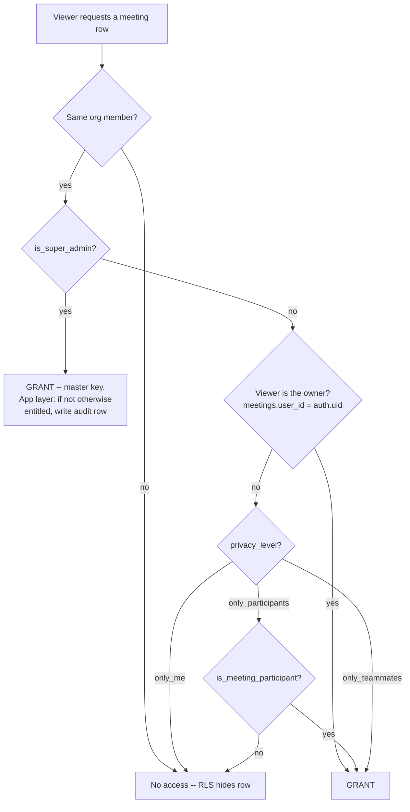
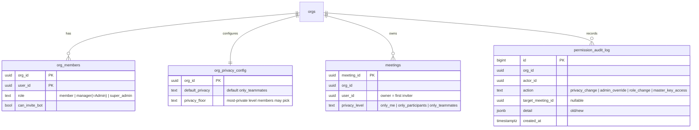

# Permissions Overhaul — Roles & Meeting Privacy

## Summary

Introduce a Fireflies-style permission model to Risezome: a **3-tier role hierarchy**
(Member / Admin / Super Admin) and a **per-meeting privacy level** (v1: Only Me /
Only Participants / Only Teammates) that turns recorded meetings into a
workspace-shared library by default, with an **org default + privacy floor**, an
**audit log**, and an **audited Super-Admin master key** that can access any
meeting for compliance. Everything stays inside org membership — external/anonymous
viewing is deferred (see origin: `docs/brainstorms/2026-06-04-permissions-overhaul-requirements.md`).

The work is RLS-heavy and builds directly on the just-shipped security plan
(`docs/plans/2026-06-03-003-...`): per-org KMS encryption, service-role-only
writes, and the participant-scoped RLS this plan rewrites.

---

## Problem Frame

Today access is flat and implicit:
- **Roles** are `manager | member` (`org_members.role`, CHECK in
  `supabase/migrations/20260603300000_roles_and_authz_helpers.sql`), with a separate
  `can_invite_bot` grant. No tier above manager.
- **Meeting access** is **participant-scoped**: a meeting (and its cards, syntheses,
  gaps, events, realtime broadcasts) is readable only by people who attended it,
  via `public.is_meeting_participant(meeting_id)` in the SELECT policies created in
  `supabase/migrations/20260603330000_visibility_and_config_rls.sql`. That migration
  deliberately makes **managers non-exempt**. There is **no per-meeting privacy
  column** and **no audit log** anywhere in the schema today.
- The "library" query already reads org-wide (`apps/portal/app/(authed)/captures/page.tsx`
  filters only on `org_id`) but RLS silently narrows it to participant rows — so the
  shared library is invisible by construction.

This plan adds the first real per-meeting privacy control + a role tier above
manager, **without** breaking the per-org KMS custody or the service-role
least-privilege model.

---

## Requirements (trace to origin)

Origin requirement IDs (R1–R15, actors A1–A5, flows F1–F6, acceptance AE1–AE6) are
carried from the requirements doc. Coverage: roles (R1–R4) → U1; privacy levels +
schema + default + floor (R5–R10, R14) → U2/U3/U4/U5; lifecycle + audit (R11–R13) →
U4/U6; migration (R14, R15) → U1/U2. Every acceptance example maps to a test
scenario in the units below.

Resolved open questions (origin Q1–Q5), now decisions:
- **Q1/R15** — the org creator is seeded as **Super Admin** on org creation and on
  migration, so a master-key holder always exists.
- **Q2** — **multiple** Super Admins per org are allowed.
- **Q3** — raising the floor later does **not** retroactively change existing
  meetings; the floor constrains **new** choices only (an admin sweep is deferred).
- **Q4** — the audit log is **Super-Admin-readable** (RLS), service-role-write-only.
- **Q5** — the "library" is the existing captures/list view, which becomes correct
  once privacy-aware RLS widens row visibility (no new list surface required for v1).

---

## Key Technical Decisions

### KTD1 — Keep `manager` as the stored Admin-tier value; add only `super_admin`
The role vocabulary becomes `member | manager | super_admin`, where the stored
`manager` **is** the "Admin" tier (UI labels it "Admin"). This keeps the
just-shipped `is_org_manager()` and every `role = 'manager'` check working
untouched, and confines the schema change to adding `super_admin` to the CHECK.
(Confirmed with the user over the full `manager → admin` rename, which would
re-touch a large amount of recently-shipped code for cosmetic gain.)

### KTD2 — Admin-power gate = `is_org_admin` (manager OR super_admin); master key = `is_super_admin`
Super Admin has **all** Admin powers (R3), so admin-power checks must accept both
tiers. Add two `SECURITY DEFINER` helpers mirroring `is_org_manager` /
`is_meeting_participant` (stable, `set search_path = public`, revoke-from-public +
grant-to-authenticated, to avoid the `org_members` RLS recursion class fixed in
`20260530110000`):
- `is_org_admin(org_id)` → role in (`manager`, `super_admin`). Repoint admin-power
  policies/actions here (settings, member management, config).
- `is_super_admin(org_id)` → role = `super_admin`. Used **only** for the master-key
  bypass and audit-log read.
`is_org_manager` stays as-is for back-compat; new admin gates use `is_org_admin`.

### KTD3 — The privacy gate is RLS, rewritten across ALL capture tables at once
Today's 8 `is_meeting_participant`-based SELECT policies (`meetings`, `cards`,
`syntheses`, `gaps`, `meeting_events`, `realtime.messages`) are rewritten to a
single privacy-aware predicate via a new `can_access_meeting(meeting_id)`
`SECURITY DEFINER` helper. **All** capture tables move together — narrowing only
`meetings` would leak the payload through a sibling table's REST endpoint (the
explicit reason the original visibility migration covered them as a set). Because
decryption is org-keyed and follows row visibility (D1), once a row is RLS-visible
the existing decrypt path serves it unchanged — no crypto changes.

### KTD4 — Super-Admin master key is an explicit `OR is_super_admin()` branch, and it reverses a documented decision
`can_access_meeting` includes `OR public.is_super_admin(org_id)`. The original
visibility migration documents "managers NOT exempt"; the master key intentionally
**overrides** that for the Super-Admin tier only. The migration header records the
reversal, the same way the original recorded its narrowing.

### KTD5 — Master-key access is audited at the **app layer**, not RLS
An RLS SELECT policy cannot reliably append an audit row. So the master-key **audit**
(R13/F6) is enforced where the privileged read happens: the meeting read paths
(`review`/`live`/`captures` pages + the transcript fetch) detect when a Super Admin
is viewing a meeting they would **not** otherwise have access to (not owner, not a
participant, and the level is below Only Teammates) and write an audit row via
service-role. RLS still grants the row; the app adds the trail.

### KTD6 — All role/privacy/audit WRITES are service-role server actions (no client write policies)
Per the `rls-no-client-update-when-service-role-writes` learning and
`docs/security/service-role-inventory.md`: role changes, privacy changes, admin
overrides, and audit writes flow through hardened service-role server actions
gated by `is_org_admin`/owner checks with explicit `.eq('org_id', …)` scoping. The
new tables get RLS-enabled + SELECT policies + **zero** client write policies
(default-deny). The audit log is **append-only and never client-writable**.

### KTD7 — The privacy floor is enforced at two layers
The floor (most-private level a Member may pick) is checked in the write action
**and** as a DB `CHECK`/trigger, so a direct PostgREST PATCH can't set a meeting
below the org floor (the `knowledge_gaps.shared_with_org` leak is the precedent).
Admin override (R12) is explicitly exempt from the floor.

### KTD8 — Generalize the last-privileged-user invariant
The `enforce_last_manager` trigger (`20260603350000`) hardcodes `'manager'`. Extend
it so an org cannot be left with **zero Super Admins** (the master-key holder must
always exist, per Q1) and zero admins-or-above. Keep it a trigger (atomic), not an
app check; note it blocks RLS-test `afterAll` cleanup (test-harness gotcha).

---

## High-Level Technical Design

### Meeting access decision (the new `can_access_meeting` predicate)

### Role & privacy data model (new/changed)

---

## Implementation Units

Phases: **A** roles (U1) → **B** privacy schema + RLS + writes (U2–U4) → **C** audit
+ master key (U5) → **D** UI (U6–U7) → **E** docs (U8). U2–U5 are the security core
and should land before the UI. **Execution posture:** RLS units are **test-first /
deny-test-driven** — write the failing access/deny test before the policy, per the
`eval-regression-coverage` and `column-write-scope` precedent.

**RLS test-harness note (applies to every unit with `test/rls/` files):** header
each new RLS test file with `// @vitest-environment node`; run with
`RISEZOME_RUN_RLS_TESTS=1` + `RISEZOME_DEV_CRYPTO_KEY` against the local stack;
pre-clean polluted `rls-%@example.com` users + orphan orgs via psql
`set session_replication_role = replica` (see `rls-test-harness-gotchas` memory).

### U1. Role hierarchy (3-tier)

- **Goal:** Add the Super Admin tier and the admin-power abstraction without
  disturbing existing manager semantics.
- **Requirements:** R1, R2, R3, R4, R15 (creator seeding), A1–A3
- **Dependencies:** none
- **Files:**
  - `supabase/migrations/20260608010000_role_super_admin.sql` (new): alter
    `org_members_role_check` to `role in ('member','manager','super_admin')`; add
    `is_org_admin(org_id)` + `is_super_admin(org_id)` SECURITY DEFINER helpers
    (mirror `is_org_manager`); generalize `enforce_last_manager` → also require ≥1
    super_admin survives (KTD8); backfill: seed each org's creator as `super_admin`
    (the row with the earliest `joined_at` / the `manager` who created it).
  - `apps/portal/app/_lib/auth.ts`: tighten `role` to a `'member'|'manager'|'super_admin'`
    union; `requireManager` semantics → accept manager OR super_admin (admin power);
    add `requireSuperAdmin`; keep `canInviteBot` implicit for manager+super_admin
    (the `chosen.role === 'manager'` line must include super_admin).
  - `apps/portal/app/(authed)/onboarding/actions.ts`: seed org creator as
    `super_admin` (was `manager`).
  - `apps/portal/app/(authed)/members/member-actions.ts`: `changeRoleAction`
    validates the 3-value set; route through `is_org_admin`.
  - Repoint admin-power RLS policies/usages from `is_org_manager` → `is_org_admin`
    where "admin powers" are meant (settings, member mgmt, sources) — audit each
    `is_org_manager` site; leave it only where strictly "manager-not-superadmin"
    (none expected).
  - `apps/portal/test/rls/roles.test.ts` (extend): super_admin fixtures; `addMember`
    role param widened.
- **Approach:** Stored `manager` = Admin (KTD1). Admin-power = `is_org_admin`
  (KTD2). Super Admin is additive. The last-privileged-user trigger guarantees a
  surviving master-key holder.
- **Patterns to follow:** `is_org_manager`/`is_meeting_participant` helper shape;
  `member-actions.ts` service-role + `requireManager` pattern; the
  `enforce_last_manager` trigger.
- **Execution note:** test-first on the deny cases (a member can't self-promote to
  super_admin; the last super_admin can't be demoted).
- **Test scenarios:**
  - A member cannot `PATCH` their own `org_members.role` to `super_admin` via
    PostgREST (service-role-only writes). *(deny)*
  - `changeRoleAction` by an admin promotes a member to super_admin; by a member is
    rejected.
  - Demoting/removing the **last** super_admin is rejected by the trigger. *(edge)*
  - `is_org_admin` returns true for manager and super_admin, false for member;
    `is_super_admin` true only for super_admin.
  - New org: creator row is `super_admin`. *(Covers R15)*
- **Verification:** role CHECK accepts the 3 values; helpers behave; creator seeded
  as super_admin; existing manager checks unchanged; last-super-admin invariant holds.

### U2. Meeting-privacy & org-config schema (+ migration + floor constraint + creation default)

- **Goal:** Add the per-meeting privacy column, the org default/floor config, the
  floor constraint, and stamp new meetings with the org default.
- **Requirements:** R5, R6, R7, R8, R9, R10, R14
- **Dependencies:** U1 (helpers)
- **Files:**
  - `supabase/migrations/20260608020000_meeting_privacy.sql` (new): add
    `meetings.privacy_level text not null default 'only_teammates'` with
    `check (privacy_level in ('only_me','only_participants','only_teammates'))`;
    new `org_privacy_config(org_id pk → orgs, default_privacy text not null default
    'only_teammates', privacy_floor text not null default 'only_me', …)` with the
    same level CHECK; RLS enabled, org-member SELECT, **no** client write policy
    (KTD6); a privacy-ordering helper + a `BEFORE INSERT/UPDATE` trigger on
    `meetings` enforcing `privacy_level` is not more private than the org floor
    **unless** set by an admin override path (KTD7); **backfill all existing
    meetings to `only_teammates`** (R14).
  - `apps/portal/src/inngest/functions/launch-bot.ts`: stamp new meetings with the
    org's `default_privacy` (R8) at creation (alongside `user_id` = owner).
  - `apps/portal/test/rls/meeting-privacy.test.ts` (new).
- **Approach:** Privacy level lives on `meetings`; ordering for the floor is a small
  ranked mapping (only_me < only_participants < only_teammates). Floor is enforced
  in-DB (trigger/CHECK) **and** in the write action (U4). Owner = `meetings.user_id`
  (D2). The org default is the shipped value `only_teammates` (library-by-default).
- **Patterns to follow:** the column-scoped-write + service-role-only pattern in
  `20260607080000_scope_client_write_policies.sql`; secret-table RLS shape
  (`org_encryption_keys`).
- **Test scenarios:**
  - A new meeting created via the launch path gets the org's default privacy
    (`only_teammates` by default). *(Covers AE2)*
  - A direct PostgREST `UPDATE meetings SET privacy_level='only_me'` when the floor
    is `only_participants` is **rejected** by the trigger. *(deny; Covers R9/R10)*
  - Existing meetings post-migration have `privacy_level='only_teammates'`. *(Covers R14)*
  - `org_privacy_config` is not client-writable; a member cannot PATCH the floor. *(deny)*
- **Verification:** column + config table + floor trigger exist; existing meetings
  migrated; new meetings inherit the org default; floor unbreakable via REST.

### U3. Privacy-aware RLS rewrite across capture tables (+ Super-Admin bypass)

- **Goal:** Replace participant-scoping with privacy-level-aware row visibility on
  every capture table and the realtime broadcast policy, including the audited
  master-key branch.
- **Requirements:** R3, R5, R6; A4; F2, F6
- **Dependencies:** U1, U2
- **Files:**
  - `supabase/migrations/20260608030000_privacy_aware_rls.sql` (new):
    `can_access_meeting(meeting_id)` SECURITY DEFINER = owner OR (only_participants
    AND is_meeting_participant) OR only_teammates-and-org-member OR
    `is_super_admin(org_id)` (KTD3/KTD4); rewrite the SELECT policies on `meetings`,
    `cards`, `syntheses`, `gaps`, `meeting_events`, and the `realtime.messages`
    broadcast policy (currently `is_meeting_participant`, defined in
    `20260603330000`) to use it; header documents the "managers-not-exempt"
    reversal for the super_admin branch only.
  - `apps/portal/test/rls/meeting-privacy.test.ts` (extend from U2).
- **Approach:** One helper, applied uniformly (KTD3). Decryption is unchanged —
  org-keyed, follows visibility (D1). `gaps`/`knowledge_gaps` already have
  `can_view_gap`; align it with the new model (a gap from an `only_me` meeting must
  not leak via the gap path — confirm `can_view_gap` is gated by meeting access too,
  or scope gap visibility to its meeting's privacy).
- **Execution note:** deny-test-driven — write the cross-level access matrix tests
  first, then the policy.
- **Test scenarios (the access matrix — each is a deny or grant assertion via a
  per-role anon client):**
  - `only_me`: owner sees it; a non-participant teammate cannot; an Admin (manager)
    cannot; a Super Admin **can**. *(Covers AE1, AE5)*
  - `only_participants`: a participant teammate sees it; a non-participant teammate
    cannot; an all-external call's sole org-member owner sees it (degenerate
    Only-Me). *(Covers AE6)*
  - `only_teammates`: every org member sees it; an external (non-member) gets
    nothing. *(Covers AE2)*
  - Sibling-table leak check: a teammate denied the `meetings` row is **also**
    denied that meeting's `cards`/`syntheses`/`gaps`/`meeting_events` rows and its
    realtime broadcast. *(integration; the core anti-leak guarantee)*
  - Super Admin sees rows across all capture tables for an `only_me` meeting. *(R3)*
- **Verification:** the access matrix passes on every capture table + realtime; no
  sibling leak; super_admin bypass works; decryption still serves visible rows.

### U4. Write paths — privacy set/change, admin override, role assignment

- **Goal:** Service-role server actions for owner privacy changes (floor-bound),
  admin override (not floor-bound), and super-admin role assignment.
- **Requirements:** R7, R10, R11, R12; F1, F3, F4, F5
- **Dependencies:** U1, U2
- **Files:**
  - `apps/portal/app/(authed)/meetings/[meetingId]/privacy-action.ts` (new):
    owner-or-admin sets `privacy_level`; owner is floor-bound, admin override is
    not (KTD7); writes an audit row (U5).
  - `apps/portal/app/(authed)/settings/...` org privacy config action (admin sets
    default + floor).
  - `apps/portal/app/(authed)/members/member-actions.ts` (extend from U1): assign
    super_admin (admin-gated).
  - `apps/portal/test/rls/meeting-privacy.test.ts` / `roles.test.ts` (extend).
- **Approach:** All service-role + role/owner check + explicit `org_id` scope
  (KTD6). The owner action rejects below-floor; the admin override bypasses the
  floor and is recorded as an override in the audit log.
- **Test scenarios:**
  - Owner lowers their meeting to `only_participants` (floor allows) → success,
    audited. *(Covers F4, R11)*
  - Owner attempts a below-floor level → rejected by both the action and the DB
    trigger. *(deny; Covers R10)*
  - Admin overrides another member's meeting from `only_teammates` →
    `only_participants` → success (floor-exempt), audited; the meeting leaves the
    general library. *(Covers AE4, R12)*
  - A non-owner non-admin member cannot change a meeting's privacy. *(deny)*
- **Verification:** owner/admin write paths work with correct floor semantics; every
  change is audited; direct client writes remain blocked.

### U5. Audit log + app-layer master-key audit

- **Goal:** The append-only audit table + the app-layer detection that records
  Super-Admin master-key reads.
- **Requirements:** R13; F6; A3
- **Dependencies:** U1, U3, U4
- **Files:**
  - `supabase/migrations/20260608040000_permission_audit_log.sql` (new):
    `permission_audit_log(id bigserial, org_id, actor_id, action, target_meeting_id
    null, detail jsonb, created_at)`; RLS enabled; **SELECT policy gated by
    `is_super_admin(org_id)`**; **no** client write policy (service-role append
    only); no UPDATE/DELETE for anyone (append-only).
  - `apps/portal/app/_lib/meeting-access.ts` (new): a server helper used by the
    meeting read paths that, given the viewer + meeting, returns access + whether
    this is a **master-key** access (super_admin viewing a meeting they aren't
    otherwise entitled to) and, if so, appends an audit row (service-role).
  - Wire it into `meetings/[meetingId]/review/page.tsx`, `live/page.tsx`,
    `captures/page.tsx`, and the transcript fetch (`app/_lib/transcript.ts`).
  - `apps/portal/test/rls/audit-log.test.ts` (new).
- **Approach:** RLS grants the super_admin the row (U3); the app layer distinguishes
  "entitled anyway" from "used the master key" and logs only the latter (KTD5).
  Privacy-change and override actions (U4) write their own audit rows directly.
- **Test scenarios:**
  - A Super Admin opening an `only_me` meeting they didn't record writes a
    `master_key_access` audit row; opening an `only_teammates` meeting (entitled
    anyway) does **not**. *(Covers AE1, F6)*
  - A member cannot read `permission_audit_log` (RLS); an Admin (manager) cannot;
    a Super Admin can. *(deny + grant)*
  - No one can `UPDATE`/`DELETE` an audit row, including via service-role-less
    PostgREST. *(deny; append-only)*
  - A privacy change (U4) and an admin override each append exactly one audit row
    with old→new detail. *(integration)*
- **Verification:** audit table is append-only + super-admin-readable; master-key
  reads are logged, entitled reads are not; mutations to audit rows are impossible
  via the client.

### U6. UI — privacy controls + library

- **Goal:** Member-facing privacy picker (floor-aware) on a meeting, admin override
  affordance, and the now-populated library.
- **Requirements:** R5, R7, R9, R11, R12; F1, F2, F4, F5
- **Dependencies:** U2, U3, U4
- **Files:**
  - `apps/portal/app/(authed)/meetings/[meetingId]/review/page.tsx` + a privacy
    picker client component: show the 3 levels, disable levels below the floor for
    non-admins, call `privacy-action.ts`.
  - `apps/portal/app/(authed)/captures/page.tsx`: the library now shows org-visible
    meetings (no query change needed — RLS widened in U3 — but adjust copy/empty
    states and surface each meeting's privacy badge).
  - `apps/portal/test/...` component/interaction tests where they exist.
- **Approach:** UI reads the org floor + the meeting's owner to decide which options
  are enabled; admin sees an override affordance not bound by the floor. Mutations
  go through U4 actions.
- **Test scenarios:**
  - The picker hides/disables below-floor levels for a Member; an Admin sees all
    levels (override). *(Covers AE3)*
  - A teammate browsing the library sees `only_teammates` meetings + their own
    participant meetings, with privacy badges. *(Covers F2)*
- **Verification:** the picker enforces the floor visually + via the action; the
  library renders org-visible meetings with correct badges.
- **Test expectation:** interaction tests for the floor-aware picker; library render
  test if a harness exists, else manual verification noted.

### U7. UI — roles/members + audit log view

- **Goal:** Members page reflects 3 tiers + super-admin assignment; a Super-Admin
  audit-log view.
- **Requirements:** R1, R2, R3, R13; A2, A3
- **Dependencies:** U1, U5
- **Files:**
  - `apps/portal/app/(authed)/members/page.tsx` + `_member-list.tsx`: render
    Member / Admin / Super Admin; the role control offers super_admin (admin-gated,
    last-super-admin-aware); label stored `manager` as "Admin".
  - `apps/portal/app/(authed)/settings/...` (or a new audit page): a Super-Admin-only
    audit-log view reading `permission_audit_log`.
  - tests where harnesses exist.
- **Approach:** Mirror existing `_member-list.tsx` role-control patterns; the audit
  view is super-admin-gated (`requireSuperAdmin`).
- **Test scenarios:**
  - The role dropdown offers super_admin only to admins; demoting the last
    super_admin is blocked (surfaced from the trigger error). *(Covers R1, edge)*
  - The audit view is reachable only by a Super Admin (route guard +
    `requireSuperAdmin`). *(deny)*
- **Verification:** member management supports 3 tiers safely; the audit view is
  super-admin-only.
- **Test expectation:** route-guard + role-control tests; render tests where a
  harness exists.

### U8. Docs + learnings capture

- **Goal:** Reflect the new permission model in the security docs and capture the
  reversal.
- **Requirements:** documentation of R1–R15
- **Dependencies:** U1–U7
- **Files:**
  - `SECURITY.md`: the role hierarchy + per-meeting privacy + master-key + audit
    model (and that master-key access is audited).
  - `docs/security/service-role-inventory.md`: the new role/privacy/audit write
    actions + the audit table; the master-key app-layer gate.
  - A `docs/solutions/` note capturing the role-vocabulary expansion + the
    Super-Admin-bypass reversal of the "managers-not-exempt" decision.
- **Approach:** Update narrative + the inventory; record the deliberate reversal so
  the next reader doesn't re-litigate it.
- **Test expectation:** none — documentation.
- **Verification:** docs describe the shipped model; the reversal is recorded.

---

## Scope Boundaries

### In scope (v1)
Three-tier roles; the three internal privacy levels; org default + floor; owner/admin
privacy lifecycle + audit log; Super-Admin master key + access audit; migration of
existing roles (creator → super_admin) and meetings (→ only_teammates).

### Deferred to Follow-Up Work
- An **admin sweep** to retroactively raise existing meetings to a newly-tightened
  floor (Q3 — v1 only constrains new choices).
- Surfacing the audit log via **export / richer filtering** beyond a basic
  super-admin view.

### Deferred for later (from origin)
- **"Anyone with link"** + **external-participant viewing** (the 4th/5th levels) —
  they require serving decrypted per-org content to non-members, reopening the
  exposure the per-org KMS encryption narrowed. v1 storage uses a `privacy_level`
  text+CHECK that can grow to the full five without migration.
- **Super-Admin plan-gating** (Enterprise-only) — no plan tiers exist yet.
- **Generalizing the privacy primitive** to other resources (`knowledge_gaps.shared_with_org`).

### Outside this product's identity
Privacy levels are org-internal trust controls, not a public publishing feature.

---

## Risks & Dependencies

| Risk | Impact | Mitigation |
| --- | --- | --- |
| Sibling-table leak | A meeting hidden on `meetings` but readable via `cards`/`syntheses`/`gaps`/`meeting_events`/realtime | KTD3: rewrite **all** capture-table policies + realtime in one migration; explicit cross-table deny test (U3) |
| Master-key reversal of a documented decision | Silent reintroduction of org-wide manager visibility | KTD4: bypass is `super_admin`-only (not manager), documented in the migration header, and audited (KTD5) |
| RLS recursion | Role/privacy policies querying `org_members` recurse → silent empty results | KTD2: all tier checks via SECURITY DEFINER helpers (mirror the `20260530110000` fix) |
| Client write bypass | A member PATCHes `role`/`privacy_level`/floor or forges an audit row via PostgREST | KTD6/KTD7: service-role-only writes, floor trigger, append-only audit, deny tests for each |
| Last-master-key removal | An org left with zero Super Admins → no compliance access + a stuck invariant | KTD8: trigger requires ≥1 super_admin survives; seed creator (R15) |
| Encryption custody for bypass | Super Admin reads ciphertext if they can't resolve the org key | D1: Super Admin is in-org; `decryptForOrgFromBytea` is org-keyed — bypass decrypt works; no change needed |
| Default flips existing meetings to org-visible | Existing participant-only meetings become workspace-visible on migration (R14) | Pre-launch, low volume; documented; the floor + per-meeting change let owners dial back |

**Dependencies:** the just-shipped security work — per-org KMS encryption
(`packages/crypto`), service-role least-privilege + the cross-org lint guard
(new tables auto-join the guarded set — every service-role write needs an `org_id`
predicate), and the participant/RLS model this rewrites. Next migration timestamps
start at `20260608010000`.

---

## System-Wide Impact

- **End users:** meetings become workspace-visible by default; owners gain a privacy
  control; admins gain org defaults + a floor; a designated Super Admin gains an
  audited master key.
- **Security posture:** this is the first per-meeting authz beyond participation; the
  master key is a deliberate, audited exception to a previously-absolute rule. The
  cross-org lint guard and the deny-test discipline keep the new write surfaces
  closed.
- **Migration:** alters the role CHECK + the last-manager trigger, adds a privacy
  column + two tables, rewrites 8 RLS policies, and backfills roles + meetings. Low
  risk pre-launch but touches the authz core — sequence A→B→C→D→E and land the
  security core (U2–U5) before the UI.
