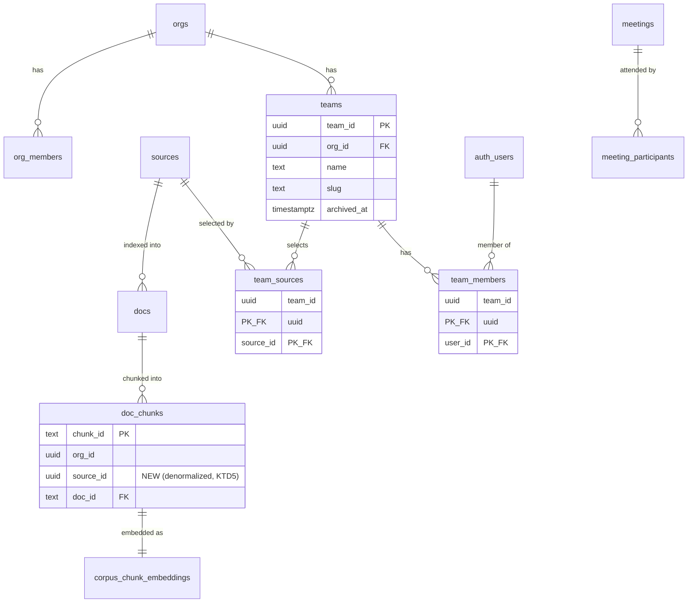

# feat: Teams restructure — attendees-only access, team-scoped sources, top-bar shell

## Summary

Restructure the portal around **Teams** inside a single **Org** (now just a name + global settings + billing). Collapse content access to the simplest correct rule — **a meeting, its captures, and its gaps are visible to its attendees plus the audited super-admin master key** — retiring the just-shipped 3-level privacy ladder and the never-built grant model. Make a knowledge gap's **open questions assignable to anyone in the org**, with the assignee seeing **only the question, who asked it, and recurrence metrics** (never verbatim). Move **sources from org-scoped to team-scoped**: a meeting retrieves over the **union of its attendees' teams' sources**, indexed **once** via a reference-counted `team_sources` selection layer over the unchanged canonical corpus. Add the **top-bar shell** (org brand + team switcher + notifications + user menu) and slim the sidebar to a nav icon rail.

This is a **second production migration** over the permissions schema deployed to prod today (plan `2026-06-04-004`). It **keeps** roles (`member`/`manager`/`super_admin`), `is_org_admin`/`is_super_admin`, `permission_audit_log`, the audited master key, and `meeting_participants`. Pre-release, no customers — the dev's two test orgs reshape freely.

---

## Problem Frame

The product is flat: one org, per-meeting privacy levels, org-wide sources, and an identity/notification cluster crammed into the sidebar. There's no **team** — the unit people actually work in — and a meeting can draw on *every* source the org ever connected, regardless of who's in the room.

This plan introduces teams as the membership + context unit, makes access "the people in the room see it," routes a meeting's retrieval through the attendees' teams' sources (deduplicated, indexed once), opens gap-question assignment org-wide without leaking verbatim, and lifts identity/notifications into a top bar.

The hard parts: (1) reworking the *just-deployed* `can_access_meeting` predicate down to attendees-only without reintroducing the sibling-table leak; (2) team-scoping sources without duplicating the corpus or denormalizing `team_id` onto it; (3) severing the shipped `assignee_id → verbatim` path while still showing assignees their question metadata; (4) sequencing a second prod migration over the first.

---

## Requirements Traceability

Origin A: `docs/brainstorms/2026-06-04-teams-and-sharing-requirements.md` (teams/access/shell — R1–R15, AE1–AE6, F1–F5).
Origin B: `docs/brainstorms/2026-06-04-team-scoped-sources-requirements.md` (sources — R1–R11, AE1–AE6, F1–F6).

| Requirement | Where addressed |
| --- | --- |
| A-R1 Org = name/settings/billing; `org_id` unchanged | U2 (no rename), U6/U7 (brand in top bar) |
| A-R2/R3/R4 Teams, multi-membership, admin-managed | U1 (schema), U7 (CRUD UI) |
| A-R5/R6 Meetings + captures = attendees ∪ super-admin, uniform across capture tables | U2 |
| A-R7 Gaps attendees-only | U5 (gap ACL kept; assignee path severed) |
| A-R8 Org-wide question assignment, metadata-only for assignee | U5 |
| A-R9/R10 Roles kept; audit team + assignment + master-key | U1 (audit actions), U5 |
| A-R11 Team-scoped sources | U3, U4 |
| A-R12/R13 Top-bar shell + team-switcher lens | U6, U8 |
| A-R14 Onboarding (org + first teams) | U7 |
| A-R15 Migration off the privacy ladder; default team | U1, U2, U3, U9 |
| B-R1 Connections stay org-level | U3 (selection over existing connections) |
| B-R2/R3/R4 Portion-grain team selection, admin-curated | U3 (schema), U7 (UI) |
| B-R5/R6 One index per source; refcount index/de-index | U3 |
| B-R7 Delta sync unchanged | U3, U4 |
| B-R8/R9 Retrieval = union of attendees' teams' sources, hard filter | U4 |
| B-R10 KMS/`org_id` unchanged; intra-org dedup | U2, U3, U4 |
| B-R11 Default-team source backfill | U3, U9 |

---

## Key Technical Decisions

**KTD1 — Access predicate collapses to attendees ∪ super-admin, the function changes, the policies don't.** The five capture-table SELECT policies (`meetings`, `cards`, `syntheses`, `meeting_events`, `realtime.messages`) already delegate to `public.can_access_meeting(meeting_id)` (see `supabase/migrations/20260608030000_privacy_aware_rls.sql`). We rewrite **only the function body** to `is_super_admin(org) OR is_meeting_participant(meeting)`, so the sibling-leak guarantee (one predicate, all tables) holds for free and the policy churn is zero. Owner access is subsumed by participant membership (the owner is always a participant); if any owner-without-participant-row edge exists, keep an explicit `m.user_id = auth.uid()` branch as belt-and-suspenders.

**KTD2 — Drop the privacy machinery in dependency order, in one migration.** Within the U2 migration: (1) rewrite `can_access_meeting` to stop referencing `privacy_level`; (2) drop the floor trigger `meetings_enforce_privacy_floor` + `enforce_meeting_privacy_floor()`; (3) drop `meetings.privacy_level`; (4) drop `org_privacy_config` (+ its config CHECK); (5) drop `meeting_privacy_rank()` and `admin_override_meeting_privacy()`. Order matters — the function rewrite must precede the column drop. `meeting_privacy_rank` is dropped last (the config CHECK depends on it).

**KTD3 — Teams are a thin layer; the canonical corpus is never denormalized with `team_id`.** `sources`/`docs`/`doc_chunks`/`corpus_chunk_embeddings` stay org-level and deduplicated exactly as today (`unique(org_id, external_id)` + `content_hash`). Teams add `team_sources(team_id, source_id)` selection and a retrieval filter only. Dedup is automatic: two teams selecting one board share one `source_id` → one indexed copy. Dedup is **intra-org**; cross-org indexing stays separate (different KMS keys — B-R10).

**KTD4 — Reference-counted source lifecycle.** `refcount(source_id) = count(*) from team_sources where source_id = ?`. First selection of a not-yet-indexed source fires the existing `*.index-requested` Inngest event; subsequent selections are join-row-only (zero re-index). Last deselect (refcount → 0) **hard-deletes** the source's `docs` (cascading chunks + embeddings) and marks the `sources` row `removed`; the org-level connection/token remains for a later fresh re-index. De-index runs as a **background, idempotent step with a short grace re-check** so rapid remove-then-readd doesn't thrash (origin B Q2).

**KTD5 — Retrieval filters on a denormalized `source_id`.** Add `source_id uuid` to `doc_chunks` and `corpus_chunk_embeddings` (backfilled from `docs`, indexed), so the HNSW/FTS search RPCs filter `source_id = any(p_source_ids)` without a `docs` join in the hot path (origin B Q1). `search_corpus_vector`/`search_corpus_fts` gain a `p_source_ids uuid[]` parameter; the bot-worker resolves a meeting's effective source set (distinct `team_sources.source_id` over the meeting's org-member attendees' teams) and passes it. Empty set → no corpus hits (B-R9).

**KTD6 — Gap assignment is metadata-only; sever the shipped assignee→verbatim path.** Today `can_view_gap` (in `supabase/migrations/20260606030000_knowledge_gaps_rls.sql`) returns true for `assignee_id = auth.uid()`, which grants SELECT on `gap_occurrences` (the `verbatim_question` + `asker_name`). Remove the `assignee_id` branch from `can_view_gap` so a non-attendee assignee gets **no** verbatim. Surface assigned questions to the assignee through a dedicated **metadata-only** read (a SECURITY DEFINER function `list_assigned_questions(uid)` or a curated server query) returning only `{knowledge_gaps.title (the canonical question), latest occurrence asker_name, frequency, last_asked_at}` — never `gap_occurrences` rows or `knowledge_gap_sections`. Attendee-assignees still see full verbatim via the unchanged participant path (`gap_viewers`).

**KTD7 — Extend the audit action vocabulary.** `permission_audit_log.action` CHECK currently admits `privacy_change | admin_override | role_change | master_key_access` (`supabase/migrations/20260608040000_permission_audit_log.sql`). Drop the now-dead `privacy_change`/`admin_override` and add `team_change` (create/rename/archive), `team_membership_change`, and `gap_assignment`. Keep `role_change` + `master_key_access`.

**KTD8 — Writes stay service-role + RLS-read, no broad client write policies.** Team CRUD, membership, source curation, and gap assignment follow the established Section B discipline (`docs/security/service-role-inventory.md`): admin/attendee-gated service-role server actions with explicit `org_id` scoping, audited; member-readable RLS, no client write policies. The cross-org lint guard (`scripts/lint/check-service-role-org-scope.mjs`) must stay green for every new service-role query.

---

## High-Level Technical Design

### New schema (additive) over the kept permissions tables



### Meeting access predicate — before → after (KTD1)

```text
BEFORE (deployed):  is_super_admin(org)
                 OR owner
                 OR (privacy_level='only_teammates' AND org member)
                 OR (privacy_level='only_participants' AND is_meeting_participant)
                 -- only_me => owner/super_admin only

AFTER (this plan):  is_super_admin(org)            -- audited master key, unchanged
                 OR is_meeting_participant(meeting) -- attendees only
                 (OR owner, belt-and-suspenders if owner can lack a participant row)
```

### Meeting-time source resolution + retrieval filter (KTD5)

```text
attendees (org-member participant rows)
   -> their teams (team_members)
      -> selected sources (team_sources)         => effective source_id[] (distinct)
search_corpus_vector(org_id, query_vec, limit, source_id[])  -- HNSW, filtered by denormalized source_id
search_corpus_fts(org_id, query,     limit, source_id[])     -- GIN/FTS, same filter
   union/RRF -> cards   (empty source set => zero corpus hits)
```

---

## Implementation Units

### U1. Teams + team_members schema, helpers, audit vocabulary, default-team backfill

**Goal:** Create the teams membership model and the audit-action vocabulary the rest of the feature writes to; seed a default team per existing org.

**Requirements:** A-R2, A-R3, A-R4, A-R10, A-R14 (schema side), A-R15; KTD7, KTD8.

**Dependencies:** none.

**Files:**
- `supabase/migrations/20260609010000_teams.sql` (create)
- `supabase/migrations/20260609020000_audit_actions_teams.sql` (create — extend `permission_audit_log.action` CHECK per KTD7)
- `apps/portal/app/_lib/auth.ts` (modify — add team helpers if read here)
- `apps/portal/test/rls/teams.test.ts` (create)

**Approach:**
- `teams(team_id uuid pk, org_id uuid fk→orgs on delete cascade, name text, slug text, archived_at timestamptz, created_at, updated_at)`; unique `(org_id, slug)`. `team_members(team_id fk, user_id fk→auth.users, created_at, pk(team_id,user_id))`.
- RLS: members read teams/team_members of orgs they belong to (mirror the `org_members` SELECT shape in `20260608020000`); **no client write policies** (service-role writes, KTD8).
- SECURITY DEFINER helpers mirroring `is_meeting_participant`/`is_org_admin` (read outside RLS, `set search_path = public`, recursion-free): `is_team_member(team_id)` and `current_user_team_source_ids()` or an equivalent used by U4. Grant execute to `authenticated`.
- Audit CHECK migration: drop `privacy_change`/`admin_override`, add `team_change`, `team_membership_change`, `gap_assignment` (KTD7).
- Backfill (A-R15): for each org, insert one default team (e.g. name "General", slug "general"), and `team_members` rows for all current `org_members`.

**Patterns to follow:** `org_members` table + SELECT policy and the `is_*` SECURITY DEFINER helpers in `supabase/migrations/20260608020000_meeting_privacy.sql` / `20260608030000_privacy_aware_rls.sql`; service-role write discipline in `docs/security/service-role-inventory.md` §B2.

**Test scenarios:**
- Covers A-R2/R3: a user on two teams reads both; a non-member of the org reads neither.
- RLS: `authenticated` cannot INSERT/UPDATE/DELETE `teams` or `team_members` directly (no client write policy).
- `is_team_member` returns true only for actual members; does not recurse/error under RLS.
- Backfill: every existing org has exactly one default team containing all its members.
- Audit CHECK: inserting `action='gap_assignment'`/`team_change`/`team_membership_change` succeeds; `action='privacy_change'` now rejected.

**Verification:** `teams`/`team_members` exist with RLS; default-team backfill covers all orgs; audit CHECK updated; `teams.test.ts` passes under the node RLS harness.

---

### U2. Collapse meeting access to attendees-only; drop privacy machinery

**Goal:** Rewrite `can_access_meeting` to attendees ∪ super-admin and remove every privacy-ladder artifact shipped in plan-004, in dependency order.

**Requirements:** A-R1, A-R5, A-R6, A-R15; KTD1, KTD2; AE1, AE2.

**Dependencies:** U1 (same migration batch; not strictly code-dependent).

**Files:**
- `supabase/migrations/20260609030000_attendees_only_access.sql` (create)
- `apps/portal/src/inngest/functions/launch-bot.ts` (modify — remove `privacy_level`/`org_privacy_config` stamping)
- `apps/portal/app/(authed)/meetings/[id]/privacy-action.ts` (delete)
- `apps/portal/app/(authed)/settings/privacy-action.ts` (delete)
- `apps/portal/app/(authed)/captures/page.tsx` (modify — drop `privacy_level` selection/filter)
- privacy picker/admin-override UI components (delete — discover via grep for `privacy_level`, `setMeetingPrivacy`, `admin_override_meeting_privacy`, `org_privacy_config`)
- `apps/portal/test/rls/meeting-access.test.ts` (create or rework from the plan-004 privacy test)

**Approach:**
- Migration order (KTD2): rewrite `can_access_meeting(meeting_id)` → `is_super_admin(m.org_id) OR is_meeting_participant(m.meeting_id)` (keep `m.user_id = auth.uid()` branch if owners can lack a participant row); then `drop trigger meetings_enforce_privacy_floor` + `drop function enforce_meeting_privacy_floor`; then `alter table meetings drop column privacy_level`; then `drop table org_privacy_config`; then `drop function admin_override_meeting_privacy`, `drop function meeting_privacy_rank`.
- The five capture-table SELECT policies are **unchanged** (they call `can_access_meeting`) — KTD1.
- `launch-bot.ts`: stop reading `org_privacy_config`/stamping `privacy_level`; the column is gone.
- Remove the privacy actions, the meeting privacy picker, the org default/floor settings UI, and the admin-override control.
- Captures list: master-key exclusion (super_admin doesn't see non-attended meetings in the *list*) carries over — now keyed on "not a participant" instead of "below privacy" (origin A Q2). Verify the existing exclusion logic in `captures/page.tsx` / `_lib/meeting-access.ts` and re-point it.

**Execution note:** Rework the plan-004 privacy RLS test into an attendees-only characterization test before deleting privacy code, so the access-boundary contract is captured first.

**Test scenarios:**
- Covers AE1: a non-attendee Admin cannot SELECT a meeting; a super_admin can, and a `master_key_access` audit row is written by the app layer.
- Covers AE2: a denied member is denied `cards`, `syntheses`, `meeting_events`, and the realtime broadcast for that meeting (sibling-leak).
- A participant sees their meeting + all sibling payload tables.
- Floor/override gone: a direct PostgREST PATCH that would have set a below-floor `privacy_level` now errors on the missing column (no privacy surface remains).
- `launch-bot` creates a meeting with no `privacy_level` reference and the insert succeeds.

**Verification:** `privacy_level`/`org_privacy_config`/`meeting_privacy_rank`/`admin_override_meeting_privacy`/floor trigger no longer exist; capture access is attendees ∪ super-admin uniformly; privacy UI/actions removed; `meeting-access.test.ts` green; `pnpm typecheck` clean after deletions.

---

### U3. team_sources selection + reference-counted index/de-index lifecycle

**Goal:** Add the team→source selection join and the refcount-driven index-on-first-reference / hard-de-index-on-last-drop lifecycle; backfill existing sources to the default team.

**Requirements:** B-R2, B-R3, B-R5, B-R6, B-R7, B-R10, B-R11; KTD3, KTD4, KTD8; B-AE1, B-AE3.

**Dependencies:** U1.

**Files:**
- `supabase/migrations/20260609040000_team_sources.sql` (create — table, RLS, refcount helper, default-team backfill)
- `apps/portal/src/inngest/functions/team-source-lifecycle.ts` (create — first-ref index trigger + last-drop de-index, or extend existing index functions)
- `apps/portal/src/inngest/functions/` de-index path (modify/reuse the existing doc/chunk/embedding cascade delete)
- `apps/portal/test/rls/team-sources.test.ts` (create)
- `apps/portal/test/inngest/team-source-lifecycle.test.ts` (create)

**Approach:**
- `team_sources(team_id fk→teams, source_id fk→sources, created_at, pk(team_id,source_id))`. RLS: members read `team_sources` for their teams; no client write policy (KTD8).
- Refcount helper: `source_refcount(source_id) := count(*) from team_sources where source_id = ?`.
- Lifecycle (KTD4), all service-role, triggered by curation actions in U7 (not client-facing here):
  - On add: if the source was not previously referenced (`status='removed'` or refcount transitioning 0→1 with no live corpus), emit the existing `*.index-requested` event for that `kind`; otherwise no indexing.
  - On remove: if refcount → 0, schedule the de-index step — background + idempotent + a short grace re-check (re-read refcount before deleting); on confirmed 0, hard-delete `docs where source_id=X` (cascades chunks/embeddings) and set `sources.status='removed'`.
- Backfill (B-R11): insert `team_sources(default_team, source_id)` for every existing `sources` row in each org, so nothing de-indexes on cutover.

**Test scenarios:**
- Covers B-AE1: selecting an already-indexed source from a second team adds one join row and emits **no** index event; corpus row counts unchanged.
- First team selecting a never-indexed source emits exactly one index-requested event for the right `kind`.
- Covers B-AE3: last team removing a source drives refcount → 0 → `docs`/`doc_chunks`/`corpus_chunk_embeddings` deleted, `sources.status='removed'`; the org's connection row still exists.
- Grace re-check: remove-then-readd within the grace window leaves the corpus intact (no thrash).
- RLS: a non-member cannot read another team's `team_sources`; no client can write `team_sources`.
- Backfill: every pre-existing source has a `team_sources` row to its org's default team.

**Verification:** `team_sources` exists with refcount lifecycle; dedup verified (one index per source across teams); de-index on last drop; backfill complete; tests pass.

---

### U4. Retrieval scoped to the union of attendees' teams' sources

**Goal:** Filter meeting-time retrieval to the meeting's effective source set via a denormalized `source_id` on the embedding/chunk tables and a source-id parameter on the search RPCs.

**Requirements:** B-R8, B-R9, B-R10; KTD3, KTD5; B-AE2, B-AE4, A-AE5.

**Dependencies:** U3.

**Files:**
- `supabase/migrations/20260609050000_corpus_source_id_denormalize.sql` (create — add `source_id` to `doc_chunks` + `corpus_chunk_embeddings`, backfill from `docs`, index)
- `supabase/migrations/20260609060000_search_rpcs_source_filter.sql` (create — `search_corpus_vector`/`search_corpus_fts` gain `p_source_ids uuid[]`)
- `apps/portal/src/inngest/lib/connector-index.ts` (modify — stamp `source_id` on new chunks/embeddings)
- `apps/bot-worker/src/corpus-search.ts` (modify — pass `p_source_ids`)
- `apps/bot-worker/src/retrieval.ts` (modify — resolve effective source set per meeting)
- `apps/bot-worker/src/pipeline/core.ts` (modify — thread the source set; empty-set short-circuit)
- `apps/bot-worker/test/retrieval-source-scope.test.ts` (create)

**Approach:**
- Denormalize `source_id uuid` onto `doc_chunks` and `corpus_chunk_embeddings`; backfill from `docs.source_id`; add `*_source_id_idx`. Make it `not null` after backfill (new writes stamp it in `connector-index.ts`).
- Search RPCs gain `p_source_ids uuid[]`: filter `source_id = any(p_source_ids)` alongside the existing `org_id` predicate, on both the HNSW vector path and the FTS path. Keep `org_id` as defense-in-depth.
- Bot-worker resolves the effective set once per meeting: distinct `team_sources.source_id` for the org-member attendees' teams (helper from U1/U3, or a dedicated RPC `meeting_effective_source_ids(meeting_id)`). Non-org-member guests contribute nothing (B-R9).
- Empty effective set → skip corpus search (return no cards); gaps still record per existing logic.

**Test scenarios:**
- Covers B-AE2: a meeting with attendees spanning two teams retrieves over the union; a source shared by both appears once.
- Covers B-AE4 / A-AE5: a board no attendee's team includes never surfaces; a denied member's meeting still leaks nothing cross-team.
- Empty source set → zero corpus cards, no error; gap-recording path intact.
- Backfill: every existing chunk/embedding has the correct `source_id`; new indexer writes stamp it.
- `source_id` filter composes with the existing relevance floor + RRF fusion (no regression in ranking for the in-scope set).

**Execution note:** Add a failing retrieval-source-scope integration test (real RPCs over a seeded two-team corpus) before wiring the filter.

**Verification:** retrieval is hard-filtered to the meeting's effective sources; denormalized `source_id` backfilled + indexed + stamped on new writes; bot-worker passes the set; tests green.

---

### U5. Org-wide gap-question assignment with a metadata-only assignee view

**Goal:** Let an attendee assign a gap's open question to any org member; the assignee sees only the question, asker, and metrics — never verbatim — and is notified; assignment is audited.

**Requirements:** A-R7, A-R8, A-R10; KTD6, KTD7, KTD8; A-AE3, A-AE4, F2.

**Dependencies:** U1 (audit vocabulary), U2 (no privacy coupling).

**Files:**
- `supabase/migrations/20260609070000_gap_assignment_metadata.sql` (create — remove `assignee_id` branch from `can_view_gap`; add `list_assigned_questions` SECURITY DEFINER fn)
- `apps/portal/app/(authed)/gaps/assign-action.ts` (create or modify the existing assign action — target = any org member; audit)
- `apps/portal/app/(authed)/gaps/` assignee surface (modify/create — render the metadata-only list)
- `apps/portal/app/(authed)/gaps/notification-actions.ts` (modify — emit a gap-assignment notification)
- `apps/portal/test/rls/gap-assignment.test.ts` (create)

**Approach:**
- `can_view_gap` (in the kept `20260606030000` shape): **drop the `assignee_id = auth.uid()` branch** so assignment alone grants no verbatim. Keep `shared_with_org`, `is_org_admin`, and participant-seeded `gap_viewers`.
- `list_assigned_questions(uid)` SECURITY DEFINER, `set search_path = public`: returns rows for gaps where `assignee_id = uid`, each `{gap_id, title (canonical question), asker_name (latest occurrence), frequency, last_asked_at}` — **no** `verbatim_question` rows, **no** `knowledge_gap_sections`. Grant execute to `authenticated`.
- Assignment action: attendee-gated (caller must be a participant of a source meeting) service-role write of `assignee_id`/`assigned_by`/`assigned_at`; **target may be any `org_members` user** (validate target is an org member); append `gap_assignment` audit; emit a `notifications` row to the assignee.
- Attendee-assignees are unaffected — they still see verbatim through their `gap_viewers` participant path.

**Test scenarios:**
- Covers A-AE3: a gap question assigned to a **non-attendee** — that user's `list_assigned_questions` shows title + asker + metrics; direct SELECT on `gap_occurrences`/`knowledge_gaps`/`knowledge_gap_sections` for that gap returns nothing (no verbatim).
- Covers A-AE4: an org member who attended none of a gap's source meetings and isn't assigned cannot see it at all.
- An **attendee**-assignee still sees full verbatim (participant path unchanged).
- Assignment to a non-org-member is rejected; assignment writes a `gap_assignment` audit row and a notification.
- Only an attendee of a source meeting may assign (non-attendee caller rejected).

**Verification:** `can_view_gap` no longer grants verbatim via assignment; assignees get metadata-only; org-wide assignment works, audited, notified; tests green.

---

### U6. Top-bar shell; slim the sidebar to a nav icon rail

**Goal:** Introduce the top bar (org brand + team switcher + notifications + user menu) and move those elements out of the sidebar, which becomes a nav icon rail.

**Requirements:** A-R1, A-R12, A-R13 (chrome side); F3.

**Dependencies:** U1 (team switcher needs teams; can stub team data until U7 wires CRUD).

**Files:**
- `apps/portal/app/(authed)/_components/top-bar.tsx` (create)
- `apps/portal/app/(authed)/_components/team-switcher.tsx` (create)
- `apps/portal/app/(authed)/layout.tsx` (modify — top bar above main; sidebar → rail)
- `apps/portal/app/(authed)/_components/sidebar.tsx`, `sidebar-frame.tsx`, `nav-icons.tsx` (modify — icon-rail form)
- `apps/portal/app/(authed)/_components/org-switcher.tsx`, `user-card.tsx` (modify/relocate — user menu into the top bar; drop "switch workspace")
- notifications bell component (modify/relocate into the top bar)
- `apps/portal/app/(authed)/_components/__tests__/top-bar.test.tsx` (create)

**Approach:**
- Top bar: left = Org brand + breadcrumb "Org / #team" with the team switcher dropdown; right = notifications bell + user-avatar dropdown (Profile & account, Notification settings, Sign out). No "Share" action (no sharing model), no "switch workspace" (single org).
- Sidebar collapses to the nav icon rail (keep nav links from `sidebar-nav-link.tsx`, drop org/user/notification clusters).
- Team switcher selection persists via a cookie (mirror the existing org-selection cookie pattern in `switch-org-action.ts` / `CURRENT_ORG_COOKIE`) — wired to browsing in U8.

**Test scenarios:**
- Top bar renders org brand, team switcher, bell, and user menu; user menu omits "switch workspace."
- Sidebar renders as an icon rail without the org/user/notification clusters.
- Team switcher lists the user's teams and sets the team cookie on selection.
- Test expectation: interaction/render coverage; no new server behavior beyond the cookie write.

**Verification:** top bar present with the four elements; sidebar is an icon rail; org/user/notifications no longer in the sidebar; component tests pass.

---

### U7. Teams management + source curation UI; onboarding (org + first teams)

**Goal:** Admin UI to create/rename/archive teams, manage membership, and curate each team's sources (driving U3's lifecycle); onboarding to name the org and create the first team(s).

**Requirements:** A-R4, A-R14; B-R2, B-R4; KTD8; B-AE5, F4, F7-equivalent.

**Dependencies:** U1, U3, U6.

**Files:**
- `apps/portal/app/(authed)/teams/page.tsx` (create — team list/management)
- `apps/portal/app/(authed)/teams/team-actions.ts` (create — create/rename/archive, add/remove member; service-role + `requireAdmin`; audit)
- `apps/portal/app/(authed)/teams/source-actions.ts` (create — add/remove `team_sources`; `requireAdmin`; fires U3 lifecycle)
- `apps/portal/app/(authed)/teams/_components/` (create — team editor, member picker, source picker over the org's connected boards/repos/projects/spaces)
- `apps/portal/app/(authed)/onboarding/page.tsx`, `onboarding/actions.ts` (modify — after org name, prompt first team(s))
- `apps/portal/test/rls/team-curation.test.ts` (create)

**Approach:**
- Team actions: `requireAdmin` (manager OR super_admin) + service-role + `org_id` scope; audit `team_change` / `team_membership_change` (KTD7/KTD8). Archive = set `archived_at` (soft); archived teams drop out of switchers and contribute no sources.
- Source curation: `requireAdmin`; the picker lists the org's selectable portions (existing `sources` rows per the org's connections); add/remove writes `team_sources` and invokes U3's add/remove lifecycle entrypoints.
- Onboarding (A-R14): extend `createOrg` flow so the super-admin names the org then creates ≥1 team; existing default-team backfill (U1) covers already-onboarded orgs.

**Test scenarios:**
- Covers B-AE5: a non-admin member cannot add/remove a team's sources (action rejects); an admin can.
- Admin creates/renames/archives a team; membership add/remove writes audit rows; archived team disappears from switchers.
- Adding a source to a team triggers U3 indexing (first ref) or a no-op join (already indexed); removing the last reference de-indexes.
- Onboarding creates an org + at least one team; the creator is super_admin (kept) and a member of that team.

**Verification:** admins manage teams + sources end-to-end; onboarding creates org + first team; non-admins blocked; audit rows written; tests pass.

---

### U8. Team-switcher browse lens; remove residual privacy UI

**Goal:** Scope the browsing views (captures, etc.) to the currently selected team, and remove any privacy-era browsing controls left after U2.

**Requirements:** A-R13; A-AE-browse; origin A Q3.

**Dependencies:** U6, U7, U2.

**Files:**
- `apps/portal/app/(authed)/captures/page.tsx` (modify — filter by current team's context + a "my meetings" view)
- `apps/portal/app/(authed)/_components/team-switcher.tsx` (modify — drive the lens)
- relevant list/query helpers for the team-scoped view (modify)
- `apps/portal/app/(authed)/captures/__tests__/team-lens.test.tsx` (create)

**Approach:**
- The team switcher sets the browse lens (cookie from U6). Captures/browse views filter to the selected team's context (the team's source/meeting context), with a "my meetings" (attended, any team) view also available. **Visibility is still attendees-only (U2)** — the lens filters what you browse; it never grants access.
- Remove any leftover privacy filter chips/labels in the browsing UI.

**Test scenarios:**
- Switching teams changes the browsed set; "my meetings" shows attended meetings regardless of team.
- The lens never widens access: a non-attended meeting is not shown/openable just because its team is selected (RLS still denies).
- Default view + cookie persistence behave per origin A Q3 decision (default to "my meetings"; persist selection).

**Verification:** team switcher filters browsing; no access widening; privacy UI fully gone; tests pass.

---

### U9. Access-boundary RLS suite + production deployment verification

**Goal:** Consolidate the cross-cutting access guarantees into the RLS test suite and produce a Go/No-Go for the second prod migration over the deployed permissions schema.

**Requirements:** A-R6, A-R15; B-R10; AE1, AE2, AE5, B-AE1–AE4; D1 (both origins).

**Dependencies:** U1–U8.

**Files:**
- `apps/portal/test/rls/meeting-access.test.ts`, `team-sources.test.ts`, `gap-assignment.test.ts` (consolidate/extend)
- `docs/security/service-role-inventory.md` (modify — record team/source/gap-assignment write paths under §B2; drop the privacy rows)
- `docs/solutions/2026-06-04-roles-and-meeting-privacy.md` (modify — note the attendees-only reversal of the privacy ladder)
- `SECURITY.md` (modify — replace the privacy-ladder section with attendees-only + teams)

**Approach:**
- One consolidated access-boundary characterization: attendees-only across all five capture tables (sibling-leak), super-admin master key + audit, team-source dedup/refcount, retrieval source-scoping, metadata-only gap assignment.
- Deployment verification (high-risk — prod migration over prod): pre/post SQL checks (privacy artifacts gone; `teams`/`team_members`/`team_sources` present; default-team + team_sources + `source_id` backfills complete and non-null; refcount sane); ordered `supabase db push` of the U1–U7 migrations; rollback notes (pre-release: forward-fix favored over down-migrations; the dev's two test orgs are disposable).
- Update the security docs so the inventory + solution + SECURITY.md reflect attendees-only and the new write paths (keep the lint guard green).

**Test scenarios:**
- Full attendees-only sibling-leak matrix across `meetings`/`cards`/`syntheses`/`meeting_events`/`realtime.messages`.
- Master-key access audited; captures-list exclusion for super_admins keyed on non-attendance.
- Source dedup (one index, many teams) + de-index on last drop + retrieval union scoping, end to end on a seeded two-team org.
- Metadata-only assignment leak check (non-attendee assignee gets no verbatim from any gap table).
- Run under the node RLS harness with the documented cleanup (`docs/solutions/` RLS-harness gotchas: `// @vitest-environment node`, `session_replication_role` cleanup).

**Verification:** the access-boundary suite passes; backfill verification queries return expected counts; migrations applied to hosted with a recorded Go/No-Go; security docs updated; lint guard green.

---

## Scope Boundaries

### In scope (v1)
Org-as-brand + Teams + multi-membership; attendees-only access (retiring the privacy ladder); org-wide gap-question assignment with metadata-only assignee view; team-scoped sources at portion grain with refcount index/de-index and retrieval filtered to attendees' teams; top-bar shell + team-switcher lens; onboarding (org + first teams); the second production migration + backfills; kept roles + audit + master key.

### Deferred to Follow-Up Work
- Sub-portion source selection (Trello lists, repo paths, individual Confluence pages) — a finer indexing/refcount subsystem.
- Self-serve (member) source curation — admin-only in v1.
- TTL/soft-orphan retention for de-indexed sources — v1 hard-deletes immediately.
- Per-team lead role; rules-engine auto-routing of meetings to teams; notification redesign beyond carrying the bell + the gap-assignment notification.
- Auditing the org default/floor change is moot now (the config is dropped).

### Outside this product's identity
- Sharing/grants of any kind (share a meeting to a user/team/org) — access is attendees-only.
- External/anonymous viewing or cross-org source dedup/sharing — forbidden by the per-org KMS boundary; all access stays inside org membership.

---

## Risks & Dependencies

- **D1 — Second prod migration over today's deploy.** Drops `privacy_level`/`org_privacy_config`/floor/rank/`admin_override` from the just-pushed plan-004 schema and rewrites `can_access_meeting`. Mitigation: pre-release, disposable test data; forward-fix posture; ordered migrations + the U9 Go/No-Go.
- **R1 — Re-introducing the sibling-table leak.** Mitigation: keep the single-predicate design (KTD1) and the full sibling-leak matrix test (U2/U9).
- **R2 — Gap-assignment over-share.** The shipped `assignee_id → verbatim` path is the trap; KTD6 severs it and U5's leak test guards it.
- **R3 — Retrieval mis-scoping** (a meeting silently loses or over-includes sources). Mitigation: U4 integration test on a seeded two-team corpus; empty-set short-circuit; `org_id` kept as defense-in-depth alongside the `source_id` filter.
- **R4 — De-index thrash / accidental corpus loss.** Mitigation: background, idempotent de-index with a grace re-check; hard-delete only on confirmed refcount 0.
- **R5 — KMS/`org_id` untouched.** No source/corpus row loses `org_id`; the new `source_id` denormalization carries `org_id` already present on those tables; no crypto change (B-R10/D3).
- **Dependency — `meeting_participants`** is the attendee baseline for both access (U2) and source resolution (U4); confirm it is populated for every meeting path (it is, at launch).

---

## Sources & Research

- Origin requirements: `docs/brainstorms/2026-06-04-teams-and-sharing-requirements.md`, `docs/brainstorms/2026-06-04-team-scoped-sources-requirements.md`.
- Reworked schema: `supabase/migrations/20260608010000_role_super_admin.sql` … `20260608040000_permission_audit_log.sql` (plan-004, deployed); `20260606020000_knowledge_gaps.sql` + `20260606030000_knowledge_gaps_rls.sql` (gap ACL); `20260601000000_corpus_pgvector.sql` + `20260601100000_search_corpus_rpcs.sql` (corpus + search RPCs); `20260603320000_meeting_dedup_and_participants.sql` (`meeting_participants`).
- Patterns/learnings: `docs/solutions/2026-06-04-roles-and-meeting-privacy.md` (single-predicate sibling-leak guarantee; master-key audit; manager-not-exempt), `docs/security/service-role-inventory.md` (§B/§B2 write discipline + lint guard), the RLS-harness gotchas (node env + `session_replication_role` cleanup).
- Retrieval/indexing map: this session's architecture sweep of `apps/portal/src/inngest/lib/connector-index.ts`, `corpus-reconcile.ts`, the per-connector indexers, `apps/bot-worker/src/{retrieval,corpus-search}.ts`, `pipeline/core.ts`.
