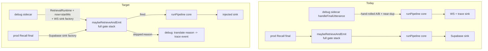

# refactor: Debug Pipeline Parity — route the debug sidecar through the prod adapter

## Summary

Collapse the local-mic / transcript-replay debug sidecar onto the **production retrieval adapter** (`apps/bot-worker/src/retrieval.ts` `maybeRetrieveAndEmit`) so the debug page reflects the live pipeline exactly — same answer/suppress decision per utterance, plus a visible reason for each. Today the sidecar (`apps/bot-worker/src/debug/local-debug-ws.ts`) calls the pipeline **core** (`runPipeline`) directly and hand-rolls a partial copy of the adapter's gate stack, so a replayed meeting over-answers and the debug view diverges from prod. We make the adapter's output sink and clock injectable (behavior-preserving for prod), route the debug path through it, delete the hand-rolled replica, thread the real meeting ID for scoped retrieval, and surface every pre-pipeline gate skip in the trace.

Origin: `docs/brainstorms/2026-06-08-debug-pipeline-parity-requirements.md`. Builds on branch `fix/github-skill-misroute` (shared `pipeline/question-trigger.ts`, the replay-path near-dup gate, and the `question-dedup` trace stage already landed).

---

## Problem Frame

Production runs every finalized utterance through `maybeRetrieveAndEmit`, which applies a gate stack — two-lane question/ambient classification, question-anchored query build, semantic near-duplicate-question suppression, per-minute/per-meeting question ceiling, 10s cooldown, utterance threshold, and the meeting-scoped effective-source-set filter — **then** calls `runPipeline` with the Supabase sink. The debug sidecar skips most of that: it calls `runPipeline` directly and re-implements only Mechanism A/B voiding/dedup plus a recently-added near-dup gate. The two paths have already drifted once (a replayed meeting answered one conversational thread four times where prod would have suppressed it).

The fix is structural: one code path. Make the adapter's two prod-specific couplings — the hardcoded Supabase sink and `Date.now()` — injectable, then drive the debug sidecar through the same adapter with a WS+trace sink and a logical clock. Drift becomes impossible because the gate logic exists in exactly one place.

**Who is affected:** the developer/operator using the debug page to diagnose live pipeline behavior. Secondary: anyone touching `maybeRetrieveAndEmit` — the refactor must not change prod behavior (the retrieval test suites are the contract).

---

## Requirements (from origin)

- **R1 — Single code path / behavior parity.** Debug runs `maybeRetrieveAndEmit`; same answer/suppress decision as prod per utterance.
- **R2 — Observability parity.** Every gate decision visible in the trace panel + copied summary, including the pre-pipeline skips and the resolved retrieval scope; a suppressed utterance shows *why*.
- **R3 — Sink injection.** Adapter output sink is injectable (prod = Supabase sink, debug = WS+trace sink); the grounded-answer hook stays wired to the adapter's runtime-recording.
- **R4 — Injectable logical clock.** Time-based gates read an injected `now`; replay supplies meeting-logical `startMs`, live-mic/prod use wall-clock.
- **R5 — Meeting-scoped retrieval for replay.** Real meeting ID threads through so retrieval scopes to that meeting's source set.
- **R6 — Whole-org sandbox for live-mic.** No-meeting sessions run whole-org, labeled "unscoped (no meeting)".
- **R7 — Remove hand-rolled replication.** Delete the sidecar's parallel gate/dedup/state copy.
- **R8 — Production behavior preserved.** `apps/bot-worker/test/retrieval.test.ts` + `retrieval-safety-net.test.ts` stay green.

---

## Key Technical Decisions

- **KTD1 — Debug-side trace translation for gate skips (origin OQ1).** `maybeRetrieveAndEmit` already returns `{ emitted, skipped? }` with a reason string (`empty_query`, `duplicate_question`, `question_ceiling`, `cooldown`, `below_utterance_threshold`). The debug caller translates that return into a single-stage `trace` WS event, mirroring the existing `question-dedup` stage approach. The adapter stays trace-free, so the prod path is untouched. Rejected: emitting trace from inside the adapter (couples prod to a debug concern; the no-trace Supabase sink would no-op it but it still bloats the live path).
- **KTD2 — Sink injection via an optional factory (origin OQ2).** The adapter accepts an optional `createSink(wiring) => PipelineSink` where `wiring` carries the adapter's `onGroundedAnswer`/`onMiss`/`onSynthesisRequested` runtime-recording hooks. Default factory builds the Supabase sink (prod call site unchanged). Debug passes a factory that builds the WS sink (`createWsSink`) with those same hooks. This keeps the runtime-recording (answeredQuestions/consumedFinals/answeredSourceSets) authoritative inside the adapter regardless of sink. Rejected: passing a pre-built sink (the grounded-answer hook must close over adapter-internal `effective`/`questionVec`/`lane`/`now`, which only exist inside the call).
- **KTD3 — Injectable clock, default `Date.now` (origin part of R4).** Add an optional `now: number` parameter; `const now = args.now ?? Date.now()`. Replay passes `utterance.startMs`; live-mic/prod omit it. The near-dup recency window, cooldown, and question-ceiling windows all read this `now`.
- **KTD4 — Meeting ID on `replay-reset`; runtime per connection (origin OQ3/OQ4).** Extend the `replay-reset` inbound to carry an optional `meetingId`. The sidecar holds one `RetrievalRuntime` (`newRetrievalRuntime()`) per WS connection and resets it on `replay-reset`, matching prod's per-meeting runtime lifetime. With a meetingId, the adapter resolves the effective source set via the existing RPC; without one (live-mic), retrieval runs whole-org and the trace is labeled unscoped.
- **KTD5 — Characterization-first on the adapter refactor.** Before changing `maybeRetrieveAndEmit`, add characterization tests that pin its current gate-skip returns and runtime mutations, so the sink/clock extraction is provably behavior-preserving. The existing retrieval suites are the backstop.

---

## High-Level Technical Design

Today vs target control flow:

Gate-skip → trace-stage mapping (KTD1), reusing the pre-pipeline `PRE`-code rows in the trace catalog:

| Adapter `skipped` reason | Trace stage | Display |
|---|---|---|
| `below_utterance_threshold` | `threshold` | SKIP |
| `cooldown` | `cooldown` | SKIP |
| `question_ceiling` | `cooldown` (ceiling variant) | SKIP |
| `duplicate_question` | `question-dedup` | SKIP (already wired) |
| `empty_query` | `empty-query` | SKIP |
| (fired → core runs) | core stages | existing trace |

---

## Implementation Units

### U1. Make `maybeRetrieveAndEmit` sink- and clock-injectable (characterization-first)

- **Goal:** Extract the two prod-specific couplings (hardcoded `createSupabaseSink`, `Date.now()`) into injectable seams without changing prod behavior.
- **Requirements:** R3, R4, R8; KTD2, KTD3, KTD5.
- **Dependencies:** none.
- **Files:**
  - `apps/bot-worker/src/retrieval.ts` (modify — add optional `now` + `createSink` factory; default to current behavior)
  - `apps/bot-worker/test/retrieval.test.ts` (modify — characterization + new seam coverage)
  - `apps/bot-worker/test/retrieval-safety-net.test.ts` (safety net — must stay green)
- **Approach:** Add `now?: number` to the args; replace the internal `const now = Date.now()` with `args.now ?? Date.now()`. Add `createSink?: (wiring) => PipelineSink` where `wiring` exposes the adapter's grounded-answer/miss/synthesis-requested hooks (the closures that record `answeredQuestions`/`consumedFinals`/`answeredSourceSets` and prune by the recency window using `now`). Default factory reproduces the current `createSupabaseSink({...})` call exactly. Every gate that reads time (near-dup window, cooldown, question ceiling, answered-source recency prune) must read the injected `now`.
- **Execution note:** Characterization-first — pin the current gate-skip returns and runtime-state mutations before extracting the seams.
- **Patterns to follow:** the existing `createSupabaseSink` wiring block and the `onGroundedAnswer` closure in `maybeRetrieveAndEmit`; `newRetrievalRuntime()` shape.
- **Test scenarios:**
  - Covers AE5. Default-args call (no `now`, no `createSink`) is byte-for-byte behavior-identical: same gate-skip reasons, same runtime mutations as before — characterization snapshot over a scripted utterance sequence.
  - Injected `now` drives the cooldown window: two utterances `now=0` and `now=5000` with a 10s cooldown → second is `cooldown`-skipped; `now=0` and `now=11000` → second fires.
  - Injected `now` drives the near-dup recency window: an answered question at `now=0` suppresses a near-dup at `now=1000` but not at `now` past the window.
  - Injected `createSink` factory receives the runtime-recording wiring and is used instead of the Supabase sink; the grounded-answer hook still mutates `answeredQuestions`/`consumedFinals`/`answeredSourceSets`.
  - Question ceiling counts use injected `now` for the per-minute window.
- **Verification:** `retrieval.test.ts` + `retrieval-safety-net.test.ts` pass; new seam tests pass; no diff in prod-path behavior (default args).

### U2. Translate adapter gate-skips into trace events (debug observability)

- **Goal:** Give the debug caller a pure helper that maps a `maybeRetrieveAndEmit` `{ skipped }` return to a `trace` WS event, so every pre-pipeline suppression is visible.
- **Requirements:** R2; KTD1.
- **Dependencies:** U1 (stable skip-reason returns).
- **Files:**
  - `apps/bot-worker/src/debug/gate-skip-trace.ts` (create — pure `skipReasonToTrace(reason, ctx)` → trace event payload, or null when the reason isn't a pre-pipeline gate)
  - `apps/bot-worker/test/debug/gate-skip-trace.test.ts` (create)
  - `apps/bot-worker/src/pipeline/contract.ts` (modify — ensure the pre-pipeline stage ids exist on `PipelineStage`: `threshold`, `cooldown`, plus existing `question-dedup`/`empty-query`)
- **Approach:** Pure function taking the reason string + context (utteranceId, meetingId, priorContext, latency) and returning the trace event with a single short-circuited stage (decision `skip`, reason = the gate). Mirror the `question-dedup` event the replay handler already emits. `duplicate_answer_sources` is NOT here — it is a core (in-`runPipeline`) skip already traced via `dedup-expand`.
- **Patterns to follow:** the `question-dedup` trace event already emitted in `local-debug-ws.ts`; the `PipelineStage` union additions made for `question-dedup`.
- **Test scenarios:**
  - Each pre-pipeline reason (`below_utterance_threshold`, `cooldown`, `question_ceiling`, `duplicate_question`, `empty_query`) maps to the expected stage id with `status: short_circuited`, `decision: skip`.
  - A fired/`undefined` skip returns null (no synthetic trace — the core emits the real one).
  - An unknown reason returns null (defensive).
  - The emitted event carries the passed priorContext + utteranceId/meetingId.
- **Verification:** unit tests pass; the trace events parse against the portal trace model (stage ids exist in the union).

### U3. Route the debug sidecar through `maybeRetrieveAndEmit`; delete the replica

- **Goal:** Replace the hand-rolled `runDebugPipeline` + Mechanism A/B + near-dup wiring in the sidecar with a single call to the prod adapter, using a per-connection `RetrievalRuntime`, a WS-sink factory, and `now = startMs` for replay.
- **Requirements:** R1, R3, R4, R7; KTD2, KTD3.
- **Dependencies:** U1, U2.
- **Files:**
  - `apps/bot-worker/src/debug/local-debug-ws.ts` (modify — remove hand-rolled gate/dedup/state; build `RetrievalRuntime` per connection; call `maybeRetrieveAndEmit` with WS-sink factory + injected `now`; on `{skipped}` emit the U2 trace)
  - `apps/bot-worker/test/debug/local-debug-ws.test.ts` (modify — handler routes through the adapter; reset clears the runtime)
- **Approach:** On connection, `const runtime = newRetrievalRuntime()`. In the final-utterance handler, call `maybeRetrieveAndEmit({ runtime, utteranceText, utteranceId, meetingId, orgId, db, embedder, synthesizer, ...classifiers, lastSummary, now: replayLogicalNow, createSink: wsSinkFactory })`. The WS-sink factory builds `createWsSink` wired to the adapter's grounded-answer hook + onComplete (summarizer close-loop). On a `{skipped}` return, emit the U2 trace event. `replay-reset` calls `runtime = newRetrievalRuntime()` (or resets fields). Delete: the per-connection `recentFinals`/`consumedFinals`/`answeredSourceSets`/`answeredQuestions` arrays, the `effectiveWindow`/continuation-merge/near-dup blocks, and `runDebugPipeline`. The summarizer runtime stays and feeds `lastSummary`.
- **Execution note:** This is the behavior-shifting unit for the debug path (intended — it gains the full gate stack). Keep the live-mic Deepgram path and the replay-inbound path both routing through the single handler.
- **Patterns to follow:** the prod call site of `maybeRetrieveAndEmit` (the Recall worker); the existing `createWsSink` wiring; `parseReplayInbound`.
- **Test scenarios:**
  - A replayed question sequence routes through `maybeRetrieveAndEmit` (assert the adapter is invoked, not `runPipeline` directly).
  - Near-duplicate questions are suppressed by the adapter (not the deleted hand-rolled gate) and produce a `question-dedup`/cooldown trace via U2.
  - `replay-reset` resets the `RetrievalRuntime` so a re-run doesn't bleed dedup/cooldown state.
  - Live-mic path (Deepgram final) and replay-utterance path both drive the same handler/adapter.
  - The grounded-answer hook records dedup state on the shared runtime (a later identical question is suppressed).
- **Verification:** the over-answering case no longer reproduces in replay; `local-debug-ws.test.ts` passes; no references to the deleted replica remain.

### U4. Thread the meeting ID for scoped retrieval; label live-mic unscoped

- **Goal:** Replay scopes retrieval to the replayed meeting's source set; live-mic with no meeting runs whole-org and is labeled.
- **Requirements:** R5, R6; KTD4.
- **Dependencies:** U3.
- **Files:**
  - `apps/bot-worker/src/debug/local-debug-ws.ts` (modify — accept `meetingId` on `replay-reset`; pass to the adapter; default to whole-org + unscoped label when absent)
  - `apps/portal/app/(authed)/debug/live-mic/_client.tsx` (modify — send the loaded meetingId on `replay-reset`)
  - `apps/portal/app/(authed)/debug/live-mic/_replay-driver.ts` or the WS-send path (modify — include meetingId in the reset payload)
  - `apps/bot-worker/test/debug/local-debug-ws.test.ts` (modify — meetingId parsing + scope passing)
- **Approach:** Extend `parseReplayInbound`'s `replay-reset` to carry an optional `meetingId`. When present, pass it as the adapter's `meetingId` so the existing `meeting_effective_source_ids` resolution scopes retrieval. When absent (live-mic), pass the sentinel the adapter already understands for whole-org (today's behavior) and surface an "unscoped (no meeting)" marker the trace/summary renders. The page sends the meetingId it loaded the transcript with on `replay-reset`.
- **Patterns to follow:** the adapter's `effectiveSourceIds` resolution; the existing `replay-reset` message shape; the U2 trace-context plumbing for the scope label.
- **Test scenarios:**
  - `replay-reset` with a meetingId → the adapter receives that meetingId (scoped retrieval).
  - `replay-reset` without a meetingId (live-mic) → whole-org retrieval, and the trace/summary carries the unscoped label.
  - Malformed/empty meetingId is treated as no-meeting (defensive), not an error.
  - Covers AE4. A scoped replay's trace shows the meeting scope; a live-mic trace shows "unscoped (no meeting)".
- **Verification:** replay retrieval is meeting-scoped; live-mic clearly labeled; no crash when the RPC returns empty for a given meeting.

### U5. Surface the new pre-pipeline gate stages + scope label in the trace model & summary

- **Goal:** The portal trace panel and copied summary render the cooldown / ceiling / threshold stages and the retrieval-scope label, so a suppressed utterance reads correctly (not "no trace / pending").
- **Requirements:** R2, R6; KTD1.
- **Dependencies:** U2 (stage ids), U4 (scope label).
- **Files:**
  - `apps/portal/app/(authed)/debug/live-mic/_pipeline-model.ts` (modify — ensure `threshold`/`cooldown` render as real (non-derived) skip stages when a record is present; `deriveOutcome` maps them to `skip`; add the scope label surfacing)
  - `apps/portal/app/(authed)/debug/live-mic/_replay-summary.ts` (modify — show the suppression gate + scope label per utterance)
  - `apps/portal/test/debug/pipeline-model.test.ts` (modify)
  - `apps/portal/test/debug/replay-summary.test.ts` (modify)
  - `apps/portal/test/live-mic-pipeline-model.test.ts` (modify — catalog/row-count assertions)
- **Approach:** The `threshold`/`cooldown` catalog rows currently render as portal-derived "not gated in dev" info rows. When an actual skip record is present for them (now possible because the adapter runs in debug), render them as real SKIP stops via `statusOf`/`deriveOutcome` — like `question-dedup`. Add a per-utterance retrieval-scope line ("scoped to meeting X" / "unscoped (no meeting)") to the trace header and the summary, sourced from the U4 label. Keep the derived "info" rendering as the fallback when no record exists.
- **Patterns to follow:** the `question-dedup` handling added across `_pipeline-model.ts` (`statusOf`, `deriveOutcome`, catalog, ribbon) and `_replay-summary.ts` (`suppressionLine`).
- **Test scenarios:**
  - A trace with a `cooldown` short-circuit stage → `deriveOutcome` is `skip` with a cooldown sub; the ledger row reads SKIP and downstream rows are not-reached.
  - Same for `threshold` and the ceiling variant.
  - The summary shows `suppressed at: cooldown` (and threshold/ceiling) for the respective utterances.
  - The summary/trace shows the retrieval-scope label for both a scoped replay and an unscoped live-mic utterance.
  - Derived "not gated in dev" rendering still applies when no record exists for those rows (back-compat for older traces).
- **Verification:** suppressed utterances render with the correct gate + scope; portal trace/summary suites pass; AE2 (no blank "no trace") holds.

---

## Scope Boundaries

### In scope
- Sink + clock injection on `maybeRetrieveAndEmit` (behavior-preserving for prod).
- Routing the debug sidecar through the adapter; deleting the hand-rolled replica.
- MeetingId threading for scoped replay; whole-org + labeled live-mic.
- Trace + summary visibility for all pre-pipeline gate skips and the retrieval scope.

### Deferred to Follow-Up Work
- A live-mic meeting-picker (borrow a meeting's source scope for the sandbox).
- Capture-and-compare against real production gate-decision logs (forensic incident diffing).
- Headless CLI replay reusing the unified path.

### Outside this product's identity
- Changing production retrieval **behavior** or any gate threshold value.
- Making live-mic-without-a-meeting claim production parity.

---

## Risks & Mitigations

- **The adapter refactor regresses prod retrieval.** Mitigation: characterization-first (KTD5/U1); `retrieval.test.ts` + `retrieval-safety-net.test.ts` are the gate; default-args path is byte-identical.
- **The grounded-answer hook doesn't fire correctly through the injected WS sink** (dedup state stops recording). Mitigation: U1 test asserts the wiring mutates the runtime regardless of sink; U3 asserts a later identical question is suppressed end-to-end.
- **Replay compressed-time distorts gates if `now` isn't threaded.** Mitigation: KTD3/R4 logical clock; AE3 test (1× vs 4× same suppression set).
- **`meeting_effective_source_ids` resolves empty for a replayed meeting** → retrieves nothing, looks broken. Mitigation: U4 handles empty resolution; the scope label makes "scoped, 0 sources" legible vs "unscoped".
- **Behavior shift surprises debug users** (the page now suppresses more). Mitigation: that's the point (parity) — U2/U5 observability makes every suppression explain itself.

---

## Acceptance / Success Criteria

- AE1: Replaying meeting `6675501a` reproduces prod's answer/suppress pattern (one answer + suppressed follow-ups), each suppression showing its gate.
- AE2: No suppressed utterance renders a blank "no trace" — every one names its gate.
- AE3: 1× and 4× replay of the same meeting yield the same answered/suppressed set.
- AE4: Scoped replay trace shows meeting scope; live-mic shows "unscoped (no meeting)".
- AE5: `retrieval.test.ts` + `retrieval-safety-net.test.ts` pass unchanged.
- One implementation of the gate/dedup/scope logic remains (no replica).

---

## Notes for Implementation

- `engine`/`crypto` are consumed as built dist — rebuild on src change before bot-worker/portal typecheck or tests.
- Branch context: `fix/github-skill-misroute` already has `pipeline/question-trigger.ts`, the replay near-dup gate, and the `question-dedup` trace stage; U3 will largely *replace* that hand-rolled near-dup wiring with the adapter call (the shared helpers in `question-trigger.ts` remain — the adapter uses them).
- Pre-existing lint debt in `retrieval.ts` (`meeting_effective_source_ids` rpc destructuring) and `core.test.ts` is not introduced by this work; filter it when checking lint.

---

## Deferred to Implementation

- Exact shape of the `createSink` wiring object (which hooks it exposes) — resolve against the real `onGroundedAnswer`/`onMiss`/`onSynthesisRequested` closures during U1.
- Whether `replay-reset` carries `meetingId` as a new field vs a small handshake message — resolve in U4 against `parseReplayInbound`.
- The exact sentinel/shape for "whole-org / unscoped" the adapter already accepts vs a new explicit flag — resolve in U4 against the `effectiveSourceIds` resolution code.
- Whether `threshold`/`cooldown` need to stop being `derived: true` in the catalog or gain a parallel non-derived id — resolve in U5 against `buildLedger`'s derived-row handling.
