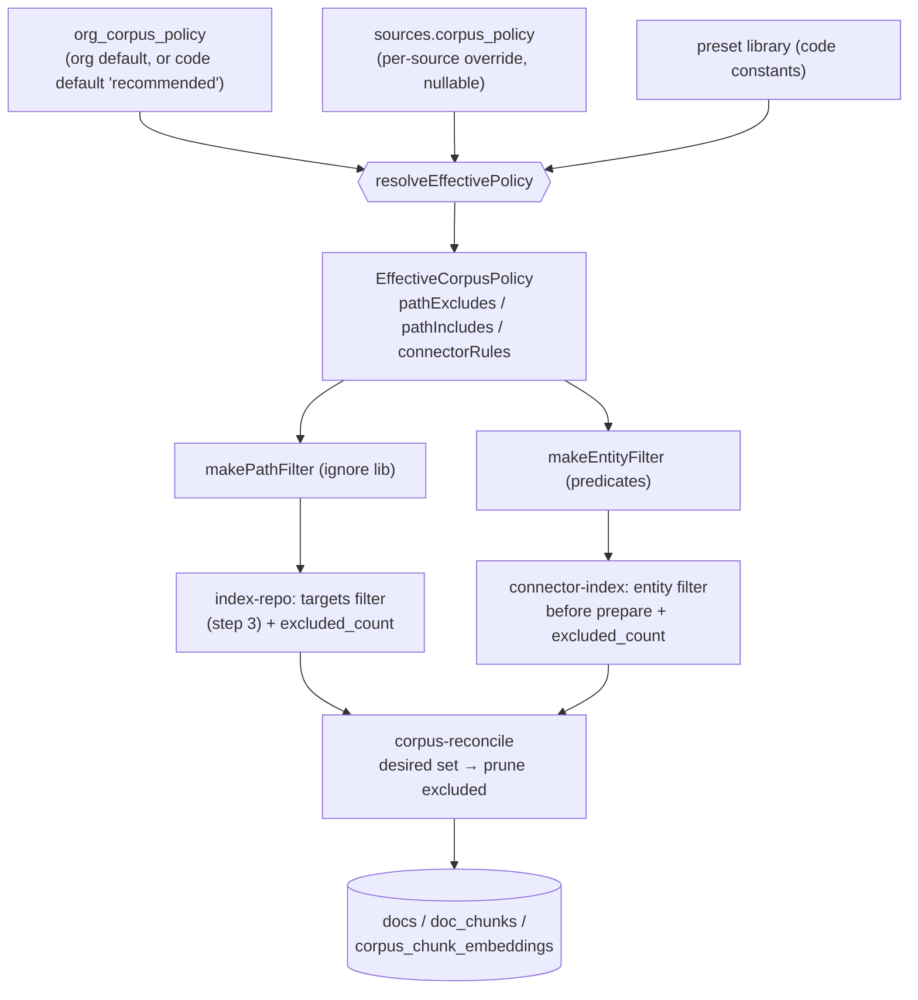

# feat: Configurable corpus filtering policy

## Summary

Give a workspace control over what each connected source contributes to the
corpus, so indexing captures knowledge and excludes noise. Ships a safe-by-default
**Recommended** preset (excludes tests, fixtures, eval reports, lockfiles, build
config; for connectors, closed/stale items), an **org-default policy** that every
source inherits, and a **per-source override**. The indexer applies the resolved
policy in its target-selection step; newly-excluded items prune through the
existing reconcile path. The Sources UI shows "indexed N of M · K excluded by
policy". Fixes the measured pollution on the dev corpus (~25% test/eval files)
that diluted retrieval and produced a citation-verified "the corpus uses SQLite"
hallucination.

Plans from origin: `docs/brainstorms/2026-06-10-corpus-filtering-policy-requirements.md`.

---

## Problem Frame

The indexer captures every parseable file/entity a source exposes, filtering only
by extension (`classifyFile` in `packages/engine/src/chunker/file-chunker.ts`) and
size. On the dev repo (`onthecaseapps/risezome`, 802 file docs): 197 (~25%) are
test files, 19 are `apps/bot-worker/eval/reports/*.json` fixtures, plus build
config. Two measured harms (golden-question eval, 2026-06-10):

1. **Retrieval dilution** — real source loses to noise (correct chunks rerank at
   ~0.016 and synthesis refuses with `no_relevant_context`).
2. **Grounded-looking hallucination** — "what database does the corpus use"
   returns a citation-*verified* "SQLite + better-sqlite3 + sqlite-vec" answer
   synthesized from stale eval-report fixtures; the real stack is Postgres +
   pgvector.

The same noise class exists in connectors (closed/duplicate Jira tickets, archived
Confluence/Trello items). No exclusion mechanism exists today; `sources` has no
policy column.

---

## Requirements

Carried from origin (`see origin`):

- **R1** — Policy resolved per source as an ordered merge: org default → per-source
  override; resolver structured so a future in-repo `.risezomeignore` is an
  additive third layer.
- **R2** — Two filter kinds: repo path globs (gitignore semantics) and connector
  attribute filters (status/age/list).
- **R3** — Built-in presets; **Recommended** is the default and applies to new and
  existing sources automatically.
- **R4** — Safe by default (allowlist-of-intent) and never silent (exclusion counts
  + a preview surfaced in the UI; recoverable via "Index everything" or an include
  override).
- **R5** — Indexer applies the resolved policy in target-selection; reindex prunes
  newly-excluded docs through `apps/portal/src/inngest/lib/corpus-reconcile.ts`.
- **R6** — Admin/manager-gated editing; a policy change reindexes the affected
  source(s).

**Success criteria:** the "what database" question no longer answers SQLite; code-
config questions retrieve real source; the dev workspace's ~197 test + 19 report
docs are excluded and pruned on reindex; relevant-bucket eval pass rate does not
drop; a regression golden question locks the pollution case.

---

## High-Level Technical Design

Resolution and application flow — one resolver feeds two filter kinds, both
upstream of the existing reconcile/prune:



Precedence (R1): preset rules form the base; override (if present) replaces the
preset and/or appends excludes/includes; an absent org row defaults to
`recommended` in code (no backfill needed). A future repo `.risezomeignore` appends
as a third merge input without changing the resolver's shape.

---

## Key Technical Decisions

**KTD1 — Data model: org-default table + per-source jsonb column.**
A narrow `org_corpus_policy` table (one row per org: `preset`, `custom_excludes`,
`custom_includes`, `updated_by`, `updated_at`) for the org default, and a nullable
`sources.corpus_policy jsonb` column for the per-source override. Resolution happens
in TypeScript at index time (the matching runs in TS anyway), not in SQL. Rationale:
mirrors the existing config-row pattern; absence of a row = code default so no
backfill; avoids the over-generalized `org_privacy_config` that was added then
dropped in the teams restructure (learnings: `docs/solutions/2026-06-04-roles-and-meeting-privacy.md`).
RLS: member-read, service-role-write, org-scoped, no client UPDATE policy
(consistent with `[[rls-no-client-update-when-service-role-writes]]` and the
`team_sources` precedent).

**KTD2 — Presets are code constants, not DB rows.** A `PresetKey` stored in the
policy references a code-defined rule set (`recommended`, `index_everything`,
`code_only`, `docs_only`). Keeps presets versioned in code, eval-tunable, and
avoids a preset table + seed migration. The stored policy is just a key + optional
custom rules.

**KTD3 — Repo path matching via the `ignore` package; connectors via structured
predicates.** Repo filters use `ignore` (zero-dep, exact gitignore semantics incl.
`!` negation / includes) — no glob lib exists in the repo today. Connector filters
are small structured rules (`{field, op, value}`) over already-fetched entity
attributes, not globs.

**KTD4 — Connector attribute filtering is scoped to currently-fetched fields.**
Jira (`apps/portal/app/_lib/atlassian-client.ts` `JiraIssue`) exposes
`status`/`issueType`/`updated` → status/type/age filters. Trello (`TrelloCard`)
exposes `listName`/`dateLastActivity` → list/age filters. Confluence
(`ConfluencePage`) exposes only `updatedAt` → age filter. Richer filters
(Trello-archived, Confluence-archived, labels) require extending those clients'
fetch and are **deferred** (see Scope Boundaries). The Recommended preset's
connector rules use only feasible-today fields.

**KTD5 — Eager full-reindex on policy change.** Editing a source override reindexes
that source in `full` mode (so prune runs). Editing the org default reindexes every
source that has no override. Mirrors `apps/portal/app/(authed)/sources/reindex-action.ts`.

**KTD6 — Exclusion visibility without storing samples.** The indexer writes a
`sources.excluded_count`. The "peek at what's dropped" is computed live in the
per-source editor (preview against the current file list / entity set) rather than
persisted, avoiding sample bloat in the row.

---

## Output Structure

New/changed surface (per-unit `Files` are authoritative):

```text
apps/portal/src/inngest/lib/
  corpus-policy.ts            # NEW types, presets, resolver, path/entity matchers
  corpus-policy-store.ts      # NEW load org default + source override → effective policy
apps/portal/app/(authed)/sources/
  corpus-policy-action.ts     # NEW server actions: edit org default / per-source override + reindex
  _connection-card.tsx        # MOD exclusion count + policy editor entry
  _corpus-policy-editor.tsx   # NEW preset select + pattern editor + live preview
supabase/migrations/
  <ts>_corpus_filtering_policy.sql   # NEW org_corpus_policy + sources columns + RLS
apps/bot-worker/eval/
  golden-questions.jsonl      # MOD pollution-regression questions
```

---

## Implementation Units

### U1. Policy core: types, presets, resolver, matchers

**Goal:** A pure, unit-tested module defining the policy shape, the preset library,
the effective-policy resolver, and the two matchers.
**Requirements:** R1, R2, R3, R4 (allowlist-of-intent default).
**Dependencies:** none.
**Files:**
- `apps/portal/src/inngest/lib/corpus-policy.ts` (new)
- `apps/portal/test/inngest/corpus-policy.test.ts` (new)
- `apps/portal/package.json` (add `ignore` dependency)
**Approach:**
- Types: `PresetKey`, `CorpusPolicy` (stored: `{ preset, customExcludes?, customIncludes?, connectorRules? }`), `EffectiveCorpusPolicy` (`{ pathExcludes, pathIncludes, connectorRules }`), `ConnectorRule` (`{ source, field, op, value }`).
- `PRESETS: Record<PresetKey, EffectiveCorpusPolicy>` — `recommended` (path excludes for tests/fixtures/eval-reports/lockfiles/build-config; Jira rule excluding resolved/closed statuses), `index_everything` (empty), `code_only`, `docs_only`.
- `resolveEffectivePolicy(orgDefault: CorpusPolicy | null, override: CorpusPolicy | null): EffectiveCorpusPolicy` — null org default ⇒ `recommended`; override replaces preset base and appends custom includes/excludes + connector rules.
- `makePathFilter(policy): (path: string) => boolean` using `ignore` (excludes minus includes via `!` negation).
- `makeEntityFilter(policy, kind): (attrs) => boolean` applying that kind's connector rules.
**Patterns to follow:** pure-logic + table-driven tests like `packages/engine/test/chunker/code-structure.test.ts`.
**Test scenarios:**
- Recommended excludes `apps/x/test/foo.test.ts`, `eval/reports/phase-3.json`, `pnpm-lock.yaml`, `tsconfig.json`; keeps `packages/engine/src/embed/voyage.ts` and `README.md`.
- `index_everything` keeps everything (no excludes).
- Resolver: null org default ⇒ recommended; override with `preset: 'index_everything'` neutralizes inherited excludes; override `customIncludes: ['!docs/keep/**']` re-includes a path the preset excluded (negation precedence).
- `makeEntityFilter` for Jira drops `status='Done'`, keeps `status='In Progress'`; for Trello drops a card in an excluded list / older than the age rule; for Confluence drops by age only.
- Unknown `PresetKey` falls back to `recommended` (defensive).
**Verification:** module unit tests pass; no I/O in the module.

### U2. Migration: policy table + source columns + RLS

**Goal:** Persist the org default and per-source override; add the exclusion counter.
**Requirements:** R1, R4, R6.
**Dependencies:** none (independent of U1).
**Files:**
- `supabase/migrations/<timestamp>_corpus_filtering_policy.sql` (new)
**Approach:**
- `create table public.org_corpus_policy (org_id uuid pk references orgs(id) on delete cascade, preset text not null default 'recommended', custom_excludes jsonb not null default '[]', custom_includes jsonb not null default '[]', connector_rules jsonb not null default '[]', updated_by uuid, updated_at timestamptz not null default now())`.
- `alter table public.sources add column corpus_policy jsonb` (nullable; null = inherit org default) and `add column excluded_count int not null default 0`.
- RLS: enable on `org_corpus_policy`; SELECT policy = member of `org_id` (mirror `team_sources` read predicate, via the org-membership helper now in the `private` schema); NO client INSERT/UPDATE/DELETE (service-role writes only). `sources` already has its RLS; the two new columns inherit it.
- `preset` CHECK constraint over the known keys (kept in sync with U1's `PresetKey`).
**Patterns to follow:** RLS shape + `revoke`/`grant` conventions from the recent
`supabase/migrations/20260612070000_private_authz_schema.sql` and `team_sources`
policies.
**Test scenarios:** `Test expectation: none — schema migration; behavior covered by U3/U4/U5 + RLS suite.` Add an RLS assertion in the existing portal RLS suite that a non-member cannot read another org's `org_corpus_policy` (see `apps/portal/test/rls/`), per `[[rls-test-harness-gotchas]]`.
**Verification:** `supabase db push` applies cleanly on a fresh local stack; RLS test green.

### U3. Effective-policy store: load + resolve for the indexer

**Goal:** One helper the indexers call to get the effective policy for a source.
**Requirements:** R1, R5.
**Dependencies:** U1, U2.
**Files:**
- `apps/portal/src/inngest/lib/corpus-policy-store.ts` (new)
- `apps/portal/test/inngest/corpus-policy-store.test.ts` (new)
**Approach:**
- `loadEffectivePolicy(db, orgId, source): Promise<EffectiveCorpusPolicy>` — reads `org_corpus_policy` (service-role) and the source's `corpus_policy`, calls `resolveEffectivePolicy`. Memoize per (orgId) within a run if cheap.
- Service-role reads (indexer context); org-scoped query.
**Test scenarios:** resolves recommended when no org row and no override; org override preset honored; per-source override beats org default; happy path returns a usable matcher pair (smoke via `makePathFilter`).
**Verification:** unit tests pass with a mocked supabase client (pattern: `apps/portal/test/inngest/corpus-reconcile.test.ts`).

### U4. Wire path filter into index-repo + record excluded_count

**Goal:** Repo files are filtered by the resolved policy before chunk/embed; the
excluded count is recorded; reindex prunes newly-excluded docs.
**Requirements:** R2, R4, R5.
**Dependencies:** U3.
**Files:**
- `apps/portal/src/inngest/functions/index-repo.ts` (modify)
- `apps/portal/test/inngest/index-repo-policy.test.ts` (new)
**Approach:**
- In step 3 (the `targets` filter), load the effective policy and apply
  `makePathFilter` as an additional `.filter()` on `tree.blobs`. Compute
  `excludedCount = candidatesAfterSizeClassify − targetsAfterPolicy`; write it to
  `sources.excluded_count` alongside the existing `total_files` write.
- Excluded files simply never enter the `desired` map → existing reconcile prunes
  any previously-indexed doc for those paths (no new deletion code; R5).
- Keep the chunking-config (`:cs1`) hash logic untouched.
**Patterns to follow:** the existing `targets`/`set-total` block in `index-repo.ts`.
**Test scenarios:**
- A tree with `src/a.ts`, `test/a.test.ts`, `eval/reports/x.json` under Recommended → only `src/a.ts` targeted; `excluded_count = 2`.
- `index_everything` override → all three targeted; `excluded_count = 0`.
- Covers R5: a path previously indexed but now policy-excluded is absent from
  `desired` (assert it's not in the target set → reconcile would prune it).
**Verification:** tests pass; a manual full reindex of the dev repo drops the ~216
noise docs and `excluded_count` reflects it.

### U5. Wire entity filter into the connector indexers + record excluded_count

**Goal:** Jira/Confluence/Trello entities are filtered by the resolved policy before
prepare; excluded count recorded.
**Requirements:** R2, R4, R5.
**Dependencies:** U3.
**Files:**
- `apps/portal/src/inngest/lib/connector-index.ts` (modify — accept an entity filter)
- `apps/portal/src/inngest/functions/index-jira.ts` (map issue → attrs)
- `apps/portal/src/inngest/functions/index-trello.ts` (map card → attrs; verify archived cards already excluded at fetch)
- `apps/portal/src/inngest/functions/index-confluence.ts` (map page → attrs)
- `apps/portal/test/inngest/index-connectors-policy.test.ts` (new)
**Approach:**
- `runConnectorIndex` gains a `corpusPolicy`/`entityFilter` config field. After
  `fetch-entities`, filter the entity list with `makeEntityFilter(policy, kind)`
  before the prepare loop; record `excluded_count` in the `set-total`/`finalize`
  writes. Filtered-out entities leave the desired set → reconcile prunes (R5).
- Each connector provides a kind-specific attribute extractor (Jira: status,
  issueType, updated; Trello: listName, dateLastActivity; Confluence: updatedAt).
**Patterns to follow:** the existing `corpusWriter ?? pgCorpusWriter()` injection in
`connector-index.ts`; reuse the in-memory test harness in
`apps/portal/test/inngest/index-connectors-reconcile.test.ts`.
**Test scenarios:**
- Jira: a `Done` issue is filtered out, an `In Progress` issue indexed; excluded
  count = 1.
- Trello: a card in an excluded list filtered; verify `fetchBoardCards` does not
  already return archived cards (note finding in the test or a code comment).
- Confluence: age rule drops a page older than the threshold.
- `index_everything` → nothing filtered for any connector.
- Covers R5: a now-excluded entity is absent from the desired set.
**Verification:** tests pass; a Jira/Trello reindex with Recommended prunes
closed/stale items.

### U6. Sources UI: exclusion visibility + policy editor + write actions

**Goal:** Admins see "indexed N of M · K excluded by policy", can pick a preset and
edit patterns per source and for the workspace default, with a live preview; saving
reindexes.
**Requirements:** R3, R4, R6.
**Dependencies:** U2, U3 (resolver for preview).
**Files:**
- `apps/portal/app/(authed)/sources/corpus-policy-action.ts` (new — server actions)
- `apps/portal/app/(authed)/sources/_corpus-policy-editor.tsx` (new)
- `apps/portal/app/(authed)/sources/_connection-card.tsx` (modify — status line + editor entry)
- `apps/portal/app/(authed)/sources/page.tsx` (modify — load org default + per-source policy + excluded_count)
- `apps/portal/test/sources/corpus-policy-action.test.ts` (new)
- `apps/portal/test/sources/connection-card.test.tsx` (modify)
**Approach:**
- Server actions `setOrgCorpusPolicy` and `setSourceCorpusPolicy`, `requireManager`-
  gated (pattern: `team-source-toggle-action.ts`), service-role writes, then emit
  reindex (KTD5): per-source change → reindex that source; org-default change →
  reindex every source with `corpus_policy is null`.
- Status line: extend `buildStatusLine` in `_connection-card.tsx` to append
  `· K excluded by policy` when `excluded_count > 0`.
- Editor: preset `<select>` + textarea of gitignore-style patterns; a live preview
  ("X of Y files would be excluded") computed client→server against the source's
  current file list using `makePathFilter`. Org-default editor reachable from the
  connection header; per-source override from the card's kebab menu.
**Patterns to follow:** `_connection-card.tsx` toggle/menu structure and the
`reindexSourceAction` dispatch.
**Test scenarios:**
- `setSourceCorpusPolicy` requires manager (rejects non-admin); persists override;
  emits a reindex event for that source.
- `setOrgCorpusPolicy` reindexes only sources without an override (assert the
  fan-out set).
- Status line renders "1 of 1 repo connected · 600 files indexed · 202 excluded by
  policy".
- Editor preview counts excluded files for a sample tree + preset.
**Verification:** tests pass; manually editing a source's preset reindexes it and
the card reflects the new excluded count.

### U7. Eval regression: pollution golden questions

**Goal:** Lock the fixed pollution behavior so a future preset/override change can't
silently reintroduce it.
**Requirements:** success criteria.
**Dependencies:** U4 (so the corpus is clean when the eval runs).
**Files:**
- `apps/bot-worker/eval/golden-questions.jsonl` (modify)
**Approach:**
- Add a relevant question "what database does the corpus use" with
  `expect_answer_contains` Postgres/pgvector (and a `note` that it must NOT answer
  SQLite — enforced via the answer-contains gate + a refusal being acceptable over a
  wrong answer).
- Add/confirm a code-retrieval question ("which embedding model is used for code vs
  prose") now expected to surface real source (`must_surface` voyage-code-3 / the
  embed module).
**Patterns to follow:** existing entries + `validateGoldenSet` schema in
`apps/bot-worker/src/corpus-eval.ts`; honors `[[eval-regression-coverage]]`.
**Test scenarios:** `Test expectation: none — eval fixtures; validated by
validateGoldenSet and exercised by the replay harness.`
**Verification:** after a clean reindex, `pnpm tsx --env-file=.env eval/replay.ts <org>`
shows the "what database" question passing (real source or refusal, not SQLite) and
no relevant-bucket regression.

---

## Scope Boundaries

**In scope (v1):** org-default + per-source override; repo path globs + connector
attribute filters over currently-fetched fields; preset library with default-on
Recommended; exclusion-count visibility + live editor preview; prune-on-reindex via
existing reconcile; admin-gated editing + reindex-on-change.

**Deferred for later** (origin "Deferred"):
- In-repo `.risezomeignore` as a third resolution layer (resolver is shaped for it).
- Content-heuristic filtering (drop low-value files by model/heuristic).

**Deferred to Follow-Up Work** (plan-local sequencing):
- Extending the Trello/Confluence clients to fetch `archived`/label fields so those
  connectors get richer attribute filters (KTD4) — the framework lands now, the
  extra fields later.
- GitHub issues/PRs state filtering in `index-github-issues.ts` (the measured
  pollution was repo files; issue-state rules can reuse the connector-rule shape).
- A persisted per-rule "what was dropped" breakdown on the card (v1 shows a count +
  live preview).

**Outside this feature's identity** (origin): a per-file manual include/exclude
curation UI — this is a glob/preset policy, not a file browser.

---

## System-Wide Impact

- **Affected:** every customer (the Recommended default changes what gets indexed on
  the next reindex). Existing sources inherit recommended via the code default — no
  backfill, but a reindex is required to prune already-indexed noise (rollout note).
- **Retrieval/eval:** expected quality improvement; gated by U7 + a full eval run.
- **Storage:** excluding noise slightly shrinks the cleartext-at-rest corpus residual
  flagged in `docs/solutions/2026-06-03-content-encryption-at-rest.md` (minor positive).
- **Audit:** policy changes are traced by `updated_by`/`updated_at` on the row. A
  `permission_audit_log` entry is **not** added in v1 (the `action` CHECK lacks a
  `config_change` value — same deliberate gap as the privacy config; revisit if an
  audit trail is required).

---

## Risks & Dependencies

- **Over-exclusion / silent content loss** (R4 mitigates): a too-aggressive preset
  drops files a customer wanted. Mitigation: visible exclusion count + live preview +
  one-step recovery (Index-everything or include override); U7 guards relevant-bucket
  pass rate.
- **`ignore` semantics drift:** gitignore matching edge cases (anchored vs floating
  patterns). Mitigation: U1 table-driven tests cover anchoring, `**`, and `!`
  negation explicitly.
- **Org-default change fan-out:** reindexing every override-less source at once could
  be a large burst. Mitigation: emit per-source reindex events (Inngest concurrency
  caps apply); acceptable at current scale.
- **Truncated GitHub tree + prune interaction:** policy filtering must not change the
  existing `truncated ⇒ don't prune` guard. Mitigation: U4 applies the filter to the
  candidate set only; reconcile's `fetchComplete` logic is untouched.
- **Dependency:** new `ignore` package (zero-dep, widely used). Connector richness
  bounded by KTD4.

---

## Sources & Research

- Origin: `docs/brainstorms/2026-06-10-corpus-filtering-policy-requirements.md`
- Learnings: `docs/solutions/2026-06-04-roles-and-meeting-privacy.md` (RLS
  member-read/service-role-write; `team_sources` + `meeting_effective_source_ids`
  precedent; `org_privacy_config` churn caution; audit-action gap),
  `docs/solutions/2026-06-03-content-encryption-at-rest.md` (corpus storage surface).
- Repo: `index-repo.ts` target-selection step; `connector-index.ts` fetch→prepare
  seam; `corpus-reconcile.ts` prune path; `JiraIssue`/`TrelloCard`/`ConfluencePage`
  in `apps/portal/app/_lib/atlassian-client.ts` + `trello-client.ts` (field
  feasibility). No glob library present → `ignore`.
- Memory: `[[rls-no-client-update-when-service-role-writes]]`,
  `[[rls-test-harness-gotchas]]`, `[[eval-regression-coverage]]`,
  `[[corpus-pollution-test-eval-files]]`.
