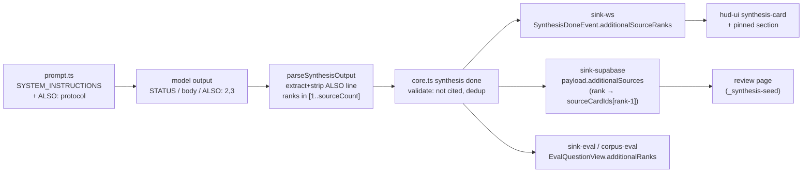

# feat: Additional sources on synthesis answers

## Summary

Synthesis answers stay terse (1–3 sentences, minimal citations), but the
synthesizer marks retrieved-but-uncited sources that also support its answer
via one optional protocol line (`ALSO: 2,3`). Marks are validated like
citations (in-range, not already cited, else dropped silently — never blocking
the answer), resolved to the existing retrieval cards, carried through both
sinks, and rendered as a compact "Additional sources" links row wherever the
answer renders (HUD live card, pinned syntheses, review page). Eval coverage
locks the motivating case: a Confluence-cited answer surfaces `contextualize.ts`
and `file-chunker.ts` beneath it; an irrelevant retrieved hit is not marked.

Plans from origin: `docs/brainstorms/2026-06-11-additional-sources-section-requirements.md`.

---

## Problem Frame

The synthesizer cites only the sources its sentences draw on — usually the top
hit. Corroborating sources (often the primary code) are retrieved, persisted as
retrieval cards, and then invisible on the answer. The data gap is small: the
synthesis event/payload already carries the full retrieved set
(`sourceCardIds`); citations reference a subset by rank. What's missing is the
model's judgment of which uncited ranks *support* the answer, and a render row.

---

## Requirements

Carried from origin:
- **R1** — optional `ALSO:` protocol line; prompt instructs marking uncited
  sources only when they independently support the answer.
- **R2** — server-side validation: in-range rank, present in retrieved set, not
  already cited; duplicates/invalid dropped; never alters the answer.
- **R3** — payload carries additional sources as references to existing
  retrieval cards (no new retrieval/storage).
- **R4** — render on every synthesis surface as a subordinate links row;
  absent when nothing marked.
- **R5** — eval: golden multi-source question asserts marked sources present
  and an irrelevant hit absent.

**Success criteria:** motivating trace case renders as described; no eval
pass-rate/precision regression; garbled `ALSO:` line ⇒ normal answer, no row.

---

## High-Level Technical Design

---

## Key Technical Decisions

**KTD1 — `ALSO:` parsed inside `parseSynthesisOutput`, stripped from the body.**
The line may appear anywhere after the body (instruct: last line); the parser
extracts ranks, removes the line so it never renders or affects citation
positions, and clamps to `[1..sourceCount]`. Mirrors how `STATUS:` is handled
(see `classifyStatus` / `stripStatusPrefix` in
`packages/engine/src/synthesize/prompt.ts`). (R1)

**KTD2 — final validation in core, not the parser.** The parser knows only
`sourceCount`; "not already cited" and dedup require the parsed citations —
core applies that before emitting `synthesisDone` so both sinks receive the
same validated list. Validation failure = drop the rank, keep the answer (R2).

**KTD3 — payload stores resolved card references, ranks on the wire.** The WS
event carries `additionalSourceRanks` (HUD already holds `sourceCardIds` to
resolve locally, mirroring how citations resolve); the persisted payload stores
resolved `additionalSources: [{cardId, rank}]` exactly like citations persist
resolved cardIds (`sourceCardIds[rank-1]` idiom in `sink-supabase.ts`). (R3)

**KTD4 — render from existing retrieval-card data.** Title + URL come from the
already-persisted retrieval cards; the row is a flat links list, visually
subordinate (small text under the answer), hidden when empty. (R4)

**KTD5 — eval lock via an optional golden field.** `golden-questions.jsonl`
gains optional `expect_additional_surface` / `expect_additional_absent`
(doc-id/title substrings, same matching as `must_surface`); ungraded when
absent so existing questions are unaffected. (R5)

---

## Implementation Units

### U1. Protocol + parser: the `ALSO:` line

**Goal:** The synthesis prompt teaches the `ALSO:` line; `parseSynthesisOutput`
extracts, validates range, and strips it.
**Requirements:** R1, R2 (range part).
**Dependencies:** none.
**Files:**
- `packages/engine/src/synthesize/prompt.ts` (modify: SYSTEM_INSTRUCTIONS + parser)
- `packages/engine/src/synthesize/contract.ts` (modify: `ParsedSynthesis.additionalRanks`)
- `packages/engine/test/synthesize/prompt.test.ts` (or the existing parser test file)
**Approach:** add a short instruction block: after the answer body, optionally
emit exactly one line `ALSO: <comma-separated source numbers>` naming uncited
sources that also support the answer; never cite-and-mark the same source; omit
the line when none apply. Parser: regex the final `ALSO:` line, parse ints,
keep `1..sourceCount`, dedupe, strip the line from `text`. Refusals never carry
additionalRanks.
**Patterns to follow:** `classifyStatus`/`CITATION_REGEX` handling in the same file.
**Test scenarios:**
- Happy: body + `ALSO: 2,3` → text without the line, `additionalRanks [2,3]`.
- Garbled: `ALSO: x,9999`, `ALSO:` empty, line embedded mid-body → invalid
  entries dropped; out-of-range dropped; body intact; no throw.
- Absent line → `additionalRanks []`; refusal output → `[]` even if line present.
- Quote-containing citations unaffected by stripping.
**Verification:** engine synthesize tests green; parsed answers byte-identical
to today when no `ALSO:` line is present.

### U2. Core validation + event/contract plumbing

**Goal:** Core drops already-cited/duplicate ranks and emits the validated list
on `synthesisDone`; eval sink captures it.
**Requirements:** R2, R5 (capture).
**Dependencies:** U1.
**Files:**
- `apps/bot-worker/src/pipeline/core.ts` (modify)
- `apps/bot-worker/src/pipeline/contract.ts` (modify: SynthesisDone info gains `additionalSourceRanks`)
- `apps/bot-worker/src/pipeline/sink-eval.ts` (modify: pass through)
- `apps/bot-worker/test/pipeline/core.test.ts` (modify)
**Approach:** after citation verification, compute
`additionalSourceRanks = parsed.additionalRanks − citedRanks`, dedup, clamp to
retrieved count; emit on the same done event citations ride today.
**Test scenarios:**
- Rank also cited → removed; duplicate ranks → one entry.
- All-invalid list → empty array; event still emitted; answer unchanged.
- Refusal path emits no additional ranks.
**Verification:** core tests green; done events carry the validated list.

### U3. Sinks: WS event + persisted payload

**Goal:** Live HUD event and persisted synthesis card both carry the marks.
**Requirements:** R3.
**Dependencies:** U2.
**Files:**
- `apps/bot-worker/src/pipeline/sink-ws.ts` (modify)
- `apps/bot-worker/src/pipeline/sink-supabase.ts` (modify: resolve rank→cardId, persist `additionalSources`)
- `packages/hud-ui/src/types.ts` (modify: `SynthesisDoneEvent.additionalSourceRanks?`, payload type)
- `apps/bot-worker/test/pipeline/sink-supabase.test.ts` (or nearest sink test)
**Approach:** WS forwards ranks (HUD resolves against `sourceCardIds` it
already has). Supabase payload stores `[{cardId, rank}]` via the
`sourceCardIds[rank-1]` idiom; out-of-range resolution drops the entry.
Optional fields for backward compat with previously-serialized cards.
**Test scenarios:**
- Done info with ranks [2,3] → payload has two resolved cardIds in rank order.
- Rank beyond sourceCardIds length → dropped at resolution.
- Absent ranks → no `additionalSources` key (old-card shape preserved).
**Verification:** sink tests green; replayed live session shows ranks on the WS event.

### U4. Render: HUD card, pinned section, review page

**Goal:** "Additional sources" links row beneath the answer on all three surfaces.
**Requirements:** R4; success criterion (motivating case renders).
**Dependencies:** U3.
**Files:**
- `packages/hud-ui/src/components/synthesis-card.tsx` (modify)
- `packages/hud-ui/src/components/pinned-syntheses-section.tsx` (modify if it doesn't reuse synthesis-card's body)
- `apps/portal/app/(authed)/meetings/[meetingId]/_synthesis-seed.ts` (modify: seed additionalSources from payload)
- `apps/portal/app/(authed)/meetings/[meetingId]/review/page.tsx` (modify if it renders citations independently)
- `packages/hud-ui/test/` or `apps/portal/test/` nearest synthesis-card render test (modify/new)
**Approach:** one small presentational block: label "Additional sources" +
inline links (card title → source URL), small/muted, rendered only when the
list is non-empty. Resolve rank→card client-side on the live path (same lookup
citations use); read resolved entries from the payload on the review path.
**Patterns to follow:** how `synthesis-card.tsx` renders citation chips today.
**Test scenarios:**
- Card with 2 additional sources renders both links with titles; none → row absent.
- A mark whose card is missing locally (retracted) is skipped without error.
**Verification:** live page + review page show the row for a multi-source
answer; empty case renders exactly as today.

### U5. Eval coverage

**Goal:** Lock marked-vs-not behavior in the golden set and surface marks in the eval view.
**Requirements:** R5; success criteria.
**Dependencies:** U2 (capture); U1.
**Files:**
- `apps/bot-worker/src/corpus-eval.ts` (modify: EvalQuestionView + optional grading)
- `apps/bot-worker/eval/golden-questions.jsonl` (modify: add/extend the contextualization question)
- `apps/bot-worker/test/eval/replay.test.ts` (modify: schema validation for new fields)
**Approach:** add optional `expect_additional_surface` (substrings that must
match an additional source's docId/title) and `expect_additional_absent`;
grade with the same matcher as `must_surface`; absent fields = ungraded.
Add/extend the "how do we contextualize each chunk…" golden question with
`expect_additional_surface: ["contextualize", "file-chunker"]`.
**Test scenarios:**
- validateGoldenSet accepts the new optional fields and rejects wrong types.
- Eval view exposes additionalRanks for the debug page (display deferred is fine).
**Verification:** replay run shows the new question grading; full eval shows no
pass-rate/precision regression (compare to 165/174 / 96%).

---

## Scope Boundaries

**Out of scope (origin):** changing citation behavior, answer length, or
grounded-or-nothing rules; re-ranking/re-retrieving for the section;
clickthrough analytics.

**Deferred to Follow-Up Work:**
- Debug/live-mic trace panel display of additional marks (the eval view carries
  the data; panel UI can follow).
- Favicon-style source-kind chips at small HUD sizes (origin open question —
  start with plain title links).

---

## Risks & Dependencies

- **Model compliance:** the model may over- or under-mark. Mitigated by the
  precise instruction (uncited + independently supporting only), validation,
  and the eval lock; failure mode is a missing/short row, never a wrong answer.
- **Prompt-cache invalidation:** SYSTEM_INSTRUCTIONS changes break the
  Anthropic prompt cache once (cost blip, self-heals).
- **Back-compat:** previously-persisted cards lack the field — all consumers
  treat it as optional (KTD3).

---

## Sources & Research

- Origin: `docs/brainstorms/2026-06-11-additional-sources-section-requirements.md`
- Repo: `parseSynthesisOutput`/`verifyCitationsDetailed`/`stripStatusPrefix`
  (`packages/engine/src/synthesize/prompt.ts`); rank→cardId idiom + payload
  persistence (`apps/bot-worker/src/pipeline/sink-supabase.ts`); WS event shape
  (`packages/hud-ui/src/types.ts`); render surfaces (`synthesis-card.tsx`,
  `pinned-syntheses-section.tsx`, review `_synthesis-seed.ts`).
- Memory: `[[eval-regression-coverage]]` (golden-question lock convention).
