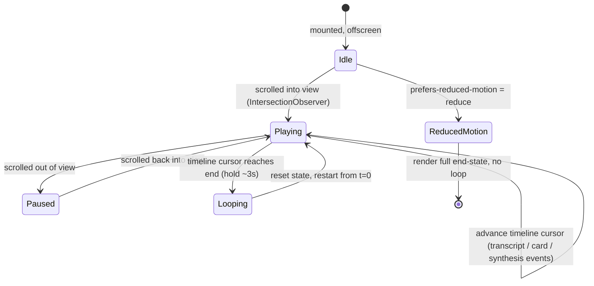

# feat: Upwell landing page (Next.js)

## Summary

Build a clean, professional marketing landing page for Upwell as a new Next.js
(App Router) app at `apps/web` in this pnpm monorepo. The page leads with
**proactive surfacing** ("context finds you — no querying, no bot, no asking")
and centers on an **auto-playing, looping demo** that faithfully reproduces the
real HUD: a streaming transcript, RAG context cards sliding in, and an AI Summary
card typing out a cited answer. A presentation-only early-access form is the
primary CTA. The app shell is structured so an authenticated customer portal can
hang off it later without re-architecting.

This is a greenfield app added to the workspace. It introduces Next.js + React as
a self-contained toolchain alongside the existing plain-TS/esbuild HUD; it does
not change the daemon, HUD, or shared packages.

---

## Problem Frame

Upwell has no public presence. The product's core behavior — context surfacing
*itself* during a live meeting — is hard to convey in static copy, so the page
must *show* it via a faithful, self-playing demo. The landing page is also the
first surface of a larger web app: a customer portal will be added later, so the
Next.js shell and routing must anticipate authenticated routes from day one
without building them now.

See origin: `docs/brainstorms/2026-05-29-upwell-landing-page-requirements.md`.

---

## Requirements Traceability

Carried from the origin requirements doc:

- **R1** — Next.js (App Router) + Tailwind, structured for a future portal → U1, U2
- **R2** — Lives as `apps/web` in the pnpm monorepo, workspace conventions → U1
- **R3** — Responsive, accessible, honors `prefers-reduced-motion` → U2, U6
- **R4** — Light/dark aware, reuses HUD visual tokens (`#3361ff`, source chips) → U2, U5
- **R5** — Hero leading with proactive surfacing + primary CTA → U3
- **R6** — Value sequence: local-first, multi-source, doc-gap loop → U4
- **R7** — Simulated-meeting demo as visual centerpiece → U5, U6
- **R8** — Footer with minimal links; no pricing/blog/docs → U3 (shell) / U4
- **R9** — Auto-playing, looping demo, no controls, starts on scroll-in → U6
- **R10** — Pixel-faithful to the real HUD (LIVE badge, RAG cards, AI Summary) → U5
- **R11** — Driven by canned/simulated data on a fixed timeline, no daemon → U6
- **R12** — Demo source chips use the real HUD source colors → U5
- **R13** — Primary CTA is early-access/waitlist (not download) → U3, U7
- **R14** — Form is presentation-only (client validation, no backend) → U7

Success criteria (origin): a cold visitor states what Upwell does within ~30s;
the demo reads as the actual product; clean/professional in light+dark, mobile+
desktop; adding a portal later needs no shell restructuring.

---

## Key Technical Decisions

### KTD1. Next.js App Router as a self-contained app in the workspace

`apps/web` is a Next.js 15 App Router app with its own `next build` / `next lint`
toolchain. It is **not** added to the root `tsconfig.json` project-references
graph (which composite-builds daemon, hud, shared-types via `tsc -b`) — Next owns
its own compilation and type-checking. The root `pnpm -r build` / `pnpm -r
typecheck` still pick up `apps/web` because they run each package's own scripts.
Rationale: the rest of the monorepo uses `tsc`/esbuild with no UI framework;
forcing Next into the references graph would fight Next's build model for no gain.

### KTD2. Reuse the HUD's design tokens for demo fidelity

The demo's visual fidelity (R10/R12) comes from porting the HUD's CSS custom-
property tokens — `--accent: #3361ff`, the `--src-github/jira/slack/code` chip
palette, card surfaces, fonts — and rebuilding the card/synthesis markup as React
components that mirror `apps/hud/src/sidebar.ts` structure and
`apps/hud/src/styles.css` classes. We do **not** import HUD source (it's
DOM-imperative, not React) and we do **not** approximate with loose Tailwind
utilities. The tokens live in one place (`apps/web/app/globals.css` or a tokens
module) so demo and product stay visually locked. Source of truth to mirror:
`apps/hud/src/styles.css` (lines defining `:root`/`:root.dark` vars, `.card`,
`.chip-source*`, `.card.synthesis`, `.synthesis-sources`, `@keyframes
card-enter`).

### KTD3. Tailwind v4, matching the HUD

Use Tailwind v4 (CSS-first config via `@import "tailwindcss"`), consistent with
`apps/hud`. Design tokens are CSS custom properties; dark mode is driven by a
`.dark` class on `<html>` (same pattern as the HUD), not `prefers-color-scheme`,
so a future theme toggle can override the OS preference.

### KTD4. Demo as a scripted timeline state machine (not real data)

The demo is a single client component driven by a fixed, declarative timeline
(an array of timestamped events: transcript line, card-surface, synthesis-start,
synthesis-delta, synthesis-done). A timer/animation loop advances through the
timeline and loops. No WebSocket, no daemon, no network — events are canned data
(R11). The timeline data shape may loosely echo the HUD's `ServerMessage` event
names (`card`, `synthesisStart`, etc. — see `apps/hud/src/types.ts`) for realism,
but is its own simplified local type; it does not import `@upwell/shared-types`.

### KTD5. Accessibility & reduced motion are first-class

The demo respects `prefers-reduced-motion: reduce` (R3/R9) by rendering the
*end state* — all cards present, full synthesis answer shown — with no animation
or looping, rather than just disabling transitions. The animated path starts only
when the demo scrolls into view (IntersectionObserver) and pauses when offscreen
to avoid wasted work and motion in the periphery.

### KTD6. Waitlist form is presentation-only

The early-access form (R13/R14) is a client component with client-side validation
(email format, required) and a success state. It performs **no** network request;
the submit handler is a stub with a clearly marked seam where a real endpoint
(`app/api/waitlist/route.ts` or external service) would later attach. No backend,
no email capture, no persistence in this plan.

---

## High-Level Technical Design

### Site shell (portal-ready)

```
apps/web/app/
  layout.tsx            root layout: <html class>, fonts, globals.css, theme baseline
  page.tsx              landing page: composes Hero → Demo → Value → CTA → Footer
  globals.css           Tailwind import + ported HUD design tokens (:root / .dark)
  (marketing)/          route group for public marketing pages (keeps room for
                        a future (app)/ authenticated group + portal routes)
  components/
    site-header.tsx     top nav / brand
    site-footer.tsx     minimal footer (status, contact)
    hero.tsx
    value-sections.tsx
    waitlist-form.tsx   presentation-only
    demo/
      meeting-demo.tsx  client component: timeline state machine + loop
      demo-timeline.ts  canned event data (transcript + cards + synthesis)
      hud-card.tsx      faithful RAG card (chip-source, score, title, snippet, Pin)
      synthesis-card.tsx faithful AI Summary card (citations + Sources grid)
      transcript.tsx    streaming transcript lines
      demo-header.tsx   LIVE badge + status
```

### Demo timeline state machine



The timeline is an ordered list of `{ atMs, event }`. A single advancing cursor
(driven by `requestAnimationFrame` or a cleared/reset interval) applies events up
to the current elapsed time into React state: transcript lines append (with a
typing effect on the active line), cards mount with the `.is-entering` slide
animation, and the synthesis card streams its text then renders citation chips +
the Sources grid.

---

## Output Structure

New files created by this plan (authoritative per-unit `**Files:**` below; this
tree is the overall shape):

```
apps/web/
  package.json
  next.config.mjs
  tsconfig.json
  postcss.config.mjs            # Tailwind v4 / PostCSS wiring
  .eslintrc or eslint flat cfg  # Next's lint, scoped to apps/web
  next-env.d.ts
  app/
    layout.tsx
    page.tsx
    globals.css
    components/
      site-header.tsx
      site-footer.tsx
      hero.tsx
      value-sections.tsx
      waitlist-form.tsx
      demo/
        meeting-demo.tsx
        demo-timeline.ts
        hud-card.tsx
        synthesis-card.tsx
        transcript.tsx
        demo-header.tsx
  test/
    demo-timeline.test.ts
    waitlist-form.test.tsx
```

---

## Implementation Units

### U1. Scaffold `apps/web` Next.js app and wire into the workspace

**Goal:** A buildable, lint-clean Next.js App Router app at `apps/web` that the
pnpm workspace recognizes, with the dev/build/lint/typecheck scripts the rest of
the repo expects.

**Requirements:** R1, R2

**Dependencies:** none

**Files:**
- `apps/web/package.json` (name `@upwell/web`, `private`, `type: module`; scripts:
  `dev`, `build`, `start`, `lint`, `typecheck`)
- `apps/web/next.config.mjs`
- `apps/web/tsconfig.json` (extends `../../tsconfig.base.json` where compatible;
  Next requires `jsx`, `moduleResolution: bundler`, `noEmit`, the Next plugin)
- `apps/web/postcss.config.mjs` (Tailwind v4)
- `apps/web/next-env.d.ts`
- `apps/web/app/layout.tsx` (minimal root layout to make it build)
- `apps/web/app/page.tsx` (placeholder, replaced in later units)
- `apps/web/app/globals.css` (Tailwind `@import` only for now)
- Root `eslint.config.mjs` — add `apps/web/**` to ignores (Next manages its own
  lint) OR confirm the type-checked flat config tolerates it; prefer ignoring the
  Next app from the root config to avoid `projectService` conflicts
- `pnpm-workspace.yaml` already globs `apps/*` — verify no change needed

**Approach:** Standard Next.js 15 App Router scaffold, TypeScript strict (inherit
the repo's strictness where Next allows). Keep `apps/web` out of root
`tsconfig.json` references (KTD1). Confirm `pnpm -r build` and `pnpm -r typecheck`
run the new app's scripts without error. Pin Next/React to current stable.

**Patterns to follow:** workspace package naming (`@upwell/hud`,
`@upwell/shared-types`), `private: true`, `type: module`, prettier config
(`.prettierrc`), kebab-case filenames (AGENTS.md).

**Test scenarios:** Test expectation: none — scaffolding/config only. Verification
is build/lint/typecheck success.

**Verification:** `pnpm --filter @upwell/web build` produces a successful
production build; `pnpm --filter @upwell/web lint` and `typecheck` pass; root
`pnpm -r typecheck` still passes for all packages.

---

### U2. Site shell, design tokens, and theme baseline

**Goal:** A reusable layout shell (header, footer, typography, light/dark tokens)
that all sections compose into, structured so a future authenticated portal slots
in without restructuring.

**Requirements:** R1, R3, R4, R8

**Dependencies:** U1

**Files:**
- `apps/web/app/layout.tsx` (fonts, `<html>` class for theme, metadata/SEO tags)
- `apps/web/app/globals.css` (port HUD tokens: `:root` and `:root.dark` custom
  properties — `--bg`, `--fg`, `--muted`, `--border`, `--card-bg`, `--accent:
  #3361ff`, `--src-github/jira/slack/code/default`, `--synthesis-tint`, fonts)
- `apps/web/app/components/site-header.tsx`
- `apps/web/app/components/site-footer.tsx`
- `apps/web/app/(marketing)/` route group (move landing page under it; reserves a
  parallel future `(app)/` group for the portal)

**Approach:** Mirror the HUD's token system (KTD2/KTD3) — CSS custom properties,
`.dark`-class dark mode. Build a max-width, centered, responsive container.
Header carries the Upwell brand and the early-access CTA anchor; footer carries
"early development" status and a contact link (no pricing/blog/docs, R8). Use the
route group so the portal can later live at `app/(app)/...` behind auth without
touching marketing routes.

**Patterns to follow:** `apps/hud/src/styles.css` `:root`/`:root.dark` blocks and
the system font stack; `apps/hud/index.html` header structure.

**Test scenarios:** Test expectation: none — presentational shell/styling.
Covered indirectly by U3/U4 render checks.

**Verification:** Page renders with correct tokens in light and dark; layout is
responsive at mobile and desktop breakpoints; Lighthouse/manual a11y shows
semantic landmarks (header/main/footer) and sufficient contrast.

---

### U3. Hero section + primary early-access CTA anchor

**Goal:** The above-the-fold hero leading with proactive surfacing, with the
primary CTA that points to the waitlist form.

**Requirements:** R5, R8, R13

**Dependencies:** U2

**Files:**
- `apps/web/app/components/hero.tsx`
- `apps/web/app/page.tsx` (compose hero as first section)

**Approach:** Headline + subhead expressing "context finds you — no querying, no
bot, no asking." Primary CTA button ("Request early access") anchors/scrolls to
the waitlist form (U7). Keep copy tight and professional — no AI-slop filler
(success criteria). A secondary line can nod to local-first/private as the
supporting beat.

**Patterns to follow:** token-based styling from U2; accent button using
`--accent`.

**Test scenarios:**
- Render: hero renders the proactive headline text and a CTA whose target anchors
  the waitlist section. (Light render assertion.)

**Verification:** Hero is legible and on-message at mobile and desktop; CTA scrolls
to the form.

---

### U4. Value / how-it-works sections

**Goal:** A short, scannable value sequence covering the secondary beats so a cold
visitor understands the product within ~30s.

**Requirements:** R6, R8

**Dependencies:** U2

**Files:**
- `apps/web/app/components/value-sections.tsx`
- `apps/web/app/page.tsx` (compose after the demo)

**Approach:** Three concise value beats in priority order: (1) local-first &
private — runs on your machine, no bot joins the call, audio never leaves your
laptop; (2) multi-source grounding — GitHub, Jira, Slack; (3) closes the doc gap —
captures unanswered questions and feeds docs/tickets. Optionally a compact
"how it works" 3-step strip. Professional, minimal, no filler.

**Patterns to follow:** U2 shell + tokens; source-chip colors can reinforce the
multi-source beat using the same `--src-*` palette.

**Test scenarios:**
- Render: all three value beats render with their headings. (Light render
  assertion.)

**Verification:** Sections are scannable and consistent with the hero; content
matches the origin's secondary-beat priority.

---

### U5. Faithful HUD demo components (static/presentational)

**Goal:** React components that pixel-faithfully reproduce the HUD's RAG card, AI
Summary (synthesis) card, transcript lines, and LIVE header — rendered from props,
no animation logic yet.

**Requirements:** R10, R12

**Dependencies:** U2

**Files:**
- `apps/web/app/components/demo/hud-card.tsx` (RAG card: `chip-source` +
  `chip-type` header, `TOP MATCH`/`MATCH` score label, bold underlined title,
  muted doc-heading line, snippet, `Pin` action)
- `apps/web/app/components/demo/synthesis-card.tsx` (`AI SUMMARY` pill, body with
  inline `[n]` citation chips, `Sources (n)` label + sources grid of source cards)
- `apps/web/app/components/demo/transcript.tsx` (speaker-attributed lines)
- `apps/web/app/components/demo/demo-header.tsx` (LIVE badge + red dot + status)
- Demo-scoped CSS: extend `apps/web/app/globals.css` (or a `demo.css`) with the
  ported card classes (`.card`, `.chip-source-*`, `.card.synthesis`,
  `.synthesis-sources`, score `.top`, etc.)

**Approach:** Mirror the markup and class structure of `apps/hud/src/sidebar.ts`
and the styles in `apps/hud/src/styles.css` (KTD2). Components are pure functions
of props (a card object, a synthesis object) so U6 can drive them from timeline
state. Match the screenshots: blue `AI SUMMARY` pill, `GITHUB · DOC` chips,
`TOP MATCH` in accent, underlined file-path titles, `📌 Pin` affordance, `[1]`
citation chips, `SOURCES (n)` grid.

**Patterns to follow:** `apps/hud/src/sidebar.ts` card/synthesis builders;
`apps/hud/src/styles.css` `.card*`, `.chip-source*`, `.card.synthesis`,
`.synthesis-sources*`, `SOURCE_ACCENT` mapping.

**Test scenarios:**
- RAG card render: given a card prop with `source: 'github'`, type `doc`, a title,
  snippet, and `rank: 1`, renders the GitHub-accented source chip, a `TOP MATCH`
  label, the underlined title, the snippet, and a Pin control.
- Synthesis card render: given an answer with two `[n]` markers and three sources,
  renders the `AI SUMMARY` label, two citation chips, and a `Sources (3)` grid.
- Source color mapping: each of github/jira/slack/code maps to its `--src-*`
  accent class; unknown source falls back to default.

**Verification:** Side-by-side against the provided HUD screenshots, the cards are
visually indistinguishable from the real product in light and dark.

---

### U6. Scripted auto-playing looping demo engine

**Goal:** Drive the U5 components from a canned timeline so the demo plays a
believable standup on its own — transcript streams, cards slide in, synthesis
types out — then loops; with scroll-triggered start and a reduced-motion fallback.

**Requirements:** R7, R9, R11, R3

**Dependencies:** U5

**Files:**
- `apps/web/app/components/demo/meeting-demo.tsx` (`'use client'` — state machine)
- `apps/web/app/components/demo/demo-timeline.ts` (canned event data)
- `apps/web/app/page.tsx` (place demo as the centerpiece, after hero)
- `apps/web/test/demo-timeline.test.ts`

**Approach:** Implement the timeline state machine from the High-Level Technical
Design. A declarative ordered list of `{ atMs, event }` (transcript line,
card-surface, synthesis-start/delta/done) is advanced by a single cursor. On
reaching the end, hold briefly, then reset and loop (KTD4). Start playback via
IntersectionObserver when scrolled into view; pause when offscreen. When
`prefers-reduced-motion: reduce`, render the full end-state with no animation or
loop (KTD5). The scripted scene includes at least one detected question
("what's the status of the auth migration PR?") that drives a card + synthesis,
matching the origin demo description.

**Execution note:** Build the timeline reducer (pure: `(state, event) → state`)
test-first so the looping/advance logic is verified independently of React
rendering and animation timing.

**Patterns to follow:** `.is-entering` + `@keyframes card-enter` from
`apps/hud/src/styles.css` for card arrival; the synthesis streaming cursor (`▊`,
`.synthesis-cursor`) for the typing effect; `ServerMessage` event names in
`apps/hud/src/types.ts` for realistic event shapes (echo, do not import).

**Test scenarios:**
- Reducer happy path: applying events in order yields the expected accumulated
  state (N transcript lines, M cards, synthesis text fully accumulated).
- Loop/reset: advancing past the final event and triggering reset returns state to
  the initial empty state, and re-advancing reproduces the first events.
- Cursor monotonicity: events with `atMs` ≤ elapsed are applied exactly once; an
  event is not double-applied across ticks.
- Reduced-motion end-state: when reduced motion is set, the computed render state
  equals the timeline's terminal state (all cards + full synthesis) without
  stepping.
- Edge: empty/partial elapsed time renders only the events due so far.

**Verification:** In a browser, the demo auto-starts when scrolled into view,
plays the full scene, loops cleanly, and pauses offscreen; with reduced motion
forced, it shows the complete end-state statically. Matches the auto-loop
behavior the user selected in the brainstorm.

---

### U7. Presentation-only early-access waitlist form

**Goal:** The primary CTA target — an early-access form with client-side
validation and a success state, no backend.

**Requirements:** R13, R14

**Dependencies:** U2

**Files:**
- `apps/web/app/components/waitlist-form.tsx` (`'use client'`)
- `apps/web/app/page.tsx` (place form as the CTA section; anchor target for U3)
- `apps/web/test/waitlist-form.test.tsx`

**Approach:** Email (required, format-validated) + submit. On submit, run
client-side validation; on success, show a confirmation state ("You're on the
list"). No network request — the submit handler is a clearly commented stub
marking where a real endpoint (`app/api/waitlist/route.ts` or an external
provider) would attach later (KTD6). Framed for an early-dev, Linux-only product
(copy nods to early access, not download).

**Test scenarios:**
- Valid email: submitting a well-formed email transitions to the success state.
- Invalid email: submitting `notanemail` shows a validation error and does not
  enter the success state.
- Empty submit: submitting with no input shows a required-field error.
- No network: submit handler performs no fetch/XHR (the stub seam is not wired).
- Accessibility: the input has an associated label and errors are announced
  (`aria-describedby` / live region).

**Verification:** Form validates inline, shows success without any network call,
and is keyboard- and screen-reader-accessible.

---

## Scope Boundaries

**In scope**
- Single landing page (hero, value sections, faithful auto-looping demo, CTA,
  footer) as a new `apps/web` Next.js app.
- Portal-ready shell (route groups, layout, tokens) — structure only.

**Deferred for later** (from origin — product-level)
- Customer portal, authentication, and any authenticated routes.
- A real waitlist backend / email capture / CRM integration.
- Pricing, blog, docs, changelog, multi-page marketing.
- macOS/Windows availability messaging (Linux-only at launch).
- Wiring the demo to the real daemon or live data.

**Outside this product's identity** (from origin)
- The demo must never misrepresent the product — no implication of cloud
  processing, a meeting bot, or unsupported platforms. Local-first and no-bot are
  load-bearing claims and the demo/copy must stay consistent with them.

**Deferred to Follow-Up Work** (plan-local)
- A theme toggle button in the site header (tokens/`.dark` plumbing land in U2,
  but an interactive toggle is not required for the landing page).
- Extracting shared card components into a workspace package if the future portal
  needs the same HUD visuals (revisit when the portal is planned).
- Real SEO/OG assets (image, sitemap, robots) beyond basic metadata.

---

## System-Wide Impact

- **Workspace/build:** adds a Next.js toolchain to the repo. `pnpm install` will
  pull React/Next and their deps; CI (if any) that runs `pnpm -r build` will now
  also run `next build`. Confirm the root ESLint flat config does not try to
  type-check the Next app (U1 handles ignoring it).
- **No change** to daemon, HUD, shared-types, or sidecars. The landing page is
  isolated and does not import from or alter existing packages.
- **Node/tooling:** Next 15 requires Node ≥ 18.18; the repo already mandates Node
  ≥ 22, so no constraint conflict.

---

## Risks & Dependencies

- **R: Tailwind v4 + Next integration.** Tailwind v4's PostCSS/CLI setup in Next
  differs from the HUD's standalone CLI build. Mitigation: use the official
  `@tailwindcss/postcss` plugin for Next; verify utilities + custom-property
  tokens compile in `next build` early in U1/U2.
- **R: Root ESLint `projectService` conflict.** The root type-checked flat config
  may try to parse `apps/web` files outside its tsconfig. Mitigation: ignore
  `apps/web/**` in the root config and rely on Next's own lint (U1).
- **R: Demo fidelity drift.** Porting HUD CSS by hand can drift from the real
  product. Mitigation: mirror class names/structure from `apps/hud/src/styles.css`
  and verify against the provided screenshots (U5 verification).
- **R: Animation jank / performance.** A poorly-throttled loop could be janky or
  burn CPU offscreen. Mitigation: `requestAnimationFrame`-driven cursor, pause via
  IntersectionObserver when offscreen, reduced-motion static path (U6).
- **Dependency:** none external; no daemon, no network, no secrets.

---

## Testing Strategy

- **Unit (logic):** the demo timeline reducer (U6) and the waitlist form
  validation (U7) carry real test coverage — these hold the only behavioral logic.
- **Component render checks (light):** hero, value sections, and the HUD demo
  cards (U3–U5) get shallow render assertions for on-message content and correct
  source-color/label mapping, not exhaustive snapshot coverage.
- **Config/scaffold (U1, U2):** verified by successful `build` / `lint` /
  `typecheck` rather than tests.
- **Manual/visual:** demo fidelity vs. the HUD screenshots, light/dark, mobile/
  desktop responsiveness, and reduced-motion behavior — confirmed in a browser.
- Test runner: align with the repo's Vitest setup; add the React testing pieces
  (`@testing-library/react`, jsdom/happy-dom) scoped to `apps/web` as needed in U1.

---

## Sources & Research

- Origin requirements: `docs/brainstorms/2026-05-29-upwell-landing-page-requirements.md`
- HUD card/synthesis rendering: `apps/hud/src/sidebar.ts`
- HUD design tokens & component CSS: `apps/hud/src/styles.css`
- HUD markup/structure: `apps/hud/index.html`
- HUD event/type shapes (echoed, not imported): `apps/hud/src/types.ts`
- Workspace conventions: `pnpm-workspace.yaml`, `tsconfig.base.json`,
  `apps/hud/package.json`, `eslint.config.mjs`, `.prettierrc`, `AGENTS.md`
- Product framing: `docs/brainstorms/meeting-context-copilot-requirements.md`
- External research: none — Next.js App Router is well-established and local
  conventions are strong (per ce-plan Phase 1.2).

---

## Open Questions (deferred to implementation)

- Exact Next.js / React minor versions to pin (use current stable at scaffold time).
- Whether to colocate demo CSS in `globals.css` or a separate `demo.css` import —
  decide once the ported card styles are in hand.
- Final hero/value copy wording and the exact scripted transcript/cards for the
  demo scene (content polish during U3/U4/U6, within the origin's constraints).
- Font choice (system stack like the HUD vs. a hosted display font for the
  marketing brand) — a presentation decision for U2.
