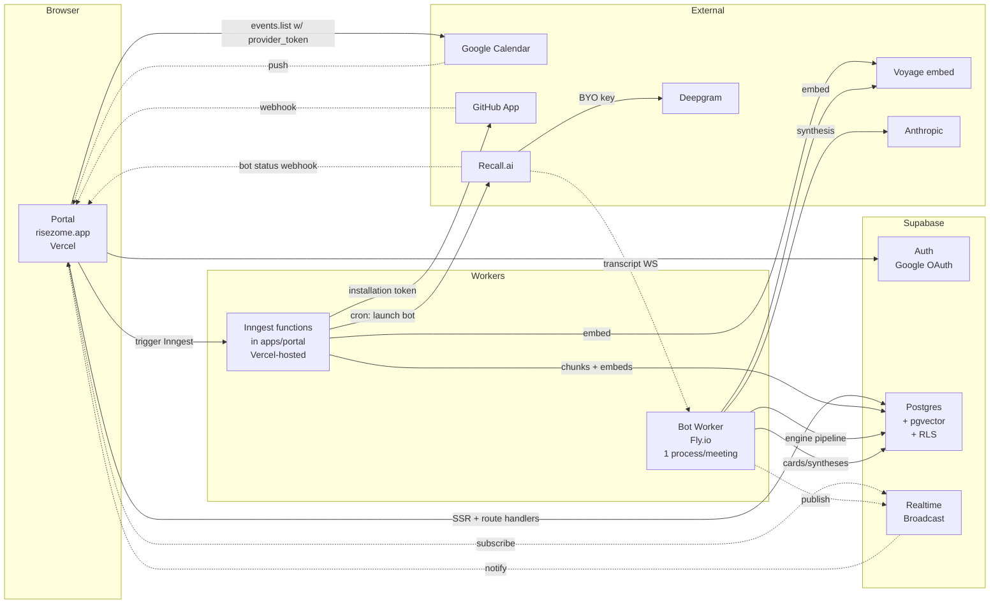

# feat: Risezome portal & bot worker SaaS shape

## Overview

Move Risezome from "desktop daemon you install" to "hosted SaaS you sign into." The desktop daemon's engine code (transcribe consumer → retrieval → synthesis) becomes a server-side worker that ingests audio from a Recall.ai bot; a new Next.js portal at `apps/portal/` exposes auth, org management, source connection, calendar-driven opt-in, live in-meeting cards, and post-meeting review. Beta scope is 50 friendly testers across ~5 orgs, Zoom + Google Meet only, Recall.ai bot transport, Supabase as the everything-platform (auth + Postgres + pgvector + Realtime Broadcast + RLS), GitHub App org-level source installation.

The HUD work in `apps/hud-next/` (just shipped) is the live meeting surface, embedded inside the portal as a Realtime-subscribing component. The daemon code is preserved in the repo as the engine; `apps/bot-worker/` reuses its pipeline classes against new state-storage adapters. The local-capture sidecar path is preserved but is not a user-facing component in this plan.

---

## Problem Frame

The original `meeting-context-copilot-requirements.md` framing — "developer-installed desktop daemon with browser HUD" — has a friction wall at every onboarding step: install a binary, set sidecar entitlements per OS, manage six API keys, manually start audio capture before each meeting. The engine itself works (we shipped the HUD U1-U5 + relevance classifier + synthesis cards), but the surface blocks every non-developer user.

The brainstorm `docs/brainstorms/2026-05-30-upwell-portal-and-cloud-shape-requirements.md` reshapes Risezome as a hosted product: bot captures audio (no install), platform owns provider keys (no user key vault), portal opts in per meeting (no consent surprise), sources connect via GitHub App OAuth (no token paste). Engine code is preserved. Local-daemon path is deferred to a privacy/enterprise tier later.

This plan executes that reshape end-to-end. Each implementation unit lands an atomic slice; phases group units that ship together but can be reviewed independently.

---

## Requirements Trace

- R1 → U2 (Google SSO sign-in)
- R2 → U2, U3, U13 (org + org_members; multi-org membership supported, with current-org cookie + topbar switcher)
- R3 → U2, U4, U5, U7, U9, U10, U12 (RLS at the data layer, not app-layer)
- R4 → U1 (provider keys platform-owned, no portal vault)
- R5 → U6 (one Google Calendar per user; multi-calendar deferred)
- R6 → U6 (upcoming events for 7 days, push + polling refresh)
- R7 → U6 (extract conferenceData.entryPoints[0].uri)
- R8 → U7 (default off; per-event opt-in)
- R9 → U7 (toggle persists per event id; reschedule carries opt-in)
- R10 → U8 (chat + audio announce on Zoom + Meet)
- R11 → U8, U10 (Recall.ai Create Bot for conference URL; loud failure)
- R11a → U6, U7 (MVP: Zoom + Meet only; disable toggle on other platforms)
- R11b → U8 (`retention=null` + `prioritize_low_latency` enforced on every Create Bot)
- R12 → U4a (App registration, one-time operator setup), U4b (per-tester install + sources schema)
- R13 → U4b (indexing on platform infra; per-source status)
- R14 → U5 (reindex available per source from portal)
- R15 → U4b (org-scoped corpus)
- R16 → U11 (live HUD inside portal meeting page; reuses `packages/hud-ui` for rendering. Note: "functional parity with `apps/hud-next/`" in the brainstorm refers to the rendering surface — state persistence, identity (per-user pin state), reconciliation, and reconnection are portal-native and not parity targets.)
- R17 → U11 (browser only; second-monitor expected)
- R18 → U9, U11 (events via Supabase Realtime Broadcast)
- R19 → U8 (Recall.ai ZDR mode; never persisted past live stream)
- R20 → U9, U12 (transcripts/cards/syntheses/gaps indefinite; per-meeting)
- R21 → U12 (delete-meeting removes all derived artifacts)
- R22 → U1, U2 (all persistent state in cloud Postgres + pgvector)
- R23 → U4, U8, U9 (jobs on queue/worker, not in request handlers)
- R23a → U9 (events persisted to Postgres + published to Realtime; portal reconciles on reconnect)
- R24 → U2, U3, U5, U7, U11, U12, U13 (portal surface scope)
- R25 → U1 (no key vault UI; provider keys are env on backend)
- R26 → U10 (clear bot-failure diagnostics on the meeting page)
- R27 → U9 (Recall transcript → existing utterance shape adapter)

**Origin actors:** A1 beta tester, A2 org admin, A3 solo user (org-of-one).
**Origin flows:** F1 first-time onboarding (U2/U3), F2 opt-in per meeting (U7), F3 live in-meeting (U8/U9/U10/U11), F4 post-meeting review (U12), F5 source management & reindex (U3/U4/U5), F6 retention & delete (U12).
**Origin acceptance examples:** AE1 (U2,U3,U4), AE2 (U6,U7,U8,U10), AE3 (U9,U11,U12), AE4 (U4,U9 — RLS isolation), AE5 (U8,U12 — ZDR + delete).

---

## Scope Boundaries

### Deferred for later

Carried verbatim from origin (`docs/brainstorms/2026-05-30-upwell-portal-and-cloud-shape-requirements.md`):

- **Local audio capture tier.** Daemon code preserved in `apps/daemon/`; it is not a user-facing component in this plan.
- **Microsoft Teams platform support.** DOM-scraping fragility + enterprise IT-admin whitelist.
- **Webex and GoTo Meeting platform support.** No chat-from-bot in Recall.ai.
- **Outlook / Microsoft 365 Calendar.**
- **Slack and Jira corpus sources.** Engine can index them; only GitHub wired in MVP.
- ~~Multi-org membership per user.~~ **REMOVED FROM DEFERRED** — now in MVP per document review (Finding 6); the schema already supported it and a topbar switcher is half-day of work.
- **Auto-join heuristics.** Per-meeting manual opt-in only.
- **Browser extension / overlay / native companion / mobile second-screen.**
- **Pricing & billing UI.** Beta is free; platform absorbs costs.
- **Gap-to-Jira / Gap-to-Confluence drafting.** Capture gap data; defer the drafting UX.
- **User-configurable retention windows.** Indefinite-or-deleted at MVP.
- **Recording storage option.** ZDR only at MVP.
- **Self-hosted / open-source bot transport** (Attendee.dev). 12-month-out cost lever.
- **Pre-meeting context prep.** Reserved as a GitHub issue created post-plan; see "Documentation / Operational Notes."

### Outside this product's identity

Carried verbatim from origin:

- Becoming a generic transcription/recording service (Otter, tl;dv).
- Post-meeting AI summary as the primary value (other tools do this well).
- Sales-only / CRM-tied positioning (Gong, Chorus).
- A meeting scheduling tool. We consume calendars; we don't write to them.

### Deferred to Follow-Up Work

- ~~Landing-page merge.~~ **REMOVED** — per document review (Finding 16), this is in scope. See U0 (added below) — landing-page branch is merged into `apps/portal/app/(marketing)/` BEFORE U1 so `risezome.app/` is a polished landing page from day one with `/sign-in` and `/onboarding` etc. living inside the same Next.js app.
- **`docs/solutions/` seeding.** No institutional learnings store exists; capture the load-bearing decisions from this plan (RLS shape, transcript adapter, ZDR enforcement, bot-worker process model) into `docs/solutions/` after the relevant units land.

---

## Context & Research

### Relevant Code and Patterns

- **`apps/hud-next/`** — Next.js 16 + React 19 + Tailwind 4 patterns. Reference for the portal's Next.js conventions but **drop `output: 'export'`** — the portal needs SSR, route handlers, and middleware. Port `apps/hud-next/app/components/*` (HudCard, SynthesisCard, CitationChip, CardStream, SynthesisStream, PinnedSection, HudShell) into a shared `packages/hud-ui` consumed by both `apps/hud-next/` (deprecated path) and `apps/portal/` — or, simpler for MVP, copy them into `apps/portal/` and leave `apps/hud-next/` as a frozen reference until the local-capture tier is reactivated.
- **`apps/daemon/src/retrieve/pipeline.ts`** — `RetrievalPipeline` class, the heart of the engine. Wraps embedder + session + synthesizer + classifier + skill registry. Move into `packages/engine` (new) so both daemon and bot-worker depend on it. Couplings: `db: better-sqlite3.Database` (swap to Postgres pool wrapper), `consentCheck: () => boolean` (per-org config closure), `MeetingSession` (in-memory; OK for process-per-meeting).
- **`apps/daemon/src/synthesize/anthropic.ts`**, **`apps/daemon/src/embed/voyage.ts`**, **`apps/daemon/src/skills/registry.ts`**, **`apps/daemon/src/skills/github/`** — Pure HTTP clients + in-memory state. **Zero local coupling.** Move into `packages/engine` as-is.
- **`apps/daemon/src/transcribe/contract.ts`** — `Utterance` shape + `TranscriptionEngine` interface. R27's Recall.ai adapter implements this interface and emits this `Utterance` shape. The existing `DeepgramTranscriptionEngine` is the reference adapter.
- **`apps/daemon/src/transcript/window.ts`** + **`apps/daemon/src/transcript/store.ts`** — `TranscriptWindow` is in-memory + delegates persist/load to `TranscriptStore` (SQLite-backed). Swap `TranscriptStore` to a Postgres-backed implementation; window is unchanged.
- **`apps/daemon/src/corpus/migrations/0001_init.sql`** + **`0002_vec.sql`** — Current local schema. Map to Postgres + pgvector with `org_id` prepended to PKs/indexes. Embedding dimension is **1024** (Voyage `voyage-3-large` / `voyage-code-3`), not 768.
- **`apps/daemon/src/cli/serve.ts`** — Canonical wiring of all engine pieces. The bot-worker entry point mirrors this structure.
- **`pnpm-workspace.yaml`** + **root `tsconfig.json`** — Conventions: `apps/*` for deployable services, `packages/*` for libraries. Add new packages to root references list.
- **`packages/shared-types/`** — Pattern for new packages: `package.json` with sub-path exports, dual `tsconfig.json` + `tsconfig.build.json`, ESM, `"version": "0.0.0"`, `private: true`.

### Institutional Learnings

None — no `docs/solutions/` directory exists in this repo. Highest-leverage decisions to capture there after units land:

- The org/RLS multi-tenancy shape (U2 + cross-cutting through every unit).
- Recall.ai → engine `Utterance` adapter contract (U9).
- ZDR enforcement pattern (U8) — "logged at WARN if `retention=null` is missing on Create Bot."
- Bot-worker process-per-meeting lifecycle (U9 + U10).

### External References

Consolidated from the framework-docs research, with direct doc links carried into the relevant units. Key references:

- **Supabase Auth Google:** https://supabase.com/docs/guides/auth/social-login/auth-google — captures `provider_token` + `provider_refresh_token` from session for Calendar API access. `access_type=offline` + `prompt=consent` both required to get a refresh token.
- **Supabase RLS:** https://supabase.com/docs/guides/database/postgres/row-level-security — `(select auth.uid())` (subquery-wrapped) vs bare `auth.uid()` is a 20x+ perf difference.
- **Supabase Realtime Broadcast:** https://supabase.com/docs/guides/realtime/broadcast + https://supabase.com/docs/guides/realtime/authorization — `POST /realtime/v1/api/broadcast` for server publish; private channels via `realtime.messages` RLS policy keyed on `realtime.topic()`.
- **pgvector + HNSW:** https://supabase.com/docs/guides/ai/vector-indexes/hnsw-indexes — HNSW with `vector_cosine_ops` for Voyage embeddings (L2-normalized). At low-thousands per org, sequential scan is fine.
- **Recall.ai Create Bot:** https://docs.recall.ai/reference/bot_create — region-pinned API URL (us-east-1 is the default), `Authorization: Token <key>` (not Bearer), `recording_config.retention=null` for ZDR, `recording_config.transcript.provider.deepgram_streaming.{api_key, mode: "prioritize_low_latency"}` for BYO Deepgram in ZDR mode.
- **Recall.ai Webhooks:** https://docs.recall.ai/docs/webhooks — Svix delivery, signature verification via `svix-{id,timestamp,signature}`.
- **Recall.ai realtime transcript:** https://docs.recall.ai/docs/real-time-transcription — WebSocket configured via `recording_config.realtime_endpoints`; payload shape `{ event: "transcript.data", data: { data: { words, participant } } }`.
- **Google Calendar push notifications:** https://developers.google.com/calendar/api/guides/push — max 7-day expiration on event channels; manual renewal required.
- **GitHub App manifest flow:** https://docs.github.com/en/apps/sharing-github-apps/registering-a-github-app-from-a-manifest — 3-step manifest registration, `POST /app-manifests/{code}/conversions` within 1h.
- **octokit/auth-app.js:** https://github.com/octokit/auth-app.js — installation token caching for 59 min, idiomatic per-installation client.

---

## Key Technical Decisions

- **Stack: Supabase full stack.** OQ1 from origin resolved at brainstorm time. Auth + Postgres + pgvector + Realtime Broadcast + RLS on one platform. Better Auth + Neon + Ably documented as fallback path if Supabase reliability or pricing breaks down.
- **Bot worker: one process per active meeting, hosted on Fly.io (OQ2).** Recall.ai delivers a per-bot WebSocket; the engine's `MeetingSession` + `TranscriptWindow` are in-memory and assume single-process. Process-per-meeting gives natural horizontal scaling and failure isolation. A single Fly.io machine in `iad` (matching Supabase us-east-1) hosts the long-running Node service with `min_machines_running = 1` and `auto_stop_machines = false` so it stays warm for inbound Recall.ai WS at `bot-worker.risezome.app`. (Earlier plan iteration had this on the operator's laptop with a Cloudflare Tunnel as a cost-saver; revised to Fly.io once the operator account was provisioned — managed hosting removes the laptop-availability constraint and the tunnel hop.) Multi-instance scaling with sticky routing on `meeting_id` is a later step when peak exceeds single-machine capacity.
- **Indexer worker: queue-driven background jobs.** Inngest is the recommended queue platform — first-class Vercel integration, durable jobs, easy retries, good observability. Falls back to plain Vercel cron if Inngest's pricing or shape doesn't fit. Per-source indexing job runs the GitHub App installation token → fetch repo content → chunk → embed → write to Postgres.
- **Portal hosting: Vercel.** Next.js 16 App Router, server components for auth-gated pages, route handlers for API endpoints (webhook receivers, sources management actions).
- **No per-user provider keys.** Recall.ai, Deepgram, Anthropic, Voyage keys live in platform-owned env vars. OQ4 resolved at brainstorm time. The Recall.ai BYO-Deepgram setting uses the platform's Deepgram key, sent per-bot in the Create Bot call — there is no per-user Recall.ai key.
- **Embedding dimension: 1024.** Voyage `voyage-3-large` (text) and `voyage-code-3` (code). pgvector column is `vector(1024)`.
- **Database migrations: Supabase CLI.** `supabase migration new <name>` produces SQL files in `supabase/migrations/` with `YYYYMMDDHHMMSS_<name>.sql` filenames. Supabase applies in filename order. Rules: (1) migrations are append-only after they land on `main` — never edit a merged migration file, always create a new one for follow-up changes; (2) U_N's migration is created at U_N's implementation time, so timestamps naturally interleave with development order; (3) table ownership is assigned to specific units (U1 creates `orgs`/`org_members`; U2 creates `user_google_tokens`; U4 creates `github_installations`/`sources`; U5 creates `docs`/`doc_chunks`/`corpus_chunk_embeddings`; U6 creates `calendar_channels`/`calendar_events`/`meetings`; U8 extends `meetings` with bot-launch columns; U10 adds `bot_status_log` if needed; U11 adds `realtime.messages` RLS policies; U12 adds delete-cascade if not declared as FK CASCADE). When a later unit needs to modify a column added by an earlier unit, the later unit creates a new migration file (e.g., `<ts>_add_bot_launch_columns_to_meetings.sql`), it does not edit the original. Prisma is rejected — it fights `auth.users`, `realtime.messages`, RLS policies, and pgvector opclasses.
- **HUD components: extract to `packages/hud-ui` shared package.** Reviewer feedback flipped this from the original "copy" decision — `hud-next` is recently shipped and bug fixes during beta need to land in both surfaces; copying invites immediate drift. The extraction is small (file moves + two `package.json` updates) and the shared-package boundary forces visual changes to think about both consumers. U11 imports from `@upwell/hud-ui`.
- **Engine code lives in `packages/engine/`.** Lifted from `apps/daemon/src/` so both `apps/bot-worker/` (cloud) and `apps/daemon/` (legacy, preserved) can depend on it. The DAL inside `packages/engine/` is abstracted behind interfaces so SQLite-backed daemon and Postgres-backed bot-worker can share the same pipeline class.
- **Local-dev parity for every cloud service.** Cloud hosting (Vercel for the portal + Inngest functions, Fly.io for the bot-worker) is the production target, but every service must also run from a `pnpm --filter ... dev` script against local infra without modification. Conventions: (1) configuration is env-var-only — no hardcoded prod URLs in source; (2) each app ships `.env.example` listing every var it consumes; (3) `apps/portal/.env.local` overrides shared defaults so dev credentials don't bleed into prod; (4) external integrations that GitHub/Recall/Google can only reach over HTTPS use a documented tunnel option (smee.io for GitHub webhooks, ngrok/Cloudflare Tunnel for inbound Recall WebSockets) — not a "deploy to test" loop; (5) the Inngest dev CLI runs the function registry locally so indexer + scheduled jobs can be exercised without a cloud account. Each unit's README documents the local-dev recipe alongside the production deploy steps.
- **State storage abstraction:** `TranscriptStore`, `CorpusReader`, `MeetingSessionStore` become interfaces in `packages/engine/`. Daemon retains SQLite implementations; bot-worker provides Postgres ones. `MeetingSession` (ephemeral state: surfaced cards, pinned set) stays in-process per the process-per-meeting decision.
- **Cross-tenant query enforcement.** Add `packages/db-client/` exposing a typed wrapper around the Supabase service-role client. Every method that reads/writes an org-scoped table takes `orgId` as a required parameter; the wrapper auto-applies `.eq('org_id', orgId)` at the SDK level. Workers, Inngest functions, and route handlers import from `@upwell/db-client` for tenanted access; importing the raw service-role client directly is gated by an ESLint rule that requires a per-call `// safe-no-org` comment justifying why org scoping is not required (e.g., platform_flags reads). CI greps SQL strings in `apps/bot-worker/` and `apps/portal/src/inngest/` for org-scoped table names; any match without `org_id` in the same string fails the build. This is the structural defense behind the convention "always filter by org_id."
- **Region pinning:** Recall.ai bots created in `us-east-1` (default). Supabase project in `us-east-1` (closest to Recall). Vercel deployments use default global edge but functions in `iad1`. All three colocated minimizes cross-region latency.

---

## Open Questions

### Resolved During Planning

- **OQ1 (stack):** Resolved at brainstorm time — Supabase full stack.
- **OQ2 (bot worker shape):** Resolved — process-per-active-meeting on Fly.io. Rationale above.
- **OQ3 (pre-meeting context prep):** **Deferred** to post-MVP (the decision is to not build it in this plan). GitHub issue to be created at plan handoff. The meeting page surface exists for live cards, but pre-prep requires net-new design (a distinct pre-meeting state, a separate retrieval-on-opt-in Inngest job, and a "Suggested context" UI section that does not exist in U11). The hook-in is not trivial — it is a follow-up effort, not a wiring exercise.
- **OQ4 (Recall.ai per-user keys):** Resolved — no per-user keying; platform Recall.ai key + per-bot BYO Deepgram key from platform env. Verified in Recall.ai docs.
- **Embedding dimension confusion:** Resolved — Voyage embeds are 1024-dim, not 768.
- **Landing page coexistence:** Resolved — portal ships as `apps/portal/`, parallel to the landing page (which lives on a separate branch). Future consolidation is a follow-up.

### Deferred to Implementation

- **DQ1 — pgvector per-org partitioning:** Single global `corpus_chunks` table with `org_id` indexed at MVP. If any single org grows past ~50k chunks, switch to per-org partitions. Verify the threshold empirically.
- **DQ2 — Realtime channel topology:** One channel per meeting: `meeting:<orgId>:<meetingId>`. RLS policy on `realtime.messages` joins through `meetings` + `org_members`. Per-org broadcast channels (e.g., for "indexing finished" notifications) are a follow-up.
- **DQ3 — Calendar push channel renewal cadence:** Channels expire in ≤7 days. Renew via cron job daily, 24h before earliest expiry. Implementation-time choice: `at expiry - 1 day` vs `every N hours`. Cron platform = Inngest scheduled functions.
- **DQ4 — Inngest vs Vercel cron vs Trigger.dev:** Default Inngest unless concrete cost or feature gap surfaces during U4 implementation.
- **DQ5 — `packages/engine/` extraction granularity:** How aggressively to extract daemon code. MVP: extract only the pieces bot-worker actually imports (`retrieve/pipeline.ts`, `synthesize/`, `embed/`, `skills/registry.ts` + relevant skills, `transcribe/contract.ts`, `transcript/window.ts`, `meeting/session.ts`). Leave the rest in daemon. Re-architect later if duplication grows.
- **DQ6 — Audio announce MP3 content:** Brand voice TTS or generic "Risezome is taking notes" recording. Implementation-time choice; cheap to swap.

---

## Output Structure

```text
apps/
├── daemon/                           # Preserved; not user-facing in MVP
├── hud-next/                         # Preserved; frozen reference for HUD components
├── portal/                           # NEW — Next.js 16 App Router, Vercel deploy
│   ├── app/
│   │   ├── (marketing)/              # public-only routes (sign-in landing)
│   │   ├── (authed)/                 # requires Supabase session
│   │   │   ├── onboarding/           # post-sign-in org setup
│   │   │   ├── sources/              # GitHub App install + per-source status
│   │   │   ├── meetings/
│   │   │   │   ├── upcoming/         # calendar-driven list + opt-in toggle
│   │   │   │   ├── [meetingId]/      # live + post-meeting view
│   │   │   │   │   ├── live/
│   │   │   │   │   └── review/
│   │   │   ├── settings/             # org name, members, GitHub app mgmt, delete
│   │   ├── api/
│   │   │   ├── github/
│   │   │   │   ├── webhook/route.ts            # ongoing installation + repo events
│   │   │   │   └── install-callback/route.ts   # post-install redirect handler (U4b)
│   │   │   ├── google/
│   │   │   │   └── calendar/webhook/route.ts   # push notification receiver
│   │   │   ├── recall/
│   │   │   │   └── webhook/route.ts            # bot lifecycle events (Svix-signed)
│   │   │   ├── inngest/route.ts                # Inngest function endpoint
│   │   │   └── auth/
│   │   │       └── callback/route.ts           # Supabase OAuth callback
│   │   ├── _lib/
│   │   │   ├── supabase-server.ts    # server-side Supabase client (service-role)
│   │   │   ├── supabase-browser.ts   # browser-side Supabase client (publishable)
│   │   │   ├── auth.ts               # session helpers + middleware
│   │   │   ├── github-app.ts         # octokit installation client factory
│   │   │   └── realtime.ts           # broadcast publish helpers
│   │   ├── layout.tsx
│   │   └── styles.css
│   ├── src/
│   │   └── inngest/                  # background jobs (was apps/indexer/)
│   │       ├── index.ts              # Inngest client + function registration
│   │       ├── functions/
│   │       │   ├── index-repo.ts             # pull + chunk + embed
│   │       │   ├── reindex-source.ts         # user-triggered reindex
│   │       │   ├── sync-calendar.ts          # pull events.list, persist
│   │       │   ├── renew-calendar-channels.ts # cron: renew Google push channels
│   │       │   ├── launch-bot.ts             # event: Create Bot at meeting start
│   │       │   └── verify-recall-zdr.ts      # cron: ZDR drift check (U14)
│   │       └── chunker.ts            # text + code chunking
│   ├── scripts/
│   │   └── register-github-app.mjs   # one-time operator runbook (U4a)
│   ├── middleware.ts                 # Supabase session refresh
│   ├── next.config.mjs               # NO `output: 'export'`
│   ├── package.json
│   ├── tsconfig.json
│   ├── tsconfig.build.json
│   ├── vitest.config.ts
│   └── test/
├── bot-worker/                       # NEW — Fly.io deploy, long-running per-meeting
│   ├── src/
│   │   ├── index.ts                  # entry: lifecycle per active meeting
│   │   ├── recall-adapter.ts         # Recall.ai realtime WS → engine Utterance
│   │   ├── postgres-stores.ts        # TranscriptStore + CorpusReader Postgres impls
│   │   ├── broadcast.ts              # publish events to Supabase Realtime
│   │   ├── bot-launcher.ts           # Create Bot API caller (ZDR-enforced)
│   │   └── env.ts                    # env validation
│   ├── Dockerfile
│   ├── fly.toml
│   ├── package.json
│   ├── tsconfig.json
│   ├── tsconfig.build.json
│   ├── vitest.config.ts
│   └── test/
└── (indexer folded into apps/portal/src/inngest/ — see portal tree above for functions list)

packages/
├── shared-types/                     # existing
├── engine/                           # NEW — lifted from apps/daemon/src/
│   ├── src/
│   │   ├── retrieve/pipeline.ts
│   │   ├── synthesize/anthropic.ts
│   │   ├── embed/voyage.ts
│   │   ├── skills/
│   │   │   ├── registry.ts
│   │   │   └── github/
│   │   ├── transcribe/contract.ts
│   │   ├── transcript/
│   │   │   ├── window.ts
│   │   │   └── store.ts              # interface; impls live in apps/
│   │   ├── meeting/session.ts
│   │   └── corpus/
│   │       └── reader.ts             # interface; impls live in apps/
│   ├── package.json
│   ├── tsconfig.json
│   └── tsconfig.build.json
├── hud-ui/                           # NEW — extracted from apps/hud-next/app/components/
│   ├── src/
│   │   ├── components/               # HudCard, SynthesisCard, CitationChip,
│   │   │                             # CardStream, SynthesisStream, PinnedSection,
│   │   │                             # SynthesisAnnounce, EmptyState, HudShell,
│   │   │                             # glyphs, card-bits
│   │   ├── types.ts                  # shared types (CardEvent, etc.)
│   │   └── index.ts                  # re-exports
│   ├── package.json
│   ├── tsconfig.json
│   └── tsconfig.build.json
├── recall-client/                    # NEW — typed RecallClient wrapper (U14)
│   ├── src/
│   │   ├── index.ts                  # createBot, ZDRRequiredConfig, etc.
│   │   └── env.ts
│   ├── package.json
│   ├── tsconfig.json
│   └── tsconfig.build.json
└── db-client/                        # NEW — typed Supabase service-role wrapper, requires orgId on tenanted ops
    ├── src/
    │   ├── index.ts                  # SupabaseTenantClient class + factory
    │   └── tenanted/                 # method modules per table grouping
    ├── package.json
    ├── tsconfig.json
    └── tsconfig.build.json

supabase/                             # NEW — Supabase CLI managed
├── config.toml
├── migrations/
│   ├── <ts>_init_orgs.sql
│   ├── <ts>_sources_and_indexer.sql
│   ├── <ts>_meetings_and_calendars.sql
│   ├── <ts>_corpus_pgvector.sql
│   ├── <ts>_realtime_messages_rls.sql
│   └── <ts>_meeting_artifacts.sql
└── seed.sql                          # dev-only fixture data
```

This is a scope declaration. The implementer may adjust if implementation reveals a better layout — per-unit `**Files:**` sections remain authoritative.

---

## High-Level Technical Design

> *This illustrates the intended approach and is directional guidance for review, not implementation specification. The implementing agent should treat it as context, not code to reproduce.*



Data plane: corpus + meeting artifacts in Postgres with RLS, live events on Realtime. Control plane: portal routes, webhooks, and Inngest functions orchestrate. Bot worker is the only long-running stateful component; everything else is request/event-driven.

---

## Implementation Units

### Phase A — Foundation

- [ ] U0. **Merge landing-page branch into `apps/portal/`**

**Goal:** The marketing landing page (currently on a separate branch) becomes the `(marketing)` route group of the new `apps/portal/` Next.js app. `risezome.app/` shows the polished landing; sign-in + onboarding + authed routes hang off the same project. This is a pre-portal-scaffolding step so U1's "Portal scaffold" merges with an existing project rather than creating one alongside an unmerged branch.

**Requirements:** Indirect — supports R24 (portal surface) by establishing the project shell + first-impression surface.

**Dependencies:** Landing-page branch is available and known-good.

**Files:**
- Move/merge: landing-page branch's pages/components into `apps/portal/app/(marketing)/*`.
- Modify: landing-page's existing build config (Next.js version, Tailwind config, tsconfig) to align with the rest of the monorepo's conventions established in `apps/hud-next/`. Specifically: Next 16 + React 19 + Tailwind 4, ESM only, strict TypeScript, no `output: 'export'` (the marketing pages can be statically generated by Next's default ISR/SSG behavior without the export flag).
- Modify: any landing-page route at `/` to live at the `app/(marketing)/page.tsx` slot.
- Modify: root `tsconfig.json` to add `apps/portal/tsconfig.build.json` (which U1 will create).

**Approach:**
- Branch is merged into `main` (or onto the working branch where U1 onwards lives). Conflicts resolved unit-by-unit; visual fidelity verified.
- Landing page's existing analytics, OG tags, sitemap stay intact.
- Sign-in CTA on the landing page targets `/sign-in` (which U2 creates).

**Test scenarios:**
- *Visual:* the landing-page DOM matches the standalone branch's output for the home route (manual compare or screenshot diff).
- *Build:* `pnpm --filter @upwell/portal build` produces a clean Next.js build with both `(marketing)` and (eventually) `(authed)` route groups.
- *Routing:* `risezome.app/` returns the landing page; `risezome.app/sign-in` 404s until U2 adds it (acceptable interim state).

**Verification:**
- The portal-deployed `risezome.app/` is visually identical to the landing-page branch's `risezome.app/`.
- No regressions in the landing page's existing tests (if any).

---

- [ ] U1. **Portal scaffold + Supabase project + initial schema (orgs)**

**Goal:** Stand up `apps/portal/` as a Next.js 16 + Tailwind 4 app on Vercel, with a Supabase project provisioned (us-east-1), Supabase CLI workflow in `supabase/`, and the initial schema for orgs + org_members + RLS. Establishes everything the rest of the plan stacks on.

**Requirements:** R1, R2, R3, R22, R24, R25

**Dependencies:** None.

**Files:**
- Create: `apps/portal/package.json`, `tsconfig.json`, `tsconfig.build.json`, `next.config.mjs` (NO `output: 'export'`), `vitest.config.ts`, `eslint.config.mjs` (extends root), `app/layout.tsx`, `app/page.tsx` (placeholder), `app/styles.css`, `middleware.ts` (Supabase session refresh stub), `app/_lib/supabase-server.ts`, `app/_lib/supabase-browser.ts`, `app/_lib/auth.ts`, `.env.example`.
- Create: `supabase/config.toml`, `supabase/migrations/<ts>_init_orgs.sql` (tables: `orgs`, `org_members`; RLS policies; indexes).
- Create: `apps/portal/test/smoke.test.tsx`, `apps/portal/test/rls/orgs.test.ts` (against `supabase start` local stack).
- Modify: root `tsconfig.json` (add `apps/portal/tsconfig.build.json` to references).
- Modify: root `pnpm-workspace.yaml` (already covers `apps/*` glob — no change needed).

**Approach:**
- Mirror `apps/hud-next/` conventions for Next.js setup; drop static export. App Router, Tailwind 4, ESM, strict TS.
- Supabase project provisioned manually; `.env.example` documents required vars (`NEXT_PUBLIC_SUPABASE_URL`, `NEXT_PUBLIC_SUPABASE_PUBLISHABLE_KEY`, `SUPABASE_SECRET_KEY`).
- Initial schema declares `orgs (id uuid pk, name, created_at)` and `org_members (org_id, user_id, role, joined_at, pk(org_id, user_id))`. RLS enabled on both. Single policy per table: "user can see rows where they are a member."
- `supabase-server.ts` exports a server-side client factory using the secret key for server actions / route handlers needing to bypass RLS (workers will use this pattern too).
- `supabase-browser.ts` exports the publishable-key client for client components.
- Placeholder marketing page at `/` — actual sign-in arrives in U2.

**Execution note:** Test-first for the RLS policies. RLS bugs are silent — write `apps/portal/test/rls/orgs.test.ts` that asserts user A cannot see org B's rows before writing the policies.

**Patterns to follow:**
- `apps/hud-next/next.config.mjs` for Next.js setup (drop `output: 'export'`).
- `apps/hud-next/vitest.config.ts` for testing setup.
- `apps/hud-next/.gitignore` for ignoring `.next/`, `out/`.
- `packages/shared-types/package.json` for package conventions.

**Test scenarios:**
- *Happy path:* user A (auth.uid A) is a member of org X; `select * from orgs where id = X` returns the row. User B (not a member) gets zero rows.
- *Edge case:* user A is a member of org X but querying org Y returns zero rows.
- *Edge case:* `select * from org_members where org_id = X` returns only the user's own membership row when they are a member; returns zero rows otherwise (or, depending on policy, returns all members of orgs they belong to — pick one and assert).
- *Error path:* `insert into orgs (name) values ('foo')` from a non-service-role context fails or succeeds based on policy — decide and assert.
- *Integration:* the smoke test verifies `pnpm --filter @upwell/portal build`, `typecheck`, and `test` all pass.

**Verification:**
- `pnpm --filter @upwell/portal build` succeeds.
- `supabase db reset` applies the migration cleanly.
- Local browser hits `localhost:3000` and gets the placeholder page.
- RLS tests pass against `supabase start` local stack.

---

- [ ] U2. **Google SSO sign-in + auth callback + session**

**Goal:** Sign in with Google produces a Supabase session with `provider_token` + `provider_refresh_token` (for Calendar API), redirects to onboarding, and persists the session in cookies the middleware refreshes. Logout works.

**Requirements:** R1, R3, R24

**Dependencies:** U1.

**Files:**
- Create: `apps/portal/app/(marketing)/sign-in/page.tsx`, `apps/portal/app/api/auth/callback/route.ts`, `apps/portal/app/api/auth/sign-out/route.ts`.
- Create: `supabase/migrations/<ts>_user_google_tokens.sql` — table `user_google_tokens (user_id pk, access_token text, refresh_token_secret_id uuid references vault.secrets(id), expires_at, updated_at)`. The refresh token is stored in Supabase Vault (a managed encrypted secret store) and the `vault.secrets` row id is what the table holds. RLS scoped to `auth.uid()`. Decryption only happens server-side via `vault.decrypted_secrets` view in server actions / Inngest functions. Access tokens are short-lived and can stay in the row (or be cached only in memory at refresh time).
- Modify: `apps/portal/middleware.ts` — full Supabase session-refresh middleware.
- Modify: `apps/portal/app/_lib/auth.ts` — `requireAuthedUser()` helper for server components, `getSession()` helper for route handlers.
- Modify: `supabase/config.toml` — enable Google provider, set redirect URLs.
- Create: `apps/portal/test/auth/sign-in.test.ts` (route handler tests, mocked Supabase).
- Modify: `.env.example` — add `GOOGLE_OAUTH_CLIENT_ID`, `GOOGLE_OAUTH_CLIENT_SECRET`.

**Approach:**
- `signInWithOAuth({ provider: 'google', options: { scopes: 'https://www.googleapis.com/auth/calendar.events.readonly', queryParams: { access_type: 'offline', prompt: 'consent' }, redirectTo: '<origin>/api/auth/callback' } })`. Both `access_type` and `prompt` are required to get a refresh token (per framework docs).
- Callback route uses `supabase.auth.exchangeCodeForSession(code)`. The refresh token is stored via Supabase Vault: insert into `vault.secrets` (encrypted at rest under a project-level key managed by Supabase), then persist the returned `secret_id` into `user_google_tokens.refresh_token_secret_id`. Plaintext refresh tokens never touch the database tables. The `vault.decrypted_secrets` view is read only from trusted server contexts; RLS restricts access to the user's own row. If Supabase Vault has documented issues in 2026, fall back to pgcrypto's `pgp_sym_encrypt` with a key in env (`USER_TOKEN_ENCRYPTION_KEY`).
- Middleware refreshes the Supabase session cookies on each request to authed routes (`(authed)` route group).
- Sign-out route calls `supabase.auth.signOut()` and clears cookies.

**Execution note:** Implement test-first for the route handler — auth flows are easy to break silently.

**Patterns to follow:**
- Supabase Auth Helpers for Next.js App Router (https://supabase.com/docs/guides/auth/server-side/nextjs).
- `apps/portal/app/_lib/supabase-server.ts` from U1 for client construction.

**Test scenarios:**
- *Happy path:* `/api/auth/callback?code=…` exchanges the code, persists tokens, redirects to `/onboarding`.
- *Happy path:* `requireAuthedUser()` from a server component on an authed page returns the user when session is valid; throws or redirects to sign-in otherwise.
- *Edge case:* sign-in initiation includes both `access_type=offline` and `prompt=consent` in the OAuth URL.
- *Edge case:* missing `code` on callback returns a clean error redirect.
- *Edge case:* user signs in twice — the second sign-in updates the `user_google_tokens` row (no duplicates).
- *Error path:* invalid code returns a clean error redirect; no session persisted.
- *Integration:* full round-trip in the test harness with mocked `signInWithOAuth` — middleware refreshes the cookie, downstream page sees `user`.

**Verification:**
- A manual sign-in against the live Supabase project (one developer's account) completes successfully and lands at `/onboarding`.
- The Google access token + refresh token are visible in the database after sign-in.
- Sign-out invalidates the session.

---

- [ ] U3. **Onboarding: first-sign-in org creation**

**Goal:** First sign-in shows an onboarding flow that creates an org for the user (with the user as admin), prompts for an org name, and lands the user at the Sources page. Returning users with an org bypass onboarding.

**Requirements:** R2, R24, F1 (steps 3+)

**Dependencies:** U2.

**Files:**
- Create: `apps/portal/app/(authed)/onboarding/page.tsx`, `apps/portal/app/(authed)/onboarding/actions.ts` (server action for org creation).
- Create: `apps/portal/app/(authed)/layout.tsx` — authed layout with topbar org switcher.
- Create: `apps/portal/app/(authed)/_components/org-switcher.tsx` — dropdown listing the user's orgs + "Create new" action.
- Create: `apps/portal/app/(authed)/orgs/new/page.tsx` — secondary org creation form (reused by onboarding + switcher).
- Modify: `apps/portal/app/_lib/auth.ts` — `requireAuthedUserWithOrg()` helper redirects to onboarding if no org. Reads `current_org_id` cookie; validates against `org_members`; falls back to first membership if invalid/missing.
- Create: `apps/portal/test/onboarding/create-org.test.ts`, `apps/portal/test/orgs/org-switcher.test.ts`.

**Approach:**
- Server action `createOrg({ name })` inserts an `orgs` row + `org_members` row (role: `admin`) inside a Postgres transaction. Sets the `current_org_id` cookie to the new org.
- Onboarding page is shown only if the user has no `org_members` row; otherwise redirects to `/sources` with `current_org_id` cookie set to the most recently active org.
- After org creation, redirect to `/sources`.
- Use `auth.uid()` from the request context to set `org_members.user_id`.
- **Multi-org support:** schema accepts a user belonging to many orgs. The topbar (rendered in `(authed)/layout.tsx`) shows the current org name with a dropdown listing all the user's orgs and a "+ Create new org" item. Switching writes the `current_org_id` cookie; subsequent requests scope all data by that org. The cookie is HTTP-only, scoped to the portal domain, and validated server-side against `org_members` on every authed-page render (a user spoofing `current_org_id` for an org they don't belong to is rejected — fall back to their first membership).

**Patterns to follow:**
- `apps/portal/app/_lib/supabase-server.ts` for server-side data access (service-role key OK for trusted server actions).

**Test scenarios:**
- *Happy path:* new user signs in → `/onboarding` shown → submit "Acme Inc." → org row created, user becomes admin, redirect to `/sources`.
- *Edge case:* user with existing org navigates to `/onboarding` → redirect to `/sources` (no double-create).
- *Edge case:* empty / whitespace-only name → form validation fails, no row created.
- *Error path:* DB constraint violation (e.g., name uniqueness if enforced) returns a clean error.
- *Integration (covers AE1 partially):* `select count(*) from orgs` + `select count(*) from org_members` go from 0 → 1 in the same transaction; if the second insert fails the first is rolled back.

**Verification:**
- Manual: first sign-in lands at onboarding; submitting a name lands at sources; a second sign-in goes straight to sources.
- Test: server action transactional behavior verified.

---

### Phase B — GitHub App + Indexer

- [ ] U4a. **GitHub App registration (one-time operator setup)**

**Goal:** Register the Risezome GitHub App via the manifest flow as a one-time Risezome-operator action. Persist platform-owned secrets (`app_id`, `pem`, `webhook_secret`, `client_id`, `client_secret`) to platform env. This unit has NO end-user UI — it is a documented runbook for Nathan.

**Requirements:** R12 (App existence is a prerequisite of per-tester install in U4b).

**Dependencies:** None.

**Files:**
- Create: `apps/portal/scripts/register-github-app.mjs` (one-shot script that prints the manifest, opens the GitHub registration URL, accepts the temporary code, calls `POST /app-manifests/{code}/conversions`, writes outputs to stdout for the operator to paste into Vercel secrets).
- Create: `apps/portal/README.md` section "GitHub App registration (one-time)" documenting the runbook.

**Approach:**
- Manifest JSON: name "Risezome", url `https://risezome.app`, hook_attributes.url `https://risezome.app/api/github/webhook`, redirect_url `https://risezome.app/github/setup/return`, default_permissions `contents: read, metadata: read, issues: read, pull_requests: read`, default_events `installation, installation_repositories, push, pull_request, issues`, public: true.
- Operator runs `node scripts/register-github-app.mjs`, follows redirect, pastes returned code. Script exchanges via `POST /app-manifests/{code}/conversions` within 1h.
- Returned `id`, `pem`, `webhook_secret`, `client_id`, `client_secret` are written to stdout. Operator copies into Vercel project env (`GITHUB_APP_ID`, `GITHUB_APP_PRIVATE_KEY` base64-encoded, `GITHUB_APP_WEBHOOK_SECRET`, `GITHUB_APP_CLIENT_ID`, `GITHUB_APP_CLIENT_SECRET`).

**Verification:**
- Manifest JSON validates against GitHub's schema.
- A registered App with the expected slug appears under the Risezome GitHub org's settings.
- Vercel env vars set successfully; portal smoke-test (U4b) can construct an octokit installation client.

---

- [ ] U4b. **Per-tester GitHub App install flow + installation webhook + sources schema**

**Goal:** Beta tester clicks "Install GitHub App" in the portal, lands on GitHub's installation UI for the existing Risezome App, picks repos, returns to the portal. Webhook persists the install. Per-org installation linkage happens at the **redirect callback** (authenticated session present), NOT in the webhook (no session). Sources schema and per-source state created here.

**Requirements:** R12, R3, R15, F1 (step 4), F5

**Dependencies:** U3, U4a.

**Files:**
- Create: `apps/portal/app/(authed)/sources/page.tsx` (initial: shows "Install GitHub App" button + per-source list once installed).
- Create: `apps/portal/app/(authed)/sources/install/route.ts` — generates CSRF state token bound to authed user's org_id, persists to `pending_installations (state_token pk, org_id, user_id, created_at, expires_at)`, redirects to `https://github.com/apps/<upwell-app-slug>/installations/new?state=<csrf>`. NOT a manifest flow.
- Create: `apps/portal/app/api/github/install-callback/route.ts` — receives redirect from GitHub with `?installation_id=X&state=Y&setup_action=install`. Verifies state, looks up the `pending_installations` row, links `installation_id → org_id`, deletes pending row. If the webhook already fired and persisted a row, this handler reconciles by updating the org_id linkage.
- Create: `apps/portal/app/api/github/webhook/route.ts` — sha256-HMAC verified. Handles `installation.created`, `installation_repositories.added/.removed`, `installation.deleted`, `installation.suspend/.unsuspend`. On `installation.created` without a matching pending state (race or direct install via GitHub UI), persists with `org_id = NULL`; install-callback resolves the link.
- Create: `apps/portal/app/_lib/github-app.ts` (octokit installation client factory using `@octokit/app`).
- Create: `supabase/migrations/<ts>_sources_and_indexer.sql` (tables: `github_installations` with nullable `org_id`, `sources`, `pending_installations`).
- Create: `apps/portal/test/github/install-flow.test.ts`, `apps/portal/test/github/webhook.test.ts`.

**Approach:**
- The two-flow split is the load-bearing decision: install initiation is portal-side (UI button), GitHub UI hands off, redirect callback authenticates the linkage. Webhook is ONLY for "what happened" (ongoing repo changes, suspends, deletes) — it never owns the org linkage because it has no Risezome session.
- CSRF state token is short-lived (15 min) HMAC of `{ org_id, user_id, nonce, exp }` signed with platform secret. Both install-callback and webhook can reconcile against it.
- Race handling: if webhook fires before install-callback, `github_installations` row exists with `org_id = NULL`; install-callback updates the row. If install-callback fires before webhook, the row is created by install-callback and webhook becomes a no-op (or upserts repository list).

**Patterns to follow:**
- octokit/auth-app.js (https://github.com/octokit/auth-app.js) — `App.getInstallationOctokit(installationId)` pattern.

**Test scenarios:**
- *Happy path (covers AE1):* user clicks Install → CSRF persisted → GitHub UI → returns with installation_id + state → callback links to org_id → webhook also fires and reconciles to same org_id.
- *Race: webhook arrives first* — `github_installations` created with `org_id = NULL`; install-callback patches.
- *Race: install-callback arrives first* — row created with org_id; webhook upserts repos.
- *Direct install (via GitHub marketplace, no portal redirect)* — webhook persists with `org_id = NULL`; portal "Sources" page shows "Unlinked installation" banner with "Link to your org" action.
- *Webhook: `installation_repositories.added`* appends sources for the right org.
- *Webhook: `installation.deleted`* — marks sources removed.
- *Error: invalid webhook signature → 401, no DB changes.*
- *Error: state token expired (>15 min) → install-callback rejects + shows clean error.*

**Verification:**
- Test the install flow end-to-end against a test GitHub org.
- Webhook signature verification rejects forged payloads.
- DB rows match the GitHub install state after each event.

**Patterns to follow:**
- octokit/auth-app.js (https://github.com/octokit/auth-app.js) — `App.getInstallationOctokit(installationId)` pattern.
- The framework-docs research's webhook verification pattern.

**Test scenarios:**
- *Happy path:* webhook payload for `installation.created` with 3 repos → 1 `github_installations` row + 3 `sources` rows persisted, scoped to the requesting org.
- *Happy path:* `installation_repositories.added` payload with 2 new repos appends 2 sources rows.
- *Happy path:* `installation_repositories.removed` payload removes (or marks removed) the matching rows.
- *Edge case:* `installation.deleted` cascades — all sources for that installation marked removed.
- *Edge case:* payload arrives before the user's manifest-callback completes (race) — webhook stores pending mapping; manifest-callback resolves it. (May not happen in practice if manifest-callback runs first, but write the test.)
- *Error path:* invalid signature → 401, no DB changes.
- *Error path:* unknown event type → 200 + ignored (do not 500).
- *Integration (covers AE1):* manifest flow start → user grants → callback persists app credentials → webhook fires → sources persisted → portal redraws "Sources" list.

**Verification:**
- Test the manifest flow against the live GitHub against a personal/test GitHub org.
- Webhook signature verification rejects forged payloads.
- DB rows match the GitHub install state after each event.

---

- [ ] U5. **Indexer worker + portal Sources view**

**Goal:** Implement the Inngest-driven indexer that pulls repo content per source, chunks, embeds with Voyage, writes to Postgres + pgvector. Portal's Sources page shows per-source status + manual "Reindex" button.

**Requirements:** R13, R14, R15, R23, F5

**Dependencies:** U4b. Also: `packages/engine/` exists (extracted from daemon — see U9's dependencies; or do the extraction here if U5 is the first user of engine code).

**Files:**
- Create: `packages/engine/package.json`, `tsconfig.json`, `tsconfig.build.json`, `src/index.ts`.
- Create: `packages/engine/src/embed/voyage.ts` (lifted from `apps/daemon/src/embed/voyage.ts`).
- Create: `packages/engine/src/skills/registry.ts`, `src/skills/github/index.ts` (lifted from daemon).
- Create: `packages/engine/src/corpus/reader.ts` (interface only).
- Create: `apps/portal/src/inngest/index.ts` — Inngest client + function registration (functions live alongside in `apps/portal/src/inngest/functions/`). `apps/portal/app/api/inngest/route.ts` exposes them via Inngest's Next.js route handler.
- Create: `apps/portal/src/inngest/functions/index-repo.ts` (Inngest function).
- Create: `apps/portal/src/inngest/functions/reindex-source.ts` (Inngest function triggered by portal action).
- Create: `apps/portal/src/inngest/github-app.ts`, `src/chunker.ts`, `src/postgres-corpus.ts` (write side).
- Modify: `apps/portal/app/(authed)/sources/page.tsx` (full implementation now; replaces the U4 stub), `apps/portal/app/(authed)/sources/[sourceId]/actions.ts` (reindex action — new file).
- Create: `supabase/migrations/<ts>_corpus_pgvector.sql` (tables: `docs`, `doc_chunks`, `corpus_chunk_embeddings` with `vector(1024)`; HNSW index `vector_cosine_ops`; RLS by org_id).
- Create: `apps/portal/test/inngest/chunker.test.ts`, `apps/portal/test/inngest/postgres-corpus.test.ts`, `apps/portal/test/inngest/index-repo.test.ts`.

**Approach:**
- Lift `voyage.ts`, `skills/`, `transcribe/contract.ts` into `packages/engine/` first. Use the existing daemon code verbatim; the new package re-exports it. Update daemon to depend on `packages/engine` (cleaner than maintaining two copies).
- Inngest function `index-repo` is parameterized by `{ org_id, source_id, installation_id, repo_full_name }`. Steps: get installation octokit → pull repo tree → for each file (filtered to indexable extensions) → chunk into text + code chunks (port `apps/daemon/src/corpus/chunker.ts` if it exists, otherwise build per existing daemon convention) → batch embed via Voyage → insert into Postgres in batches.
- Cursors for incremental sync: persist `cursors (org_id, source_id, cursor_token, last_full_sync_at, etag)`. First run is a full sync; subsequent runs use the etag/cursor.
- Sources view in portal shows per row: source name (repo full name), status (`pending` / `indexing` / `idle` / `errored`), **progress** (`indexed_files / total_files` when `total_files` is known; indeterminate spinner during initial file-list discovery), `last_indexed_at` (relative), `chunk_count`, `error_message` (when `errored`, with a "Retry" button alongside "Reindex"). Reindex action enqueues an Inngest event the function consumes. Source's `indexed_files` is updated by the indexer function in batches (every ~50 files); portal polls every 5s while any source is in `pending`/`indexing` state.
- pgvector schema: `corpus_chunk_embeddings (chunk_id pk, org_id not null, embedding vector(1024))` separate from `doc_chunks` for cleaner index management. RLS scoped on `org_id`. HNSW index with `vector_cosine_ops`. At launch, may skip the index (sequential scan fine at low-thousands) — decision deferred (DQ1).
- Service-role key from indexer to bypass RLS on write (workers always filter by `org_id` explicitly).

**Execution note:** Characterization-first for the chunker — port the existing daemon chunker carefully and lock its behavior with a fixture-based test before adding any new behavior.

**Patterns to follow:**
- `apps/daemon/src/corpus/chunker.ts` (if exists) and `apps/daemon/src/corpus/index.ts` for indexer wiring patterns.
- octokit installation-token caching pattern from `@octokit/app`.
- Inngest function shape (https://www.inngest.com/docs).

**Test scenarios:**
- *Happy path:* `index-repo` for a small test repo creates `docs`, `doc_chunks`, `corpus_chunk_embeddings` rows scoped to the right org_id.
- *Happy path:* reindex of an already-indexed source replaces or upserts chunks; final row count matches expectation.
- *Edge case:* empty repo → 0 chunks, no errors, source status `idle`.
- *Edge case:* repo with only binary files → 0 chunks, status `idle`.
- *Edge case:* RLS — user A in org X cannot read corpus_chunk_embeddings from org Y.
- *Error path:* GitHub API rate-limit (429) → Inngest function retries with backoff.
- *Error path:* Voyage embedding API timeout → Inngest function retries; on persistent failure, source status `errored` with error message persisted.
- *Integration (covers AE1, AE4):* User A indexes a repo; user B in the same org sees it appear in Sources. User C in a different org does not see it.

**Verification:**
- Manual: install GitHub App on a small test repo → verify chunks land in Postgres with correct org_id.
- Reindex button kicks off a new run; status transitions visible in portal.
- Cross-org isolation verified via RLS tests.

---

### Phase C — Calendar + Meetings

- [ ] U6. **Calendar sync: events.list + push notifications**

**Goal:** Fetch the user's upcoming calendar events for the next 7 days, refresh on portal load + on Google push, persist them as `calendar_events` rows scoped to user_id + org_id, and extract the `conference_url` + `platform` from each.

**Requirements:** R5, R6, R7, R11a, F2 (step 1)

**Dependencies:** U2 (for `provider_refresh_token` storage).

**Files:**
- Create: `apps/portal/app/api/google/calendar/webhook/route.ts` (push notification receiver).
- Create: `apps/portal/src/inngest/functions/sync-calendar.ts` (Inngest function: pulls events.list, persists).
- Create: `apps/portal/src/inngest/functions/renew-calendar-channels.ts` (Inngest scheduled function: renews push channels ~24h before expiry).
- Create: `apps/portal/app/_lib/google-token.ts` (refresh Google access tokens using stored refresh token).
- Create: `supabase/migrations/<ts>_meetings_and_calendars.sql` (tables: `user_google_tokens` updated, `calendar_channels`, `calendar_events`).
- Create: `apps/portal/test/google/conference-extract.test.ts` (unit test for parsing `conferenceData`).

**Approach:**
- On first sign-in (U2 + U3), trigger `sync-calendar` for the user. It refreshes the Google access token, calls `GET /calendar/v3/calendars/primary/events?timeMin&timeMax&singleEvents=true&orderBy=startTime`, persists each event with:
  - `event_id` (Google's `id`)
  - `user_id`, `org_id`
  - `start_at`, `end_at`, `title`, `description`
  - `conference_url` (extracted from `conferenceData.entryPoints[].uri` where `entryPointType === 'video'`; fallback: regex on `location` / `description` for Zoom/Meet URLs)
  - `platform` (`zoom` | `meet` | `other`) — derived from URL pattern AND `conferenceData.conferenceSolution.key.type` (`hangoutsMeet` → meet; `addOn` with name "Zoom Meeting" → zoom).
  - `attendee_count`, `is_organizer`
  - `bot_optin` (boolean, default false)
- Set up Google push channel via `POST /calendar/v3/calendars/{calendarId}/events/watch` with `address: <portal_url>/api/google/calendar/webhook`, store `channel_id`, `resource_id`, `expiration` in `calendar_channels`.
- Webhook receiver: empty body; verify `X-Goog-Channel-ID` + `X-Goog-Channel-Token` (echo of our token containing user_id). Trigger `sync-calendar` for that user.
- Renewal cron (Inngest scheduled function, runs daily): for each channel expiring within 24h, recreate via `events.watch` and update DB. Stop the old channel via `POST /calendar/v3/channels/stop`.
- Idempotency: events are upserted on `(user_id, event_id)`; reschedules update `start_at`/`end_at` while preserving `bot_optin`.
- Filter to "MVP platforms" at query time: portal shows only events with `platform in ('zoom', 'meet')` as opt-in-eligible; others are listed but the toggle is disabled with "Coming soon" tooltip.

**Patterns to follow:**
- Google Calendar push notification docs.
- Google OAuth token refresh: POST to https://oauth2.googleapis.com/token with `grant_type=refresh_token`.

**Test scenarios:**
- *Happy path:* sync-calendar pulls 5 events, persists rows, conference_url + platform populated correctly for Zoom and Meet events.
- *Happy path:* push-webhook event triggers sync-calendar for the right user.
- *Happy path:* renew-calendar-channels runs daily, renews the channel before expiry, updates the DB row.
- *Edge case:* Event without `conferenceData` → `conference_url` and `platform` are NULL (or 'other'); event still persisted but not opt-in-eligible.
- *Edge case:* Event rescheduled in Google → next sync updates `start_at`/`end_at` but preserves `bot_optin = true`.
- *Edge case:* Teams event → `platform = 'other'`, opt-in disabled.
- *Edge case:* Zoom URL only in `location` (not `conferenceData`) → fallback regex still extracts.
- *Error path:* Google access token expired and refresh token also invalid → user is prompted to re-authenticate.
- *Error path:* `events.watch` returns 401 → token-refresh + retry once; on persistent fail, log + skip.
- *Integration:* full lifecycle — push channel created → event added in Google → webhook fires within seconds → DB has the new event.

**Verification:**
- Manual: add a Zoom event in Google Calendar; portal shows it within the polling interval (or via push).
- Renewal cron verified by tampering with `expiration` in DB to force renewal on next run.
- Tested across at least one Meet event and one Zoom event.

---

- [ ] U7. **Upcoming meetings view + per-meeting opt-in toggle**

**Goal:** Portal page at `/meetings/upcoming` shows the next 7 days of calendar events with per-event "Send Risezome bot" toggles. Toggling on persists `bot_optin = true` and queues the bot for launch at meeting start time. MVP platforms only (R11a) — Teams/Webex/GoTo toggles disabled.

**Requirements:** R6, R8, R9, R11a, R24, F2

**Dependencies:** U6.

**Files:**
- Create: `apps/portal/app/(authed)/meetings/upcoming/page.tsx` (server component fetching events).
- Create: `apps/portal/app/(authed)/meetings/upcoming/event-row.tsx` (client component for the toggle).
- Create: `apps/portal/app/(authed)/meetings/upcoming/actions.ts` (server action `toggleOptIn(eventId, on)`).
- Create: `apps/portal/test/meetings/opt-in-action.test.ts`.

**Approach:**
- Page fetches `calendar_events` for the user where `start_at` ∈ [now, now+7d], sorted by `start_at`.
- Each row renders: title, time (with state-driven label — see below), attendees count, platform badge, opt-in toggle.
- **Row state visual treatment** (derived from `start_at`, `end_at`, `bot_optin`, and the joined `meetings.status` if a meeting record exists):
  - `start_at > now + 1h` → relative time "in 2 hours" + neutral row treatment.
  - `start_at` within next 15 min and bot_optin = true and no meeting record yet → "Bot launching in N min" + pulsing dot.
  - meeting.status in (`launching`, `awaiting_recall`, `joining`, `waiting_room`) → "Bot joining your meeting…" + spinner.
  - meeting.status = `recording` → "🔴 Live now — N min in" + pulsing red dot + the row links directly to `/meetings/[id]/live`.
  - `end_at < now` and meeting.status = `completed` → "Ended" + link to `/review`.
  - `start_at < now` and no meeting → "Started without bot" + disabled toggle.
  - Disabled toggles always show a tooltip with the reason (`Teams not yet supported` / `No conference link` / `Past meeting` / `Bot launch failed — click to retry`).
- Toggle: enabled iff `platform in ('zoom', 'meet')` AND `conference_url IS NOT NULL`. Disabled with tooltip "Coming soon" (Teams) / "No conference link" / "Past meeting" otherwise.
- Server action `toggleOptIn(eventId, on)` updates `calendar_events.bot_optin = on`. Toggle UI is optimistic but rolls back on server-action failure.
- **Inngest scheduling pattern.** Toggle-on sends an Inngest event `bot/scheduled-launch` immediately; the consuming `launch-bot` function uses `step.sleepUntil(start_at - 90s)` to wait until just before meeting start (90s margin for Recall.ai bot cold-start). Toggle-off does NOT cancel the in-flight sleeping function — Inngest doesn't expose per-event cancellation. Instead, the function wakes up at sleepUntil expiry, re-reads `calendar_events.bot_optin` from DB, and exits early if false. Same pattern handles reschedules: an updated `start_at` triggers a new `bot/scheduled-launch` event (the existing one wakes up at the old time, finds the meeting was rescheduled, exits). This wake-and-recheck pattern is the canonical Inngest model for "scheduled with cancellation."

**Patterns to follow:**
- `apps/portal/app/_lib/supabase-server.ts` for the data fetch.
- Inngest's `step.sleepUntil(start_at - 30s)` pattern for scheduled execution.

**Test scenarios:**
- *Happy path (covers AE2):* user toggles on a Zoom Meet event 30 min out → row reflects "on," DB updated, Inngest event scheduled.
- *Happy path:* user toggles off → DB updated, scheduled Inngest event canceled (or marked canceled in our table so the function exits early when it fires).
- *Edge case:* user toggles on a Teams event → toggle is disabled in UI, server action rejected.
- *Edge case:* user toggles on a past event (start_at < now) → rejected.
- *Edge case:* user toggles on an event with `conference_url IS NULL` → rejected.
- *Edge case (covers F2 step 4):* event with `bot_optin=true` is rescheduled by Google → next calendar sync updates `start_at`; the scheduled Inngest event must be rescheduled too (cancel old, schedule new).
- *Error path:* server action with non-existent event_id → 404.
- *Integration:* toggle flow end-to-end including Inngest event creation.

**Verification:**
- Manual: toggle on a near-future event; verify Inngest dashboard shows the scheduled event.
- Reschedule in Google Calendar; verify the scheduled Inngest event updates.

---

### Phase D — Recall.ai Bot + Engine Worker

- [ ] U8. **Bot launcher: Recall.ai Create Bot with ZDR enforcement**

**Goal:** When a scheduled meeting's start time arrives (Inngest fires the scheduled event), call Recall.ai Create Bot with the right config (ZDR, BYO Deepgram, chat + audio announce, platform-specific bot name). Persist the resulting `bot_id` to the meeting; handle "user toggled off after schedule" by exiting early.

**Requirements:** R8, R10, R11, R11a, R11b, R19, F3 (step 1)

**Dependencies:** U7. Recall.ai account + Deepgram key in env.

**Files:**
- Create: `apps/portal/src/inngest/functions/launch-bot.ts` (Inngest function consuming the scheduled `bot/scheduled-launch` event).
- Create: `apps/bot-worker/src/bot-launcher.ts` — the Create Bot HTTP call lives here (called by the Inngest `launch-bot` function in the portal).
- Create: `supabase/migrations/<ts>_meeting_artifacts.sql` (tables: `meetings` updated with `recall_bot_id`, `meeting_status`, `error_code`, `error_message`).
- Create: `apps/portal/test/inngest/launch-bot.test.ts` (mocked Recall.ai HTTP).
- Modify: `.env.example` — `RECALL_API_KEY`, `RECALL_REGION` (default `us-east-1`), `RECALL_DEEPGRAM_KEY`, `BOT_WORKER_BASE_URL` (the wss target for realtime transcripts).

**Approach:**
- Inngest function `launch-bot` runs at scheduled time. Step 1: re-fetch the calendar_event; if `bot_optin = false`, exit. Step 2: create a `meetings` row (`meeting_id` UUID, `org_id`, `user_id`, `calendar_event_id`, `started_at = NULL`, `status = 'launching'`). Step 3: HTTP POST to `https://us-east-1.recall.ai/api/v1/bot/` with payload:
  - `meeting_url`: from calendar_event.conference_url
  - `bot_name`: "Risezome"
  - `recording_config.retention`: **null** (R11b — enforce in code; WARN log if missing for any reason)
  - `recording_config.transcript.provider.deepgram_streaming`: `{ api_key: RECALL_DEEPGRAM_KEY, model: "nova-3", mode: "prioritize_low_latency" }`
  - `recording_config.realtime_endpoints`: `[{ type: "websocket", url: "${BOT_WORKER_BASE_URL}/recall/${meeting_id}", events: ["transcript.data", "transcript.partial_data", "participant_events.join", "participant_events.leave"] }]`
  - `chat.on_bot_join`: `{ send_to: "everyone", message: "Risezome is taking notes for ${user.name}. View live at risezome.app/meetings/${meeting_id}/live" }`
  - `automatic_audio_output.in_call_recording.data`: `{ kind: "mp3", b64_data: <bundled-announce-mp3-base64> }`
  - `automatic_leave`: standard timeouts
  - `metadata`: `{ org_id, meeting_id, user_id }`
- On 2xx, persist `recall_bot_id` to meetings row, status → `awaiting_recall`. On non-2xx, set status `failed` with error code + message; portal diagnostic surfaces it (U10).
- Defensive check: assert `recording_config.retention === null` AND `mode === "prioritize_low_latency"` AND log a critical-level warning if either drifts. This is the only line of defense between us and persisted recordings (R19).

**Execution note:** Test-first. R11b is the trust-story keystone; mock the HTTP call and verify the request body contains `retention: null` and the right mode.

**Patterns to follow:**
- Recall.ai Create Bot doc — exact JSON shape from the framework-docs research.
- Inngest function with `step.run('create-bot', async () => fetch(...))` for idempotency.

**Test scenarios:**
- *Happy path:* function fires → meeting row created → Create Bot called with correct body → `recall_bot_id` persisted, status `awaiting_recall`.
- *Critical (R11b enforcement):* HTTP body MUST contain `recording_config.retention: null` AND `mode: "prioritize_low_latency"` — assert these are present in every test that exercises a successful path.
- *Critical:* a regression test that mutates the launcher to remove `retention: null` causes the request body to fail an explicit assertion in the launcher itself (the "WARN if missing" guard). Even better: the launcher refuses to send a bot request if these are missing — fail closed.
- *Edge case:* `bot_optin` was toggled off between scheduling and firing → function exits cleanly, no meetings row, no Create Bot call.
- *Edge case:* meeting URL is now invalid (e.g., user deleted the calendar event) → 4xx from Recall → meeting status `failed`, error_code `invalid_url`.
- *Edge case (covers AE2):* user's name comes from `auth.users` profile; the bot message includes it correctly.
- *Error path:* Recall.ai 5xx → Inngest retries with backoff; after exhausting retries, meeting status `failed`.
- *Integration:* one full mocked path with all the required fields in the request body.

**Verification:**
- Unit tests pass including R11b regression test.
- Manual: schedule a real meeting against a Recall.ai test bot URL; verify the bot joins with the right config and ZDR confirmed (no recording artifacts in Recall's dashboard).
- DB assertion: every `meetings` row created via this path has a valid `recall_bot_id`.

---

- [ ] U9. **Bot worker: Recall.ai transcript ingestion + engine pipeline + Realtime publish**

**Goal:** A long-running bot worker process accepts a Recall.ai realtime transcript WebSocket per active meeting, adapts the wrapped transcript format to the engine's `Utterance` shape (R27), runs the existing retrieval + synthesis pipeline against the org's pgvector corpus, persists cards/syntheses/gaps to Postgres, and publishes events to Supabase Realtime Broadcast on the meeting's channel.

**Requirements:** R16, R18, R20, R23, R23a, R27, F3 (steps 2-5)

**Dependencies:** U5 (engine package), U8 (bot launched). `packages/engine` must include the retrieve pipeline + synthesis + Postgres-backed `TranscriptStore` and `CorpusReader` implementations.

**Files:**
- Create: `apps/bot-worker/package.json`, `tsconfig.json`, `tsconfig.build.json`, `vitest.config.ts`, `README.md` (Fly.io deploy + local-dev instructions), `Dockerfile` (Node 22 alpine + workspace install + tsc build), `fly.toml` (single machine in `iad`, `min_machines_running = 1`, HTTP service on 443 with WebSocket upgrade allowed).
- Create: `apps/bot-worker/src/index.ts` (entry: HTTP server that accepts the WebSocket upgrade at `/recall/:meetingId`, spawns or uses a per-meeting context).
- Create: `apps/bot-worker/src/recall-adapter.ts` (R27 — Recall transcript → engine Utterance).
- Create: `apps/bot-worker/src/broadcast.ts` (server publish to Supabase Realtime via HTTP).
- Create: `apps/bot-worker/src/postgres-stores.ts` (`TranscriptStore`, `CorpusReader` Postgres impls).
- Create: `apps/bot-worker/src/meeting-runtime.ts` (wires `RetrievalPipeline` + `MeetingSession` + `TranscriptWindow` per meeting).
- Create: `supabase/migrations/<ts>_meeting_events_and_artifacts.sql` — tables `meeting_events (event_id bigserial pk, meeting_id, org_id, type, payload jsonb, created_at, idx on (meeting_id, event_id))`, `cards (card_id pk, meeting_id, org_id, ..., retracted_at timestamptz null, idx on (meeting_id, created_at))`, `syntheses (synthesis_id pk, meeting_id, org_id, accumulated_text, status, citations jsonb, retracted_at timestamptz null)`, `gaps (gap_id pk, meeting_id, org_id, verbatim_question, context_window, ...)`. RLS on all four scoped via meetings → org_members.
- Modify: `packages/engine/src/retrieve/pipeline.ts` — replace `db: better-sqlite3.Database` with `CorpusReader` interface in constructor. Daemon updates its own injection accordingly.
- Modify: `packages/engine/src/transcript/store.ts` — interface only; implementations move to apps.
- Modify: `packages/engine/src/corpus/reader.ts` — extend the interface (created in U5) with `hybridSearch({ orgId, queryEmbedding, queryText, k })` and `getChunk(id)`.
- Create: `apps/bot-worker/test/recall-adapter.test.ts`, `apps/bot-worker/test/broadcast.test.ts`, `apps/bot-worker/test/meeting-runtime.integration.test.ts`.
- Modify: `apps/daemon/src/cli/serve.ts` — adapt to the new `packages/engine` interface (SQLite-backed `CorpusReader` + `TranscriptStore`).

**Approach:**
- `apps/bot-worker/src/index.ts` is a long-running Node HTTP server (Fly.io machine in `iad`, single instance with `min_machines_running = 1`). On WS upgrade at `/recall/:meetingId/:jwt`, it: (1) verifies the JWT signature with `BOT_WORKER_SECRET`, (2) asserts `jwt.payload.meetingId === url.params.meetingId` (prevents cross-meeting token replay), (3) asserts `jwt.payload.botId` matches the meeting's `recall_bot_id` in the DB, (4) asserts `jwt.payload.exp > now()`, (5) spawns a per-meeting runtime if not already present, (6) routes incoming messages to it. The JWT is generated at bot-launch time in U8 (`{ meetingId, orgId, botId, iat, exp: meetingEnd + 1h }`, HS256). Recall.ai receives the full URL `wss://bot-worker.risezome.app/recall/<meetingId>/<jwt>` in `realtime_endpoints[0].url` at Create Bot time and forwards it verbatim on every connection.
- **Pre-implementation spike (before U9 starts):** verify against the live Recall.ai API that (a) `realtime_endpoints[].url` is preserved verbatim including path segments, (b) Recall reconnects to the same URL after a transient disconnect, (c) no path-segment limits truncate the JWT. The JWT may need to move to the query string if path length limits bite, in which case the verification logic shifts but the JWT contents and validation are unchanged. Spike duration: ~half-day, blocking U9.
- `recall-adapter.ts`: maps Recall's `{ event: "transcript.data", data: { data: { words, participant } } }` → `Utterance { utteranceId: <derive>, text: words.map(w=>w.text).join(' '), isFinal: event==='transcript.data', speaker: participant.name, startMs: words[0].start_timestamp.relative*1000, endMs: words[at-1].end_timestamp.relative*1000, revision: <monotonic>, confidence: undefined }`. Verify against the `Utterance` shape in `packages/engine/src/transcribe/contract.ts`.
- `meeting-runtime.ts` instantiates `MeetingSession(meetingId)`, `TranscriptWindow(meetingId, postgresTranscriptStore)`, `RetrievalPipeline({ corpusReader, embedder, session, synthesizer, classifier, skillRegistry, ...})` exactly mirroring `apps/daemon/src/cli/serve.ts`. The pipeline emits `card`, `synthesisStart/Delta/Done/Error/Retracted`, `cardUpdated`, `cardRetracted` events.
- Each emitted event flows through this path: (1) batch synthesis deltas in a 250ms window (cards and synthesis terminal events bypass batching); (2) BEGIN transaction; (3) update the domain table (insert card / update synthesis / set `retracted_at`); (4) insert into `meeting_events (event_id serial, meeting_id, org_id, type, payload jsonb, created_at)` returning `event_id`; (5) COMMIT; (6) HTTP broadcast with the `event_id` in payload. The DB write must succeed before broadcast — if broadcast fails, the event is durable in DB; portal recovers on reconnect.
- Card retraction is `UPDATE cards SET retracted_at = NOW() WHERE card_id = ...` — never `DELETE`. The reducer treats `retracted_at NOT NULL` as "hidden but recoverable" so a reconnect-fetch sees the retraction.
- Synthesis delta batching: bot worker accumulates deltas in memory; flushes to DB + broadcast every 250ms or on receipt of `synthesisDone`. Reduces broadcast volume from ~50 events/synthesis to ~5.
- Meeting termination: Recall.ai sends two related events, handled distinctly in U10. `bot.call_ended` is the user-facing meeting completion signal — handler transitions `meetings.status = 'completed'` and signals the bot-worker (HTTP call to `/meetings/${meetingId}/end` or via Postgres NOTIFY/LISTEN). `bot.done` is Recall's "we're done processing this bot's data" signal and is idempotent — it fires after `bot.call_ended` and the handler asserts current status is already `completed` (or transitions if for some reason `bot.call_ended` was missed). The bot-worker flushes its in-memory state on receiving the end signal, ends its outgoing WS, and exits cleanly.
- Bot-worker is process-per-meeting *within* a single Fly.io instance via the in-memory map of `meetingId → runtime`. Multiple instances behind a load balancer require sticky routing — for MVP, run a single instance (scale up by adding more instances behind Fly's regional anycast and a stickiness key on meeting_id later).

**Execution note:** Test-first for the Recall adapter — the format mapping is the bridge between two contracts and must be precise. Characterization tests against captured Recall payload fixtures.

**Patterns to follow:**
- `apps/daemon/src/cli/serve.ts:75-241` for engine wiring.
- `apps/daemon/src/transcribe/deepgram.ts` for the `TranscriptionEngine` interface implementation pattern (Recall adapter is just another implementation of that interface, or close to it).
- The framework-docs research's Realtime broadcast endpoint shape.

**Test scenarios:**
- *Happy path (covers AE3):* a captured Recall payload (`transcript.data` with 5 words from speaker "Nathan") → adapter produces `Utterance { text: "...", speaker: "Nathan", startMs, endMs, isFinal: true }`. Pipe through `RetrievalPipeline` (mocked corpus) → emits a `card` event → adapter publishes to `meeting:<orgId>:<meetingId>` channel AND inserts into `cards` table.
- *Happy path (covers F3 step 4):* over a session of 10 utterances, the right number of cards + 1 synthesis are emitted.
- *Edge case:* `transcript.partial_data` updates an in-flight utterance (the engine's `revision` field increments).
- *Edge case:* participant joins mid-meeting → adapter handles the new `speaker_name` without crashing.
- *Edge case:* connection drops mid-meeting → worker holds the per-meeting state for N seconds; if Recall reconnects, the state is reused. If not, state is flushed.
- *Critical:* RLS — published broadcast messages are scoped via the right topic; subscribers in other orgs cannot receive them.
- *Critical (R23a):* every card emitted is inserted into `cards` BEFORE publishing to Realtime. If the insert fails, the publish is skipped (consistency over availability for live cards).
- *Error path:* Realtime publish 5xx → log + retry once + give up. Card stays in DB (portal sees it on reconnect).
- *Error path:* embedder/synthesizer 5xx → error event published; meeting continues.
- *Integration:* full path against a test Supabase project — capture 30s of Recall payloads (anonymized), replay through the worker, assert DB + Realtime state.

**Verification:**
- Recall adapter passes its fixture-based tests.
- Realtime publish goes through against the test Supabase project.
- Manual end-to-end with a single test meeting on Recall against a Meet bot.

---

- [ ] U10. **Recall.ai bot status webhook + diagnostics surface**

**Goal:** Receive Recall.ai bot lifecycle webhooks (`bot.joining_call`, `bot.in_call_recording`, `bot.call_ended`, `bot.done`, `bot.fatal`, etc.), update meeting status, surface human-readable diagnostics on the meeting page for failures.

**Requirements:** R11, R26, F3 (step 1+5), F5 (failure handling)

**Dependencies:** U8 (meetings + bot_id).

**Files:**
- Create: `apps/portal/app/api/recall/webhook/route.ts`.
- Create: `apps/portal/app/_lib/recall-svix.ts` (signature verification using `@svix/svix`).
- Create: `apps/portal/app/_lib/bot-status-mapping.ts` (Recall status_codes → human-readable message + next action).
- Modify: `supabase/migrations/<ts>_meeting_artifacts.sql` (already includes status + error_code; verify; add `bot_status_log` table if needed for telemetry).
- Create: `apps/portal/test/recall/webhook.test.ts`.
- Modify: `.env.example` — `RECALL_WEBHOOK_SECRET`.

**Approach:**
- Webhook handler verifies Svix signature (`svix-id`, `svix-timestamp`, `svix-signature` headers) using the secret from Recall.ai dashboard.
- Map Recall events to internal meeting status:
  - `bot.joining_call` → `joining`
  - `bot.in_waiting_room` → `waiting_room`
  - `bot.in_call_recording` → `recording`
  - `bot.recording_permission_denied` → `failed` + error code `recording_denied`, message "The meeting host declined the recording request. Try again next time."
  - `bot.call_ended` → `ended` (final state for normal meetings)
  - `bot.done` → no status change (just indicates Recall is done processing); signals bot-worker to flush.
  - `bot.fatal` → `failed` + error code + human-readable message from `bot-status-mapping.ts`.
- `bot-status-mapping.ts` translates Recall sub-codes (e.g., `microsoft_teams_captcha_detected`, `zoom_internal_error`, `meeting_not_found`) into next-action text shown in the portal: "Your IT admin needs to whitelist Risezome's bot in Teams" / "Zoom returned an error — try again" / "Couldn't find the meeting — was the URL correct?"
- On `bot.fatal` or `*_denied`, the live meeting page shows a banner with the error + retry button (where applicable).
- On `bot.call_ended`, signal the bot-worker to flush (via Postgres NOTIFY or HTTP); meeting status `completed`.

**Patterns to follow:**
- Recall.ai webhook signature verification using Svix.
- The framework-docs research's full event list.

**Test scenarios:**
- *Happy path:* signed `bot.joining_call` payload → meetings.status = 'joining'.
- *Happy path:* `bot.in_call_recording` → status = 'recording'.
- *Happy path:* `bot.call_ended` → status = 'completed', signals worker to flush.
- *Edge case:* duplicate webhook (Recall retries) — idempotent via `svix-id` dedupe table or status transition rules.
- *Error path:* invalid signature → 401, no DB change.
- *Error path:* `bot.fatal` with sub-code `meeting_not_found` → status = 'failed', error_message specific.
- *Error path:* unknown event type → 200 + ignored.
- *Integration (covers R26):* a `bot.fatal` event lands → meeting page shows the human-readable error.

**Verification:**
- Manual: trigger a failed bot (invalid URL) → portal shows the right diagnostic.
- Manual: end a real meeting → status transitions through the right states; meeting page transitions to "completed."
- Test: signature rejection works.

---

### Phase E — Live + Post-Meeting Views

- [ ] U11. **Live meeting page: Realtime subscription + embedded HUD**

**Goal:** Portal page at `/meetings/[meetingId]/live` subscribes to the meeting's Realtime channel + DB-fetches current state on mount, renders the HUD components (ported from `apps/hud-next/`) with live card/synthesis events flowing through. R23a — DB-state-first, Realtime-deltas-on-top.

**Requirements:** R16, R17, R18, R23a, F3 (step 3-4)

**Dependencies:** U9 (events being published), U10 (status known).

**Files:**
- Create: `apps/portal/app/(authed)/meetings/[meetingId]/live/page.tsx` (server component: fetch initial state).
- Create: `apps/portal/app/(authed)/meetings/[meetingId]/live/_client.tsx` (client component: subscribe + render).
- Create: `packages/hud-ui/package.json`, `tsconfig.json`, `tsconfig.build.json`, `src/index.ts` re-exports. Move `apps/hud-next/app/components/*` source into `packages/hud-ui/src/components/*` (HudCard, SynthesisCard, CitationChip, CardStream, SynthesisStream, PinnedSection, SynthesisAnnounce, EmptyState, HudShell, glyphs, card-bits) plus shared types from `apps/hud-next/app/types.ts` → `packages/hud-ui/src/types.ts`.
- Modify: `apps/hud-next/app/components/*` — replace local components with re-exports from `@upwell/hud-ui` (or update imports in `app/page.tsx` / `app/layout.tsx` to point at the package). Verify hud-next still builds + 70 tests pass.
- Modify: `apps/portal/package.json` — add `@upwell/hud-ui: workspace:*` dependency.
- Create: `apps/portal/app/_lib/realtime-meeting-channel.ts` (subscribe helper + reconciliation logic).
- Create: `supabase/migrations/<ts>_realtime_messages_rls.sql` (RLS on `realtime.messages` scoped to `realtime.topic() like 'meeting:%'` and joined through meetings + org_members).
- Create: `apps/portal/test/meetings/live-page.integration.test.tsx` (Testing Library + mocked Realtime + DB).

**Approach:**
- Server component reads `meetings` row + `cards`, `syntheses`, `gaps` rows for the meeting (RLS enforced). Renders initial state into the HUD components.
- Client component opens a private Realtime channel `meeting:<orgId>:<meetingId>` (`supabase.channel(name, { config: { private: true } })`), subscribes to `broadcast` events. Each event type matches the existing `ServerMessage` union from `apps/hud-next/app/types.ts`:
  - `card` → dispatch reducer action (same reducer as hud-next).
  - `cardUpdated` / `cardRetracted` → reducer.
  - `synthesisStart/Delta/Done/Error/Retracted` → reducer.
  - `meetingStarted` / `meetingEnded` → drives the "live" → "completed" transition (could also be derived from `meetings.status`).
- On reconnect, fetch all `meeting_events` rows with `event_id > lastEventId` (the last event the client successfully processed) ordered by `event_id` ASC. Replay each through the reducer; reducer dedupes any that arrived via the live channel before reconnect. After replay, set `lastEventId` to the highest replayed event_id and resume live subscription.
- HUD components are copied (not shared-package) for MVP — `@upwell/hud-ui`.
- **Status-driven rendering:** the page renders different content based on `meetings.status`:
  - `launching`, `awaiting_recall`, `joining`, `waiting_room` → "Risezome is joining your meeting…" header + the rotating EmptyState messages from `@upwell/hud-ui` + a thin "joined N seconds ago" progress hint. No card stream surface yet.
  - `recording` → full HUD (CardStream, SynthesisStream, PinnedSection, SynthesisAnnounce).
  - `completed` → redirect to `/review`.
  - `failed` → the diagnostic banner from U10 with the human-readable error message and retry/edit-URL actions when applicable. No card stream.
- The status comes from the server component's initial DB fetch AND is updated by Realtime broadcasts (the bot worker also publishes `meetingStatus` events on each transition); the client subscribes to both card events AND meetingStatus.

**Patterns to follow:**
- `apps/hud-next/app/state/app-state.tsx` for the reducer + context.
- `apps/hud-next/app/components/*` for the HUD components.
- The framework-docs research's Realtime subscribe pattern for private channels.

**Test scenarios:**
- *Happy path (covers AE3):* server renders initial state with 3 cards; client subscribes; new card arrives via broadcast → renders in the list at the top.
- *Happy path:* synthesis lifecycle — `start`, 5 `delta`, `done` — all flow through reducer.
- *Edge case:* page reload → server-render includes the 3 cards already there + the new card; no duplicates.
- *Edge case:* Realtime drop + reconnect → client fetches DB state on reconnect, no duplicates with existing in-memory state.
- *Edge case (covers AE3):* user pins a card via the UI → pin state persists to DB; reload still shows pinned.
- *Edge case (covers AE4):* user from a different org navigating to this meeting URL → RLS denies → 404 page.
- *Critical: direct channel subscription bypass.* A non-member anon client constructs a direct `supabase.channel('meeting:<orgId>:<meetingId>', { config: { private: true } })` subscription using their own JWT. RLS on `realtime.messages` must deny → no broadcasts received. This test fires the actual Realtime subscription path, not the SSR data path; confirms the channel-name org_id exposure (Finding 17 / security F8) is non-exploitable.
- *Error path:* Realtime channel auth fails (RLS rejects) → page falls back to polling DB every N seconds with a "Live updates unavailable" banner.
- *Integration (covers AE3):* full mocked event stream renders correctly across reducer + components.

**Verification:**
- Unit + integration tests pass.
- Manual: end-to-end during a real bot-active meeting — cards appear within ~3s of utterances (acceptable; the brainstorm AE3 specifies this).
- Pin a card; reload; pin persists.
- Cross-org access denied.

---

- [ ] U12. **Post-meeting review page + delete-meeting**

**Goal:** Portal page at `/meetings/[meetingId]/review` shows pinned cards (top), full card stream, synthesis text, gap log, and a transcript link (text-only). User can delete the meeting (R21) — removes all derived artifacts.

**Requirements:** R20, R21, R24, F4, F6

**Dependencies:** U11. The data model from U9 must include the gap log.

**Files:**
- Create: `apps/portal/app/(authed)/meetings/[meetingId]/review/page.tsx`.
- Create: `apps/portal/app/(authed)/meetings/[meetingId]/review/delete-action.ts`.
- Create: `apps/portal/app/(authed)/meetings/[meetingId]/transcript/page.tsx` (simple text view; optional download).
- Create: `apps/portal/test/meetings/delete-meeting.test.ts`.

**Approach:**
- Page fetches `meetings`, `cards` (filtered: `retracted_at IS NULL`, ordered: pinned first then chronological), `syntheses` (final state, `retracted_at IS NULL`), `gaps` for the meeting.
- **Empty state:** when the meeting completed but has zero non-retracted cards AND zero syntheses, render: heading "No grounding context surfaced." Body: "The bot joined and listened, but didn't find anything relevant to your connected sources during this meeting. This usually means the conversation topic wasn't represented in the indexed repos." Actions: link to `/sources` ("Check connected sources") and link to the transcript view ("Read transcript"). Gap log still renders if any gaps were captured — those are the unanswered-questions surface from F4 step 3 of the brainstorm and are valuable even when cards are absent.
- Transcript fetched separately (potentially lazy-loaded — large) from `meeting_utterances`.
- Delete action: confirmation dialog → server action deletes all rows for this meeting in a transaction (`cards`, `syntheses`, `gaps`, `meeting_utterances`, `meetings`). Cascading FK constraints handle the cleanup if declared; otherwise explicit deletes in dependency order.
- Audio: there is no audio to delete server-side because R19 (ZDR) means it was never persisted in Recall.ai or our side.

**Patterns to follow:**
- `@upwell/hud-ui` for the card components (same as U11).
- Standard Next.js server-action delete-confirmation pattern.

**Test scenarios:**
- *Happy path:* review page renders pinned cards at top, all cards chronological below, synthesis text, gap log with count.
- *Happy path:* delete action removes all meeting artifacts and redirects to upcoming meetings.
- *Edge case:* meeting with no syntheses → page renders cleanly, no empty synthesis box.
- *Edge case:* meeting with no gaps → no gap log section shown.
- *Edge case (covers AE5):* delete a meeting → all rows in `cards`, `syntheses`, `gaps`, `meeting_utterances`, `meetings` for that meeting_id are gone. No orphan rows.
- *Edge case (covers AE5):* delete is transactional — if any of the sub-deletes fails, all are rolled back.
- *Edge case (covers AE4):* cross-org user attempting `/review` → RLS denies → 404.
- *Error path:* delete on already-deleted meeting → 404.
- *Integration:* delete cascade verified at DB level.

**Verification:**
- Manual: review a real meeting; delete it; row counts in each table verify cleanup.
- Cross-org access denied verified.

---

### Phase F — Settings + Polish

- [ ] U14. **Durable ZDR enforcement + per-org cost tracking + kill switch**

**Goal:** Make R11b ZDR enforcement durable across future code changes (not relying on U8's single-callsite assertion), add per-org cost tracking visible to the platform operator, enforce per-org bot-hour caps, and provide a single-flag kill switch that disables all new bot launches platform-wide. These are operational guardrails the plan currently leaves to convention.

**Requirements:** R4 (cost discipline), R19+R11b (ZDR durability), plus operational gaps surfaced by the document review.

**Dependencies:** U8 (RecallClient must wrap the existing Create Bot call), U9 (cost telemetry hooks the bot worker's existing events).

**Files:**
- Create: `packages/recall-client/package.json`, `tsconfig.json`, `src/index.ts` — typed `RecallClient` class with `createBot(config: ZDRRequiredConfig)` where `ZDRRequiredConfig` requires `retention: null` and `mode: 'prioritize_low_latency'` at the type level. Raw `fetch` calls to recall.ai are forbidden outside this package.
- Modify: `eslint.config.mjs` (root) — add a `no-restricted-syntax` rule blocking `fetch('https://*.recall.ai/...')` literals outside `packages/recall-client/`.
- Modify: `apps/portal/src/inngest/functions/launch-bot.ts` (U8) — replace direct HTTP with `recallClient.createBot(...)`.
- Modify: `apps/bot-worker/src/bot-launcher.ts` (U8) — same.
- Create: `apps/portal/src/inngest/functions/verify-recall-zdr.ts` — Inngest scheduled function (every 1h) that calls `GET https://us-east-1.recall.ai/api/v1/bot/?created_after=<1h ago>` and asserts every returned bot has `recording_config.retention === null`. On failure, post to alert webhook (defined below).
- Create: `apps/portal/app/(authed)/admin/cost-dashboard/page.tsx` — operator-only view (gated by a platform-admin flag on `org_members.role = 'platform_admin'`). Per-org table: Recall bot hours this month, Anthropic token spend (estimated from `telemetry_events`), Voyage token spend, Deepgram (bundled in Recall), all-in dollars. Sorted by spend desc.
- Modify: `supabase/migrations/<ts>_meeting_artifacts.sql` (or new migration) — add `org_budgets (org_id pk, monthly_bot_hour_cap int default 50, monthly_anthropic_token_cap bigint default 50000000)` and `platform_flags (key pk, value)` table with row `bot_launches_enabled = true`.
- Modify: `apps/portal/src/inngest/functions/launch-bot.ts` — before Create Bot, check `platform_flags.bot_launches_enabled` (kill switch) and `org_budgets.monthly_bot_hour_cap` vs current usage. If kill switch is off or cap exceeded, mark meeting `status = 'blocked'` with a clear error message and skip the Create Bot call.
- Modify: `apps/bot-worker/src/meeting-runtime.ts` — emit telemetry events on every Anthropic/Voyage/Deepgram-mediated API call with `{ org_id, meeting_id, provider, input_tokens, output_tokens, model, timestamp }`. Writes to `telemetry_events` (existing schema).
- Create: `apps/portal/app/_lib/cost-rollup.ts` — query helpers for the dashboard.
- Create: `apps/portal/test/inngest/verify-recall-zdr.test.ts`, `packages/recall-client/test/zdr-types.test.ts` (compile-fail tests proving you cannot construct a config without `retention: null`), `apps/portal/test/admin/cost-dashboard.test.ts`.
- Modify: `.env.example` — `ZDR_DRIFT_ALERT_WEBHOOK_URL` (Slack or PagerDuty webhook).

**Approach:**
- The typed `RecallClient` is the structural defense — TypeScript refuses to compile a Create Bot call missing `retention: null`. The ESLint rule blocks `fetch('https://*.recall.ai/...')` outside the package, so a future developer cannot route around the type.
- The hourly drift check is the runtime defense for Recall-side config drift (someone changes a project default in the dashboard). It does not rely on our code being correct; it verifies what Recall actually persisted.
- The kill switch is a single DB flag; flipping it disables all new bot launches in <1 minute (the next Create Bot call reads it before launching). Critical for "we're burning money" or "Recall is having an incident" scenarios.
- Per-org caps are enforced server-side; the portal shows the cap and current usage to the user (org-member-visible — they should know they're being rate-limited).
- Cost dashboard is operator-only. Sources of cost: Recall bot duration ($0.50/hr + $0.15/hr transcription = $0.65/hr) × bot hours, Anthropic per-model rates × tokens, Voyage per-1M × tokens. Per-meeting rollup grouped by org.

**Execution note:** Test-first for the type-level enforcement — write the compile-fail test before the type definition.

**Patterns to follow:**
- Existing daemon telemetry pattern (`telemetry_events` writes from `serve.ts`).
- Anthropic + Voyage cost models from public pricing pages.

**Test scenarios:**
- *Compile-fail:* `recallClient.createBot({ ... })` without `retention: null` fails TypeScript compile. Test asserts this via `expect-type` or `tsc --noEmit` on a fixture.
- *Happy path:* `verify-recall-zdr` runs against a mocked Recall API returning 3 bots all with `retention: null` → no alert.
- *Critical:* `verify-recall-zdr` against mocked API returning 1 bot with `retention: '30d'` → posts to alert webhook with bot_id + meeting_id + org_id.
- *Happy path:* kill switch off → next `launch-bot` invocation marks meeting `blocked`, no Create Bot call.
- *Edge case:* per-org cap exceeded → next `launch-bot` marks `blocked` with cap-exceeded message; user sees banner on next portal load.
- *Happy path:* cost dashboard aggregates `telemetry_events` correctly for a fixture set; sums match within $0.01.
- *Edge case:* non-platform-admin user navigates to `/admin/cost-dashboard` → 403.

**Verification:**
- `packages/recall-client` typecheck rejects missing `retention: null`.
- `verify-recall-zdr` runs successfully against the real Recall API in staging once.
- Cost dashboard renders for at least one beta org's data.
- Kill-switch flag flip disables a test launch in <1 min.

---

- [ ] U13. **Settings: org name + members + GitHub App management + account delete**

**Goal:** Portal settings page at `/settings` exposes org admin functions: rename org, list members (initial: just self), manage GitHub App installation (link out to GitHub installation settings + show installed account), **calendar connection health** (last successful sync, push-channel expiry, manual refresh button), and account deletion (delete user + cascade to org if sole admin, plus OAuth/channel cleanup per Finding 13).

**Requirements:** R24 (settings surface)

**Dependencies:** U4 (GitHub install info), U2 (auth).

**Files:**
- Create: `apps/portal/app/(authed)/settings/page.tsx`.
- Create: `apps/portal/app/(authed)/settings/actions.ts` (rename org, delete account).
- Create: `apps/portal/test/settings/actions.test.ts`.

**Approach:**
- Page is server component. Renders forms for org name + read-only views for members + GitHub installation status.
- Rename org action: updates `orgs.name`; admin-role-gated.
- Delete account action: a server action that runs cleanup in this order, each step inside try/catch so a failure in one external system does not block the others. (1) Revoke Google OAuth via `POST https://oauth2.googleapis.com/revoke?token=<refresh_token>` (decrypt token from Vault first). (2) Stop all active `calendar_channels` for this user via `POST https://www.googleapis.com/calendar/v3/channels/stop` for each channel. (3) Surface the GitHub App uninstall link (`https://github.com/settings/installations/<installation_id>`) in the confirmation modal so the user can manually uninstall — GitHub's API does not allow the App to uninstall itself from an installer's account. (4) Inside a Postgres transaction: if sole admin of their org → cascade delete the org and all related rows (sources, meetings, cards, syntheses, gaps, calendar_events, calendar_channels, github_installations for that org, user_google_tokens, org_members). Otherwise: just remove this user's `org_members` rows. (5) Delete the `auth.users` row via `supabase.auth.admin.deleteUser(userId)`. Confirmation prompt requires re-typing the user's email.
- GitHub App management: link out to `https://github.com/settings/installations/<installation_id>` for the user to add/remove repos.

**Patterns to follow:**
- Standard Next.js server actions.

**Test scenarios:**
- *Happy path:* rename org → DB updated; page reflects new name.
- *Happy path:* delete sole-admin's account → cascade removes org + all members + all derived data; the user is signed out.
- *Edge case:* user is not admin → rename action rejected.
- *Edge case:* user is admin but not the sole admin → delete account removes user from org_members but org remains.
- *Error path:* whitespace-only name → validation rejects.
- *Integration:* full delete-cascade verified.

**Verification:**
- Manual: rename works. Delete account on a test user works and is irreversible.

---

## System-Wide Impact

- **Interaction graph:** Calendar events → Inngest scheduled events → Recall.ai Create Bot → bot-worker WS → engine pipeline → Postgres + Realtime → portal page. Webhooks fan in from Google (calendar), GitHub (installs), Recall (bot lifecycle). Each integration is independently testable but the live-meeting happy path crosses all three.
- **Error propagation:** Engine errors (synthesis fails, retrieval times out) emit `synthesisError` events that the portal surfaces inline on the meeting page (existing `apps/hud-next/` behavior). Bot lifecycle errors emit `meetings.status = 'failed'` and surface as banners (U10). Calendar sync errors are logged + surfaced as "calendar disconnected" banner (re-auth flow). Indexer errors set `sources.status = 'errored'` with the error message; user retries via reindex button.
- **State lifecycle risks:**
  - **Recall.ai retention drift (R11b):** if a future code change accidentally drops `retention=null`, recordings are persisted. Mitigation: U8's defensive check + a daily test job that pulls a recent bot config from Recall and asserts the retention setting.
  - **Bot worker process restart:** the worker holds per-meeting state in memory. A restart mid-meeting loses the in-flight state (transcript window, surfaced-set, pending synthesis). Mitigation: TranscriptStore writes go to Postgres synchronously; on restart, the worker reconstructs from DB state when the Recall WS reconnects. The synthesis-in-flight is lost — accepted at MVP.
  - **Realtime delivery loss (R23a):** addressed by DB-first persistence + client reconciliation.
  - **Google calendar push channel expiry:** addressed by daily renewal cron.
- **API surface parity:** Engine event shapes (cards, syntheses, gaps) are emitted by the daemon (local) and by the bot worker (cloud). Both must stay in sync with `apps/hud-next/app/types.ts` `ServerMessage` union. The portal copies these types into `apps/portal/app/_hud/types.ts` for now; a follow-up consolidates via `packages/shared-types`.
- **Integration coverage:** Cross-layer scenarios that unit tests do not prove:
  - Bot launch → bot joins → realtime transcript → cards in portal — must be tested end-to-end against a Recall test bot at least once during U9-U11 integration.
  - Cross-org isolation — RLS tests in U1 are the unit; manual cross-account test before launch is the integration.
  - Calendar reschedule mid-opt-in — manual test against real Google Calendar.
- **Unchanged invariants:** The daemon's existing functionality (`apps/daemon/`) does not change in user-visible behavior. It continues to work for the local-capture tier (deferred). Engine code is lifted into `packages/engine` and the daemon updated to depend on it; if this introduces regressions the daemon's existing test suite catches them.

---

## Risks & Dependencies

| Risk | Mitigation |
|------|------------|
| **R11b ZDR enforcement is the only line of defense for R19; a missed code change could persist recordings.** | U8 has a fail-closed assertion in the launcher: the launcher refuses to send a Create Bot request if `retention !== null` or `mode !== 'prioritize_low_latency'`. Combined with a regression test that fails on omission. |
| **Recall.ai outage or breaking change to bot.create or transcript stream.** | Adapter (R27) isolates the Recall format from the engine. If Recall has an extended outage during the beta, meetings fail-loud (R11/R26) and users are notified. The Attendee.dev open-source alternative is documented as a 12-month-out hedge. |
| **Supabase Realtime delivery loss during a live meeting.** | R23a — DB-first persistence + client reconciliation on reconnect. The "live" experience may degrade to "near-live with reconnect" but never to "lost cards." |
| **pgvector RLS+HNSW interaction at scale.** | At beta scale (low-thousands of chunks per org), sequential scan is fine. Re-evaluate at growth — DQ1 logged. |
| **Inngest pricing or shape mismatch.** | Indexer functions are not deeply coupled to Inngest beyond `inngest.send` + `step.*`; the pattern ports to Trigger.dev or plain Vercel cron+QStash with bounded effort. |
| **Bot-worker single-instance bottleneck on Fly.io.** | At beta scale (~5 concurrent meetings peak), one instance handles it. Multi-instance with sticky routing is a documented scaling step but not in MVP. |
| **GitHub App permissions creep / re-consent.** | Get the permission set right at launch (`contents: read, metadata: read, issues: read, pull_requests: read`); adding later requires re-consent. |
| **User Google calendar push channel silently expires.** | Daily renewal cron with explicit alerting on renewal failure. |
| **The Recall transcript adapter (R27) is the bridge between two contracts; bugs are silent.** | Test-first with captured-payload fixtures. Adapter has 100% coverage of message-type variants. |
| **Cross-org data leakage.** | RLS at the data layer + explicit `org_id` filter on every worker query (defense in depth, since workers use service-role key which bypasses RLS). Cross-org tests in every CRUD unit. |

---

## Documentation / Operational Notes

- **Platform secrets management:** Recall.ai, Anthropic, Voyage, Deepgram, GitHub App private key, Supabase secret key live in Vercel project env vars (for portal — which hosts Inngest functions too) and in the operator's local `.env` file (for bot-worker during early beta). Document the manual set-up process in `apps/portal/README.md` + `apps/bot-worker/README.md`.
- **Local development prerequisites:** running U1's RLS tests requires the Supabase CLI (`brew install supabase/tap/supabase`) and Docker Desktop (for `supabase start`). Document in `apps/portal/README.md` under "Local Development." CI runs the same RLS tests against a temporary Supabase instance via the `supabase/setup-cli` GitHub Action.
- **Google Cloud Console one-time setup:** the `risezome.app` domain must be added as a verified webhook destination in the Google Cloud Console for Calendar Push notifications to work. Vercel preview deploys (`*.vercel.app`) cannot receive push notifications; integration tests for U6 push are limited to staging/prod deployments behind verified domains.
- **Bot-worker hosting (Fly.io + local-dev parity):** **Production:** single Fly.io machine in `iad` with `min_machines_running = 1` and `auto_stop_machines = false`, deployed via `fly deploy` from `apps/bot-worker/`. Stable hostname `bot-worker.risezome.app` (CNAME via Fly's certs + DNS). Recall.ai connects inbound over WSS at `/recall/:meetingId/:jwt`. Single-machine means rolling deploys briefly interrupt active WS sessions; document a "do not deploy during active meetings" policy until multi-instance + sticky routing lands. **Local dev** (must always work): `pnpm --filter @risezome/bot-worker dev` starts the same Node entry point on `http://localhost:8787` against the local Supabase stack (or the shared dev project, configurable via env). Unit + integration tests run fully offline against a Postgres fixture. To point a real Recall.ai bot at the dev machine, the operator opens a temporary tunnel (`cloudflared tunnel --url http://localhost:8787` or `ngrok http 8787`) and overrides `BOT_WORKER_PUBLIC_URL` in the portal env so the Create Bot call uses the tunnel URL — no source edits required. The two code paths (Fly machine + local Node) share the exact same `src/index.ts` entry; the only deltas are env vars, the `fly.toml` machine config, and the Dockerfile. CI runs `pnpm --filter @risezome/bot-worker dev` in a smoke job to ensure local-dev never bit-rots.
- **GitHub App manifest flow is a one-time platform setup** — the App registration is not per-user. Document this clearly.
- **Recall.ai dashboard config:** BYO Deepgram key must be added in the Recall dashboard for the project. One-time setup step before any bot is created.
- **Inngest setup (production + local-dev):** **Production:** Vercel-Inngest integration is one-time; cloud webhook URL is `https://risezome.app/api/inngest`. **Local dev:** the Inngest dev CLI (`npx inngest-cli@latest dev`) discovers functions at `http://localhost:3000/api/inngest` and runs them entirely on the local machine — no cloud account needed for development. Document the one-command bootstrap (`pnpm dev` in one terminal + `npx inngest-cli@latest dev` in another) in `apps/portal/README.md`. The same Inngest function source registers in both environments — the routing decision is made by the `INNGEST_BASE_URL` env var, not by code branching.
- **Pre-meeting context-prep deferred (OQ3):** create a GitHub issue at plan completion that describes the feature, references R24 (currently silent on pre-prep), and outlines the implementation shape (early Inngest job triggered on opt-in that runs retrieval against meeting metadata; renders results as "Suggested context" section on the meeting page).
- **`docs/solutions/` seeding:** After each phase lands, capture the load-bearing decisions: RLS shape (after U1+U2), Recall transcript adapter (after U9), ZDR enforcement (after U8), bot-worker process model (after U9-U10). Use `/ce-compound` per phase.
- **Cost monitoring:** Recall.ai usage ($0.65/hr beta budget), Anthropic synthesis tokens, Voyage embed calls. Add a simple `telemetry_events` writer (already in daemon schema) to bot-worker so per-meeting cost can be reconstructed.

---

## Sources & References

- **Origin document:** [docs/brainstorms/2026-05-30-upwell-portal-and-cloud-shape-requirements.md](../brainstorms/2026-05-30-upwell-portal-and-cloud-shape-requirements.md)
- **Earlier related brainstorms:**
  - `docs/brainstorms/meeting-context-copilot-requirements.md` — original product framing
  - `docs/brainstorms/2026-05-29-upwell-landing-page-requirements.md` — landing page (separate branch; portal coexists)
  - `docs/brainstorms/hud-visual-polish-requirements.md` — HUD U1-U5 polish that is now embedded
  - `docs/brainstorms/router-skills-framework-requirements.md` — engine's router + skills
  - `docs/brainstorms/utterance-relevance-classifier-requirements.md` — engine's relevance pre-classifier
- **Just-shipped plan:** [docs/plans/2026-05-30-001-feat-hud-nextjs-conversion-plan.md](2026-05-30-001-feat-hud-nextjs-conversion-plan.md) — HUD that becomes the embedded live view
- **Related code (engine pieces being lifted):**
  - `apps/daemon/src/retrieve/pipeline.ts`
  - `apps/daemon/src/synthesize/anthropic.ts`
  - `apps/daemon/src/embed/voyage.ts`
  - `apps/daemon/src/skills/`
  - `apps/daemon/src/transcribe/contract.ts`
  - `apps/daemon/src/transcript/window.ts`
  - `apps/daemon/src/meeting/session.ts`
  - `apps/daemon/src/corpus/migrations/`
- **External docs (cited per unit):** Supabase Auth Google, Supabase RLS, Supabase Realtime Broadcast, Supabase pgvector + HNSW, Recall.ai Create Bot + Webhooks + Real-time transcription + Storage/ZDR, Google Calendar push notifications + events.list, GitHub App manifest flow + installation access tokens + webhooks, octokit/auth-app.js.
